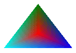

# Кисти и закрашенные фигуры в GDI+
Замкнутые фигуры, например прямоугольник или эллипс, состоит из структуры и внутренней частью. Контур рисуется с помощью пера и внутренняя область заполняется с помощью кисти. [!INCLUDE[ndptecgdiplus](../../../../includes/ndptecgdiplus-md.md)] предоставляет несколько классов кисти для заливки фигур, закрытых: <xref:System.Drawing.SolidBrush>, <xref:System.Drawing.Drawing2D.HatchBrush>, <xref:System.Drawing.TextureBrush>, <xref:System.Drawing.Drawing2D.LinearGradientBrush>, и <xref:System.Drawing.Drawing2D.PathGradientBrush>. Все эти классы наследуют <xref:System.Drawing.Brush> класса. Ниже показан прямоугольник заполняется сплошной кистью и эллипс, заполненный кистей штриховки.  
  
   
  
## Сплошные кисти  
 Для заполнения замкнутой фигуры, требуется экземпляр <xref:System.Drawing.Graphics> класс и <xref:System.Drawing.Brush>. Экземпляр <xref:System.Drawing.Graphics> класс предоставляет методы, такие как <xref:System.Drawing.Graphics.FillRectangle%2A> и <xref:System.Drawing.Graphics.FillEllipse%2A>и <xref:System.Drawing.Brush> сохраняет атрибуты заливки, таких как цвет и шаблон. <xref:System.Drawing.Brush> Передается в качестве одного из аргументов метода fill. В следующем примере кода показано, как заливка эллипса сплошным красным цветом.  
  
 [!code-csharp[LinesCurvesAndShapes#121](~/samples/snippets/csharp/VS_Snippets_Winforms/LinesCurvesAndShapes/CS/Class1.cs#121)]
   
  
> [!NOTE]
>  В приведенном выше примере кисть, которая имеет тип <xref:System.Drawing.SolidBrush>, который наследует от <xref:System.Drawing.Brush>.  
  
## Кистей штриховки  
 При заполнении формы штриховой кистью задаются цвет переднего плана, цветом фона и стиль штриховки. Цвет переднего плана — это цвет штриховки.  
  
 [!code-csharp[LinesCurvesAndShapes#122](~/samples/snippets/csharp/VS_Snippets_Winforms/LinesCurvesAndShapes/CS/Class1.cs#122)]
   
  
 [!INCLUDE[ndptecgdiplus](../../../../includes/ndptecgdiplus-md.md)] предоставляет более чем 50 стилей штриховки. на следующем рисунке показано три стили представляют собой <xref:System.Drawing.Drawing2D.HatchStyle.Horizontal>, <xref:System.Drawing.Drawing2D.HatchStyle.ForwardDiagonal>, и <xref:System.Drawing.Drawing2D.HatchStyle.Cross>.  
  
   
  
## Текстурные кисти  
 С помощью кисти текстуры вы можете заполнить фигуры с шаблоном, хранящиеся в точечном рисунке. Предположим, например, приведенный ниже рисунок хранится на диске в файле с именем `MyTexture.bmp`.  
  
   
  
 В следующем примере кода показано, как заливка эллипса, повторив рисунка, сохраненного в `MyTexture.bmp`.  
  
 [!code-csharp[LinesCurvesAndShapes#123](~/samples/snippets/csharp/VS_Snippets_Winforms/LinesCurvesAndShapes/CS/Class1.cs#123)]
   
  
 На следующем рисунке заполненного эллипса.  
  
   
  
## Градиентные кисти  
 [!INCLUDE[ndptecgdiplus](../../../../includes/ndptecgdiplus-md.md)] предоставляет два типа градиентных кистей: линейный и путь. Кисти линейного градиента можно использовать для заливки фигуры цвет, который постепенно через фигуры по горизонтали, вертикали или по диагонали. В следующем примере кода показано, как заливка эллипса с горизонтальной градиентную кисть, которая поменяет цвет с синего на зеленый, при переходе от левого края эллипса по правому краю.  
  
 [!code-csharp[LinesCurvesAndShapes#124](~/samples/snippets/csharp/VS_Snippets_Winforms/LinesCurvesAndShapes/CS/Class1.cs#124)]
   
  
 На следующем рисунке заполненного эллипса.  
  
   
  
 Чтобы изменить цвет, при перемещении в центре фигуры к границе можно настроить кисти градиента контура.  
  
   
  
 Градиентные кисти путь отличаются достаточной гибкостью. Кисти градиента, используемый для заполнения в приведенном ниже рисунке последовательно от красного в центре для каждого из трех различных цветов в вершины треугольника.  
  
   
  
## См. также

- <xref:System.Drawing.SolidBrush?displayProperty=nameWithType>
- <xref:System.Drawing.Drawing2D.HatchBrush?displayProperty=nameWithType>
- <xref:System.Drawing.TextureBrush?displayProperty=nameWithType>
- <xref:System.Drawing.Drawing2D.LinearGradientBrush?displayProperty=nameWithType>
- [Прямые и кривые линии и фигуры](lines-curves-and-shapes.md)
- [Практическое руководство. Рисование заполненного прямоугольника в Windows Forms](how-to-draw-a-filled-rectangle-on-a-windows-form.md)
- [Практическое руководство. Рисование заполненного эллипса в Windows Forms](how-to-draw-a-filled-ellipse-on-a-windows-form.md)
