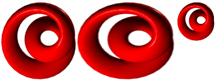
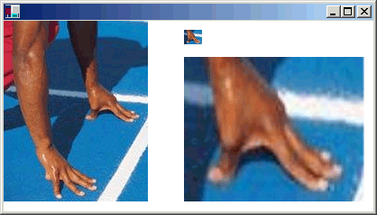

# Обрезка и масштабирование изображений в GDI+
Можно использовать <xref:System.Drawing.Graphics.DrawImage%2A> метод <xref:System.Drawing.Graphics> позволяет рисовать и размещать векторные и растровые изображения. <xref:System.Drawing.Graphics.DrawImage%2A> — Это перегруженный метод, поэтому существует несколько способов передачи аргументов.  
  
## DrawImage вариантов  
 Один из вариантов <xref:System.Drawing.Graphics.DrawImage%2A> метод получает <xref:System.Drawing.Bitmap> и <xref:System.Drawing.Rectangle>. Прямоугольник определяет место назначения для операции рисования; то есть он задает прямоугольник, в котором должно быть нарисовано изображение. Если размер целевого прямоугольника отличаются от размера исходного изображения, изображение масштабируется по размерам прямоугольника назначения. В следующем примере кода показано, как должно быть нарисовано изображение же три раза: один раз без масштабирования, один раз с помощью расширения и один раз с сжатия:  
  
 [!code-csharp[System.Drawing.ImagesBitmapsMetafiles#31](~/samples/snippets/csharp/VS_Snippets_Winforms/System.Drawing.ImagesBitmapsMetafiles/CS/Class1.cs#31)]
 [!code-vb[System.Drawing.ImagesBitmapsMetafiles#31](~/samples/snippets/visualbasic/VS_Snippets_Winforms/System.Drawing.ImagesBitmapsMetafiles/VB/Class1.vb#31)]  
  
 Ниже показаны три изображения.  
  
   
  
 Некоторые варианты <xref:System.Drawing.Graphics.DrawImage%2A> метод иметь исходный прямоугольник, а также параметр целевого прямоугольника. Исходный прямоугольник задает часть исходного изображения для рисования. Прямоугольник назначения задает прямоугольник, в котором для рисования эту часть изображения. Если размер целевого прямоугольника отличаются от размера исходного прямоугольника, изображение масштабируется по размерам прямоугольника назначения.  
  
 В следующем примере кода показано создание <xref:System.Drawing.Bitmap> из файла Runner.jpg. Все изображение рисуется без масштабирования на (0, 0). Затем небольшую часть изображения отображается дважды: один раз со сжатием и один раз с помощью расширения.  
  
 [!code-csharp[System.Drawing.ImagesBitmapsMetafiles#32](~/samples/snippets/csharp/VS_Snippets_Winforms/System.Drawing.ImagesBitmapsMetafiles/CS/Class1.cs#32)]
 [!code-vb[System.Drawing.ImagesBitmapsMetafiles#32](~/samples/snippets/visualbasic/VS_Snippets_Winforms/System.Drawing.ImagesBitmapsMetafiles/VB/Class1.vb#32)]  
  
 Ниже показан немасштабированного рисунка и части, сжатые и Развернутое изображение.  
  
   
  
## См. также

- [Работа с растровыми и векторными изображениями с использованием классов Image, Bitmap и Metafile](images-bitmaps-and-metafiles.md)
- [Работа с растровыми и векторными изображениями](working-with-images-bitmaps-icons-and-metafiles.md)
