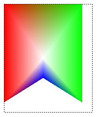

# Практическое руководство. Создание градиента вдоль контура
<xref:System.Drawing.Drawing2D.PathGradientBrush> Класс позволяет настраивать то, как вы постепенно изменение цвета заливки фигуры. Например можно указать один цвет для центра контура, а другой — для границы пути. Можно также определить отдельные цвета для каждой из нескольких точек на границе пути.  
  
> [!NOTE]
>  В [!INCLUDE[ndptecgdiplus](../../../../includes/ndptecgdiplus-md.md)], путь представляет собой последовательность линий и кривых, поддерживаемых <xref:System.Drawing.Drawing2D.GraphicsPath> объекта. Дополнительные сведения о [!INCLUDE[ndptecgdiplus](../../../../includes/ndptecgdiplus-md.md)] пути, см. в разделе [контуры в GDI +](graphics-paths-in-gdi.md) и [Constructing и рисование контуров](constructing-and-drawing-paths.md).  
  
### Заливка эллипса с градиента вдоль контура  
  
-   В следующем примере заполняется эллипса с кисти градиента контура. Имеет значение центрального цвета на синем и граничным цветом — зеленовато-голубой. На следующем рисунке заполненного эллипса.  
  
       
  
     По умолчанию кисти градиента контура не распространяется за пределами границы пути. При использовании пути градиентной кисти для заливки фигуры, которая выходит за пределы границ пути области экрана за пределами контура заполняться не будет.  
  
     На следующем рисунке показано, что происходит при изменении <xref:System.Drawing.Graphics.FillEllipse%2A> вызов в следующий код, чтобы `e.Graphics.FillRectangle(pthGrBrush, 0, 10, 200, 40)`:  
  
       
  
     [!code-csharp[System.Drawing.UsingaGradientBrush#11](~/samples/snippets/csharp/VS_Snippets_Winforms/System.Drawing.UsingaGradientBrush/CS/Class1.cs#11)]
       
  
     Предыдущий пример кода предназначен для работы с Windows Forms и требует <xref:System.Windows.Forms.PaintEventArgs> e, который является параметром из <xref:System.Windows.Forms.PaintEventHandler>.  
  
### Указание точек на границе  
  
-   В следующем примере создается градиентной кисти путь из пути форме четырехконечной звезды. В коде устанавливается <xref:System.Drawing.Drawing2D.PathGradientBrush.CenterColor%2A> свойство, которое задает цвет в центре звезды как красный. Затем устанавливается <xref:System.Drawing.Drawing2D.PathGradientBrush.SurroundColors%2A> свойство, чтобы указать различные цвета (хранящиеся в `colors` массива) отдельных точек в `points` массива. Последняя инструкция кода заливку пути в форме звезды с помощью кисти градиента контура.  
  
     [!code-csharp[System.Drawing.UsingaGradientBrush#12](~/samples/snippets/csharp/VS_Snippets_Winforms/System.Drawing.UsingaGradientBrush/CS/Class1.cs#12)]
       
  
-   В следующем примере рисуется градиента вдоль контура без <xref:System.Drawing.Drawing2D.GraphicsPath> в коде. Конкретного <xref:System.Drawing.Drawing2D.PathGradientBrush.%23ctor%2A> конструктор в примере, получает массив точек, но не требует <xref:System.Drawing.Drawing2D.GraphicsPath> объекта. Кроме того, обратите внимание, что <xref:System.Drawing.Drawing2D.PathGradientBrush> используется для заливки прямоугольника, а не путь. Прямоугольник больше, чем замкнутый контур, используемый для задания кисти, поэтому часть прямоугольника не закрашивается кистью. Ниже показан прямоугольник (пунктирная линия) и часть прямоугольника, созданный при помощи кисти градиента контура: 
  
       
  
     [!code-csharp[System.Drawing.UsingaGradientBrush#13](~/samples/snippets/csharp/VS_Snippets_Winforms/System.Drawing.UsingaGradientBrush/CS/Class1.cs#13)]
       
  
### Чтобы настроить градиента вдоль контура  
  
-   Одним из способов настройки кисти градиента контура является установка его <xref:System.Drawing.Drawing2D.PathGradientBrush.FocusScales%2A> свойство. Это свойство определяет внутренний путь, расположенную внутри главный путь. Центрального цвета везде в пределах этого внутреннего пути, а не только в центральной точке.  
  
     В следующем примере создается на основе эллиптической пути кисти градиента контура. Код задает в качестве цвета границы на синий, устанавливает центрального цвета на голубой и затем использует путь градиентной кисти для заливки по контуру.  
  
     Затем код задает коэффициенты масштабирования кисти градиента контура. Коэффициент масштабирования по x имеет значение 0.3 и масштабирования по оси y имеет значение 0,8. Этот код вызывает <xref:System.Drawing.Graphics.TranslateTransform%2A> метод <xref:System.Drawing.Graphics> объекта таким образом, последующий вызов <xref:System.Drawing.Graphics.FillPath%2A> осуществляется заливка эллипса, который находится справа от первого эллипса.  
  
     Чтобы увидеть эффект коэффициенты масштабирования, представьте себе небольшой эллипса, который совпадает с основной эллипс центром. Небольшой (внутренний) эллипс представляет собой основной эллипс, вдвое 0.3 и по вертикали с коэффициентом 0,8 горизонтально масштабировать (относительно ее центра). При перемещении от границы внешнего эллипса к границе внутреннего эллипса цвет плавно меняется от синего на голубой. При перемещении от границы внутреннего эллипса к общему центру зеленовато-голубой цвет сохраняется.  
  
     На рисунке ниже показан результат выполнения кода. Эллипс в левой части — голубой цвет только в центральной точки. Эллипс в правой — голубой везде в пределах внутреннего пути.  
  
   
  
 [!code-csharp[System.Drawing.UsingaGradientBrush#14](~/samples/snippets/csharp/VS_Snippets_Winforms/System.Drawing.UsingaGradientBrush/CS/Class1.cs#14)]
   
  
### Настройка с интерполяцией  
  
-   Чтобы указать массив интерполяции цветов и позиций интерполяции является другим способом настройки кисти градиента контура.  
  
     В следующем примере создается исходя треугольником кисти градиента контура. В коде устанавливается <xref:System.Drawing.Drawing2D.PathGradientBrush.InterpolationColors%2A> свойство кисти градиента контура, чтобы указать массив цветов интерполяции (темно-зеленый, голубой, синий), а также массив позиций интерполяции (0, 0,25, 1). При перемещении от границы треугольника к центральной точке цвет плавно меняется от темно-зеленый голубой, а затем из голубой цвет на синий. Изменение темно-зеленого цвета на голубой происходит на 25 процентов от расстояния от темно-зеленого до синего.  
  
     Ниже показан треугольник, заполненный градиентной кисти пользовательский путь.  
  
       
  
     [!code-csharp[System.Drawing.UsingaGradientBrush#15](~/samples/snippets/csharp/VS_Snippets_Winforms/System.Drawing.UsingaGradientBrush/CS/Class1.cs#15)]
       
  
### Чтобы задать точку center  
  
-   По умолчанию центральная точка градиентной кисти путь находится в центре путь, используемый для создания кисти. Можно изменить расположение точки center, задав <xref:System.Drawing.Drawing2D.PathGradientBrush.CenterPoint%2A> свойство <xref:System.Drawing.Drawing2D.PathGradientBrush> класса.  
  
     В следующем примере создается на основе эллиптического кисти градиента контура. Центром эллипса является точка (70, 35), но центральную точку градиента кисти путь имеет значение (120, 40).  
  
     [!code-csharp[System.Drawing.UsingaGradientBrush#16](~/samples/snippets/csharp/VS_Snippets_Winforms/System.Drawing.UsingaGradientBrush/CS/Class1.cs#16)]
       
  
     Ниже показан закрашенный эллипс и центральную точку градиента кисти пути:  
  
       
  
-   Можно задать центральную точку градиента кисти путь в расположение вне пути, который использовался для создания кисти. В следующем примере заменяется вызов для установки <xref:System.Drawing.Drawing2D.PathGradientBrush.CenterPoint%2A> свойство в приведенном выше коде.  
  
     [!code-csharp[System.Drawing.UsingaGradientBrush#17](~/samples/snippets/csharp/VS_Snippets_Winforms/System.Drawing.UsingaGradientBrush/CS/Class1.cs#17)]
       
  
     На следующем рисунке показан выходные данные этого изменения:  
  
       
  
     В приведенном выше рисунке в крайней правой точки эллипса не являются чисто синими (несмотря на то, что они очень близки). Цвета градиента располагаются так, как если бы заливки достиг точки (145, 35), где цвет является чисто синим (0, 0, 255). Никогда не дойти до точки (145, 35), так как путь Градиентная кисть закрашивает только в пределах заданного пути.  
  
## Компиляция кода  
 Предыдущий пример предназначен для работы с Windows Forms, и они требуют <xref:System.Windows.Forms.PaintEventArgs> `e`, который является параметром <xref:System.Windows.Forms.Control.Paint> обработчик событий.  
  
## См. также

- [Заливка фигур с помощью градиентной кисти](using-a-gradient-brush-to-fill-shapes.md)
