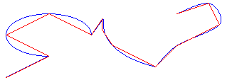

# Практическое руководство. Спрямление участков кривой
Объект <xref:System.Drawing.Drawing2D.GraphicsPath> объект хранит последовательность, линий и сплайнов Безье. Различные типы кривых (эллипсы, дуги, фундаментальные сплайны) можно добавить в путь, но каждую кривую преобразуется в кривую Безье, перед его сохранением в пути. Спрямление путь заключается в преобразовании всех сплайнов Безье в пути в последовательность прямых линий. Ниже показан путь до и после выравнивания.  
  
   
  
### Спрямление контура  
  
-   Вызовите <xref:System.Drawing.Drawing2D.GraphicsPath.Flatten%2A> метод <xref:System.Drawing.Drawing2D.GraphicsPath> объекта. <xref:System.Drawing.Drawing2D.GraphicsPath.Flatten%2A> Метод получает аргумент спрямления, который указывает максимальное расстояние между уплощенный путь и исходный путь.  
  
## См. также

- <xref:System.Drawing.Drawing2D.GraphicsPath?displayProperty=nameWithType>
- [Прямые и кривые линии и фигуры](lines-curves-and-shapes.md)
- [Построение и рисование контуров](constructing-and-drawing-paths.md)
