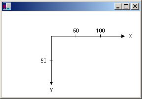
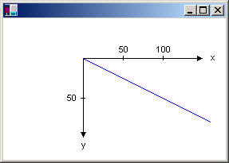
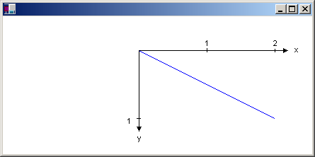

# Типы систем координат
[!INCLUDE[ndptecgdiplus](../../../../includes/ndptecgdiplus-md.md)] использует три координатных пространства: world, страницы и устройства. Мировые координаты — это координаты, используемые для моделирования определенного графического мира и которые можно передать методу в .NET Framework. Страничные координаты система координат, используемая области рисования, например формы или элемента управления. Координаты устройства — это координаты, используемые физического устройства, на котором производится рисование, будь то экран или лист бумаги. При выполнении вызова `myGraphics.DrawLine(myPen, 0, 0, 160, 80)`, точки, которые передаются <xref:System.Drawing.Graphics.DrawLine%2A> метод —`(0, 0)` и `(160, 80)`— находятся в мировом пространстве координат. Прежде чем [!INCLUDE[ndptecgdiplus](../../../../includes/ndptecgdiplus-md.md)] можно нарисовать линию на экране, координаты пройти через последовательность преобразований. Одно из преобразований, вызывается мировое преобразование, конвертирующее мировые координаты в координаты страницы и еще одно преобразование, страничное преобразование преобразует координаты в координаты устройства.  
  
## Системы координат и преобразования  
 Предположим, что вы хотите работать с системой координат его началом координат в тексте клиентской области, а не в левом верхнем углу. Предположим, например, возникает необходимость начало координат будет находиться 100 пикселей от левого края клиентской области и 50 пикселей от верхнего края клиентской области. На следующем рисунке такая система координат.  
  
   
  
 При выполнении вызова `myGraphics.DrawLine(myPen, 0, 0, 160, 80)`, линия, показано на следующем рисунке.  
  
   
  
 Ниже приведены координаты конечных точек линии в трех пространствах координат.  
  
|||  
|-|-|  
|мир|(0, 0) к (160, 80)|  
|Страница|(100, 50) к (260, 130)|  
|Устройство|(100, 50) к (260, 130)|  
  
 Обратите внимание, что пространство координат страницы начала координат в левом верхнем углу области клиента. Это всегда будет так. Также Обратите внимание, что так как единицы измерения пиксель, координаты устройства так же, как координаты страницы. Значение единицы измерения отличные от точек (например, дюймов), координаты устройства будет отличаться от страничных координат.  
  
 Мировое преобразование, которая сопоставляет мировых координатах в координаты страницы, хранится в <xref:System.Drawing.Graphics.Transform%2A> свойство <xref:System.Drawing.Graphics> класса. В приведенном выше примере мировое преобразование является сдвиг на 100 единиц по оси x и 50 единиц по оси y. В следующем примере задается мировое преобразование объекта <xref:System.Drawing.Graphics> объекта, а затем использует, <xref:System.Drawing.Graphics> объекта, чтобы нарисовать линию, показанный на предыдущем рисунке:  
  
 [!code-csharp[System.Drawing.CoordinateSystems#31](~/samples/snippets/csharp/VS_Snippets_Winforms/System.Drawing.CoordinateSystems/CS/Class1.cs#31)]
 [!code-vb[System.Drawing.CoordinateSystems#31](~/samples/snippets/visualbasic/VS_Snippets_Winforms/System.Drawing.CoordinateSystems/VB/Class1.vb#31)]  
  
 Преобразование страницы сопоставляет координаты в координаты устройства. <xref:System.Drawing.Graphics> Класс предоставляет <xref:System.Drawing.Graphics.PageUnit%2A> и <xref:System.Drawing.Graphics.PageScale%2A> свойства для управления преобразование страницы. <xref:System.Drawing.Graphics> Класс также предоставляет два свойства только для чтения, <xref:System.Drawing.Graphics.DpiX%2A> и <xref:System.Drawing.Graphics.DpiY%2A>, для проверки горизонтальных и вертикальных точек на дюйм дисплея.  
  
 Можно использовать <xref:System.Drawing.Graphics.PageUnit%2A> свойство <xref:System.Drawing.Graphics> класса для указания единицы измерения, отличного от точки.  
  
> [!NOTE]
>  Невозможно задать <xref:System.Drawing.Graphics.PageUnit%2A> свойства <xref:System.Drawing.GraphicsUnit.World>, как это не физическую единицу и вызовет исключение.  
  
 В следующем примере рисуется строки из (0, 0) на (2, 1), где точка (2, 1) — 2 дюйма вправо и 1 дюйм вниз от точки (0, 0):  
  
 [!code-csharp[System.Drawing.CoordinateSystems#32](~/samples/snippets/csharp/VS_Snippets_Winforms/System.Drawing.CoordinateSystems/CS/Class1.cs#32)]
 [!code-vb[System.Drawing.CoordinateSystems#32](~/samples/snippets/visualbasic/VS_Snippets_Winforms/System.Drawing.CoordinateSystems/VB/Class1.vb#32)]  
  
> [!NOTE]
>  Если не указать ширину пера, когда пера, приведенном выше примере будет нарисовать линию, один дюйм. Можно указать ширину пера в качестве второго аргумента <xref:System.Drawing.Pen> конструктор:  
  
 [!code-csharp[System.Drawing.CoordinateSystems#33](~/samples/snippets/csharp/VS_Snippets_Winforms/System.Drawing.CoordinateSystems/CS/Class1.cs#33)]
 [!code-vb[System.Drawing.CoordinateSystems#33](~/samples/snippets/visualbasic/VS_Snippets_Winforms/System.Drawing.CoordinateSystems/VB/Class1.vb#33)]  
  
 Если предположить, что устройство отображения содержит 96 точек на дюйм по горизонтали и 96 точек на дюйм по вертикали, конечные точки линии в предыдущем примере имеют следующие координаты в три координатных пространства:  
  
|||  
|-|-|  
|мир|(0, 0) на (2, 1)|  
|Страница|(0, 0) на (2, 1)|  
|Устройство|(0, 0, чтобы (192, 96)|  
  
 Обратите внимание, что поскольку происхождение мировых координат в левом верхнем углу клиентской области, координаты страницы так же, как мировых координатах.  
  
 Можно объединить мировое и страничное преобразования для получения различных эффектов. Например предположим, вы хотите использовать в качестве единицы измерения дюймов и начало координат должно быть 2 дюйма от левого края клиентской области и 1/2 дюйма от верхнего края клиентской области. В следующем примере задается мировое и страничное преобразования из <xref:System.Drawing.Graphics> и затем рисует линию от (0, 0) на (2, 1):  
  
 [!code-csharp[System.Drawing.CoordinateSystems#34](~/samples/snippets/csharp/VS_Snippets_Winforms/System.Drawing.CoordinateSystems/CS/Class1.cs#34)]
 [!code-vb[System.Drawing.CoordinateSystems#34](~/samples/snippets/visualbasic/VS_Snippets_Winforms/System.Drawing.CoordinateSystems/VB/Class1.vb#34)]  
  
 Ниже показан строки и системы координат.  
  
   
  
 Если предположить, что устройство отображения содержит 96 точек на дюйм по горизонтали и 96 точек на дюйм по вертикали, конечные точки линии в предыдущем примере имеют следующие координаты в три координатных пространства:  
  
|||  
|-|-|  
|мир|(0, 0) на (2, 1)|  
|Страница|(2, 0,5) к (4, 1.5)|  
|Устройство|(192, 48) к (384, 144)|  
  
## См. также

- [Системы координат и преобразования](coordinate-systems-and-transformations.md)
- [Матричное представление преобразований](matrix-representation-of-transformations.md)
