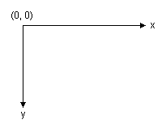
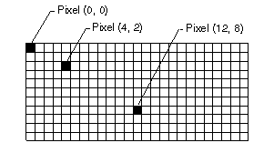
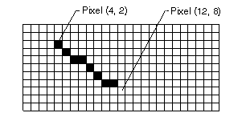

# Общие сведения о векторной графике
[!INCLUDE[ndptecgdiplus](../../../../includes/ndptecgdiplus-md.md)] Рисует линии, прямоугольники и других фигур в системе координат. Можно выбрать из различных систем координат, но система координат по умолчанию имеет начало координат в левом верхнем углу ось x вправо, а ось y направлена вниз. Единицы измерения в системе координат по умолчанию является пиксель.  
  
## Стандартные блоки GDI +  
   
  
 Монитор компьютера создает его отображение на прямоугольный массив точек, называемых элементами изображения. Разное количество пикселей, отображаемых на экране монитора к другому, а количество пикселей, которые отображаются на отдельных мониторе обычно можно в некоторой степени пользователем.  
  
   
  
 При использовании [!INCLUDE[ndptecgdiplus](../../../../includes/ndptecgdiplus-md.md)] Чтобы нарисовать линию, прямоугольник или кривой, предоставляют ключевая информация об элементе для отрисовки. Например можно указать строку, предоставляя две точки, и можно указать, предоставляя точку, высоту и ширину прямоугольника. [!INCLUDE[ndptecgdiplus](../../../../includes/ndptecgdiplus-md.md)] работает в сочетании с программным обеспечением драйвера экрана, чтобы определить, какие точек должен быть включен для отображения линии, прямоугольника или кривой. На следующем рисунке пиксели, которые включены для отображения линии из точки (4, 2) в точку ("12", "8").  
  
   
  
 Со временем некоторые основные стандартные блоки оказались наиболее удобно для создания двухмерных изображений. Эти стандартные блоки, которые поддерживаются системой [!INCLUDE[ndptecgdiplus](../../../../includes/ndptecgdiplus-md.md)], приведены в следующем списке:  
  
-   Прямых линий  
  
-   Прямоугольники  
  
-   Многоточие  
  
-   Дуги  
  
-   Многоугольники  
  
-   Фундаментальные сплайны  
  
-   сплайны Безье  
  
## Методы для рисования с помощью графических объектов  
 <xref:System.Drawing.Graphics> В класс [!INCLUDE[ndptecgdiplus](../../../../includes/ndptecgdiplus-md.md)] предоставляет следующие методы для рисования элементов в списке выше: <xref:System.Drawing.Graphics.DrawLine%2A>, <xref:System.Drawing.Graphics.DrawRectangle%2A>, <xref:System.Drawing.Graphics.DrawEllipse%2A>, <xref:System.Drawing.Graphics.DrawPolygon%2A>, <xref:System.Drawing.Graphics.DrawArc%2A>, <xref:System.Drawing.Graphics.DrawCurve%2A> (для фундаментальные сплайны), и <xref:System.Drawing.Graphics.DrawBezier%2A>. Каждый из этих методов перегружена; то есть каждый метод поддерживает несколько различными списками параметров. Например, один из вариантов <xref:System.Drawing.Graphics.DrawLine%2A> метод получает <xref:System.Drawing.Pen> объекта и четырех целых чисел, а другой вариант <xref:System.Drawing.Graphics.DrawLine%2A> метод получает <xref:System.Drawing.Pen> и два <xref:System.Drawing.Point> объектов.  
  
 Методы для рисования линий, прямоугольников и сплайнов Безье иметь вспомогательные методы, выполняющие нарисовать несколько элементов за один вызов: <xref:System.Drawing.Graphics.DrawLines%2A>, <xref:System.Drawing.Graphics.DrawRectangles%2A>, и <xref:System.Drawing.Graphics.DrawBeziers%2A>. Кроме того <xref:System.Drawing.Graphics.DrawCurve%2A> метод имеет вспомогательный метод, <xref:System.Drawing.Graphics.DrawClosedCurve%2A>, что точка кривой, подключившись к начальной конечной точки кривой закрывается.  
  
 Все методы рисования <xref:System.Drawing.Graphics> используют с <xref:System.Drawing.Pen> объекта. Чтобы нарисовать что-либо, необходимо создать по крайней мере два объекта: <xref:System.Drawing.Graphics> объекта и <xref:System.Drawing.Pen> объекта. <xref:System.Drawing.Pen> Объект сохраняет атрибуты, такие как толщины и цвета, рисуемого элемента. <xref:System.Drawing.Pen> Объект передается в качестве одного из аргументов метод рисования. Например, один из вариантов <xref:System.Drawing.Graphics.DrawLine%2A> метод получает <xref:System.Drawing.Pen> объекта и четырех целых чисел, как показано в следующем примере, который рисует прямоугольник с шириной 100, высотой 50 и координатами верхнего левого угла (20, 10):  
  
 [!code-csharp[LinesCurvesAndShapes#11](~/samples/snippets/csharp/VS_Snippets_Winforms/LinesCurvesAndShapes/CS/Class1.cs#11)]
 [!code-vb[LinesCurvesAndShapes#11](~/samples/snippets/visualbasic/VS_Snippets_Winforms/LinesCurvesAndShapes/VB/Class1.vb#11)]  
  
## См. также

- <xref:System.Drawing.Graphics?displayProperty=nameWithType>
- <xref:System.Drawing.Pen?displayProperty=nameWithType>
- [Прямые и кривые линии и фигуры](lines-curves-and-shapes.md)
- [Практическое руководство. Создание графических объектов для рисования](how-to-create-graphics-objects-for-drawing.md)
