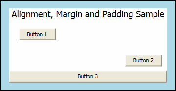
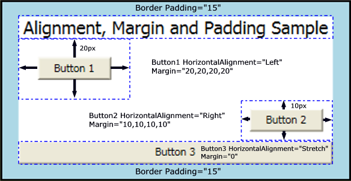
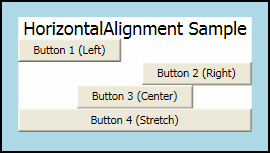
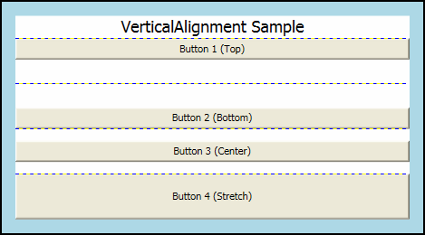
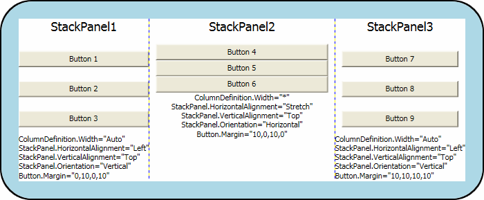

# Общие сведения о свойствах Alignment, Margin, Padding
<xref:System.Windows.FrameworkElement> Класс предоставляет несколько свойств, которые используются для точного размещения дочерних элементов. В этом разделе рассмотрены четыре наиболее важных свойства: <xref:System.Windows.FrameworkElement.HorizontalAlignment%2A>, <xref:System.Windows.FrameworkElement.Margin%2A>, <xref:System.Windows.Controls.Border.Padding%2A>, и <xref:System.Windows.FrameworkElement.VerticalAlignment%2A>. Очень важно иметь представление о результатах применения этих свойств, поскольку они обеспечивают основу для управления положением элементов в приложениях [!INCLUDE[TLA#tla_winclient](../../../../includes/tlasharptla-winclient-md.md)].  

   
## Введение в позиционирование элементов  
 Существуют разные способы позиционирования элементов с помощью [!INCLUDE[TLA2#tla_winclient](../../../../includes/tla2sharptla-winclient-md.md)]. Однако идеальный макет достигается не просто выбором справа <xref:System.Windows.Controls.Panel> элемент. Точное управление размещением требует понимания <xref:System.Windows.FrameworkElement.HorizontalAlignment%2A>, <xref:System.Windows.FrameworkElement.Margin%2A>, <xref:System.Windows.Controls.Border.Padding%2A>, и <xref:System.Windows.FrameworkElement.VerticalAlignment%2A> свойства.  
  
 На следующем рисунке показан сценарий макета, использующий несколько свойств размещения.  
  
   
  
 На первый взгляд <xref:System.Windows.Controls.Button> может появиться элементы на этой иллюстрации размещены случайным образом. На самом деле их положение точно контролируется с помощью сочетания полей, выравнивания и заполнения.  
  
 В следующем примере демонстрируется создание макета, показанного на предыдущем рисунке. Объект <xref:System.Windows.Controls.Border> инкапсулирует родительский <xref:System.Windows.Controls.StackPanel>, с помощью <xref:System.Windows.Controls.Border.Padding%2A> значение 15 аппаратно-независимых пикселях. Это учитывается для узкой <xref:System.Windows.Media.Brushes.LightBlue%2A> аппаратного контроллера управления, которая окружает дочерний элемент <xref:System.Windows.Controls.StackPanel>. Дочерние элементы <xref:System.Windows.Controls.StackPanel> используются для иллюстрации каждого из различных свойств размещения, которые подробно описаны в этом разделе. Три <xref:System.Windows.Controls.Button> элементы используются для демонстрации <xref:System.Windows.FrameworkElement.Margin%2A> и <xref:System.Windows.FrameworkElement.HorizontalAlignment%2A> свойства.  
  
 [!code-csharp[MPALayoutSampleIntro#1](~/samples/snippets/csharp/VS_Snippets_Wpf/MPALayoutSampleIntro/CSharp/MPA_Layout_Sample_Intro.cs#1)]
 [!code-vb[MPALayoutSampleIntro#1](~/samples/snippets/visualbasic/VS_Snippets_Wpf/MPALayoutSampleIntro/VisualBasic/MPALayoutIntro.vb#1)]  
  
 Следующая схема обеспечивает подробное представление различных свойств размещения, примененных в предыдущем примере. В последующих разделах этой статьи более подробно описывается использование каждого свойства размещения.  
  
   
  
   
## Общие сведения о свойствах Alignment  
 <xref:System.Windows.FrameworkElement.HorizontalAlignment%2A> И <xref:System.Windows.FrameworkElement.VerticalAlignment%2A> свойства описывают, как дочерний элемент должен быть размещен в родительском элементе выделенного пространства макета. При совместном использовании этих свойств можно точно расположить дочерние элементы. Например, дочерние элементы <xref:System.Windows.Controls.DockPanel> можно указать четыре разных горизонтального выравнивания: <xref:System.Windows.HorizontalAlignment.Left>, <xref:System.Windows.HorizontalAlignment.Right>, или <xref:System.Windows.HorizontalAlignment.Center>, или <xref:System.Windows.HorizontalAlignment.Stretch> для заполнения доступного пространства. Аналогичные значения доступны для вертикального размещения.  
  
> [!NOTE]
>  Явно заданные <xref:System.Windows.FrameworkElement.Height%2A> и <xref:System.Windows.FrameworkElement.Width%2A> свойств в элементе имеют приоритет над <xref:System.Windows.HorizontalAlignment.Stretch> значение свойства. Попытка задать <xref:System.Windows.FrameworkElement.Height%2A>, <xref:System.Windows.FrameworkElement.Width%2A>и <xref:System.Windows.FrameworkElement.HorizontalAlignment%2A> значение `Stretch` приводит `Stretch` запроса игнорируются.  
  
   
### Свойство HorizontalAlignment  
 <xref:System.Windows.FrameworkElement.HorizontalAlignment%2A> Свойство объявляет характеристики горизонтального выравнивания для применения к дочерним элементам. Ниже показаны все возможные значения <xref:System.Windows.FrameworkElement.HorizontalAlignment%2A> свойство.  
  
|Член|Описание|  
|------------|-----------------|  
|<xref:System.Windows.HorizontalAlignment.Left>|Дочерние элементы выравниваются по левому краю выделенного пространства макета родительского элемента.|  
|<xref:System.Windows.HorizontalAlignment.Center>|Дочерние элементы выравниваются по центру выделенного пространства макета родительского элемента.|  
|<xref:System.Windows.HorizontalAlignment.Right>|Дочерние элементы выравниваются по правому краю выделенного пространства макета родительского элемента.|  
|<xref:System.Windows.HorizontalAlignment.Stretch> (Значение по умолчанию)|Дочерние элементы растягиваются для заполнения выделенного пространства макета родительского элемента. Явные <xref:System.Windows.FrameworkElement.Width%2A> и <xref:System.Windows.FrameworkElement.Height%2A> значения имеют приоритет.|  
  
 В следующем примере показано, как применить <xref:System.Windows.FrameworkElement.HorizontalAlignment%2A> свойства <xref:System.Windows.Controls.Button> элементов. Показаны все значения атрибутов, чтобы проиллюстрировать различные режимы отрисовки.  
  
 [!code-csharp[MPALayoutHorizontalAlignment#2](~/samples/snippets/csharp/VS_Snippets_Wpf/MPALayoutHorizontalAlignment/CSharp/MPA_Layout_HorizontalAlignment.cs#2)]
 [!code-vb[MPALayoutHorizontalAlignment#2](~/samples/snippets/visualbasic/VS_Snippets_Wpf/MPALayoutHorizontalAlignment/VisualBasic/MPA_Layout_HorizontalAlignment.vb#2)]  
  
 Приведенный выше код создает макет, похожий на следующий рисунок. Эффекты размещения для каждого <xref:System.Windows.FrameworkElement.HorizontalAlignment%2A> значение видны на рисунке.  
  
   
  
   
### Свойство VerticalAlignment  
 <xref:System.Windows.FrameworkElement.VerticalAlignment%2A> Свойство описывает характеристики вертикального выравнивания, чтобы применить к дочерним элементам. В следующей таблице показаны все возможные значения для <xref:System.Windows.FrameworkElement.VerticalAlignment%2A> свойство.  
  
|Член|Описание|  
|------------|-----------------|  
|<xref:System.Windows.VerticalAlignment.Top>|Дочерние элементы выравниваются по верхнему краю выделенного пространства макета родительского элемента.|  
|<xref:System.Windows.VerticalAlignment.Center>|Дочерние элементы выравниваются по центру выделенного пространства макета родительского элемента.|  
|<xref:System.Windows.VerticalAlignment.Bottom>|Дочерние элементы выравниваются по нижнему краю выделенного пространства макета родительского элемента.|  
|<xref:System.Windows.VerticalAlignment.Stretch> (Значение по умолчанию)|Дочерние элементы растягиваются для заполнения выделенного пространства макета родительского элемента. Явные <xref:System.Windows.FrameworkElement.Width%2A> и <xref:System.Windows.FrameworkElement.Height%2A> значения имеют приоритет.|  
  
 В следующем примере показано, как применить <xref:System.Windows.FrameworkElement.VerticalAlignment%2A> свойства <xref:System.Windows.Controls.Button> элементов. Показаны все значения атрибутов, чтобы проиллюстрировать различные режимы отрисовки. Для данного примера <xref:System.Windows.Controls.Grid> с видимым линиями сетки используется в качестве родительского для лучшей иллюстрации поведения каждого значения свойства.  
  
 [!code-csharp[MPALayoutVerticalAlignment#2](~/samples/snippets/csharp/VS_Snippets_Wpf/MPALayoutVerticalAlignment/CSharp/MPA_Layout_VerticalAlignment.cs#2)]
 [!code-vb[MPALayoutVerticalAlignment#2](~/samples/snippets/visualbasic/VS_Snippets_Wpf/MPALayoutVerticalAlignment/VisualBasic/MPA_Layout_VerticalAlignment.vb#2)]
 [!code-xaml[MPALayoutVerticalAlignment#2](~/samples/snippets/xaml/VS_Snippets_Wpf/MPALayoutVerticalAlignment/XAML/default.xaml#2)]  
  
 Приведенный выше код создает макет, похожий на следующий рисунок. Эффекты размещения для каждого <xref:System.Windows.FrameworkElement.VerticalAlignment%2A> значение видны на рисунке.  
  
   
  
   
## Основные сведения о свойствах Margin  
 <xref:System.Windows.FrameworkElement.Margin%2A> Свойство описывает расстояние между элементом и его дочерних или одноранговых узлов. <xref:System.Windows.FrameworkElement.Margin%2A> значения могут быть однородными, используя следующий синтаксис `Margin="20"`. С помощью этого синтаксиса равномерное <xref:System.Windows.FrameworkElement.Margin%2A> 20 устройства независимых пикселях будут применяться к элементу. <xref:System.Windows.FrameworkElement.Margin%2A> значения может также принимать форму четыре различных значений, описывающих различные поля слева, сверху, справа и снизу (в таком порядке), как `Margin="0,10,5,25"`. Правильное использование <xref:System.Windows.FrameworkElement.Margin%2A> свойство позволяет очень точно управлять положением отрисовки элемента и положения его соседних и дочерних элементов.  
  
> [!NOTE]
>  Ненулевое значение поля применяет пространство за пределами этого элемента <xref:System.Windows.FrameworkElement.ActualWidth%2A> и <xref:System.Windows.FrameworkElement.ActualHeight%2A>.  
  
 В следующем примере показано, как применить однородные поля группы <xref:System.Windows.Controls.Button> элементов. <xref:System.Windows.Controls.Button> Элементы расположены равномерно с буфером 10 точек в каждом направлении.  
  
 [!code-cpp[MarginPaddingAlignmentSample#1](~/samples/snippets/cpp/VS_Snippets_Wpf/MarginPaddingAlignmentSample/CPP/Margin_Padding_Alignment_Sample.cpp#1)]
 [!code-csharp[MarginPaddingAlignmentSample#1](~/samples/snippets/csharp/VS_Snippets_Wpf/MarginPaddingAlignmentSample/CSharp/Margin_Padding_Alignment_Sample.cs#1)]
 [!code-vb[MarginPaddingAlignmentSample#1](~/samples/snippets/visualbasic/VS_Snippets_Wpf/MarginPaddingAlignmentSample/VisualBasic/MarginPaddingAlignment.vb#1)]
 [!code-xaml[MarginPaddingAlignmentSample#1](~/samples/snippets/xaml/VS_Snippets_Wpf/MarginPaddingAlignmentSample/XAML/default.xaml#1)]  
  
 Во многих случаях универсальные поля не подходят. В этих случаях можно применять неоднородные интервалы. В следующем примере показано применение неоднородных полей к дочерним элементам. Поля описываются в следующем порядке: слева, сверху, справа, снизу.  
  
 [!code-cpp[MarginPaddingAlignmentSample#2](~/samples/snippets/cpp/VS_Snippets_Wpf/MarginPaddingAlignmentSample/CPP/Margin_Padding_Alignment_Sample.cpp#2)]
 [!code-csharp[MarginPaddingAlignmentSample#2](~/samples/snippets/csharp/VS_Snippets_Wpf/MarginPaddingAlignmentSample/CSharp/Margin_Padding_Alignment_Sample.cs#2)]
 [!code-vb[MarginPaddingAlignmentSample#2](~/samples/snippets/visualbasic/VS_Snippets_Wpf/MarginPaddingAlignmentSample/VisualBasic/MarginPaddingAlignment.vb#2)]
 [!code-xaml[MarginPaddingAlignmentSample#2](~/samples/snippets/xaml/VS_Snippets_Wpf/MarginPaddingAlignmentSample/XAML/default.xaml#2)]  
  
   
## Основные сведения о свойстве Padding  
 Аналогично свойству <xref:System.Windows.FrameworkElement.Margin%2A> во многом. Свойство Padding предоставляется в только в нескольких классах, главным образом для удобства: <xref:System.Windows.Documents.Block>, <xref:System.Windows.Controls.Border>, <xref:System.Windows.Controls.Control>, и <xref:System.Windows.Controls.TextBlock> являются примерами классов, которые предоставляют свойство Padding. <xref:System.Windows.Controls.Border.Padding%2A> Свойство увеличивает эффективный размер дочернего элемента по заданному <xref:System.Windows.Thickness> значение.  
  
 В следующем примере показано, как применить <xref:System.Windows.Controls.Border.Padding%2A> к родительскому элементу <xref:System.Windows.Controls.Border> элемент.  
  
 [!code-cpp[MarginPaddingAlignmentSample#3](~/samples/snippets/cpp/VS_Snippets_Wpf/MarginPaddingAlignmentSample/CPP/Margin_Padding_Alignment_Sample.cpp#3)]
 [!code-csharp[MarginPaddingAlignmentSample#3](~/samples/snippets/csharp/VS_Snippets_Wpf/MarginPaddingAlignmentSample/CSharp/Margin_Padding_Alignment_Sample.cs#3)]
 [!code-vb[MarginPaddingAlignmentSample#3](~/samples/snippets/visualbasic/VS_Snippets_Wpf/MarginPaddingAlignmentSample/VisualBasic/MarginPaddingAlignment.vb#3)]
 [!code-xaml[MarginPaddingAlignmentSample#3](~/samples/snippets/xaml/VS_Snippets_Wpf/MarginPaddingAlignmentSample/XAML/default.xaml#3)]  
  
   
## Использование свойств Alignment, Margin и Padding в приложении  
 <xref:System.Windows.FrameworkElement.HorizontalAlignment%2A>, <xref:System.Windows.FrameworkElement.Margin%2A>, <xref:System.Windows.Controls.Border.Padding%2A>, и <xref:System.Windows.FrameworkElement.VerticalAlignment%2A> предоставляют управления размещением, необходимые для создания сложного [!INCLUDE[TLA#tla_ui](../../../../includes/tlasharptla-ui-md.md)]. Эффекты каждого свойства позволяют изменить размещение дочерних элементов, обеспечивая гибкость создания динамических приложений и интерфейсов пользователя.  
  
 В следующем примере демонстрируются понятия, описанные в этом разделе. Основываясь на инфраструктуре, приведенной в первом примере этого раздела, в этом примере добавляется <xref:System.Windows.Controls.Grid> как дочерний элемент элемента <xref:System.Windows.Controls.Border> в первом примере. <xref:System.Windows.Controls.Border.Padding%2A> применяется к родительскому <xref:System.Windows.Controls.Border> элемент. <xref:System.Windows.Controls.Grid> Используется для разделения пространства между тремя дочерними <xref:System.Windows.Controls.StackPanel> элементов. <xref:System.Windows.Controls.Button> элементы повторно используются для отображения различных эффектов <xref:System.Windows.FrameworkElement.Margin%2A> и <xref:System.Windows.FrameworkElement.HorizontalAlignment%2A>. <xref:System.Windows.Controls.TextBlock> элементы добавляются к каждому <xref:System.Windows.Controls.ColumnDefinition> для лучшего определения различных свойств, применяемых к <xref:System.Windows.Controls.Button> элементов в каждом столбце.  
  
 [!code-cpp[MarginPaddingAlignmentSample#4](~/samples/snippets/cpp/VS_Snippets_Wpf/MarginPaddingAlignmentSample/CPP/Margin_Padding_Alignment_Sample.cpp#4)]
 [!code-csharp[MarginPaddingAlignmentSample#4](~/samples/snippets/csharp/VS_Snippets_Wpf/MarginPaddingAlignmentSample/CSharp/Margin_Padding_Alignment_Sample.cs#4)]
 [!code-vb[MarginPaddingAlignmentSample#4](~/samples/snippets/visualbasic/VS_Snippets_Wpf/MarginPaddingAlignmentSample/VisualBasic/MarginPaddingAlignment.vb#4)]
 [!code-xaml[MarginPaddingAlignmentSample#4](~/samples/snippets/xaml/VS_Snippets_Wpf/MarginPaddingAlignmentSample/XAML/default.xaml#4)]  
  
 При компиляции приведенное выше приложение создает [!INCLUDE[TLA2#tla_ui](../../../../includes/tla2sharptla-ui-md.md)], который показан на рисунке ниже. Влияние различных значений свойств выражается интервалами между элементами, а существенные изменения значений свойств для элементов в каждом столбце отображаются внутри <xref:System.Windows.Controls.TextBlock> элементов.  
  
   
  
   
## Что дальше?  
 Свойства позиционирования, определенные <xref:System.Windows.FrameworkElement> класс обеспечивают точное управление размещением элементов в [!INCLUDE[TLA2#tla_winclient](../../../../includes/tla2sharptla-winclient-md.md)] приложений. Вы получаете в свое распоряжение несколько способов, позволяющих более эффективно размещать элементы с помощью [!INCLUDE[TLA2#tla_winclient](../../../../includes/tla2sharptla-winclient-md.md)].  
  
 Доступны дополнительные ресурсы, в которых макет [!INCLUDE[TLA2#tla_winclient](../../../../includes/tla2sharptla-winclient-md.md)] рассматривается более подробно. [Общие сведения о панелях](../controls/panels-overview.md) разделе содержатся более подробные сведения о различных <xref:System.Windows.Controls.Panel> элементов. Раздел [Пошаговое руководство: Создание первого классического приложения WPF](../getting-started/walkthrough-my-first-wpf-desktop-application.md) рассмотрены дополнительные методики, использующие элементы макета для размещения компонентов и привязки их действий к источникам данных.  
  
## См. также

- <xref:System.Windows.FrameworkElement>
- <xref:System.Windows.FrameworkElement.HorizontalAlignment%2A>
- <xref:System.Windows.FrameworkElement.VerticalAlignment%2A>
- <xref:System.Windows.FrameworkElement.Margin%2A>
- [Общие сведения о панелях](../controls/panels-overview.md)
- [Макет](layout.md)
- [Пример коллекции макетов WPF](https://go.microsoft.com/fwlink/?LinkID=160054)
