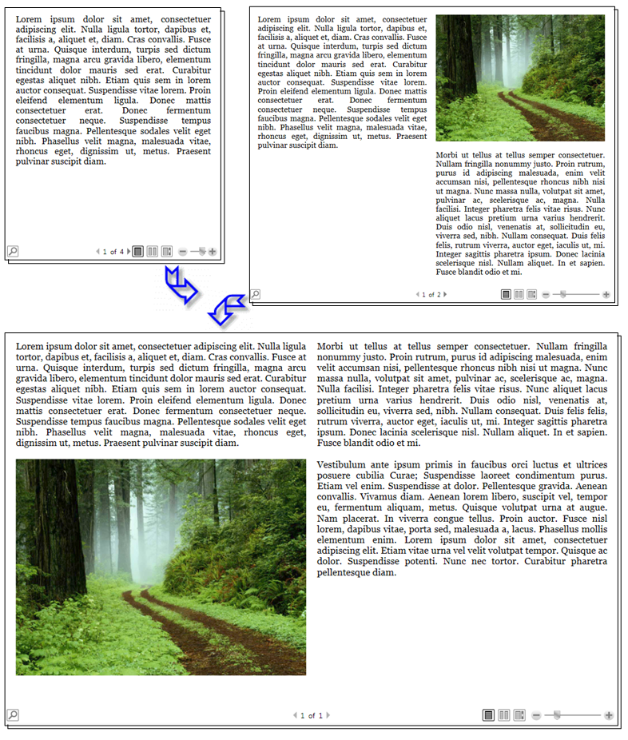
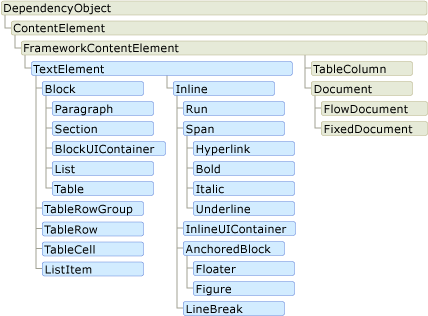
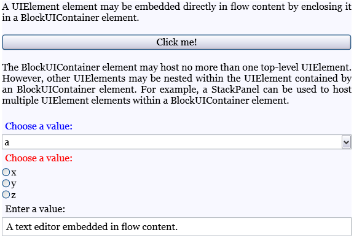
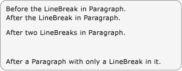
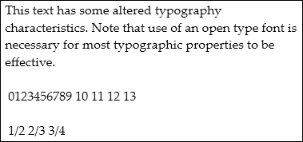

# Общие сведения о документах нефиксированного формата
Документы нефиксированного формата предназначены для более удобного просмотра и чтения. Вместо того чтобы использовать какой-либо определенный макет, документы нефиксированного формата динамически корректируют и перемещают содержимое с учетом переменных времени выполнения, таких как размер окна, разрешение устройства и дополнительные пользовательские настройки. Кроме того, в документах нефиксированного формата доступны расширенные возможности, такие как разбивка на страницы и столбцы. В этом разделе представлены общие сведения о документах нефиксированного формата и способах их создания.  

   
## Что такое документ нефиксированного формата  
 Документ нефиксированного формата предназначен для "переформатирования содержимого" в зависимости от размера окна, разрешения устройства и других переменных среды. Кроме того, документы нефиксированного формата имеют несколько встроенных возможностей, включая поиск, режимы просмотра, оптимизирующие читаемость, и возможность менять размер и внешний вид шрифта. Документы нефиксированного формата следует использовать, если удобство чтения является основным приоритетом. Напротив, документы фиксированного формата предназначены для статического представления. Документы фиксированного формата полезны в тех случаях, когда важна точная передача содержимого источника. См. в разделе [документы в WPF](documents-in-wpf.md) Дополнительные сведения о разных типах документов.  
  
 Ниже показан образец документа нефиксированного формата, отображенного в нескольких окнах разных размеров. При изменении области отображения содержимое переформатируется для оптимального использования доступного пространства.  
  
   
  
 Как показано на рисунке выше, содержимое нефиксированного формата может включать многие компоненты, такие как абзацы, списки, изображения и др. Эти компоненты соответствуют элементам в разметке и объектам в процедурном коде. Рассмотрим более подробно эти классы позже на [потока связанные классы](#flow_related_classes) раздел в этом обзоре. Сейчас ниже приведен простой пример кода, создающий документ нефиксированного формата, состоит из абзаца с выделенным полужирным текстом и списка.
  
 [!code-xaml[FlowOvwSnippets_snip#SimpleFlowExampleWholePage](~/samples/snippets/csharp/VS_Snippets_Wpf/FlowOvwSnippets_snip/CS/SimpleFlowExample.xaml#simpleflowexamplewholepage)]  
  
 [!code-csharp[FlowOvwSnippets_procedural_snip#SimpleFlowCodeOnlyExampleWholePage](~/samples/snippets/csharp/VS_Snippets_Wpf/FlowOvwSnippets_procedural_snip/CSharp/SimpleFlowExample.cs#simpleflowcodeonlyexamplewholepage)]
   
  
 На рисунке ниже представлен результат выполнения этого фрагмента кода.  
  
   
  
 В этом примере <xref:System.Windows.Controls.FlowDocumentReader> управления используется для размещения содержимого нефиксированного формата. См. в разделе [типы документов нефиксированного формата](#flow_document_types) Дополнительные сведения о потоковом содержимом, размещение элементов управления. <xref:System.Windows.Documents.Paragraph>, <xref:System.Windows.Documents.List>, <xref:System.Windows.Documents.ListItem>, и <xref:System.Windows.Documents.Bold> элементы используются для управления форматированием содержимого на основе их порядка в разметке. Например <xref:System.Windows.Documents.Bold> элемент охватывает только часть текста в абзаце; таким образом, что часть текста полужирным шрифтом. Если вы когда-либо работали с HTML, такой сценарий будет вам знаком.  
  
 Как видно на приведенном выше рисунке существует несколько функций, встроенных в документы нефиксированного формата:
  
-   Поиск: Позволяет пользователю выполнять полнотекстовый поиск по всему документу.  
  
-   Режим просмотра: Пользователь может выбрать предпочтительный режим просмотра включая постраничный (страницы в a-time), две страницы в раз (книжный формат) режиме непрерывной прокрутки (без дна) и режим просмотра.  Дополнительные сведения об этих режимах просмотра см. в разделе <xref:System.Windows.Controls.FlowDocumentReaderViewingMode>.  
  
-   Элементы управления навигацией: Если в режиме просмотра документа используются страницы, элементы управления навигации по страницам включают кнопку для перехода на следующую страницу (стрелка вниз) или предыдущую страницу (стрелка вверх), а также индикаторы номера текущей страницы и общее число страниц. Пролистывание страниц может также выполняться с помощью клавиши со стрелками.  
  
-   Масштаб: Элементы управления масштабом позволяют пользователю увеличить или уменьшить масштаб, щелкнув знак "плюс" или «минус», соответственно. Элементы управления масштабом также включают ползунок для изменения масштаба. Дополнительные сведения см. в разделе <xref:System.Windows.Controls.FlowDocumentReader.Zoom%2A>.  
  
 Эти функции можно изменять с учетом элемента управления, используемого для размещения содержимого. В следующем разделе описываются различные элементы управления.  
  
   
## Типы документов нефиксированного формата  
 Отображение содержимого документа нефиксированного формата и его вид зависят от того, какой объект используется для размещения содержимого. Существует четыре элемента управления, поддерживающих Просмотр содержимого нефиксированного формата: <xref:System.Windows.Controls.FlowDocumentReader>, <xref:System.Windows.Controls.FlowDocumentPageViewer>, <xref:System.Windows.Controls.RichTextBox>, и <xref:System.Windows.Controls.FlowDocumentScrollViewer>. Эти элементы управления кратко описаны ниже.  
  
 **Примечание:** <xref:System.Windows.Documents.FlowDocument> необходим для непосредственного размещения содержимого нефиксированного, поэтому все эти элементы управления просмотром используют <xref:System.Windows.Documents.FlowDocument> для размещения содержимого нефиксированного формата.
  
### FlowDocumentReader  
 <xref:System.Windows.Controls.FlowDocumentReader> включает функции, которые позволяют пользователю динамически переключаться между разными режимами просмотра, включая постраничный (страницы в a-time), две страницы в раз (книжный формат) режиме непрерывной прокрутки (без дна) и режим просмотра. Дополнительные сведения об этих режимах просмотра см. в разделе <xref:System.Windows.Controls.FlowDocumentReaderViewingMode>. Если возможность динамически переключаться между режимами просмотра не требуется <xref:System.Windows.Controls.FlowDocumentPageViewer> и <xref:System.Windows.Controls.FlowDocumentScrollViewer> предоставляют облегченные средства просмотра содержимого, исправленных в определенном режиме просмотра.  
  
### FlowDocumentPageViewer и FlowDocumentScrollViewer  
 <xref:System.Windows.Controls.FlowDocumentPageViewer> Отображает содержимое в страницы во время режима просмотра, а <xref:System.Windows.Controls.FlowDocumentScrollViewer> отображает содержимое в режиме непрерывной прокрутки. Оба <xref:System.Windows.Controls.FlowDocumentPageViewer> и <xref:System.Windows.Controls.FlowDocumentScrollViewer> зафиксированы в определенном режиме просмотра. Сравнить с <xref:System.Windows.Controls.FlowDocumentReader>, которое включает функции, которые позволяют пользователю динамически переключаться между разными режимами просмотра (предоставленный <xref:System.Windows.Controls.FlowDocumentReaderViewingMode> перечисления), однако является более ресурсоемким, чем <xref:System.Windows.Controls.FlowDocumentPageViewer> или <xref:System.Windows.Controls.FlowDocumentScrollViewer>.  
  
 По умолчанию вертикальная полоса прокрутки отображается всегда, а горизонтальная полоса прокрутки становится видимой при необходимости. Значение по умолчанию пользовательский Интерфейс для <xref:System.Windows.Controls.FlowDocumentScrollViewer> не включает панель инструментов; Однако <xref:System.Windows.Controls.FlowDocumentScrollViewer.IsToolBarVisible%2A> свойство может использоваться для включения встроенной панели инструментов.  
  
### RichTextBox  
 Использовании <xref:System.Windows.Controls.RichTextBox> Если вы хотите разрешить пользователю редактировать содержимое нефиксированного формата. Например, если вы хотите создать редактор, который позволял бы пользователю манипулировать такими как таблицы, курсив и полужирное форматирование и т. д, использовалась бы <xref:System.Windows.Controls.RichTextBox>. См. в разделе [Общие сведения о RichTextBox](../controls/richtextbox-overview.md) Дополнительные сведения.  
  
 **Примечание.** Содержимое внутри потока <xref:System.Windows.Controls.RichTextBox> работать не так, как в других элементах управления. Например, отсутствуют столбцы в <xref:System.Windows.Controls.RichTextBox> и поэтому не автоматического изменения размеров. Кроме того, стандартные встроенные функции содержимого нефиксированного формата, такие как поиск, режим просмотра, навигация по страницам и увеличение недоступны в <xref:System.Windows.Controls.RichTextBox>.  
  
   
## Создание содержимого нефиксированного формата  
 Содержимое нефиксированного формата могут быть сложными, состоящий из различных элементов, включая текст, изображения, таблицы и даже <xref:System.Windows.UIElement> производных классов, таких как элементы управления. Чтобы понять, как создавать сложное размещение содержимого, нужно учитывать следующее:  
  
-   **Классы, связанные с потоком**: Каждый класс, используемый в содержимом нефиксированного формата, имеет особое назначение. Кроме того, иерархическая связь между классами нефиксированного формата помогает понять, как они используются. Например, классы, производные от <xref:System.Windows.Documents.Block> класса используются для размещения других объектов, а классы, производные от <xref:System.Windows.Documents.Inline> содержат отображаемые объекты.  
  
-   **Схема содержимого**: Документ нефиксированного формата может потребовать значительного числа вложенных элементов. Схема содержимого задает возможные отношения типа "родительский-дочерний" между элементами.  
  
 В следующих разделах все эти вопросы будут рассмотрены более подробно.  
  
   
## Классы, связанные с содержимым нефиксированного формата  
 На приведенной ниже схеме показаны объекты, которые чаще всего используется с содержимым нефиксированного формата:  
  
   
  
 В работе с размещением содержимого используются две важные категории:  
  
1. **Классы, производные от блока**: Также называется «Блоковыми элементами содержимого» или просто «Блоковыми элементами». Элементы, которые наследуются из <xref:System.Windows.Documents.Block> можно использовать для группирования элементов в составе одного родительского или для применения общих атрибутов в группу.  
  
2. **Встроенные классы**: Также называется «Встроенными элементами содержимого» или просто «встроенными элементами». Элементы, которые наследуются из <xref:System.Windows.Documents.Inline> либо содержащихся в элементе блока или другом встроенном элементе. Встроенные элементы часто используются в качестве непосредственного контейнера содержимого, отображаемого на экране. Например <xref:System.Windows.Documents.Paragraph> (блоковый элемент) может содержать <xref:System.Windows.Documents.Run> (встроенный элемент), но <xref:System.Windows.Documents.Run> фактически содержит текст, отображаемый на экране.  
  
 Ниже кратко описан каждый класс этих категорий.  
  
### Классы, производные от блока  
 **Абзац**  
  
 <xref:System.Windows.Documents.Paragraph> обычно используется для группировки содержимого в абзац. Самый простой и распространенный способ использования класса Paragraph — составление текстового абзаца.  
  
 [!code-xaml[FlowOvwSnippets_snip#ParagraphExampleWholePage](~/samples/snippets/csharp/VS_Snippets_Wpf/FlowOvwSnippets_snip/CS/ParagraphExample.xaml#paragraphexamplewholepage)]  
  
 [!code-csharp[FlowOvwSnippets_procedural_snip#ParagraphCodeOnlyExampleWholePage](~/samples/snippets/csharp/VS_Snippets_Wpf/FlowOvwSnippets_procedural_snip/CSharp/ParagraphExample.cs#paragraphcodeonlyexamplewholepage)]
   
  
 Тем не менее может также содержать другие производные встроенные элементы, как можно будет увидеть ниже. 
  
 **Раздел**  
  
 <xref:System.Windows.Documents.Section> используется только для того, чтобы содержать другие <xref:System.Windows.Documents.Block>-производных элементов. Он не применяет никакого форматирования по умолчанию к содержащимся в нем элементам. Тем не менее, любое свойство значения, заданные на <xref:System.Windows.Documents.Section> применяется к его дочерним элементам. Раздел также позволяет программным способом перебирать свою дочернюю коллекцию. <xref:System.Windows.Documents.Section> используется в так же, как \
 тег в HTML.  
  
 В приведенном ниже примере три абзаца определены в одном разделе <xref:System.Windows.Documents.Section>. Раздел содержит <xref:System.Windows.Documents.TextElement.Background%2A> значение свойства Red, поэтому цвет фона абзаца — тоже красный.  
  
 [!code-xaml[FlowOvwSnippets_snip#SectionExampleWholePage](~/samples/snippets/csharp/VS_Snippets_Wpf/FlowOvwSnippets_snip/CS/SectionExample.xaml#sectionexamplewholepage)]  
  
 [!code-csharp[FlowOvwSnippets_procedural_snip#SectionCodeOnlyExampleWholePage](~/samples/snippets/csharp/VS_Snippets_Wpf/FlowOvwSnippets_procedural_snip/CSharp/SectionExample.cs#sectioncodeonlyexamplewholepage)]
   
  
 **BlockUIContainer**  
  
 <xref:System.Windows.Documents.BlockUIContainer> позволяет <xref:System.Windows.UIElement> элементы (т. е. <xref:System.Windows.Controls.Button>) для внедрения в содержимом нефиксированного формата, производные от блока. <xref:System.Windows.Documents.InlineUIContainer> (см. ниже) используется для внедрения <xref:System.Windows.UIElement> элементы в содержимом нефиксированного формата, производное от встроенных. <xref:System.Windows.Documents.BlockUIContainer> и <xref:System.Windows.Documents.InlineUIContainer> важны, так как нет другого способа для использования <xref:System.Windows.UIElement> в потоке содержимого, если он не содержится в одном из этих элементов.  
  
 В следующем примере показано, как использовать <xref:System.Windows.Documents.BlockUIContainer> для размещения элемента <xref:System.Windows.UIElement> объекты в потоковом содержимом.  
  
 [!code-xaml[SpanSnippets#_BlockUIXAML](~/samples/snippets/csharp/VS_Snippets_Wpf/SpanSnippets/CSharp/Window1.xaml#_blockuixaml)]  
  
 На следующем рисунке показана отрисовка этого примера:  
  
   
  
 **Список**  
  
 <xref:System.Windows.Documents.List> используется для создания маркированного или нумерованного списка. Задайте <xref:System.Windows.Documents.List.MarkerStyle%2A> свойства <xref:System.Windows.TextMarkerStyle> значение перечисления, чтобы определить стиль списка. В приведенном ниже примере показано, как создать простой список.  
  
 [!code-xaml[FlowOvwSnippets_snip#ListExampleWholePage](~/samples/snippets/csharp/VS_Snippets_Wpf/FlowOvwSnippets_snip/CS/ListExample.xaml#listexamplewholepage)]  
  
 [!code-csharp[FlowOvwSnippets_procedural_snip#ListCodeOnlyExampleWholePage](~/samples/snippets/csharp/VS_Snippets_Wpf/FlowOvwSnippets_procedural_snip/CSharp/ListExample.cs#listcodeonlyexamplewholepage)]
   
  
 **Примечание:** <xref:System.Windows.Documents.List> является единственным элементом потока, который использует <xref:System.Windows.Documents.ListItemCollection> для управления дочерними элементами.  
  
 **Таблица**  
  
 <xref:System.Windows.Documents.Table> используется для создания таблицы. <xref:System.Windows.Documents.Table> аналогичен <xref:System.Windows.Controls.Grid> элемент, но имеет больше возможностей и, следовательно, требует больше ресурсов. Так как <xref:System.Windows.Controls.Grid> — <xref:System.Windows.UIElement>, его нельзя использовать в содержимое нефиксированного формата, если он не содержится в <xref:System.Windows.Documents.BlockUIContainer> или <xref:System.Windows.Documents.InlineUIContainer>. Дополнительные сведения о <xref:System.Windows.Documents.Table>, см. в разделе [Общие сведения о таблицах](table-overview.md).  
  
### Встроенные классы  
 **Выполнить**  
  
 <xref:System.Windows.Documents.Run> используется для хранения неформатированного текста. Можно ожидать <xref:System.Windows.Documents.Run> объектов для использования в содержимое потока. Тем не менее, в разметке <xref:System.Windows.Documents.Run> элементов не должна использоваться явным образом. <xref:System.Windows.Documents.Run> является обязательным для использования при создании или управлении ими документы нефиксированного формата с помощью кода. Например, в разметке ниже первый <xref:System.Windows.Documents.Paragraph> указывает <xref:System.Windows.Documents.Run> элемент явно, а второй — нет. Оба абзаца создают идентичные выходные данные.  
  
 [!code-xaml[FlowOvwSnippets_snip#RunExample1](~/samples/snippets/csharp/VS_Snippets_Wpf/FlowOvwSnippets_snip/CS/RunSnippetsExample.xaml#runexample1)]  
  
 **Примечание.**  Начиная с версии [!INCLUDE[net_v40_short](../../../../includes/net-v40-short-md.md)], <xref:System.Windows.Documents.Run.Text%2A> свойство <xref:System.Windows.Documents.Run> объект является свойством зависимостей. Можно привязать <xref:System.Windows.Documents.Run.Text%2A> свойства к данным источника, такое как <xref:System.Windows.Controls.TextBlock>. <xref:System.Windows.Documents.Run.Text%2A> Свойство полностью поддерживает одностороннюю привязку. <xref:System.Windows.Documents.Run.Text%2A> Свойство также поддерживает двухстороннюю привязку, за исключением <xref:System.Windows.Controls.RichTextBox>. Пример см. в разделе <xref:System.Windows.Documents.Run.Text%2A?displayProperty=nameWithType>.  
  
 **диапазон**  
  
 <xref:System.Windows.Documents.Span> Группирует другие встроенные элементы содержимого. Никакая обязательная отрисовка не применяется к содержимому в рамках <xref:System.Windows.Documents.Span> элемент. Тем не менее, элементы, наследующие от <xref:System.Windows.Documents.Span> включая <xref:System.Windows.Documents.Hyperlink>, <xref:System.Windows.Documents.Bold>, <xref:System.Windows.Documents.Italic> и <xref:System.Windows.Documents.Underline> применить форматирование к тексту.  
  
 Ниже приведен пример <xref:System.Windows.Documents.Span> , используемого для хранения встроенного содержимого, включая текстовые, <xref:System.Windows.Documents.Bold> элемент и <xref:System.Windows.Controls.Button>.  
  
 [!code-xaml[FlowOvwSnippets_snip#SpanExampleWholePage](~/samples/snippets/csharp/VS_Snippets_Wpf/FlowOvwSnippets_snip/CS/SpanExample.xaml#spanexamplewholepage)]  
  
 На следующем снимке экрана показана отрисовка этого примера.  
  
   
  
 **InlineUIContainer**  
  
 <xref:System.Windows.Documents.InlineUIContainer> позволяет <xref:System.Windows.UIElement> элементы (т. е. элемент управления, такие как <xref:System.Windows.Controls.Button>) для внедрения в <xref:System.Windows.Documents.Inline> элемент содержимого. Этот элемент является встроенным эквивалентом <xref:System.Windows.Documents.BlockUIContainer> описано выше. Ниже приведен пример, использующий <xref:System.Windows.Documents.InlineUIContainer> вставляемый <xref:System.Windows.Controls.Button> , встроенный в <xref:System.Windows.Documents.Paragraph>.  
  
 [!code-xaml[FlowOvwSnippets_snip#InlineUIContainerExampleWholePage](~/samples/snippets/csharp/VS_Snippets_Wpf/FlowOvwSnippets_snip/CS/InlineUIContainerExample.xaml#inlineuicontainerexamplewholepage)]  
  
 [!code-csharp[FlowOvwSnippets_procedural_snip#InlineUIContainerCodeOnlyExampleWholePage](~/samples/snippets/csharp/VS_Snippets_Wpf/FlowOvwSnippets_procedural_snip/CSharp/InlineUIContainerExample.cs#inlineuicontainercodeonlyexamplewholepage)]
   
  
 **Примечание:** <xref:System.Windows.Documents.InlineUIContainer> не нужно использовать в разметке явным образом. Если не указан, <xref:System.Windows.Documents.InlineUIContainer> будет создаваться в любом случае, при компиляции кода.  
  
 **Figure и Floater**  
  
 <xref:System.Windows.Documents.Figure> и <xref:System.Windows.Documents.Floater> используются для внедрения содержимого в документы нефиксированного формата со свойствами положения, которые могут быть настроены независимо от первичного потока содержимого. <xref:System.Windows.Documents.Figure> или <xref:System.Windows.Documents.Floater> элементы часто используются для выделения или подчеркивания частей содержимого, для размещения вспомогательных изображений или другого содержимого в основном потоке содержимого, или для вставки слабо связанного содержимого, например рекламы.  
  
 В следующем примере показано, как внедрить <xref:System.Windows.Documents.Figure> в абзац текста.  
  
 [!code-xaml[FlowOvwSnippets_snip#FigureExampleWholePage](~/samples/snippets/csharp/VS_Snippets_Wpf/FlowOvwSnippets_snip/CS/FigureExample.xaml#figureexamplewholepage)]  
  
 [!code-csharp[FlowOvwSnippets_procedural_snip#FigureCodeOnlyExampleWholePage](~/samples/snippets/csharp/VS_Snippets_Wpf/FlowOvwSnippets_procedural_snip/CSharp/FigureExample.cs#figurecodeonlyexamplewholepage)]
   
  
 На рисунке ниже показано, как будет выглядеть этот пример.  
  
   
  
 <xref:System.Windows.Documents.Figure> и <xref:System.Windows.Documents.Floater> отличаются несколькими способами и используются для разных сценариев.  
  
 **Рисунок.**  
  
-   Можно разместить: Можно задать его горизонтальных и вертикальных якорей можно закрепить элемент относительно страницы, содержимого, столбца или абзаца. Можно также использовать его <xref:System.Windows.Documents.Figure.HorizontalOffset%2A> и <xref:System.Windows.Documents.Figure.VerticalOffset%2A> свойства, чтобы задать произвольные смещения.  
  
-   Можно изменить размер до более одного столбца: Можно задать <xref:System.Windows.Documents.Figure> высоту и ширину кратными страницы, содержимое или столбец высоты или ширины. Обратите внимание, что в случае страницы и содержимого кратность более 1 не поддерживается. Например, можно задать ширину <xref:System.Windows.Documents.Figure> «0,5 page» или «0,25 content» или «2 столбец». Также можно задать высоту и ширину в абсолютных пиксельных значениях.  
  
-   Не разбивать на страницы: Если содержимое внутри <xref:System.Windows.Documents.Figure> не помещается <xref:System.Windows.Documents.Figure>, он будет обрабатывать в соответствии с любым содержимым, и остальное содержимое теряется  
  
 **Плавающий объект:**  
  
-   Невозможно указать местоположение, отрисовывается в любом доступном пространстве. Невозможно задать смещение или прикрепить <xref:System.Windows.Documents.Floater>.  
  
-   Невозможно изменить размер до более одного столбца: По умолчанию <xref:System.Windows.Documents.Floater> размеров одного столбца. Он имеет <xref:System.Windows.Documents.Floater.Width%2A> свойство, которое можно задать абсолютное пиксельное значение, но если это значение превышает ширину одного столбца, оно игнорируется и floater размера одного столбца. Можно сделать его менее чем один столбец, задав правильную ширину в пикселях, но нельзя относительно столбца, поэтому есть «0,5» не является допустимым выражением для <xref:System.Windows.Documents.Floater> ширины. <xref:System.Windows.Documents.Floater> не имеет свойства высоты, и это высота не может быть задано, его высота зависит от содержимого  
  
-   <xref:System.Windows.Documents.Floater> Разбивает на страницы: Если его содержимое с заданной шириной распространяется на высоту более 1 столбца, элемент прерывается и переходит к следующему столбцу, следующую страницу и т. д.  
  
 <xref:System.Windows.Documents.Figure> хорошо подходит для размещения отдельного содержимого, где вы хотите контролировать размер и размещение и уверены, что содержимое уместится в указанный размер. <xref:System.Windows.Documents.Floater> хорошо подходит для размещения дополнительные свободного содержимого, которое размещается подобно содержимому главной страницы, но отделено от него.  
  
 **LineBreak**  
  
 <xref:System.Windows.Documents.LineBreak> вызывает разрыв строки в содержимом нефиксированного формата. В следующем примере показано использование функции <xref:System.Windows.Documents.LineBreak>.  
  
 [!code-xaml[FlowOvwSnippets_snip#LineBreakExampleWholePage](~/samples/snippets/csharp/VS_Snippets_Wpf/FlowOvwSnippets_snip/CS/LineBreakExample.xaml#linebreakexamplewholepage)]  
  
 На следующем снимке экрана показана отрисовка этого примера.  
  
   
  
### Элементы коллекции нефиксированного формата  
 Во многих примерах выше <xref:System.Windows.Documents.BlockCollection> и <xref:System.Windows.Documents.InlineCollection> используются для создания содержимого нефиксированного формата программными средствами. Например, чтобы добавить элементы в <xref:System.Windows.Documents.Paragraph>, используется следующий синтаксис:  
  
 `…`  
  
 `myParagraph.Inlines.Add(new Run("Some text"));`  
  
 `…`  
  
 Это добавляет <xref:System.Windows.Documents.Run> для <xref:System.Windows.Documents.InlineCollection> из <xref:System.Windows.Documents.Paragraph>.  Это то же самое, как неявный <xref:System.Windows.Documents.Run> внутри <xref:System.Windows.Documents.Paragraph> в разметке:  
  
 `…`  
  
 `<Paragraph>`  
  
 `Some Text`  
  
 `</Paragraph>`  
  
 `…`  
  
 В качестве примера использования <xref:System.Windows.Documents.BlockCollection>, в следующем примере создается новый <xref:System.Windows.Documents.Section> , а затем использует **добавить** метод, чтобы добавить новый <xref:System.Windows.Documents.Paragraph> для <xref:System.Windows.Documents.Section> содержимое.  
  
 [!code-csharp[FlowDocumentSnippets#_SectionBlocksAdd](~/samples/snippets/csharp/VS_Snippets_Wpf/FlowDocumentSnippets/CSharp/Window1.xaml.cs#_sectionblocksadd)]
   
  
 Помимо добавления элементов в коллекцию нефиксированного формата элементы также можно удалять.  В следующем примере удаляется последний <xref:System.Windows.Documents.Inline> элемент <xref:System.Windows.Documents.Span>.  
  
 [!code-csharp[SpanSnippets#_SpanInlinesRemoveLast](~/samples/snippets/csharp/VS_Snippets_Wpf/SpanSnippets/CSharp/Window1.xaml.cs#_spaninlinesremovelast)]
   
  
 В следующем примере удаляется все содержимое (<xref:System.Windows.Documents.Inline> элементы) из <xref:System.Windows.Documents.Span>.  
  
 [!code-csharp[SpanSnippets#_SpanInlinesClear](~/samples/snippets/csharp/VS_Snippets_Wpf/SpanSnippets/CSharp/Window1.xaml.cs#_spaninlinesclear)]
   
  
 При работе с содержимым нефиксированного формата программными средствами эти коллекции, скорее всего, будут использоваться довольно активно.  
  
 Использует ли элемент нефиксированного формата <xref:System.Windows.Documents.InlineCollection> (встроенные элементы) или <xref:System.Windows.Documents.BlockCollection> (блоков) для хранения своих дочерних элементов зависит от типа дочерних элементов (<xref:System.Windows.Documents.Block> или <xref:System.Windows.Documents.Inline>) может содержаться в родительском. Правила включения для элементов размещения содержимого обобщаются в схеме содержимого в следующем разделе.  
  
 **Примечание.** Третий тип коллекции, используемый с содержимым нефиксированного формата <xref:System.Windows.Documents.ListItemCollection>, но эта коллекция используется только с <xref:System.Windows.Documents.List>. Кроме того, существует несколько коллекций, используемых с <xref:System.Windows.Documents.Table>. См. в разделе [Общие сведения о таблицах](table-overview.md) Дополнительные сведения.  
  
   
## Схема содержимого  
 Учитывая количество различных элементов в документах нефиксированного формата, может быть очень сложно отследить, какой тип дочерних элементов может содержать тот или иной элемент. На схеме ниже представлены правила включения для элементов нефиксированного формата. Стрелки указывают возможные связи "родитель-потомок".  
  
   
  
 Как видно из приведенной выше схемы, потомки для элемента не обязательно определяются тем, является ли <xref:System.Windows.Documents.Block> элемент или <xref:System.Windows.Documents.Inline> элемент. Например <xref:System.Windows.Documents.Span> ( <xref:System.Windows.Documents.Inline> элемент) может иметь только <xref:System.Windows.Documents.Inline> дочерних элементов при <xref:System.Windows.Documents.Figure> (также <xref:System.Windows.Documents.Inline> элемент) может иметь только <xref:System.Windows.Documents.Block> дочерних элементов. Таким образом, схему можно использовать для быстрого определения элемента, который может содержаться в другом элементе. В качестве примера используем схему, чтобы определить, как создать содержимое нефиксированного <xref:System.Windows.Controls.RichTextBox>.  
  
 **1.** Объект <xref:System.Windows.Controls.RichTextBox> должен содержать <xref:System.Windows.Documents.FlowDocument> который в свою очередь, должен содержать <xref:System.Windows.Documents.Block>-объект, производный от. Ниже приведен соответствующий сегмент из предыдущей диаграммы.  
  
   
  
 Разметка может выглядеть следующим образом.  
  
 [!code-xaml[FlowOvwSnippets_snip#SchemaWalkThrough1](~/samples/snippets/csharp/VS_Snippets_Wpf/FlowOvwSnippets_snip/CS/MiscSnippets.xaml#schemawalkthrough1)]  
  
 **2.** Согласно схеме, существует несколько <xref:System.Windows.Documents.Block> элементов для выбора из в том числе <xref:System.Windows.Documents.Paragraph>, <xref:System.Windows.Documents.Section>, <xref:System.Windows.Documents.Table>, <xref:System.Windows.Documents.List>, и <xref:System.Windows.Documents.BlockUIContainer> (см. выше классы, производные от блока). Предположим, мы хотим <xref:System.Windows.Documents.Table>. В соответствии с приведенной выше схеме <xref:System.Windows.Documents.Table> содержит <xref:System.Windows.Documents.TableRowGroup> содержащий <xref:System.Windows.Documents.TableRow> элементы, которые содержат <xref:System.Windows.Documents.TableCell> элементы, которые содержат <xref:System.Windows.Documents.Block>-объект, производный от. Ниже приведен соответствующий сегмент для <xref:System.Windows.Documents.Table> из схемы выше.  
  
   
  
 Ниже приводится соответствующая разметка.  
  
 [!code-xaml[FlowOvwSnippets_snip#SchemaWalkThrough2](~/samples/snippets/csharp/VS_Snippets_Wpf/FlowOvwSnippets_snip/CS/MiscSnippets.xaml#schemawalkthrough2)]  
  
 **3.** Опять же один или несколько <xref:System.Windows.Documents.Block> требуются элементы <xref:System.Windows.Documents.TableCell>. Для удобства поместим часть текста в ячейку. Это можно сделать с помощью <xref:System.Windows.Documents.Paragraph> с <xref:System.Windows.Documents.Run> элемент. Ниже приведен соответствующий сегмент из схемы, показывающий, что <xref:System.Windows.Documents.Paragraph> может занять <xref:System.Windows.Documents.Inline> элемент, который <xref:System.Windows.Documents.Run> ( <xref:System.Windows.Documents.Inline> элемент) может принять только обычный текст.  
  
   
  
   
  
 Ниже приведен полный пример в виде разметки.  
  
 [!code-xaml[FlowOvwSnippets_snip#SchemaExampleWholePage](~/samples/snippets/csharp/VS_Snippets_Wpf/FlowOvwSnippets_snip/CS/SchemaExample.xaml#schemaexamplewholepage)]  
  
   
## Настройка текста  
 Обычно текст является наиболее распространенным типом содержимого в документе нефиксированного формата. Хотя представленные выше объекты могут использоваться для управления большинством аспектов отображения текста, существуют и другие методы для настройки текста, описанные в этом разделе.  
  
### Оформление текста  
 Оформление текста позволяет применять к тексту эффекты подчеркивания, надчеркивания, нижней линии и зачеркивания (см. рисунки ниже). Эти эффекты оформления добавляются с помощью <xref:System.Windows.Documents.Inline.TextDecorations%2A> свойство, которое предоставляется некоторое количество объектов, в том числе <xref:System.Windows.Documents.Inline>, <xref:System.Windows.Documents.Paragraph>, <xref:System.Windows.Controls.TextBlock>, и <xref:System.Windows.Controls.TextBox>.  
  
 В следующем примере показано, как задать свойство <xref:System.Windows.Documents.Paragraph.TextDecorations%2A> объекта <xref:System.Windows.Documents.Paragraph>.  
  
 [!code-xaml[InlineSnippets#_Paragraph_TextDecXAML](~/samples/snippets/csharp/VS_Snippets_Wpf/InlineSnippets/CSharp/Window1.xaml#_paragraph_textdecxaml)]  
  
 [!code-csharp[InlineSnippets#_Paragraph_TextDec](~/samples/snippets/csharp/VS_Snippets_Wpf/InlineSnippets/CSharp/Window1.xaml.cs#_paragraph_textdec)]
   
  
 На следующем рисунке показана отрисовка этого примера.  
  
   
  
 На следующих рисунках показаны как **надчеркивание**, **базовых показателей**, и **Underline** украшения.  
  
   
  
   
  
   
  
### Типографская разметка  
 <xref:System.Windows.Documents.TextElement.Typography%2A> Свойство также представлено включив большинство связанные с потоком содержимого <xref:System.Windows.Documents.TextElement>, <xref:System.Windows.Documents.FlowDocument>, <xref:System.Windows.Controls.TextBlock>, и <xref:System.Windows.Controls.TextBox>. Это свойство используется для управления типографскими характеристиками текста (т. е. малыми прописными или строчными буквами, надстрочными и подстрочными символами и т. д.).  
  
 В следующем примере показано, как задать <xref:System.Windows.Documents.TextElement.Typography%2A> атрибут, с помощью <xref:System.Windows.Documents.Paragraph> качестве элемента примера.  
  
 [!code-xaml[TextElementSnippets#_TextElement_TypogXAML](~/samples/snippets/csharp/VS_Snippets_Wpf/TextElementSnippets/CSharp/Window1.xaml#_textelement_typogxaml)]  
  
 На следующем рисунке показана отрисовка этого примера.  
  
   
  
 Напротив, на следующем рисунке показано, как отрисовывается аналогичный пример с типографскими характеристиками по умолчанию.  
  
   
  
 В следующем примере показано, как задать <xref:System.Windows.Controls.TextBox.Typography%2A> свойства программным способом.  
  
 [!code-csharp[TextElementSnippets#_TextElement_Typog](~/samples/snippets/csharp/VS_Snippets_Wpf/TextElementSnippets/CSharp/Window1.xaml.cs#_textelement_typog)]
   
  
 См. в разделе [оформление в WPF](typography-in-wpf.md) Дополнительные сведения об оформлении.  
  
## См. также

- [Текста](optimizing-performance-text.md)
- [Оформление в WPF](typography-in-wpf.md)
- [Практические руководства](flow-content-elements-how-to-topics.md)
- [Общие сведения о модели содержимого TextElement](textelement-content-model-overview.md)
- [Общие сведения о RichTextBox](../controls/richtextbox-overview.md)
- [Документы в WPF](documents-in-wpf.md)
- [Общие сведения о таблицах](table-overview.md)
- [Общие сведения о заметках](annotations-overview.md)
