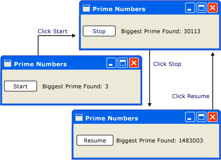
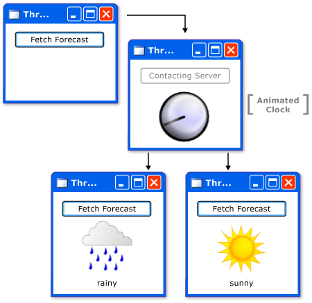
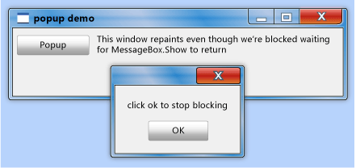
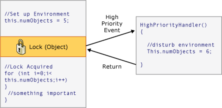

# Модель потоков
Windows Presentation Foundation (WPF) призвана помочь разработчикам избежать трудностей при разработке потоков. Как следствие, большинство WPF разработчикам не требуется писать интерфейс, использующий более одного потока. Поскольку многопотоковые программы являются сложными и трудно отлаживаемыми, их следует избегать, если существуют однопоточные решения.  
  
 Независимо от того, насколько хорошо качества архитектуры, нет UI framework никогда не будут иметь возможность предоставить однопоточное решение для каждого типа задач. WPF приблизилось, но по-прежнему существуют ситуации, в которых несколько потоков улучшают [!INCLUDE[TLA#tla_ui](../../../../includes/tlasharptla-ui-md.md)] скорость реагирования или производительность приложения. После рассмотрения некоторых основных материалов в данном документе рассматриваются подобные ситуации и в завершение обсуждаются некоторые более подробные сведения.  

> [!NOTE]
>  В этом разделе обсуждается создание потоков с помощью <xref:System.Windows.Threading.Dispatcher.BeginInvoke%2A> метод для асинхронных вызовов. Вы также можете асинхронных вызовов, вызвав <xref:System.Windows.Threading.Dispatcher.InvokeAsync%2A> метод, который занять <xref:System.Action> или <xref:System.Func%601> как параметр.  <xref:System.Windows.Threading.Dispatcher.InvokeAsync%2A> Возвращает <xref:System.Windows.Threading.DispatcherOperation> или <xref:System.Windows.Threading.DispatcherOperation%601>, который имеет <xref:System.Windows.Threading.DispatcherOperation.Task%2A> свойства. Можно использовать `await` ключевого слова with либо <xref:System.Windows.Threading.DispatcherOperation> или связанного <xref:System.Threading.Tasks.Task>. Если требуется синхронно дождаться <xref:System.Threading.Tasks.Task> , возвращаемый <xref:System.Windows.Threading.DispatcherOperation> или <xref:System.Windows.Threading.DispatcherOperation%601>, вызовите <xref:System.Windows.Threading.TaskExtensions.DispatcherOperationWait%2A> метода расширения.  Вызов <xref:System.Threading.Tasks.Task.Wait%2A?displayProperty=nameWithType> приведет к взаимоблокировке. Дополнительные сведения об использовании <xref:System.Threading.Tasks.Task> для выполнения асинхронных операций, см. в разделе параллелизм задач.  <xref:System.Windows.Threading.Dispatcher.Invoke%2A> Метод также имеются перегрузки, принимающие <xref:System.Action> или <xref:System.Func%601> как параметр.  Можно использовать <xref:System.Windows.Threading.Dispatcher.Invoke%2A> вызывает синхронный метод, передав делегат, <xref:System.Action> или <xref:System.Func%601>.  
  
   
## Общие сведения и Dispatcher  
 Как правило WPF приложения начинается с двух потоков: одного для обработки визуализации, а другой — для управления UI. Поток визуализации эффективно выполняется незаметно для пользователя в фоновом режиме при UI поток получает входные данные, обрабатывает события, выводит изображение на экран и выполняет код приложения. Большинство приложений используют один UI поток, несмотря на то, что в некоторых ситуациях лучше использовать несколько. Позже это будет рассмотрено на примере.  
  
 UI Очереди потоков рабочие элементы внутри объекта, называемого <xref:System.Windows.Threading.Dispatcher>. Объект <xref:System.Windows.Threading.Dispatcher> выбирает рабочие элементы на основе приоритетов и выполняет каждый из них до завершения.  Каждый UI поток должен иметь по крайней мере <xref:System.Windows.Threading.Dispatcher>и каждый <xref:System.Windows.Threading.Dispatcher> может выполнять рабочие элементы только в одном потоке.  
  
 Условием для построения быстро реагирующих, понятных пользователю приложений является максимальное повышение <xref:System.Windows.Threading.Dispatcher> пропускной способности путем сохранения небольших рабочие элементы. Таком методе элементы никогда не устаревают <xref:System.Windows.Threading.Dispatcher> очереди, ожидающих обработки. Любая задержка между входными данными и ответами может разочаровать пользователя.  
  
 Как в таком WPF приложения должны обрабатывать большие операции? Что если код включает большие вычисления или требуется запрос к базе данных на удаленном сервере? Обычно ответ заключается в большие операции обрабатываются в отдельном потоке, оставляя UI поток для обслуживания элементов в <xref:System.Windows.Threading.Dispatcher> очереди. После завершения большой операции она может передать результат обратно UI поток для отображения.  
  
 Исторически сложилось так, что Windows позволяет UI элементов был доступен только создавшему их потоку. Это означает, что фоновый поток, отвечающий за некоторую длительную задачу, не может обновить текстовое поле при своем завершении. Windows Это делается, чтобы обеспечить целостность UI компонентов. Список может выглядеть странно, если его содержимое обновляется фоновым потоком в процессе отображения.  
  
 WPF имеет встроенный механизм взаимного исключения, осуществляет эту координацию. Большинство классов в WPF являются производными от <xref:System.Windows.Threading.DispatcherObject>. При конструировании <xref:System.Windows.Threading.DispatcherObject> хранит ссылку на <xref:System.Windows.Threading.Dispatcher> связанный с текущим выполняемым потоком. По сути <xref:System.Windows.Threading.DispatcherObject> связывается с потоком, который его создал. Во время выполнения программы <xref:System.Windows.Threading.DispatcherObject> может вызвать свой открытый <xref:System.Windows.Threading.DispatcherObject.VerifyAccess%2A> метод. <xref:System.Windows.Threading.DispatcherObject.VerifyAccess%2A> проверяет <xref:System.Windows.Threading.Dispatcher> связанный с текущим потоком и сравнивает его <xref:System.Windows.Threading.Dispatcher> ссылка сохраняется во время создания. Если они не совпадают, <xref:System.Windows.Threading.DispatcherObject.VerifyAccess%2A> возникло исключение. <xref:System.Windows.Threading.DispatcherObject.VerifyAccess%2A> предназначен для вызова в начале каждого метода, принадлежащего к <xref:System.Windows.Threading.DispatcherObject>.  
  
 Если только один поток может изменить UI, как фоновые потоки взаимодействуют с пользователем? Фоновый поток может попросить UI поток, выполняющий операцию от его имени. Это достигается путем регистрации рабочего элемента с <xref:System.Windows.Threading.Dispatcher> из UI потока. <xref:System.Windows.Threading.Dispatcher> Класс предоставляет два метода для регистрации рабочих элементов: <xref:System.Windows.Threading.Dispatcher.Invoke%2A> и <xref:System.Windows.Threading.Dispatcher.BeginInvoke%2A>. Оба метода назначают делегат для выполнения. <xref:System.Windows.Threading.Dispatcher.Invoke%2A> является синхронным вызовом — то есть он не возвращает до UI потока не закончит выполнение делегата. <xref:System.Windows.Threading.Dispatcher.BeginInvoke%2A> является асинхронным и немедленно возвращает.  
  
 <xref:System.Windows.Threading.Dispatcher> Упорядочивает элементы в своей очереди по приоритету. Существуют десять уровней, которые могут быть указаны при добавлении элемента к <xref:System.Windows.Threading.Dispatcher> очереди. Эти приоритеты сохраняются в <xref:System.Windows.Threading.DispatcherPriority> перечисления. Подробные сведения о <xref:System.Windows.Threading.DispatcherPriority> уровней можно найти в [!INCLUDE[TLA2#tla_winfxsdk](../../../../includes/tla2sharptla-winfxsdk-md.md)] документации.  
  
   
## Потоки в действии: Примеры  
  
   
### Пример однопоточного приложения с длительным выполнением вычислений  
 Большинство [!INCLUDE[TLA#tla_gui#plural](../../../../includes/tlasharptla-guisharpplural-md.md)] тратят большую часть своего времени, простаивая в ожидании событий, которые создаются в ответ на действия пользователя. При внимательном программировании это время простоя можно использовать конструктивно, не влияя на скорость реагирования UI. WPF Потоковая модель не позволяет вводу прерывать операцию, которая происходит в UI потока. Это означает, что необходимо убедиться, чтобы вернуться к <xref:System.Windows.Threading.Dispatcher> периодически, чтобы обработать отложенные события ввода, прежде чем они станут устаревшими.  
  
 Рассмотрим следующий пример.  
  
   
  
 Это простое приложение ищет простые числа, начиная от трех и далее. Когда пользователь щелкает **запустить** кнопки, поиск начинается. Когда программа находит простое число, она обновляет пользовательский интерфейс. В любой момент пользователь может остановить поиск.  
  
 При всей простоте операции поиск простых чисел может происходить бесконечно, что представляет некоторые трудности.  Если бы обработка всех операций поиска в обработчик события нажатия кнопки, никогда бы не получил UI потоков возможность обработки других событий. UI Бы ответить на входные данные или обработать сообщения. Он бы никогда не обновил отображение и не ответил бы на нажатие кнопки.  
  
 Можно провести поиск простого числа в отдельном потоке, но тогда пришлось бы иметь дело с проблемами синхронизации. С помощью однопотокового подхода можно непосредственно обновить подпись, в которой перечислено наибольшее простое число.  
  
 Если разбить задачу вычисления на управляемые фрагменты, можно периодически возвращаться к <xref:System.Windows.Threading.Dispatcher> и обработки событий. Мы можем дать WPF возможность обновлять и обрабатывать ввод.  
  
 Лучшим способом разбиения времени обработки между вычислением и обработкой события является управление вычислением из <xref:System.Windows.Threading.Dispatcher>. С помощью <xref:System.Windows.Threading.Dispatcher.BeginInvoke%2A> метод, можно запланировать проверку простого числа в той же очереди, UI события, являются производными от. В приведенном примере запланирована проверка только одного простого числа в каждый момент времени. После завершения проверки простого числа немедленно планируется следующая проверка. Эта проверка выполняется только после ожидающих UI обработки событий.  
  
   
  
 [!INCLUDE[TLA#tla_word](../../../../includes/tlasharptla-word-md.md)] выполняет проверку орфографии с помощью этого механизма. Проверка орфографии выполняется в фоновом режиме, используя время простоя UI потока. Давайте посмотрим на код.  
  
 В следующем примере показан код XAML, который создает пользовательский интерфейс.  
  
 [!code-xaml[ThreadingPrimeNumbers#ThreadingPrimeNumberXAML](~/samples/snippets/csharp/VS_Snippets_Wpf/ThreadingPrimeNumbers/CSharp/Window1.xaml#threadingprimenumberxaml)]  
  
 В следующем примере показан код программной части.  
  
 [!code-csharp[ThreadingPrimeNumbers#ThreadingPrimeNumberCodeBehind](~/samples/snippets/csharp/VS_Snippets_Wpf/ThreadingPrimeNumbers/CSharp/Window1.xaml.cs#threadingprimenumbercodebehind)]
   
  
 В следующем примере показан обработчик событий для <xref:System.Windows.Controls.Button>.  
  
 [!code-csharp[ThreadingPrimeNumbers#ThreadingPrimeNumberStartOrStop](~/samples/snippets/csharp/VS_Snippets_Wpf/ThreadingPrimeNumbers/CSharp/Window1.xaml.cs#threadingprimenumberstartorstop)]
   
  
 Помимо обновления текста в <xref:System.Windows.Controls.Button>, этот обработчик отвечает за планирование проверки первого простого числа путем добавления делегата к <xref:System.Windows.Threading.Dispatcher> очереди. Иногда после завершения работы, этот обработчик событий <xref:System.Windows.Threading.Dispatcher> выберет этот делегат для выполнения.  
  
 Как было упомянуто ранее, <xref:System.Windows.Threading.Dispatcher.BeginInvoke%2A> является <xref:System.Windows.Threading.Dispatcher> членом, который используется при планировании делегата для выполнения. В этом случае мы выбираем <xref:System.Windows.Threading.DispatcherPriority.SystemIdle> приоритет. <xref:System.Windows.Threading.Dispatcher> Будет выполнять данный делегат только в том случае, если отсутствуют важные события для обработки. UI скорость реагирования важнее, чем проверка числа. Также передается новый делегат, представляющий подпрограмму проверки числа.  
  
 [!code-csharp[ThreadingPrimeNumbers#ThreadingPrimeNumberCheckNextNumber](~/samples/snippets/csharp/VS_Snippets_Wpf/ThreadingPrimeNumbers/CSharp/Window1.xaml.cs#threadingprimenumberchecknextnumber)]
   
  
 Этот метод проверяет, является ли следующее нечетное число простым. Если оно простое, метод непосредственно обновляет `bigPrime`<xref:System.Windows.Controls.TextBlock> в соответствии с его обнаружения. Мы можем сделать так потому, что вычисление происходит в том же потоке, который был использован для создания компонента. Бы мы решили использовать отдельный поток для вычислений, нам пришлось бы использовать более сложный механизм синхронизации и выполнять обновления в UI потока. Эта ситуация будет продемонстрирована далее.  
  
 Полный исходный код для этого примера, см. в разделе [Пример однопоточного приложения с образцом выполняющейся длительное время вычисления](https://go.microsoft.com/fwlink/?LinkID=160038)  
  
   
### Обработка блокирующей операции с фоновым потоком  
 Обработка блокировки операций в графическом приложении может оказаться трудной задачей. Мы не будем вызывать методы блокировки из обработчиков событий, так как приложение будет остановлено. Можно использовать отдельный поток для обработки этих операций, но когда все готово, у нас есть для синхронизации с UI потоков, поскольку нельзя непосредственно изменить [!INCLUDE[TLA2#tla_gui](../../../../includes/tla2sharptla-gui-md.md)] из рабочего потока. Мы можем использовать <xref:System.Windows.Threading.Dispatcher.Invoke%2A> или <xref:System.Windows.Threading.Dispatcher.BeginInvoke%2A> вставку делегатов в <xref:System.Windows.Threading.Dispatcher> из UI потока. Наконец, эти делегаты будут выполнены с разрешением на изменение UI элементов.  
  
 В этом примере мы имитируем вызов удаленной процедуры, который получает прогноз погоды. Мы используем отдельный рабочий поток для выполнения этого вызова и планируем метод обновления в <xref:System.Windows.Threading.Dispatcher> из UI потоков, когда мы закончили.  
  
   
  
 [!code-csharp[ThreadingWeatherForecast#ThreadingWeatherCodeBehind](~/samples/snippets/csharp/VS_Snippets_Wpf/ThreadingWeatherForecast/CSharp/Window1.xaml.cs#threadingweathercodebehind)]
   
  
 Ниже приведены некоторые подробности, на которые следует обратить внимание.  
  
-   Создание обработчика кнопки  
  
     [!code-csharp[ThreadingWeatherForecast#ThreadingWeatherButtonHandler](~/samples/snippets/csharp/VS_Snippets_Wpf/ThreadingWeatherForecast/CSharp/Window1.xaml.cs#threadingweatherbuttonhandler)]
       
  
 При нажатии кнопки мы отображаем рисунок часов и запускаем анимацию. Мы отключаем кнопку. Мы вызываем `FetchWeatherFromServer` метод в новом потоке, а затем мы возвращаем, позволяя <xref:System.Windows.Threading.Dispatcher> для обработки событий во время ожидания сбора прогноза погоды.  
  
-   Выборка погоды  
  
     [!code-csharp[ThreadingWeatherForecast#ThreadingWeatherFetchWeather](~/samples/snippets/csharp/VS_Snippets_Wpf/ThreadingWeatherForecast/CSharp/Window1.xaml.cs#threadingweatherfetchweather)]
       
  
 Для простоты мы фактически не используем никакого сетевого кода в данном примере. Вместо этого мы моделируем задержку доступа к сети, задав для нашего нового потока спящий режим в течение четырех секунд. В настоящее время исходного UI поток по-прежнему выполняется и реагирование на события. Чтобы показать это, была оставлена запущенная анимация, и кнопки свертывания и развертывания также продолжают работать.  
  
 После завершения задержки и случайного выбора прогноза погоды, настала пора докладываю UI потока. Это делается путем создания расписания для вызова `UpdateUserInterface` в UI потока с помощью этого потока <xref:System.Windows.Threading.Dispatcher>. В запланированный вызов этого метода передается строка, описывающая погоду.  
  
-   Обновление UI  
  
     [!code-csharp[ThreadingWeatherForecast#ThreadingWeatherUpdateUI](~/samples/snippets/csharp/VS_Snippets_Wpf/ThreadingWeatherForecast/CSharp/Window1.xaml.cs#threadingweatherupdateui)]
       
  
 Когда <xref:System.Windows.Threading.Dispatcher> в UI времени у потока, он выполняет запланированный вызов метода `UpdateUserInterface`. Этот метод останавливает анимацию часов и выбирает изображение для описания погоды. Он отображает это изображение и восстанавливает кнопку "Получить прогноз погоды".  
  
   
### Несколько окон, несколько потоков  
 Некоторые WPF приложениям требуется несколько окон верхнего уровня. Тогда вполне приемлемым для одного потока /<xref:System.Windows.Threading.Dispatcher> наилучшим образом сочетания для управления окнами, но иногда несколько потоков. Это особенно верно, когда существует возможность, что одно из окон будет монополизировать поток.  
  
 Windows Обозреватель работает таким образом. Каждое новое окно проводника принадлежит исходному процессу, однако оно создается под управлением независимого потока.  
  
 С помощью WPF<xref:System.Windows.Controls.Frame> элемента управления, мы можем отобразить веб-страниц. Можно легко создать простой [!INCLUDE[TLA2#tla_ie](../../../../includes/tla2sharptla-ie-md.md)] заменить. Начнем с важной функции: возможности открыть новое окно браузера. Когда пользователь нажимает кнопку "Новое окно", запускается копия окна в отдельном потоке. Таким образом, долго выполняющиеся или блокирующие операции в одном из окон не блокируют все остальные окна.  
  
 На самом деле у браузера имеется своя собственная сложная поточная модель. Мы выбрали его, поскольку он знаком большинству читателей.  
  
 В следующем примере показан код.  
  
 [!code-xaml[ThreadingMultipleBrowsers#ThreadingMultiBrowserXAML](~/samples/snippets/csharp/VS_Snippets_Wpf/ThreadingMultipleBrowsers/CSharp/Window1.xaml#threadingmultibrowserxaml)]  
  
 [!code-csharp[ThreadingMultipleBrowsers#ThreadingMultiBrowserCodeBehind](~/samples/snippets/csharp/VS_Snippets_Wpf/ThreadingMultipleBrowsers/CSharp/Window1.xaml.cs#threadingmultibrowsercodebehind)]
   
  
 В данном контексте наиболее интересными являются следующие сегменты потоков этого кода:  
  
 [!code-csharp[ThreadingMultipleBrowsers#ThreadingMultiBrowserNewWindow](~/samples/snippets/csharp/VS_Snippets_Wpf/ThreadingMultipleBrowsers/CSharp/Window1.xaml.cs#threadingmultibrowsernewwindow)]
   
  
 Этот метод вызывается при нажатии кнопки "Новое окно". Она создает новый поток и запускает его в асинхронном режиме.  
  
 [!code-csharp[ThreadingMultipleBrowsers#ThreadingMultiBrowserThreadStart](~/samples/snippets/csharp/VS_Snippets_Wpf/ThreadingMultipleBrowsers/CSharp/Window1.xaml.cs#threadingmultibrowserthreadstart)]
   
  
 Этот метод является начальной точкой для нового потока. Мы создаем новое окно под элементом управления этого потока. WPF автоматически создает новую <xref:System.Windows.Threading.Dispatcher> для управления новым потоком. Все что нужно сделать для обеспечения функциональности окна — начать <xref:System.Windows.Threading.Dispatcher>.  
  
   
## Технические подробности и важные моменты  
  
### Написание компонентов, использующих поток  
 Руководство разработчика Microsoft .NET Framework описывается шаблон того, как компонент может предоставлять асинхронное поведение для своих клиентов (см. в разделе [Обзор асинхронной модели на основе событий](../../../standard/asynchronous-programming-patterns/event-based-asynchronous-pattern-overview.md)). Например, предположим, что нужно упаковать `FetchWeatherFromServer` метод в неграфический компонент многократного использования. Следующий стандартный шаблон Microsoft .NET Framework это будет выглядеть примерно следующим образом.  
  
 [!code-csharp[CommandingOverviewSnippets#ThreadingArticleWeatherComponent1](~/samples/snippets/csharp/VS_Snippets_Wpf/CommandingOverviewSnippets/CSharp/Window1.xaml.cs#threadingarticleweathercomponent1)]
   
  
 `GetWeatherAsync` использовать один из методов, описанных выше, таких как создание фонового потока, для работы в асинхронном режиме, не блокируя вызывающий поток.  
  
 Одна из наиболее важных частей этого шаблона является вызов *имя_метода* `Completed` метод в том же потоке, который вызвал *имя_метода* `Async` метод начинается с. Это можно сделать с помощью WPF довольно просто, сохранив <xref:System.Windows.Threading.Dispatcher.CurrentDispatcher%2A>, но затем неграфический компонент может использоваться только в WPF приложений, не в [!INCLUDE[TLA#tla_winforms](../../../../includes/tlasharptla-winforms-md.md)] или [!INCLUDE[TLA#tla_aspnet](../../../../includes/tlasharptla-aspnet-md.md)] программы.  
  
 <xref:System.Windows.Threading.DispatcherSynchronizationContext> Класс адреса этой задачи — представляйте его упрощенную версию <xref:System.Windows.Threading.Dispatcher> , работает с другими UI также платформ.  
  
 [!code-csharp[CommandingOverviewSnippets#ThreadingArticleWeatherComponent2](~/samples/snippets/csharp/VS_Snippets_Wpf/CommandingOverviewSnippets/CSharp/Window1.xaml.cs#threadingarticleweathercomponent2)]
   
  
### Вложенная накачка  
 Иногда нецелесообразно полностью заблокировать UI потока. Давайте рассмотрим <xref:System.Windows.MessageBox.Show%2A> метод <xref:System.Windows.MessageBox> класса. <xref:System.Windows.MessageBox.Show%2A> не возвращает, пока пользователь не щелкнет "ОК". Однако он создает окно, которое должно иметь цикл обработки сообщений, чтобы быть интерактивным. Ожидая, когда пользователь нажмет кнопку "ОК", исходное окно приложения не отвечает на ввод данных пользователем. Тем не менее оно продолжает обрабатывать сообщения отображения. Исходное окно перерисовывается при его перекрытии и выведении.  
  
   
  
 Данное окно сообщения должно подчиняться какому-либо потоку. WPF создать новый поток специально для данного окна сообщения, но этот поток сможет отображать отключенные элементы в исходном окне (вспомните предыдущее обсуждение взаимного исключения). Вместо этого WPF использует систему обработки вложенных сообщений. <xref:System.Windows.Threading.Dispatcher> Класс включает специальный метод <xref:System.Windows.Threading.Dispatcher.PushFrame%2A>, который хранит текущей точки выполнения приложения, затем начинает новый цикл обработки сообщений. После завершения цикла обработки вложенных сообщений выполнение возобновляется после исходного <xref:System.Windows.Threading.Dispatcher.PushFrame%2A> вызова.  
  
 В этом случае <xref:System.Windows.Threading.Dispatcher.PushFrame%2A> поддерживает программный контекст при вызове <xref:System.Windows.MessageBox>.<xref:System.Windows.MessageBox.Show%2A>, и он начинает новый цикл обработки сообщений для перерисовки фона окна и обработки входных данных для окна сообщения. Когда пользователь нажимает кнопку ОК и очищает всплывающее окно, вложенные циклы завершаются и управление возобновляется после вызова <xref:System.Windows.MessageBox.Show%2A>.  
  
### Устаревшие перенаправленные события  
 Маршрутизация системы обработки событий в WPF уведомляет все деревья, когда вызываются события.  
  
 [!code-xaml[InputOvw#ThreadingArticleStaticRoutedEvent](~/samples/snippets/csharp/VS_Snippets_Wpf/InputOvw/CSharp/Page1.xaml#threadingarticlestaticroutedevent)]  
  
 При нажатии левой кнопки мыши над эллипсом, `handler2` выполняется. После `handler2` окончания события передается вдоль <xref:System.Windows.Controls.Canvas> объект, который использует `handler1` для его обработки. Это происходит только в том случае, если `handler2` не задает явно пометить объект события как обработанные.  
  
 Возможно, `handler2` займет немало времени, обработка этого события. `handler2` может использовать <xref:System.Windows.Threading.Dispatcher.PushFrame%2A> для начала цикла вложенных сообщений, который не возвращает часов. Если `handler2` не помечает событие как обработанное после цикла обработки сообщений завершить, событие передается вверх по дереву, несмотря на то, что оно является очень старым.  
  
### Повторный вход и блокировка  
 Механизм блокировки [!INCLUDE[TLA#tla_clr](../../../../includes/tlasharptla-clr-md.md)] не ведут себя точно так, как это можно представить; можно ожидать, что поток полностью завершает операцию, запрашивая блокировку. В действительности поток продолжает получать и обрабатывать сообщения с высоким приоритетом. Это помогает избежать взаимоблокировок и максимально повышает скорость отклика интерфейсов, но может приводить к незначительным ошибкам.  Подавляющее большинство времени, не нужно ничего знать об этом, но в редких случаях (как правило с участием [!INCLUDE[TLA2#tla_win32](../../../../includes/tla2sharptla-win32-md.md)] сообщения окна или компоненты COM STA) это может быть знания.  
  
 Большинство интерфейсов построено без учета безопасности потоков не так, как разработчики работают в предположении, что UI никогда не осуществляется более чем одним потоком. В данном случае, что вносимые одним потоком при изменении среды в непредвиденное время неблагоприятные последствия, <xref:System.Windows.Threading.DispatcherObject> предполагается механизм взаимного исключения. Рассмотрим следующий псевдокод:  
  
   
  
 Большую часть времени все работает правильно, но бывают случаи, в WPF где непредвиденный повторный вход может действительно вызвать проблемы. В этом случае в некий ключевой момент WPF вызовы <xref:System.Windows.Threading.Dispatcher.DisableProcessing%2A>, который меняет инструкцию блокировки для этого потока использовать WPF свободную от повторного входа блокировку, вместо обычной [!INCLUDE[TLA2#tla_clr](../../../../includes/tla2sharptla-clr-md.md)] блокировки.  
  
 Так почему было [!INCLUDE[TLA2#tla_clr](../../../../includes/tla2sharptla-clr-md.md)] team выбрала такое поведение? Это было связано с объектами COM STA и завершением потока. Когда объект удаляется сборщиком мусора, его `Finalize` метод выполняется в выделенном потоке метода завершения, не UI потока. Этой последовательности заключена проблема, так как объект COM STA, который был создан на UI поток может быть удален только в UI потока. [!INCLUDE[TLA2#tla_clr](../../../../includes/tla2sharptla-clr-md.md)] Предоставляет эквивалент <xref:System.Windows.Threading.Dispatcher.BeginInvoke%2A> (в данном случае с помощью Win32 `SendMessage`). Но если UI поток занят, поток метода завершения устаревает, и объект COM STA не удается завершить, что приводит к серьезной утечке памяти. Поэтому [!INCLUDE[TLA2#tla_clr](../../../../includes/tla2sharptla-clr-md.md)] создала сложный вызов для создания блокировки работать так, они делают.  
  
 Задача для WPF — избежать непредвиденного повторного входа без внесения утечки памяти, поэтому мы не блокируем где.  
  
## См. также

- [Однопоточного приложения с образцом выполняющейся длительное время вычисления](https://go.microsoft.com/fwlink/?LinkID=160038)
