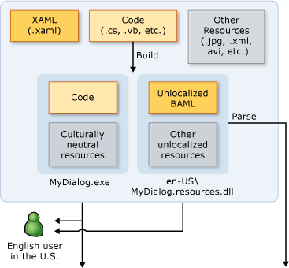
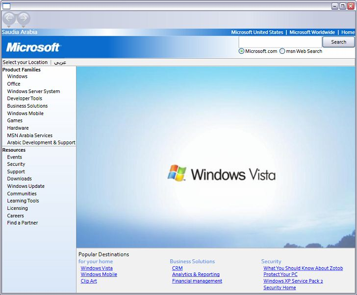
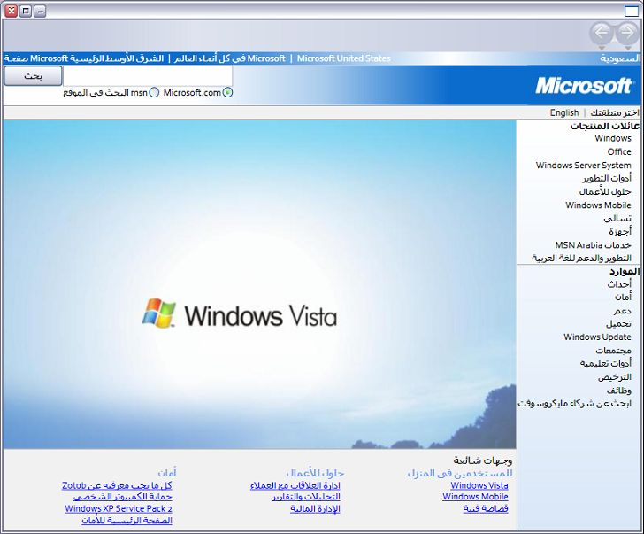

# <a name="wpf-globalization-and-localization-overview"></a>Общие сведения о глобализации и локализации WPF

Если доступность продукта ограничена только одним языком, то таким образом ограничивается потенциальная база клиентов до некоторой части всего 6,5-миллиардного мирового населения. Чтобы созданные приложения были доступны мировой аудитории, одним из лучших и наиболее экономичных способов охватить большее количество клиентов является экономически эффективная локализация продукта.  
  
 В этом обзоре представлена глобализации и локализации в Windows Presentation Foundation (WPF). Глобализация — это проектирование и разработка приложений, которые выполняются в нескольких расположениях. Например, глобализация поддерживает локализованные пользовательские интерфейсы и региональные данные для пользователей на различных языках. WPF предоставляет глобализованные функциональные возможности проектирования, включая автоматический макет, вспомогательные сборки и локализованные атрибуты и комментарии.
  
 Локализация — это перевод ресурсов приложения в локализованные версии для конкретных языков и региональных параметров, которые поддерживает приложение. При локализации в WPF, используйте API-интерфейсы в <xref:System.Windows.Markup.Localizer> пространства имен. Эти API-интерфейсов power [средства LocBaml](https://go.microsoft.com/fwlink/?LinkID=160016) средство командной строки. Сведения о том, как создавать и использовать LocBaml, см. в разделе [локализация приложения](how-to-localize-an-application.md).
  
## <a name="best-practices-for-globalization-and-localization-in-wpf"></a>Рекомендации по глобализации и локализации в WPF

 Вы можете максимально эффективно использовать функциональные возможности глобализации и локализации, встроенных в WPF , выполнив Дизайн пользовательского интерфейса, а также советы, относящиеся к локализации, которые в этом разделе содержатся.  
  
### <a name="best-practices-for-wpf-ui-design"></a>Оптимальные методы разработки пользовательского интерфейса WPF

 При проектировании WPF— на основе UI, рассмотрите возможность реализации этих рекомендаций:  
  
-   Запись вашего UI в [!INCLUDE[TLA2#tla_xaml](../../../../includes/tla2sharptla-xaml-md.md)]; Избегайте создания UI в коде. При создании вашей UI с помощью [!INCLUDE[TLA2#tla_xaml](../../../../includes/tla2sharptla-xaml-md.md)], он предоставляется через встроенные интерфейсы API локализации.  
  
-   Избегайте использования абсолютных положений и фиксированных размеров для размещения содержимого; Вместо этого используйте относительное или автоматическое изменение размеров.
  
    -   Используйте <xref:System.Windows.Window.SizeToContent%2A> ширины и высоты значение `Auto`.  
  
    -   Избегайте использования <xref:System.Windows.Controls.Canvas> для размещения UIs.  
  
    -   Используйте <xref:System.Windows.Controls.Grid> и функции общего размера.  
  
-   Необходимо предусмотреть дополнительное пространство в полях, так как локализованный текст часто занимает больше места. Дополнительное пространство позволит использовать выступающие символы, возможно, присутствующие в конкретном языке.  
  
-   Включить <xref:System.Windows.Controls.TextBlock.TextWrapping%2A> на <xref:System.Windows.Controls.TextBlock> во избежание обрезки.
  
-   Задайте атрибут `xml:lang` . Этот атрибут описывает язык и региональные параметры конкретного элемента и его дочерних элементов. Значение этого свойства изменяет поведение некоторых функциональных возможностей WPF. Например, изменяется процесс переноса по слогам, проверки орфографии, подстановки чисел, формирования сложных скриптов и подмены шрифта. См. в разделе [Глобализация для WPF](globalization-for-wpf.md) Дополнительные сведения о параметре [XML: lang в XAML обработки](../../xaml-services/xml-lang-handling-in-xaml.md).  
  
-   Создание настраиваемого составного шрифта, чтобы получить лучшее управление шрифтами, которые используются для различных языков. По умолчанию WPF использует шрифт globaluserinterface.Composite из папки в папке Windows\Fonts.  
  
-   При создании приложений навигации, которые могут быть локализованы в языке, использующем представление текста в формате справа налево, необходимо явно установить <xref:System.Windows.FlowDirection> части каждой страницы, чтобы обеспечить страницы не наследует <xref:System.Windows.FlowDirection> из <xref:System.Windows.Navigation.NavigationWindow>.  
  
-   При создании автономных приложений навигации, размещенных вне браузера, задайте <xref:System.Windows.Application.StartupUri%2A> для начального приложения <xref:System.Windows.Navigation.NavigationWindow> вместо на страницу (например, `<Application StartupUri="NavigationWindow.xaml">`). Такой подход позволяет изменять <xref:System.Windows.FlowDirection> окна и панели навигации. Дополнительные сведения и пример см. в разделе [пример Globalization Homepage](https://go.microsoft.com/fwlink/?LinkID=159990).  
  
### <a name="best-practices-for-wpf-localization"></a>Оптимальные методы локализации приложений WPF

 При локализации WPF— приложений, рассмотрите возможность реализации этих рекомендаций:  
  
-   Используйте комментарии локализации для обеспечения дополнительного контекста для локализаторов.  
  
-   Используйте атрибуты локализации для управления локализацией вместо выборочного пропуска <xref:System.Windows.Markup.Localizer.BamlLocalizableResourceKey.Uid%2A> свойства элементов. См. в разделе [атрибуты и комментарии локализации](localization-attributes-and-comments.md) Дополнительные сведения.  
  
-   Используйте `msbuild -t:updateuid` и `-t:checkuid` для добавления и проверки <xref:System.Windows.Markup.Localizer.BamlLocalizableResourceKey.Uid%2A> свойств в вашей [!INCLUDE[TLA2#tla_xaml](../../../../includes/tla2sharptla-xaml-md.md)]. Используйте <xref:System.Windows.Markup.Localizer.BamlLocalizableResourceKey.Uid%2A> свойства для отслеживания изменений между разработкой и локализацией. <xref:System.Windows.Markup.Localizer.BamlLocalizableResourceKey.Uid%2A> свойства помогают локализовать новые изменения в разработке. Если вручную добавить <xref:System.Windows.Markup.Localizer.BamlLocalizableResourceKey.Uid%2A> свойства UI, задача является трудоемкой и менее точным.  
  
    -   Не следует редактировать или изменять <xref:System.Windows.Markup.Localizer.BamlLocalizableResourceKey.Uid%2A> свойства после начала локализации.  
  
    -   Не используйте дубликат <xref:System.Windows.Markup.Localizer.BamlLocalizableResourceKey.Uid%2A> свойства (помните этот совет при использовании команды копирования и вставки).  
  
    -   Задайте `UltimateResourceFallback` расположение в AssemblyInfo.*, чтобы указать соответствующий язык для резервной проверки подлинности (например, `[assembly: NeutralResourcesLanguage("en-US",   UltimateResourceFallbackLocation.Satellite)]`).  
  
         Если вы решили включить исходный язык в основную сборку путем пропуска `<UICulture>` тег в файле проекта, задайте `UltimateResourceFallback` расположении, что и основной сборки вместо вспомогательной (например, `[assembly: NeutralResourcesLanguage("en-US", UltimateResourceFallbackLocation.MainAssembly)]`).  
  
## <a name="localize-a-wpf-application"></a>Локализация приложения WPF

При локализации WPF приложения можно несколькими способами. Например, можно привязать локализованные ресурсы в приложении [!INCLUDE[TLA2#tla_xml](../../../../includes/tla2sharptla-xml-md.md)] файл, хранить локализуемый текст в resx-таблицах или же указать локализатору использовать [!INCLUDE[TLA#tla_xaml](../../../../includes/tlasharptla-xaml-md.md)] файлов. В этом разделе рассматривается рабочий процесс локализации, использующий BAML-формы XAML, который предоставляет несколько преимуществ:  
  
-   Вы можете локализовать после построения.  
  
-   Можно обновить до более новой версии BAML-формы XAML с локализациями из более старой версии BAML-формы XAML таким образом, вы можете локализовать, в то же время, которое разрабатывается.  
  
-   Можно проверить исходные исходные элементы и семантику во время компиляции, так как форма BAML кода XAML является скомпилированной формой [!INCLUDE[TLA2#tla_xaml](../../../../includes/tla2sharptla-xaml-md.md)].  
  
### <a name="localization-build-process"></a>Процесс построения локализации  

При разработке WPF приложения, процесс построения локализации выглядит следующим образом:  
  
-   Разработчик создает и глобализует WPF приложения. В файле проекта разработчик задает `<UICulture>en-US</UICulture>` таким образом, чтобы при компиляции приложения, не зависящий от языка основная сборка. Эта сборка имеет вспомогательный файл .resources.dll, содержащий все локализуемые ресурсы. При необходимости можно хранить исходный язык в основную сборку, так как наша локализация [!INCLUDE[TLA2#tla_api#plural](../../../../includes/tla2sharptla-apisharpplural-md.md)] поддерживают извлечение из основной сборки.  
  
-   Когда файл компилируется в сборку, [!INCLUDE[TLA2#tla_xaml](../../../../includes/tla2sharptla-xaml-md.md)] преобразуется в BAML-форму XAML. Независимый от языка `MyDialog.exe` и языку и региональным параметрам зависимые (на английском языке) `MyDialog.resources.dll` файлы выпущены для англоговорящего клиента.  
  
### <a name="localization-workflow"></a>Рабочий процесс локализации

Процесс локализации начинается после сборки нелокализованного `MyDialog.resources.dll` файла. UI Элементы и свойства в исходном [!INCLUDE[TLA2#tla_xaml](../../../../includes/tla2sharptla-xaml-md.md)] извлекаются из BAML-формы XAML в пары "ключ значение" с помощью [!INCLUDE[TLA2#tla_api#plural](../../../../includes/tla2sharptla-apisharpplural-md.md)] под <xref:System.Windows.Markup.Localizer>. Локализаторы используют пары "ключ —значение" для локализации приложения. После завершения локализации можно создать файл .resource.dll на основе новых значений.
  
 Ключи пар "ключ значение" `x:Uid` значения, которые помещаются разработчиком в исходный [!INCLUDE[TLA2#tla_xaml](../../../../includes/tla2sharptla-xaml-md.md)]. Эти `x:Uid` включить значения [!INCLUDE[TLA2#tla_api](../../../../includes/tla2sharptla-api-md.md)] для отслеживания и объединения изменений, разработчик и локализатором во время локализации. Например, если разработчик изменяет UI после начала локализации, можно слить изменения с уже выполненной работой по локализации, так что теряется минимум работы по переводу.  
  
 На приведенном ниже рисунке показан типичный рабочий процесс локализации на основе BAML-формы XAML. Эта диаграмма предполагает, что разработчик создает приложение на английском языке. Разработчик создает и глобализует приложение WPF. В файле проекта разработчик задает `<UICulture>en-US</UICulture>` , чтобы на сборки, от основного языка сборка получает созданный вспомогательной. resources.dll, содержащий все локализуемые ресурсы. Кроме того, можно сохранить исходный язык в основной сборке, так как интерфейсы API локализации WPF поддерживают извлечение из основной сборки. По завершении процесса сборки XAML компилируется в BAML. Независимый от языка и региональных параметров файл MyDialog.exe.resources.dll поставляется англоязычному пользователю.  
  
   
  
   
  
## <a name="examples-of-wpf-localization"></a>Примеры локализации WPF

 Этот раздел содержит примеры локализованных приложений, которые помогут понять, как сборки и локализации WPF приложений.  
  
#### <a name="run-dialog-box-example"></a>Пример диалогового окна "Выполнить"

 На следующем рисунке показаны выходные данные **запуска** пример диалогового окна.  
  
 **Английский.**  
  
   
  
 **Немецкий.**  
  
   
  
 **Разработка глобального диалогового окна "Выполнить"**  
  
 Этот пример выводит **запуска** диалоговое окно с помощью WPF и [!INCLUDE[TLA2#tla_xaml](../../../../includes/tla2sharptla-xaml-md.md)]. Это диалоговое окно эквивалентно **запуска** диалоговое окно, которое доступно из [!INCLUDE[TLA#tla_win](../../../../includes/tlasharptla-win-md.md)] меню "Пуск".  
  
 Некоторые замечания по созданию глобальных диалоговых окон  
  
 **Автоматический макет**  
  
 *В файле Window1.xaml*  
  
 `<Window SizeToContent="WidthAndHeight">`  
  
 Предыдущее свойство Window автоматически изменяет размер окна в соответствии с размером содержимого. Это свойство предотвращает обрезание содержимого окна, которое увеличивается в размере после локализации. Кроме того, оно также удаляет лишнее пространство, если содержимое уменьшается в размерах после локализации.  
  
 `<Grid x:Uid="Grid_1">`  
  
 <xref:System.Windows.Markup.Localizer.BamlLocalizableResourceKey.Uid%2A> для того, требуются свойства WPF локализации [!INCLUDE[TLA2#tla_api#plural](../../../../includes/tla2sharptla-apisharpplural-md.md)] для правильной работы.  
  
 Они используются WPF локализации [!INCLUDE[TLA2#tla_api#plural](../../../../includes/tla2sharptla-apisharpplural-md.md)] для отслеживания изменений между разработкой и локализацией [!INCLUDE[TLA#tla_ui](../../../../includes/tlasharptla-ui-md.md)]. <xref:System.Windows.Markup.Localizer.BamlLocalizableResourceKey.Uid%2A> свойства позволяют выполнить слияние более новой версии UI со старой локализацией UI. Добавляемые <xref:System.Windows.Markup.Localizer.BamlLocalizableResourceKey.Uid%2A> свойства, выполнив `msbuild -t:updateuid RunDialog.csproj` в командной строке. Это рекомендуемый способ добавления <xref:System.Windows.Markup.Localizer.BamlLocalizableResourceKey.Uid%2A> свойства тем, что добавление их вручную обычно требует много времени и менее точным. Можно убедиться, что <xref:System.Windows.Markup.Localizer.BamlLocalizableResourceKey.Uid%2A> правильно заданы свойства, выполнив `msbuild -t:checkuid RunDialog.csproj`.
  
 UI Структурирован с помощью <xref:System.Windows.Controls.Grid> управления, который является полезным управления преимуществами автоматического макета в WPF. Обратите внимание, что диалоговое окно разделено на три строки и пять столбцов. Не в одном из определений строк и столбцов имеет фиксированный размер; Таким образом UI элементы, которые располагаются в каждой ячейке могут адаптироваться к увеличению и уменьшению размеров во время локализации.  
  
 [!code-xaml[GlobalizationRunDialog#GridColumnDef](~/samples/snippets/csharp/VS_Snippets_Wpf/GlobalizationRunDialog/CS/Window1.xaml#gridcolumndef)]  
  
 Первые два столбца где **откройте:** метки и <xref:System.Windows.Controls.ComboBox> помещаются использует 10 процентов UI всей ширины.  
  
 [!code-xaml[GlobalizationRunDialog#GridColumnDef2](~/samples/snippets/csharp/VS_Snippets_Wpf/GlobalizationRunDialog/CS/Window1.xaml#gridcolumndef2)]  
  
 Обратите внимание, что в примере используется функция общего изменения размера <xref:System.Windows.Controls.Grid>. Последние три столбца используют это преимущество, размещаясь в том же <xref:System.Windows.Controls.DefinitionBase.SharedSizeGroup%2A>. Как следует из имени свойства, это позволяет столбцам использовать один и тот же размер. Поэтому при «Обзор...» получает локализации в более длинную строку «Durchsuchen …», всех кнопок увеличивается ширина маленькую кнопку «ОК» и непропорционально большой кнопкой «Durchsuchen …».  
  
 **xml:lang**
  
 `xml:lang="en-US"`  
  
 Обратите внимание, что [XML: lang в XAML обработки](../../xaml-services/xml-lang-handling-in-xaml.md) размещается в корневом элементе UI. Это свойство описывает язык и региональные параметры конкретного элемента и его потомков. Это значение используется несколькими функциональными возможностями в WPF и должно быть соответствующим образом изменено во время локализации. Это значение изменяется в зависимости от того, какой языковой словарь используется для расстановки переносов и проверки орфографии слов. Оно также влияет на отображение цифр и на то, как система подмены шрифтов выбирает шрифт для использования. Наконец, это свойство влияет на способ отображения чисел и на способ написания текста в сложных скриптах. По умолчанию используется значение en-US.  
  
 **Создание вспомогательной сборки ресурсов**  
  
 *В файле .csproj*  

 Изменить `.csproj` и добавьте следующий тег безусловной операции `<PropertyGroup>`:
 
 `<UICulture>en-US</UICulture>`  
  
 Обратите внимание на добавленную `UICulture` значение. Если присвоено значение на допустимый <xref:System.Globalization.CultureInfo> значение, например en US, построение проекта будет создана вспомогательная сборка со всеми локализуемыми ресурсами в нем.  
  
 `<Resource Include="RunIcon.JPG">`  
  
 `<Localizable>False</Localizable>`  
  
 `</Resource>`  
  
 `RunIcon.JPG` Необходимо локализовать, потому что он должен быть одинаков для всех языков и региональных параметров. `Localizable` имеет значение `false` так что он остается в независимой от языка основной сборке, вместо вспомогательной сборки. Значение по умолчанию для всех некомпилируемых ресурсов — `Localizable` присвоено `true`.  
  
 **Локализация диалогового окна "Выполнить"**  
  
 **Анализ**  
  
 После сборки приложения первым шагом в локализации является анализ локализуемых ресурсов из вспомогательной сборки. В целях этого раздела используется демонстрационное средство LocBaml, которую можно найти в [средства LocBaml](https://go.microsoft.com/fwlink/?LinkID=160016). Обратите внимание, что LocBaml ― только демонстрационное средство, предназначенное помочь начать работу по созданию средства локализации, встраиваемого в процесс локализации. С помощью LocBaml выполните следующую команду, чтобы проанализировать: **LocBaml/parse RunDialog.resources.dll/out:** создать файл «Команду».  
  
 **Локализация**  
  
 Для редактирования этого файла можно воспользоваться любым редактором CSV, поддерживающим Юникод. Исключите все записи с категорией локализации "Нет". Должны остаться следующие записи.  
  
|Ключ ресурса|Категория локализации|Значение|  
|-|-|-| 
|Button_1:System.Windows.Controls.Button.$Content|Кнопка|ОК|  
|Button_2:System.Windows.Controls.Button.$Content|Кнопка|Отмена|  
|Button_3:System.Windows.Controls.Button.$Content|Кнопка|Обзор...|  
|ComboBox_1:System.Windows.Controls.ComboBox.$Content|ComboBox||  
|TextBlock_1:System.Windows.Controls.TextBlock.$Content|Текста|Введите имя программы, папки, документа или ресурса Интернета, и Windows откроет их.|  
|TextBlock_2:System.Windows.Controls.TextBlock.$Content|Текста|Открыть:|  
|Window_1:System.Windows.Window.Title|Заголовок|Выполнить|  
  
 Для локализации приложений в немецком языке потребуются следующие переводы.  
  
|Ключ ресурса|Категория локализации|Значение|  
|-|-|-| 
|Button_1:System.Windows.Controls.Button.$Content|Кнопка|ОК|  
|Button_2:System.Windows.Controls.Button.$Content|Кнопка|Abbrechen|  
|Button_3:System.Windows.Controls.Button.$Content|Кнопка|Durchsuchen…|  
|ComboBox_1:System.Windows.Controls.ComboBox.$Content|ComboBox||  
|TextBlock_1:System.Windows.Controls.TextBlock.$Content|Text|Geben Sie den Namen eines Programms, Ordners, Dokuments oder einer Internetresource an.|  
|TextBlock_2:System.Windows.Controls.TextBlock.$Content|Текста|Öffnen:|  
|Window_1:System.Windows.Window.Title|Заголовок|Выполнить|  
  
 **Создание**  
  
 Последний шаг локализации включает создание только что локализованной вспомогательной сборки. Эту задачу можно решить с помощью следующей команды LocBaml.  
  
 **LocBaml.exe /generate RunDialog.resources.dll /trans:RunDialog.resources.dll.CSV /out: . /cul:de-DE**  
  
 В немецкой Windows, если файл resources.dll размещен в папке de-DE главной сборки, этот ресурс будет автоматически загружаться вместо того, в папке en US. Если у вас используется немецкая версия Windows Чтобы проверить это, установите язык и региональные параметры региональные Windows вы используете (например, `en-US`) и заменить исходные ресурсы библиотеки DLL.  
  
 **Загрузка вспомогательных ресурсов**  
  
|MyDialog.exe|en-US\MyDialog.resources.dll|de-DE\MyDialog.resources.dll|  
|------------------|------------------------------------|------------------------------------|  
|Код|Исходный английский BAML|Локализованный BAML|  
|Ресурсы, не зависящие от языка и региональных параметров|Другие ресурсы на английском языке|Другие ресурсы, локализованные для немецкого языка|  
  
 Платформа .NET framework автоматически выбирает вспомогательную сборку ресурсов для загрузки в зависимости от приложения `Thread.CurrentThread.CurrentUICulture`. По умолчанию используется язык и региональные параметры вашего Windows операционной системы. Таким образом, если вы используете немецкий Windows, загружается de-DE\MyDialog.resources.dll, если используется английский Windows, загружается en-US\MyDialog.resources.dll. Можно задать для приложения резервный ресурс, указав NeutralResourcesLanguage в AssemblyInfo.* проекта. Например, если будет указано:  
  
 `[assembly: NeutralResourcesLanguage("en-US", UltimateResourceFallbackLocation.Satellite)]`  
  
 то в случае недоступности de-DE\MyDialog.resources.dll и de\MyDialog.resources.dll немецкой версией Windows будет использоваться en-US\MyDialog.resources.dll.  
  
### <a name="microsoft-saudi-arabia-homepage"></a>Домашняя страница сайта Майкрософт для Саудовской Аравии  
 На рисунке ниже показаны английская и арабская домашние страницы. Полный пример создания такой графики см. в разделе [пример Globalization Homepage](https://go.microsoft.com/fwlink/?LinkID=159990).  
  
 **Английский.**  
  
   
  
 **Арабский:**  
  
   
  
### <a name="designing-a-global-microsoft-home-page"></a>Разработка Microsoft глобальной домашней страницы  
 Этот макет веб-сайта Майкрософт для Саудовской Аравии показывает функциональные возможности глобализации, предоставляемые для языков с порядком чтения справа налево (RightToLeft). Языки, такие как иврит и арабский имеют порядок чтения справа налево, поэтому макет UI необходимо часто надо компоновать совершенно иначе, нежели было бы на языках слева направо, например в английском языке. Локализация с языка с направлением письма слева направо на язык с направлением письма справа налево или наоборот может быть достаточно сложной. WPF разработан так, чтобы значительно упростить подобные локализации.  
  
 **FlowDirection**  
  
 *Homepage.xaml:*  
  
 [!code-xaml[GlobalizationHomepage#Homepage](~/samples/snippets/csharp/VS_Snippets_Wpf/GlobalizationHomepage/CS/Homepage.xaml#homepage)]  
  
 Обратите внимание, что <xref:System.Windows.FrameworkElement.FlowDirection%2A> свойство <xref:System.Windows.Controls.Page>. Изменение этого свойства для <xref:System.Windows.FlowDirection.RightToLeft> приведет к изменению <xref:System.Windows.FrameworkElement.FlowDirection%2A> из <xref:System.Windows.Controls.Page> и ее дочерних элементов, чтобы макет этого UI зеркально отразится справа налево, как и ожидает Арабский пользователь. Поведение наследования можно переопределить, указав явный <xref:System.Windows.FrameworkElement.FlowDirection%2A> для любого элемента. <xref:System.Windows.FrameworkElement.FlowDirection%2A> Свойство доступно на любом <xref:System.Windows.FrameworkElement> или документа связанного элемента, и имеет неявное значение <xref:System.Windows.FlowDirection.LeftToRight>.  
  
 Обратите внимание, что даже фоновые градиентные кисти соответствующим образом при корневой <xref:System.Windows.FrameworkElement.FlowDirection%2A> изменяется:  
  
 **FlowDirection="LeftToRight"**  
  
   
  
 **FlowDirection="RightToLeft"**  
  
   
  
 **Избегайте использования фиксированных размеров для панелей и элементов управления**  
  
 Посмотрите на Homepage.xaml, обратите внимание, что помимо фиксированной ширины и высоты, заданной для всего UI вверху <xref:System.Windows.Controls.DockPanel>, существуют другие фиксированные размеры. Не следует использовать фиксированные размеры, чтобы предотвратить отсечение локализованного текста, который может быть больше, чем исходный текст. Панели и элементы управления WPF будут автоматически изменяться в размерах в зависимости от находящегося в них содержимого. Большинство элементов управления также имеют минимальные и максимальные размеры, которые можно задать для большего контроля (например, MinWidth = «20»). С помощью <xref:System.Windows.Controls.Grid>, также можно задать относительную ширину и высоту с помощью "\*" (например, `Width="0.25*"`) или использования функции совместного использования размера ячейки.  
  
 **Комментарии о локализации**  
  
 Во многих случаях содержимое может быть неоднозначным и трудным для перевода. Разработчик и проектировщик имеют возможность предоставить локализаторам дополнительный контекст и примечания в комментариях локализации. Например, в приведенных ниже комментариях локализации уточняется использование символа "&#124;".  
  
 [!code-xaml[GlobalizationHomepage#LocalizationComment](~/samples/snippets/csharp/VS_Snippets_Wpf/GlobalizationHomepage/CS/Homepage.xaml#localizationcomment)]  
  
 Этот комментарий становится связанным с содержимым TextBlock_1 и средство LocBaml (см. в разделе [локализация приложения](how-to-localize-an-application.md)), его можно увидеть в шестом столбце строки TextBlock_1 в выходном CSV-файле:  
  
|Ключ ресурса|Категория|Доступен для чтения|Изменяемый|Комментарий|Значение|  
|-|-|-|-|-|-|  
|TextBlock_1:System.Windows.Controls.TextBlock.$Content|Текста|true|true|Этот символ используется в качестве декоративного правила.|&#124;|  
  
 Комментарии могут быть помещены в содержимое или в свойство любого элемента посредством следующего синтаксиса.  
  
 [!code-xaml[GlobalizationHomepage#LocalizationCommentsProp](~/samples/snippets/csharp/VS_Snippets_Wpf/GlobalizationHomepage/CS/Homepage.xaml#localizationcommentsprop)]  
  
 **Атрибуты локализации**  
  
 Разработчику или менеджеру локализации часто бывает необходимо управлять тем, что локализаторы могут читать и изменять. Например, может быть нежелательно, чтобы локализатор переводил название компании или юридическую формулировку. В WPF имеются атрибуты, позволяющие задать возможность чтения, возможность изменения, а также категорию содержимого или свойства элемента. Эти атрибуты можно использовать в средстве локализации для блокировки, скрытия или сортировки элементов. Дополнительные сведения см. в разделе <xref:System.Windows.Localization.Attributes%2A>. В этом примере средство LocBaml только выводит значения этих атрибутов. Во всех элементах управления WPF эти атрибуты имеют значения по умолчанию, но их можно переопределять. Например, в приведенном ниже примере переопределяются атрибуты локализации по умолчанию для `TextBlock_1` и задает невозможность изменения содержимого на чтение для локализаторов.  
  
 [!code-xaml[LocalizationComAtt#LocalizationAttributes](~/samples/snippets/csharp/VS_Snippets_Wpf/LocalizationComAtt/CSharp/Attributes.xaml#localizationattributes)]  
  
 В дополнение к читаемость и атрибуты Изменяемости WPF предоставляет перечисление общих категорий пользовательского интерфейса (<xref:System.Windows.LocalizationCategory>), может использоваться для предоставления локализаторам дополнительного контекста. WPF Категории по умолчанию для элементов управления платформы могут переопределяться в [!INCLUDE[TLA2#tla_xaml](../../../../includes/tla2sharptla-xaml-md.md)] также:  
  
 [!code-xaml[LocalizationComAtt#LocalizationAttributesOverridden](~/samples/snippets/csharp/VS_Snippets_Wpf/LocalizationComAtt/CSharp/Attributes.xaml#localizationattributesoverridden)]  
  
 Атрибуты локализации по умолчанию, который WPF предоставляет также могут быть переопределены в коде, так что можно корректно установить правильные значения по умолчанию для пользовательских элементов управления. Пример:  

```csharp 
[Localizability(Readability = Readability.Readable, Modifiability=Modifiability.Unmodifiable, LocalizationCategory.None)] 
public class CorporateLogo : TextBlock
{
    // ...
}
``` 
 
 Каждый набор атрибутов экземпляра [!INCLUDE[TLA2#tla_xaml](../../../../includes/tla2sharptla-xaml-md.md)] будет иметь приоритет над значениями, заданными в коде для пользовательских элементов управления. Дополнительные сведения об атрибутах и комментариях см. в разделе [атрибуты и комментарии локализации](localization-attributes-and-comments.md).  
  
 **Подмена шрифтов и составные шрифты**  
  
 Если задан шрифт, который не поддерживает данный диапазон кодовых точек, WPF будет автоматически использовать его с помощью шрифта Global User Interface.compositefont, расположенного в папке Windows\Fonts. Составные шрифты работают так же как и любой другой шрифт и может использоваться явным образом задав элемента `FontFamily` (например, `FontFamily="Global User Interface"`). Вы можете задавать собственные предпочтения для подмены шрифта путем создания собственного составного шрифта и указания его использования для конкретных языков и диапазонов кодовых точек.  
  
 Дополнительные сведения о составных шрифтах см. в разделе <xref:System.Windows.Media.FontFamily>.  
  
 **Локализация домашней страницы Майкрософт**  
  
 Для локализации этого приложения можно выполнить те же действия, что и в примере локализации диалогового окна "Выполнить". Локализованный CSV-файл для арабского языка доступен для вас в [пример Globalization Homepage](https://go.microsoft.com/fwlink/?LinkID=159990).
