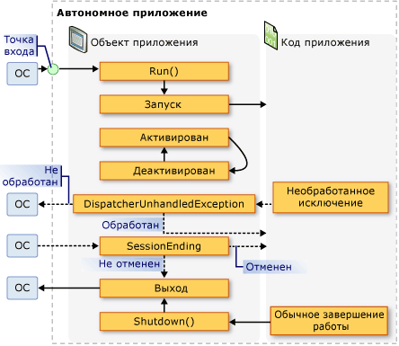

# <a name="application-management-overview"></a>Общие сведения об управлении приложением
Все приложения имеют тенденцию совместно использовать общий набор функциональных возможностей, который применяется к реализации приложения и управлению им. В этом разделе представлен обзор функциональных возможностей класса <xref:System.Windows.Application> для создания приложений и управления ими.  

## <a name="the-application-class"></a>Класс Application  
 В WPF функциональные возможности, относящиеся к области приложения, инкапсулируются классом <xref:System.Windows.Application>. Класс <xref:System.Windows.Application> включает следующие функциональные возможности:  
  
-   отслеживание и взаимодействие со временем существования приложения;  
  
-   извлечение и обработка параметров командной строки;  
  
-   обнаружение необработанных исключений и реагирование на них;  
  
-   совместное использование свойств и ресурсов области приложения;  
  
-   управление окнами в автономных приложениях;  
  
-   отслеживание навигации и управление ею.  
  
<a name="The_Application_Class"></a>   
## <a name="how-to-perform-common-tasks-using-the-application-class"></a>Выполнение стандартных задач с помощью класса приложения  
 Если вас не интересуют все аспекты класса <xref:System.Windows.Application>, в следующей таблице перечислены некоторые из наиболее распространенных задач <xref:System.Windows.Application> и способах их выполнения. Чтобы получить дополнительные сведения и примеры кода, просмотрите связанные API и разделы.  
  
|Задача|Подход|  
|----------|--------------|  
|Получение объекта, представляющего текущее приложение|Используйте свойство <xref:System.Windows.Application.Current%2A?displayProperty=nameWithType>.|  
|Добавление заставки в приложение|См. в разделе [Добавление в WPF-приложение экрана-заставки](how-to-add-a-splash-screen-to-a-wpf-application.md).|  
|Запуск приложения|Воспользуйтесь методом <xref:System.Windows.Application.Run%2A?displayProperty=nameWithType>.|  
|Остановка приложения|Используйте метод <xref:System.Windows.Application.Shutdown%2A> объекта <xref:System.Windows.Application.Current%2A?displayProperty=nameWithType>.|  
|Получение аргументов командной строки|Обработайте <xref:System.Windows.Application.Startup?displayProperty=nameWithType> и используйте свойство <xref:System.Windows.StartupEventArgs.Args%2A?displayProperty=nameWithType>. Пример см. в разделе <xref:System.Windows.Application.Startup?displayProperty=nameWithType>.|  
|Получение и задание кода завершения приложения|Задайте <xref:System.Windows.ExitEventArgs.ApplicationExitCode%2A?displayProperty=nameWithType> в обработчике событий <xref:System.Windows.Application.Exit?displayProperty=nameWithType> или вызовите <xref:System.Windows.Application.Shutdown%2A>, передав в него число.|  
|Обнаружение необработанных исключений и реагирование на них|Обработайте событие <xref:System.Windows.Application.DispatcherUnhandledException>.|  
|Получение и задание ресурсов области приложения|Используйте свойство <xref:System.Windows.Application.Resources%2A?displayProperty=nameWithType>.|  
|Использование словаря ресурсов области приложения|См. в разделе [использование словаря ресурсов области приложения](how-to-use-an-application-scope-resource-dictionary.md).|  
|Получение и задание свойств области приложения|Используйте свойство <xref:System.Windows.Application.Properties%2A?displayProperty=nameWithType>.|  
|Получение и сохранение состояния приложения|См. в разделе [сохранение и восстановление свойств области приложения в сеансах приложения](persist-and-restore-application-scope-properties.md).|  
|Управление файлами данных, включая файлы ресурсов, файлы содержимого и файлы исходного расположения.|См. в разделе [ресурсы приложения WPF, содержимое и файлы данных](wpf-application-resource-content-and-data-files.md).|  
|Управление окнами в автономных приложениях|См. раздел [Общие сведения об окнах WPF](wpf-windows-overview.md).|  
|Отслеживание навигации и управление ею|См. в разделе [Общие сведения о переходах](navigation-overview.md).|  
  
<a name="The_Application_Definition"></a>   
## <a name="the-application-definition"></a>Определение приложения  
 Чтобы использовать функциональные возможности класса <xref:System.Windows.Application>, необходимо реализовать определение приложения. Определение приложения WPF — это класс, производный от <xref:System.Windows.Application> и сконфигурированный с помощью специальных настроек MSBuild.

### <a name="implementing-an-application-definition"></a>Реализация определения приложения  
 Типичное определение приложения WPF реализуется с помощью разметки и кода. Это позволяет использовать разметку для декларативного задания свойств и ресурсов приложения и регистрации событий, а обработку событий и поведение приложения реализовывать в коде программной части.  
  
 В следующем примере показано, как реализовать определение приложения с помощью разметки и кода:  
  
 [!code-xaml[ApplicationSnippets#ApplicationXAML](~/samples/snippets/csharp/VS_Snippets_Wpf/ApplicationSnippets/CSharp/App.xaml#applicationxaml)]  
  
 [!code-csharp[ApplicationSnippets#ApplicationCODEBEHIND](~/samples/snippets/csharp/VS_Snippets_Wpf/ApplicationSnippets/CSharp/App.xaml.cs#applicationcodebehind)]
   
  
 Для совместной работы файла разметки и файла кода программной части должны выполняться указанные ниже условия.  
  
- В разметке элемент `Application` должен включать атрибут `x:Class`. При построении приложения наличие `x:Class` в разметке указывает MSBuild сформировать `partial` класс, производный от <xref:System.Windows.Application> и имеющий имя, заданное параметром атрибута `x:Class`. Для этого требуется добавить объявление пространства имен XML в схему XAML (`xmlns:x="http://schemas.microsoft.com/winfx/2006/xaml"`).
  
-   В коде программной части должен быть определен `partial` класс с тем же именем, которое задается параметром атрибута `x:Class` в разметке, производный от <xref:System.Windows.Application>. Это позволяет связать файл кода с `partial` классом, созданным из файла разметки при построении приложения (см. в разделе [построение приложения WPF](building-a-wpf-application-wpf.md)).  
  
> [!NOTE]
>  При создании нового проекта приложения WPF или проекта приложения браузера WPF с помощью Visual Studio, определение приложения включается по умолчанию и определяется с помощью разметки и кода.  
  
 Этот код является минимумом, необходимым для реализации определения приложения. Однако, для запуска и построения приложения необходима дополнительная настройка MSBuild.
  
### <a name="configuring-the-application-definition-for-msbuild"></a>Настройка определения приложения для MSBuild  
 Автономные приложения и приложения браузера XAML (XBAP) требуют реализации инфраструктуры определенного уровня перед своим запуском. Наиболее важной частью этой инфраструктуры является точка входа. При запуске приложения пользователем операционная система вызывает точку входа, известную функцию, используемую для запуска приложения.  
  
 Обычно разработчикам требовалось писать весь этот код или его часть самостоятельно в зависимости от технологии. Тем не менее, WPF создает этот код автоматически, при настройке файла разметки для определения приложения в качестве элемента MSBuild `ApplicationDefinition`, как показано в следующем файле проекта MSBuild:  
  
```xml  
<Project   
  DefaultTargets="Build"  
                        xmlns="http://schemas.microsoft.com/developer/msbuild/2003">  
  ...  
  <ApplicationDefinition Include="App.xaml" />  
  <Compile Include="App.xaml.cs" />  
  ...  
</Project>  
```  
  
 Так как файл кода содержит код, он помечается как элемент MSBuild `Compile`, как и обычные файлы кода.  
  
 Применение этой конфигурации MSBuild к файлам разметки и кода программной части определения приложения заставляет MSBuild создать следующий код:
  
 [!code-csharp[auto-generated-code](~/samples/snippets/csharp/VS_Snippets_Wpf/AppDefAugSnippets/CSharp/App.cs)]
   
  
 Результирующий код дополняет ваше определение приложения кодом инфраструктуры, которая включает в себя метод точки входа `Main`. Атрибут <xref:System.STAThreadAttribute> применяется к методу `Main`, чтобы указать, что основной поток пользовательского интерфейса для приложения WPF является потоком STA, что необходимо для приложений WPF. При вызове `Main` создается новый экземпляр класса `App` и вызывается метод `InitializeComponent` для регистрации событий и задания свойств, реализованных в разметке. Так как `InitializeComponent` создается автоматически, не нужно явно вызывать `InitializeComponent` из определения приложения как для реализаций <xref:System.Windows.Controls.Page> и <xref:System.Windows.Window>. Наконец, метод  <xref:System.Windows.Application.Run%2A> вызывается для запуска приложения.  
  
<a name="Getting_the_Current_Application"></a>   
## <a name="getting-the-current-application"></a>Получение текущего приложения  
 Так как функциональные возможности <xref:System.Windows.Application> являются общими для всего приложения, может существовать только один экземпляр <xref:System.Windows.Application> на <xref:System.AppDomain>. Чтобы гарантировать это, <xref:System.Windows.Application> реализован в виде singleton-класса (см. в разделе [Реализация Singleton в C# ](https://docs.microsoft.com/ru-ru/previous-versions/msp-n-p/ff650316(v=pandp.10)), который создает единственный экземпляр самого себя и предоставляет общий доступ к нему с помощью `static` свойства <xref:System.Windows.Application.Current%2A>.  
  
 Ниже показано, как получить ссылку на <xref:System.Windows.Application> для текущего <xref:System.AppDomain>.  
  
 [!code-csharp[ApplicationManagementOverviewSnippets#GetCurrentAppCODE](~/samples/snippets/csharp/VS_Snippets_Wpf/ApplicationManagementOverviewSnippets/CSharp/MainWindow.xaml.cs#getcurrentappcode)]
   
  
 <xref:System.Windows.Application.Current%2A> возвращает ссылку на экземпляр <xref:System.Windows.Application>. Если требуется ссылка на ваш класс, производный от <xref:System.Windows.Application>, необходимо привести значение <xref:System.Windows.Application.Current%2A>, как показано в следующем примере.  
  
 [!code-csharp[ApplicationManagementOverviewSnippets#GetSTCurrentAppCODE](~/samples/snippets/csharp/VS_Snippets_Wpf/ApplicationManagementOverviewSnippets/CSharp/MainWindow.xaml.cs#getstcurrentappcode)]
   
  
 Вы можете проверить значение <xref:System.Windows.Application.Current%2A> в любой момент времени существования объекта <xref:System.Windows.Application>. Однако следует соблюдать осторожность. После создания экземпляра <xref:System.Windows.Application> в течение во время которого состояние <xref:System.Windows.Application> непредсказуемо. В течение этого периода <xref:System.Windows.Application> выполняет различные задачи инициализации, необходимые для исполнения кода, включая создание инфраструктуры приложения, настройку свойств и регистрацию событий. Если вы попытаетесь использовать <xref:System.Windows.Application> в течение этого периода, код может иметь непредвиденные результаты, особенно в том случае, если он зависит от различных свойств <xref:System.Windows.Application>.  

 Когда <xref:System.Windows.Application> завершает свою работу инициализации, начинается его время существования.  
  
<a name="Application_Lifetime"></a>   
## <a name="application-lifetime"></a>Время существования приложения  
 Время существования приложения WPF отмечается несколькими событиями, которые <xref:System.Windows.Application> вызывает, чтобы сообщить вам о запуске приложения, его активации, деактивации и завершении работы.  

<a name="Splash_Screen"></a>   
### <a name="splash-screen"></a>Заставка  
 Начиная с версии [!INCLUDE[net_v35SP1_short](../../../../includes/net-v35sp1-short-md.md)], можно указать изображение, которое может использоваться в качестве *заставки*. Класс <xref:System.Windows.SplashScreen> позволяет легко отобразить заставку во время загрузки приложения. Окно <xref:System.Windows.SplashScreen> создается и отображается перед вызовом <xref:System.Windows.Application.Run%2A>. Дополнительные сведения см. в разделе [время запуска приложения](../advanced/application-startup-time.md) и [Добавление в WPF-приложение экрана-заставки](how-to-add-a-splash-screen-to-a-wpf-application.md).  
  
<a name="Starting_an_Application"></a>   
### <a name="starting-an-application"></a>Запуск приложения  
 После вызова <xref:System.Windows.Application.Run%2A> и инициализации приложения оно будет готово к запуску. Этот момент обозначается событием <xref:System.Windows.Application.Startup>:  
  
[!code-csharp[Startup-event](~/samples/snippets/csharp/VS_Snippets_Wpf/ApplicationStartupSnippets/CSharp/App.xaml.cs?range=3-11,31-33)]

  
 На этом этапе приложение обычно отображает свой пользовательский интерфейс.
  
<a name="Showing_a_User_Interface"></a>
### <a name="showing-a-user-interface"></a>Отображение пользовательского интерфейса  
 Большинство автономных приложений Windows при запуске открывают <xref:System.Windows.Window>. Обработчик события <xref:System.Windows.Application.Startup> — в одно из место, откуда это можно сделать, как показано в следующем примере кода.
  
 [!code-xaml[AppShowWindowHardSnippets#StartupEventMARKUP](~/samples/snippets/csharp/VS_Snippets_Wpf/AppShowWindowHardSnippets/CSharp/App.xaml#startupeventmarkup)]  
  
 [!code-csharp[AppShowWindowHardSnippets#StartupEventCODEBEHIND](~/samples/snippets/csharp/VS_Snippets_Wpf/AppShowWindowHardSnippets/CSharp/App.xaml.cs#startupeventcodebehind)]
   
  
> [!NOTE]
>  Первое созданное <xref:System.Windows.Window> в автономном приложении становится главным окном приложения по умолчанию. На этот объект <xref:System.Windows.Window> ссылается свойство <xref:System.Windows.Application.MainWindow%2A?displayProperty=nameWithType>. Значение <xref:System.Windows.Application.MainWindow%2A> может быть изменено программно, если главным окном должен стать другой экземпляр <xref:System.Windows.Window>.  

 Приложение XBAP при первом запуске обычно выполняет переход к <xref:System.Windows.Controls.Page>. Это показано в приведенном ниже коде.  
  
 [!code-xaml[XBAPAppStartupSnippets#StartupXBAPMARKUP](~/samples/snippets/csharp/VS_Snippets_Wpf/XBAPAppStartupSnippets/CSharp/App.xaml#startupxbapmarkup)]  
  
 [!code-csharp[XBAPAppStartupSnippets#StartupXBAPCODEBEHIND](~/samples/snippets/csharp/VS_Snippets_Wpf/XBAPAppStartupSnippets/CSharp/App.xaml.cs#startupxbapcodebehind)]
   
  
 Если вы обрабатываете <xref:System.Windows.Application.Startup> только для открытия <xref:System.Windows.Window> или перехода к <xref:System.Windows.Controls.Page>, можно вместо этого задать `StartupUri` в разметке. 
  
 В следующем примере показано, как использовать <xref:System.Windows.Application.StartupUri%2A> из отдельного приложения, чтобы открыть <xref:System.Windows.Window>.  
  
 [!code-xaml[ApplicationManagementOverviewSnippets#OverviewStartupUriMARKUP](~/samples/snippets/csharp/VS_Snippets_Wpf/ApplicationManagementOverviewSnippets/CSharp/App.xaml#overviewstartupurimarkup)]  
  
 В следующем примере показано, как использовать <xref:System.Windows.Application.StartupUri%2A> в XBAP, чтобы перейти к <xref:System.Windows.Controls.Page>.  
  
 [!code-xaml[PageSnippets#XBAPStartupUriMARKUP](~/samples/snippets/csharp/VS_Snippets_Wpf/PageSnippets/CSharp/App.xaml#xbapstartupurimarkup)]  

 Эта разметка действует так же, как и предыдущий код для открытия окна.  
  
> [!NOTE]
>  Дополнительные сведения о навигации см. в разделе [Общие сведения о переходах](navigation-overview.md).
  
 Обрабатывать <xref:System.Windows.Application.Startup> понадобится, чтобы открыть <xref:System.Windows.Window> с помощью конструктора не по умолчанию, когда необходимо задать его свойства либо подписаться на его события перед его отображением, или когда вам необходимо обработать аргументы командной строки, заданные при запуске приложения.  
  
<a name="Processing_Command_Line_Arguments"></a>
### <a name="processing-command-line-arguments"></a>Обработка аргументов командной строки  
 В Windows автономные приложения можно запустить из командной строки или с рабочего стола. В обоих случаях аргументы командной строки могут быть переданы приложению. В приведенном ниже примере показано приложение, которое запускается с одним аргументом командной строки /StartMinimized:  
  
 `wpfapplication.exe /StartMinimized`  
  
 Во время инициализации приложения WPF получает аргументы командной строки из операционной системы и передает их обработчику события <xref:System.Windows.Application.Startup> через свойство <xref:System.Windows.StartupEventArgs.Args%2A> параметра <xref:System.Windows.StartupEventArgs>. Аргументы командной строки можно извлечь и сохранить с помощью приведенного ниже кода.
  
 [!code-xaml[ApplicationStartupSnippets#HandleStartupXAML](~/samples/snippets/csharp/VS_Snippets_Wpf/ApplicationStartupSnippets/CSharp/App.xaml#handlestartupxaml)]  
  
 [!code-csharp[ApplicationStartupSnippets#HandleStartupCODEBEHIND](~/samples/snippets/csharp/VS_Snippets_Wpf/ApplicationStartupSnippets/CSharp/App.xaml.cs#handlestartupcodebehind)]
   
  
 Код обрабатывает <xref:System.Windows.Application.Startup> и проверяет, передан ли аргумент командной строки **/StartMinimized**; если да, он открывает главное окно с <xref:System.Windows.WindowState> равным <xref:System.Windows.WindowState.Minimized>. Обратите внимание, что поскольку значение <xref:System.Windows.Window.WindowState%2A> необходимо задать программно, главное <xref:System.Windows.Window> должно быть явным образом открыто в коде.
  
 XBAP-приложения не могут получить и обработать аргументы командной строки, так как они запускаются с помощью развертывания ClickOnce (см. в разделе [развертывание приложений WPF](deploying-a-wpf-application-wpf.md)). Однако они могут извлекать и обрабатывать строковые параметры запроса из URL-адресов, которые используются для их запуска.  
  
<a name="Application_Activation_and_Deactivation"></a>   
### <a name="application-activation-and-deactivation"></a>Активация и деактивация приложения  
 Windows позволяет пользователям переключаться между приложениями. Наиболее простой способ — использовать клавиши ALT+TAB. Приложения можно переключить только в том случае, если оно содержит видимое <xref:System.Windows.Window>, которое пользователь может выбрать. Выбранное в данный момент <xref:System.Windows.Window> является *активным окном* (также известно как *окно переднего плана*) и принимает вводимые пользователем данные. Приложение с активным окном является *активным приложением* (или *приложением переднего плана*). Приложение становится активным в указанных ниже случаях.
  
-   Оно запускается и отображает <xref:System.Windows.Window>.  
  
-   Пользователь переключается из другого приложения, выбрав <xref:System.Windows.Window> в приложении.  
  
 Вы можете определить, когда приложение активируется, обработав событие <xref:System.Windows.Application.Activated?displayProperty=nameWithType>.  
  
 Аналогичным образом приложение может стать неактивным в указанных ниже случаях.  
  
-   Пользователь переключается на другое приложение из текущего.  
  
-   Приложение завершает работу.  
  
 Можно обнаружить, когда приложение становится неактивным, обрабатывая событие <xref:System.Windows.Application.Deactivated?displayProperty=nameWithType>.  
  
 Ниже показано, как обработать события <xref:System.Windows.Application.Activated> и <xref:System.Windows.Application.Deactivated>, чтобы определить, активно ли приложение.  
  
 [!code-xaml[ApplicationActivationSnippets#DetectActivationStateXAML](~/samples/snippets/csharp/VS_Snippets_Wpf/ApplicationActivationSnippets/CSharp/App.xaml#detectactivationstatexaml)]  
  
 [!code-csharp[ApplicationActivationSnippets#DetectActivationStateCODEBEHIND](~/samples/snippets/csharp/VS_Snippets_Wpf/ApplicationActivationSnippets/CSharp/App.xaml.cs#detectactivationstatecodebehind)]
   
  
 Объект <xref:System.Windows.Window> также можно активировать и деактивировать. Дополнительные сведения см. в разделах <xref:System.Windows.Window.Activated?displayProperty=nameWithType> и <xref:System.Windows.Window.Deactivated?displayProperty=nameWithType>.  
  
> [!NOTE]
>  Ни <xref:System.Windows.Application.Activated?displayProperty=nameWithType>, ни <xref:System.Windows.Application.Deactivated?displayProperty=nameWithType> не вызываются для XBAP.
  
<a name="Application_Shutdown"></a>   
### <a name="application-shutdown"></a>Завершение работы приложения  
 Время существования приложения заканчивается, когда оно завершает работу, что может возникнуть по указанным ниже причинам.  
  
-   Пользователь закрывает каждый <xref:System.Windows.Window>.  
  
-   Пользователь закрывает главное <xref:System.Windows.Window>.  
  
-   Пользователь завершает сеанс Windows, выходя из системы или выключая компьютер.  
  
-   Выполнено специальное условие для выхода, определяемое приложением.
  
 Чтобы помочь в управлении завершением работы приложения, <xref:System.Windows.Application> предоставляет метод <xref:System.Windows.Application.Shutdown%2A>, свойство <xref:System.Windows.Application.ShutdownMode%2A> и события <xref:System.Windows.Application.SessionEnding> и <xref:System.Windows.Application.Exit>.  
  
> [!NOTE]
>  <xref:System.Windows.Application.Shutdown%2A> может вызываться только из приложений, имеющих <xref:System.Security.Permissions.UIPermission>. У автономных приложений WPF всегда есть это разрешение. Однако, XBAP-приложения в песочнице с частичным доверием безопасности зоны Интернета его не имеют.  
  
#### <a name="shutdown-mode"></a>Режим завершения работы  
 Большинство приложений завершают работу при закрытии главного окна или всех окон. Однако, иногда завершение работы приложения должно проиходить при других условиях. Можно указать условия, при которых приложение завершит работу, задав <xref:System.Windows.Application.ShutdownMode%2A> с одним из следующих значений перечисления <xref:System.Windows.ShutdownMode>:  
  
-   <xref:System.Windows.ShutdownMode.OnLastWindowClose>  
  
-   <xref:System.Windows.ShutdownMode.OnMainWindowClose>  
  
-   <xref:System.Windows.ShutdownMode.OnExplicitShutdown>  
  
 Значение по умолчанию <xref:System.Windows.Application.ShutdownMode%2A> является <xref:System.Windows.ShutdownMode.OnLastWindowClose>, что означает, что приложение автоматически завершает работу при закрытии пользователем последнего окна в приложении. Тем не менее, если приложение должно завершить работу при закрытии главного окна, WPF автоматически сделает это, если задать для <xref:System.Windows.Application.ShutdownMode%2A> значение <xref:System.Windows.ShutdownMode.OnMainWindowClose>. Эти действия показаны в следующем примере.  
  
 [!code-xaml[ApplicationShutdownModeSnippets#OnMainWindowCloseMARKUP](~/samples/snippets/csharp/VS_Snippets_Wpf/ApplicationShutdownModeSnippets/CS/Page1.xaml#onmainwindowclosemarkup)]  

 При наличии условия завершения работы приложения, следует установить для <xref:System.Windows.Application.ShutdownMode%2A> значение <xref:System.Windows.ShutdownMode.OnExplicitShutdown>. В этом случае необходимо завершить работу приложения путем явного вызова <xref:System.Windows.Application.Shutdown%2A> метода; в противном случае приложение будет продолжать работать, даже если закрыты все окна. Обратите внимание, что <xref:System.Windows.Application.Shutdown%2A> вызывается неявно при <xref:System.Windows.Application.ShutdownMode%2A> равном <xref:System.Windows.ShutdownMode.OnLastWindowClose> или <xref:System.Windows.ShutdownMode.OnMainWindowClose>.  
  
> [!NOTE]
>  <xref:System.Windows.Application.ShutdownMode%2A> можно задать из XBAP, но он не учитывается; приложение XBAP всегда завершает работу при выходе из него в браузере или при закрытии браузера, в котором размещается приложение XBAP. Дополнительные сведения см. в разделе [Общие сведения о переходах](navigation-overview.md).  

#### <a name="session-ending"></a>Завершение сеанса  
 Условия завершения работы, описываемые свойством <xref:System.Windows.Application.ShutdownMode%2A>, зависят от конкретного приложения. Однако в некоторых случаях приложение может завершить работу в результате выполнения внешнего условия. Наиболее обычное внешнее условие возникает, когда пользователь завершает сеанс Windows при выполнении следующих действий:  
  
-   выход из системы;  
  
-   завершение работы;  
  
-   перезапуск;  
  
-   спящий режим.  
  
 Чтобы обнаружить завершение сеанса Windows, можно обрабатывать событие <xref:System.Windows.Application.SessionEnding>, как показано в следующем примере.
  
 [!code-xaml[ApplicationSessionEndingSnippets#HandlingSessionEndingXAML](~/samples/snippets/csharp/VS_Snippets_Wpf/ApplicationSessionEndingSnippets/CSharp/App.xaml#handlingsessionendingxaml)]  
  
 [!code-csharp[ApplicationSessionEndingSnippets#HandlingSessionEndingCODEBEHIND](~/samples/snippets/csharp/VS_Snippets_Wpf/ApplicationSessionEndingSnippets/CSharp/App.xaml.cs#handlingsessionendingcodebehind)]
   
  
 В этом примере код проверяет значение <xref:System.Windows.SessionEndingCancelEventArgs.ReasonSessionEnding%2A>, чтобы определить способ завершения сеанса Windows. Он использует это значение, чтобы отобразить сообщение подтверждения для пользователя. Если пользователю не нужно завершать сеанс, код задает <xref:System.ComponentModel.CancelEventArgs.Cancel%2A> для `true` чтобы запретить завершение сеанса Windows.  
  
> [!NOTE]
>  <xref:System.Windows.Application.SessionEnding> не вызывается для XBAP.

#### <a name="exit"></a>Exit  
 При завершении работы приложения может возникнуть необходимость выполнить окончательную обработку, например сохранение состояния приложения. В подобных случаях можно обрабатывать <xref:System.Windows.Application.Exit> событий, как `App_Exit` обработчик события выполняет в следующем примере. Он определен в качестве обработчика событий в *App.xaml* файл. Его реализация выделена в файл *App.xaml.cs*.
  
[!code-xaml[Defining-the-Exit-event-handler](~/samples/snippets/csharp/VS_Snippets_Wpf/HOWTOApplicationModelSnippets/CSharp/App.xaml?highlight=1-7)]  
  
 [!code-csharp[Handling-the-Exit-event](~/samples/snippets/csharp/VS_Snippets_Wpf/HOWTOApplicationModelSnippets/CSharp/App.xaml.cs?highlight=42-55)]
   
  
 Полный пример см. в разделе [сохранение и восстановление свойств области приложения](persist-and-restore-application-scope-properties.md).  
  
 <xref:System.Windows.Application.Exit> может обрабатываться автономными приложениями и XBAP-приложениями. Для приложения XBAP <xref:System.Windows.Application.Exit> вызывается в следующих случаях:  
  
-   Будет выполнен выход из приложения XBAP.  
  
-   В Internet Explorer 7, при закрытии вкладки, на которой размещается приложение XBAP.  
  
-   Закрывается браузер.  
  
#### <a name="exit-code"></a>Код выхода  
 Приложения, как правило, запускаются операционной системой в ответ на запрос пользователя. Однако приложение может быть запущено другим приложением для выполнения определенной задачи. При завершении работы запущенного приложения приложению, которое его запустило, может понадобиться выяснить условие, при котором запущенное приложение завершает работу. В таких ситуациях Windows позволяет приложениям вернуть код выхода приложения при завершении работы. По умолчанию для приложений WPF возвращается значение кода выхода 0.
  
> [!NOTE]
>  При отладке из Visual Studio, код выхода приложения отображается в окне **вывода**, когда приложение завершает работу, в сообщении, которое выглядит следующим образом:  
>   
>  `The program '[5340] AWPFApp.vshost.exe: Managed' has exited with code 0 (0x0).`  
>   
>  Окно **вывода** можно открыть, нажав кнопку **выходные данные** в меню **представление**.  
  
 Чтобы изменить код выхода, вы можете вызвать перегрузку <xref:System.Windows.Application.Shutdown%28System.Int32%29>, которая принимает целочисленный аргумент для кода выхода:  
  
 [!code-csharp[ApplicationExitSnippets#AppExitCODE](~/samples/snippets/csharp/VS_Snippets_Wpf/ApplicationExitSnippets/CSharp/MainWindow.xaml.cs#appexitcode)]
   
  
 Можно определить значение кода выхода и изменить его, обработав событие <xref:System.Windows.Application.Exit>. Обработчику события <xref:System.Windows.Application.Exit> передаются <xref:System.Windows.ExitEventArgs>, которые обеспечивает доступ к коду выхода через свойство <xref:System.Windows.ExitEventArgs.ApplicationExitCode%2A>. Дополнительные сведения см. в разделе <xref:System.Windows.Application.Exit>.  
  
> [!NOTE]
>  Можно задать код выхода в автономных приложениях и XBAP-приложениях. Однако значение кода выхода игнорируется для XBAP.  
  
<a name="Unhandled_Exceptions"></a>   
### <a name="unhandled-exceptions"></a>Необработанные исключения  
 Иногда приложение может завершить работу из-за неправильного состояния, например когда создается непредвиденное исключение. В этом случае в приложении может не быть кода для обнаружения и обработки исключения. Исключение такого типа является необработанным. Перед закрытием приложения выводится уведомление, похожее на показанное на рисунке ниже.  
  
   
  
 С точки зрения работы пользователя такое поведение приложения по умолчанию лучше переопределить, выполнив некоторые (или все) из следующих действий:  
  
-   отображение понятных для пользователя сведений;  
  
-   попытка продолжить выполнение приложения;  
  
-   запись подробных, понятных разработчику особых сведений в журнал событий Windows.  
  
 Реализация этой поддержки зависит от возможности обнаружить необработанные исключения, которую предоставляет событие <xref:System.Windows.Application.DispatcherUnhandledException>.  
  
[!code-xaml[detecting-unhandled-exceptions](~/samples/snippets/csharp/VS_Snippets_Wpf/ApplicationDispatcherUnhandledExceptionSnippets/CSharp/App.xaml#handledispatcherunhandledexceptionxaml)]  
  
[!code-csharp[code-to-detect-unhandled-exceptions](~/samples/snippets/csharp/VS_Snippets_Wpf/ApplicationDispatcherUnhandledExceptionSnippets/CSharp/App.xaml.cs)]
  
  
 Обработчику события <xref:System.Windows.Application.DispatcherUnhandledException> передаются <xref:System.Windows.Threading.DispatcherUnhandledExceptionEventArgs>, содержащие контекстные сведения, касающиеся необработанного исключения, включая само исключение (<xref:System.Windows.Threading.DispatcherUnhandledExceptionEventArgs.Exception%2A?displayProperty=nameWithType>). Эту информацию можно использовать для определения способа обработки исключений.  
  
 При обработке <xref:System.Windows.Application.DispatcherUnhandledException> следует задать для свойства  <xref:System.Windows.Threading.DispatcherUnhandledExceptionEventArgs.Handled%2A?displayProperty=nameWithType> значение `true`; в противном случае WPF по-прежнему рассматривает исключение как необработанное и возвращается к поведению по умолчанию, описанному ранее. Если возникает необработанное исключение и событие  <xref:System.Windows.Application.DispatcherUnhandledException> не обрабатывается или свойству <xref:System.Windows.Threading.DispatcherUnhandledExceptionEventArgs.Handled%2A> присваивается `false`, приложение немедленно завершает работу. Кроме того никакие другие события <xref:System.Windows.Application> не вызываются. Следовательно, вам нужно обрабатывать <xref:System.Windows.Application.DispatcherUnhandledException>, если ваше приложение имеет код, который должен выполняться до завершения работы приложения.
  
 Хотя приложение может завершить работу в результате возникновения необработанного исключения, приложение обычно завершает работу в ответ на запрос пользователя, как описано в следующем разделе.  
  
<a name="Application_Lifetime_Events"></a>   
### <a name="application-lifetime-events"></a>События жизненного цикла приложения  
 Автономные приложения и приложения XBAP имеют разное время жизни. На приведенном ниже рисунке продемонстрированы ключевые события времени существования автономного приложения и показана последовательность, в которой они создаются.  
  
   
  
 Аналогичным образом приведенном ниже рисунке продемонстрированы ключевые события времени существования XBAP и показана последовательность, в котором они вызываются.  
  
   
  
## <a name="see-also"></a>См. также

- <xref:System.Windows.Application>
- [Общие сведения об окнах WPF](wpf-windows-overview.md)
- [Общие сведения о переходах](navigation-overview.md)
- [Ресурсы, Содержимое и Файлы данных WPF-приложения](wpf-application-resource-content-and-data-files.md)
- [URI типа "pack" в WPF](pack-uris-in-wpf.md)
- [Модель приложения: Практические руководства](https://docs.microsoft.com/previous-versions/dotnet/netframework-4.0/ms749013(v=vs.100))
- [Разработка приложений](index.md)
