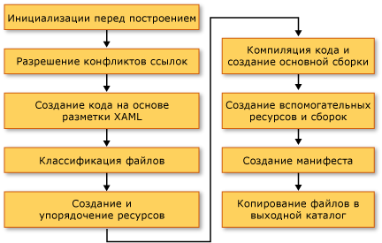

# <a name="building-a-wpf-application-wpf"></a>Построение приложения WPF
Приложения Windows Presentation Foundation (WPF) могут быть собраны как исполняемые файлы [!INCLUDE[dnprdnshort](../../../../includes/dnprdnshort-md.md)] (.exe), библиотеки (.dll) или как сочетание этих двух типов файлов. В этом разделе даются вводные сведения для построения приложений WPF и описываются основные шаги процесса построения.

<a name="Building_a_WPF_Application_using_Command_Line"></a>   
## <a name="building-a-wpf-application"></a>Построение приложения WPF  
 Приложения WPF можно компилировать следующими способами.

-   Из командной строки. Приложение должно содержать только код (без XAML) и файл определения приложения. Дополнительные сведения см. в разделе [Построение из командной строки с помощью csc.exe](https://docs.microsoft.com/dotnet/csharp/language-reference/compiler-options/) или [Построение из командной строки (Visual Basic)](https://docs.microsoft.com/dotnet/visual-basic/reference/command-line-compiler/building-from-the-command-line).  

-   С помощью Microsoft Build Engine (MSBuild). Помимо кода и файлов XAML приложение должно содержать файл проекта MSBuild. Дополнительные сведения см. в разделе "MSBuild".  

-   Visual Studio. Visual Studio — это интегрированная среда разработки, которая компилирует приложения WPF с помощью MSBuild и включает визуальный конструктор для создания пользовательского интерфейса. Дополнительные сведения см. в разделах [написание кода и управление им с помощью Visual Studio](https://docs.microsoft.com/visualstudio/ide/index-writing-code) и [конструктор XAML в Visual Studio](https://docs.microsoft.com/visualstudio/designers/designing-xaml-in-visual-studio).

<a name="The_Windows_Presentation_Foundation_Build_Pipeline"></a>   
## <a name="wpf-build-pipeline"></a>Конвейер сборки WPF  
 Когда выполняется сборка проекта WPF, вызывается сочетание целевых объектов, специфичных для языка и WPF. Процесс выполнения этих целевых объектов называется конвейером сборки, и его ключевые шаги показаны на следующем рисунке.
  
 
  
<a name="Pre_Build_Initializations"></a>   
### <a name="pre-build-initializations"></a>Инициализации перед сборкой  
 Перед сборкой MSBuild определяет расположение важных инструментов и библиотек, включая следующие.  

-   .NET Framework.

-   Каталоги [!INCLUDE[TLA2#tla_wcsdk](../../../../includes/tla2sharptla-wcsdk-md.md)].

-   Расположение ссылочных сборок WPF.

-   Свойство для путей поиска сборки.

 В первую очередь MSBuild ищет сборки в каталоге ссылочных сборок (%ProgramFiles%\Reference Assemblies\Microsoft\Framework\v3.0\\). На этом шаге процесс сборки также инициализирует различные свойства и группы элементов и выполняет все необходимые действия по очистке.  
  
<a name="Resolving_references"></a>   
### <a name="resolving-references"></a>Разрешение ссылок  
 Процесс сборки находит и привязывает сборки, которые требуются для выполнения сборки проекта приложения. Эта логика содержится в задаче `ResolveAssemblyReference`. Все сборки, объявленные как `Reference` в файле проекта, передаются в задачу вместе с информацией о путях поиска и метаданными в сборках, уже установленных в системе. Задача ищет сборки и использует метаданные установленной сборки для фильтрации этих основных сборок WPF, которые не должны отображаться в манифестах выходных данных. Это позволяет избежать избыточных сведений в манифесте ClickOnce. Например, так как ссылка на PresentationFramework.dll может считаться признаком приложения WPF, и все сборки WPF лежат в одном и том же расположении на каждом компьютере с .NET Framework, нет необходимости включать в манифесты все сведения о всех ссылочных сборках .NET Framework.  
  
<a name="Markup_Compilation___Pass_1"></a>   
### <a name="markup-compilationpass-1"></a>Компиляция разметки — шаг 1  
 На этом шаге файлы XAML анализируются и компилируются, чтобы в среде выполнения не тратилось время на анализ XML и проверку значений свойств. Скомпилированный файл XAML заранее разобран на составляющие элементы, так что во время выполнения его загрузка происходит гораздо быстрее, чем загрузка файла XAML.
  
 На этом шаге для каждого файла XAML, который является элементом сборки `Page`, выполняются следующие действия.  
  
1. Файл XAML анализируется компилятором разметки.  
  
2. Для этого XAML создается скомпилированное представление и копируется в папку obj\Release.  
  
3. Создается представление CodeDOM нового разделяемого класса и копируется в папку obj\Release.  
  
 Кроме того, создается отдельный языковой файл кода для каждого файла XAML. Например для страницы Page1.xaml в проекте Visual Basic, создается файл Page1.g.vb; для страницы Page1.xaml в проекте C# создается файл Page1.g.cs. ".g" в имени файла указывает, что это файл автоматически сгенерированного кода, который содержит объявление разделяемого класса для элемента верхнего уровня файла разметки (например, `Page` или `Window`). Класс объявляется с модификатором `partial` в C# (`Extends` в Visual Basic) для указания, что существует другое объявление класса в другом месте, обычно это файл Page1.xaml.cs с кодом программной части.  
  
 Разделяемый класс наследует от соответствующего базового класса (например <xref:System.Windows.Controls.Page> для страницы) и реализует интерфейс  <xref:System.Windows.Markup.IComponentConnector?displayProperty=nameWithType>. Интерфейс <xref:System.Windows.Markup.IComponentConnector> содержит методы для инициализации компонента и связывания имен и событий элемента в его содержимом. Таким образом, в созданном файле кода имеется реализация метода, подобная следующей:  
  
```csharp  
public void InitializeComponent() {  
    if (_contentLoaded) {  
        return;  
    }  
    _contentLoaded = true;  
    System.Uri resourceLocater =   
        new System.Uri(  
            "window1.xaml",   
            System.UriKind.RelativeOrAbsolute);  
    System.Windows.Application.LoadComponent(this, resourceLocater);  
}  
```  
  
```vb  
Public Sub InitializeComponent() _  
  
    If _contentLoaded Then  
        Return  
    End If  
  
    _contentLoaded = True  
    Dim resourceLocater As System.Uri = _  
        New System.Uri("mainwindow.xaml", System.UriKind.Relative)  
  
    System.Windows.Application.LoadComponent(Me, resourceLocater)  
  
End Sub  
```  

 По умолчанию компиляция разметки выполняется в том же <xref:System.AppDomain>, как и ядро MSBuild. Это обеспечивает значительный выигрыш в производительности. Это поведение можно переключать с помощью свойства `AlwaysCompileMarkupFilesInSeparateDomain`. Это дает следующее преимущество: при выгрузке отдельного <xref:System.AppDomain> выгружаются загруженные в него ссылочные сборки.
  
<a name="Pass_2_of_Markup_Compilation"></a>   
### <a name="markup-compilationpass-2"></a>Компиляция разметки — шаг 2  
 Не все страницы XAML компилируются на шаге 1 компиляции разметки. XAML файлы, имеющие локально определенные типы (ссылки на типы, определенные в коде в том же проекте), исключаются из компиляции на этом этапе. Причина заключается в том, что эти локально определенные типы существуют только в исходном коде и еще не скомпилированы. Чтобы определить это, синтаксический анализатор использует эвристику, которая включает поиск элементов, таких как `x:Name`, в файле разметки. При обнаружении такого экземпляра компиляция этого файла разметки откладывается, пока не будут скомпилированы файлы кода, после чего второй этап компиляции разметки обрабатывает эти файлы.  
  
<a name="File_Classification"></a>   
### <a name="file-classification"></a>Классификация файлов  
 Процесс сборки помещает выходные файлы в различные группы ресурсов на основе того, в какую сборку приложения они будут помещены. В обычном нелокализованном приложении все файлы данных, отмеченные как `Resource`, помещаются в главную сборку (исполняемый файл или библиотеку). Когда в проекте задается `UICulture`, все скомпилированные файлы XAML и ресурсы, специально отмеченные как языковые, помещаются во вспомогательную сборку ресурсов. Кроме того, все независящие от языка ресурсы помещаются в главную сборку. Решение принимается на данном этапе процесса сборки.  
  
 Действия сборки `ApplicationDefinition`, `Page` и `Resource` в файле проекта могут быть дополнены метаданными `Localizable` (допустимые значения — `true` и `false`), которые определяют, зависит ли этот файл от языка.
  
<a name="Core_Compilation"></a>   
### <a name="core-compilation"></a>Основная компиляция  
 На этапе основной компиляции выполняется компиляция файлов кода. Это управляется логикой в языковых файлах целей сборки Microsoft.CSharp.targets и Microsoft.VisualBasic.targets. Если эвристика определила, что первого этапа компилятора разметки достаточно, то создается главная сборка. Однако, если один или несколько файлов XAML в проекте имеют ссылки на локально определенные типы, то создается временный DLL-файл, чтобы могли быть созданы окончательные сборки приложения по завершении второго этапа компиляции разметки.
  
<a name="Manifest_generation"></a>   
### <a name="manifest-generation"></a>Создание манифеста  
 В конце процесса сборки, когда будут готовы все сборки приложения и файлы содержимого, создаются манифесты ClickOnce.  
  
 Файл манифеста развертывания описывает модель развертывания: текущую версию, поведение обновления и идентификатор издателя вместе с цифровой подписью. Этот манифест должен создаваться администраторами, управляющими развертыванием. Файл имеет расширение .xbap (для XAML-приложения браузера XBAP) и .application для устанавливаемых приложений. Первое задается свойством проекта `HostInBrowser`, и в результате манифест идентифицирует приложение как браузерное.
  
 Манифест приложения (файл .exe.manifest) описывает сборки приложения и зависимые библиотеки, а также перечисляет разрешения, необходимые для приложения. Этот файл должен быть создан разработчиком приложения. Для запуска приложения ClickOnce пользователь открывает файл манифеста развертывания приложения.
  
 Эти файлы манифеста всегда создаются для XBAP. Для установленных приложений они не создаются, если в файле проекта не будет задано свойство `GenerateManifests` со значением `true`.  
  
 XBAP помимо обычных разрешений зоны Интернета получают два дополнительных разрешения: <xref:System.Security.Permissions.WebBrowserPermission> и <xref:System.Security.Permissions.MediaPermission>. Система сборки WPF объявляет эти разрешения в манифесте приложения.  
  
<a name="Incremental_Build_Support"></a>   
## <a name="incremental-build-support"></a>Частичная сборка  
 Система сборки WPF обеспечивает поддержку частичной сборки. Она достаточно интеллектуально обнаруживает изменения, внесенные в разметку или код, и компилирует только те артефакты, на которые повлияло изменение. Механизм частичной сборки использует следующие файлы.
  
-   Файл $(*AssemblyName*)_MarkupCompiler.Cache для сохранения текущего состояния компилятора.  
  
-   Файл $(*AssemblyName*)_MarkupCompiler.lref для кэширования файлов XAML со ссылками на локально определенные типы.  
  
 Ниже приведен набор правил, управляющих частичной сборкой.  
  
-   Файл — это наименьшая единица, в которой система сборки обнаруживает изменения. Таким образом, для файла кода система сборки не может узнать, был ли изменен тип или добавлен код. То же самое относится и к файлам проекта.  
  
-   Механизм частичной сборки должен знать, что страница XAML либо определяет класс, либо использует другие классы.  
  
-   Если изменены записи `Reference`, то перекомпилируются все страницы.  
  
-   При изменении файла кода перекомпилируются все страницы с локально определенными ссылками типа.  
  
-   Если изменяется файл XAML:  
  
    -   XAML объявляется как `Page` в проекте: если XAML не имеет локально определенных ссылок на типы, перекомпилируется этот XAML плюс все страницы XAML с локальными ссылками; если XAML имеет локальные ссылки, перекомпилируются все страницы XAML с локальными ссылками.  
  
    -   Если XAML объявляется как `ApplicationDefinition` в проекте: перекомпилируются все XAML страниц (потому что в каждом XAML есть ссылка на тип <xref:System.Windows.Application>, который мог быть изменен).  
  
-   Если файл проекта объявляет файл кода как определение приложения вместо файла XAML:  
  
    -   Проверяется, изменилось ли значение `ApplicationClassName` в файле проекта (появился ли новый тип приложения). Если да, перекомпилируется все приложение.  
  
    -   В противном случае перекомпилируются все страницы XAML с локальными ссылками.  
  
-   При изменении файла проекта: применяются все вышеперечисленные правила и определяется, что нужно перекомпилировать. Изменения следующих свойств приводят к полной перекомпиляции: `AssemblyName`, `IntermediateOutputPath`, `RootNamespace` и `HostInBrowser`.  
  
 Возможны следующие сценарии перекомпиляции.  
  
-   Перекомпилируется все приложение.  
  
-   Перекомпилируются только те файлы XAML, в которых есть локально определенные ссылки типа.  
  
-   Ничего не перекомпилируется (если в проекте ничего не изменялось).  
  
## <a name="see-also"></a>См. также

- [Развертывание приложения WPF](deploying-a-wpf-application-wpf.md)
- [Справочные сведения о WPF для MSBuild](https://docs.microsoft.com/visualstudio/msbuild/wpf-msbuild-reference)
- [URI типа "pack" в WPF](pack-uris-in-wpf.md)
- [Ресурсы, содержимое и файлы данных WPF-приложения](wpf-application-resource-content-and-data-files.md)
