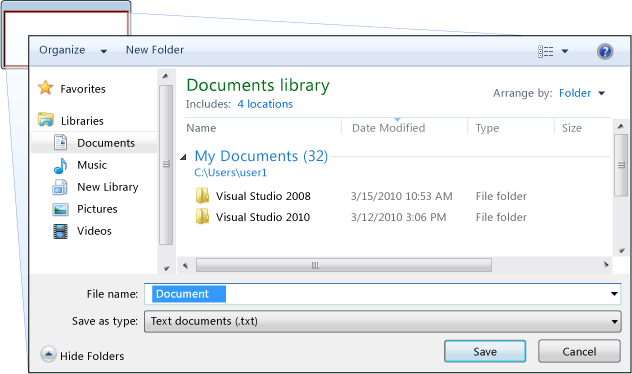

# Общие сведения о диалоговых окнах
Автономные приложения обычно имеют главное окно, отображающее основные данные, с которыми приложение работает, и предоставляющее функциональные возможности для обработки этих данных через  такие механизмы UI, как строки меню, панели инструментов и строки состояния. Нетривиальное приложение может также отображать дополнительные окна для следующих целей:  
  
-   отображения определенных сведений для пользователей;  
  
-   сбора сведений от пользователей;  
  
-   одновременно сбора и отображения сведений.  
  
 Такие типы окон называются *диалоговыми окнами*, и бывают двух типов: модальные и немодальные.
  
 *Модальное* диалоговое окно отображается функцией, когда для продолжения ей требуются дополнительные данные от пользователя. Поскольку функция зависит от модального диалогового окна для сбора данных, это окно также не разрешает пользователю активизировать другие окна в приложении, пока оно остается открытым. В большинстве случаев модальное диалоговое окно разрешает пользователю завершить работу с модальным диалоговым окном, нажав кнопки **ОК** или **Отмена**. Нажатие кнопки **ОК** обозначает, что пользователь ввел данные и желает, чтобы функция продолжила работу с этими данными. Нажатие кнопки **Отмена** обозначает, что пользователь хочет остановить выполнение функции. Наиболее распространенными примерами модальных диалоговых окон являются окна, которые отображаются для открытия, сохранения и печати данных.  
  
 *Немодальное* диалоговое окно, с другой стороны, не запрещает пользователю активацию других окон, когда оно открыто. Например, если пользователь хочет найти вхождения конкретного слова в документе, главное окно часто открывает диалоговое окно с запросом слова для поиска. Так как поиск слова не мешает пользователю редактировать документ, диалоговое окно не обязательно должно быть модальным. Немодальное диалоговое окно обычно содержит как минимум кнопку **Закрыть** и может предоставлять дополнительные кнопки для выполнения определенных функций, таких как **Найти далее**, чтобы найти следующее слово, соответствующее критерию поиска.
  
 Windows Presentation Foundation (WPF) позволяет создавать несколько типов диалоговых окон, включая окна сообщений, общие диалоговые окна и пользовательские диалоговые окна. В этом разделе обсуждаются эти виды диалоговых окон, а в разделе [примеры диалоговых окон](https://go.microsoft.com/fwlink/?LinkID=159984) приведены соответствующие примеры.  

   
## Окна сообщений  
 *Окно сообщения* является диалоговым окном, которое может использоваться для отображения текстовых данных и позволяет пользователям принимать решения с помощью кнопок. На следующем рисунке показано окно сообщения, в котором отображается текстовая информация, задается вопрос и предоставляются три кнопки для ответа на этот вопрос.  
  
   
  
 Для создания окна сообщения используйте класс <xref:System.Windows.MessageBox>. <xref:System.Windows.MessageBox> позволяет настроить текст в окне сообщения, заголовок, значок и кнопки с помощью следующего кода.  
  
 [!code-csharp[DialogBoxesOverviewSnippets#MsgBoxConfigureCODEBEHIND](~/samples/snippets/csharp/VS_Snippets_Wpf/DialogBoxesOverviewSnippets/CSharp/Window1.xaml.cs#msgboxconfigurecodebehind)]
   
  
 Чтобы отобразить окно сообщения, вызовите `static` метод <xref:System.Windows.MessageBox.Show%2A>, как показано в следующем коде.  
  
 [!code-csharp[DialogBoxesOverviewSnippets#MsgBoxShowCODEBEHIND](~/samples/snippets/csharp/VS_Snippets_Wpf/DialogBoxesOverviewSnippets/CSharp/Window1.xaml.cs#msgboxshowcodebehind)]
   
  
 Когда коду, который показывает окно сообщения, нужно определить и обработать решение пользователя (какая кнопка была нажата), он может проверить результат окна сообщения, как показано в следующем коде.  
  
 [!code-csharp[DialogBoxesOverviewSnippets#MsgBoxShowAndResultCODEBEHIND1](~/samples/snippets/csharp/VS_Snippets_Wpf/DialogBoxesOverviewSnippets/CSharp/Window1.xaml.cs#msgboxshowandresultcodebehind1)]
   
  
 Дополнительные сведения об использовании окон сообщений см. в разделах <xref:System.Windows.MessageBox>, [пример MessageBox](https://go.microsoft.com/fwlink/?LinkID=160023) и [примеры диалоговых окон](https://go.microsoft.com/fwlink/?LinkID=159984).
  
 Несмотря на то, что <xref:System.Windows.MessageBox> предлагает лишь достаточно ограниченный пользовательский интерфейс диалогового окна, преимуществом использования <xref:System.Windows.MessageBox> является то, что это единственный тип окна, который могут отображать приложения, работающие в песочнице с частичным доверием (см. в разделе [безопасности](../security-wpf.md)), такие как XAML-приложения браузера (XBAP).
  
 Большинство диалоговых окон отображают и собирают более сложные данные, чем результат окна сообщения, в том числе текст, выбранные варианты (флажки), взаимоисключающий выбор (переключатели) и списки выбора (списки, поля со списком, поля с раскрывающимся списком). Для этого Windows Presentation Foundation (WPF) предоставляет несколько общих диалоговых окон и позволяет создавать пользовательские диалоговые окна, хотя их использование возможно только для приложений, выполняемых с полным доверием.
  
   
## Общие диалоговые окна  
 Windows реализует различные часто используемые диалоговые окна, которые являются общими для всех приложений, включая диалоговые окна для открытия и сохранения файлов, а также печати. Поскольку эти диалоговые окна реализованы операционной системой, они могут совместно использоваться всеми приложениями, работающими в операционной системе, что помогает поддерживать единообразие пользовательского интерфейса; если пользователи знакомы с диалоговым окном, предоставляемым операционной системой в одном приложении, им не нужно учиться пользоваться этим диалоговым окном в других приложениях. Поскольку эти диалоговые доступны для всех приложений и обеспечивают согласованный пользовательский интерфейс, они называются *общими*.  
  
 Windows Presentation Foundation (WPF) инкапсулирует диалоговые окна открытия файла, сохранения файла и печати и предоставляет их как управляемые классы для использования в автономных приложениях. В этом разделе приводится краткий обзор каждого типа диалоговых окон.
  
   
### Диалоговое окно открытия файлов  
 Диалоговое окно открытия файлов, показанное на следующем рисунке, используется функцией открытия файла для получения имени открываемого файла.  
  
   
  
 Общее диалоговое окно открытия файла реализуется как класс <xref:Microsoft.Win32.OpenFileDialog>, который расположен в пространстве имен <xref:Microsoft.Win32>. Следующий код показывает, как создавать, настраивать и отображать такое окно, а также как обрабатывать результат.  
  
 [!code-csharp[DialogBoxesOverviewSnippets#OpenFileDialogBoxCODEBEHIND](~/samples/snippets/csharp/VS_Snippets_Wpf/DialogBoxesOverviewSnippets/CSharp/Window1.xaml.cs#openfiledialogboxcodebehind)]
   
  
 Дополнительные сведения о диалоговом окне открытия файла см. в разделе <xref:Microsoft.Win32.OpenFileDialog?displayProperty=nameWithType>.  
  
> [!NOTE]
>  <xref:Microsoft.Win32.OpenFileDialog> может использоваться для безопасного извлечения имен файлов приложениями, выполняющимися с частичным доверием (см. в разделе [безопасность](../security-wpf.md)).
  
   
### Диалоговое окно сохранения файлов  
 Диалоговое окно сохранения файлов, показанное на следующем рисунке, используется функцией сохранения файла для получения имени сохраняемого файла.  
  
   
  
 Общее диалоговое окно сохранения файла реализуется как класс <xref:Microsoft.Win32.SaveFileDialog> и находится в пространстве имен <xref:Microsoft.Win32>. Следующий код показывает, как создавать, настраивать и отображать такое окно, а также как обрабатывать результат.  
  
 [!code-csharp[DialogBoxesOverviewSnippets#SaveFileDialogBoxCODEBEHIND](~/samples/snippets/csharp/VS_Snippets_Wpf/DialogBoxesOverviewSnippets/CSharp/Window1.xaml.cs#savefiledialogboxcodebehind)]
   
  
 Дополнительные сведения о диалоговом окне сохранения файла см. в разделе <xref:Microsoft.Win32.SaveFileDialog?displayProperty=nameWithType>.

   
### Диалоговое окно печати
 Диалоговое окно печати, показанное на следующем рисунке, используется функциональными возможностями печати для выбора и настройки принтера, на котором пользователь хочет печатать данные.  
  
   
  
 Общее диалоговое окно печати реализуется как класс <xref:System.Windows.Controls.PrintDialog> и находится в пространстве имен <xref:System.Windows.Controls>. Следующий код показывает, как создавать, настраивать и отображать такое окно.
  
 [!code-csharp[DialogBoxesOverviewSnippets#PrintDialogBoxCODEBEHIND](~/samples/snippets/csharp/VS_Snippets_Wpf/DialogBoxesOverviewSnippets/CSharp/Window1.xaml.cs#printdialogboxcodebehind)]
   
  
 Дополнительные сведения о диалоговом окне печати см. в разделе <xref:System.Windows.Controls.PrintDialog?displayProperty=nameWithType>. Подробное описание печати в WPF см. в разделе [Обзор печати](../advanced/printing-overview.md).
  
   
## Пользовательские диалоговые окна  
 Хотя общие диалоговые окна полезны и должны использоваться, когда это возможно, они не поддерживают требований диалоговых окон, относящихся к особой предметной области. В этих случаях необходимо создавать собственные диалоговые окна. Как мы увидим, диалоговое окно является окном со специальным поведением. Это поведение реализуется <xref:System.Windows.Window> и, следовательно, для создания пользовательских модальных и немодальных диалоговых окон используется класс <xref:System.Windows.Window>.
  
   
### Создание модального пользовательского диалогового окна  
 В этом разделе показано, как использовать <xref:System.Windows.Window> для реализации типичного модального диалогового окнп, используя диалоговое окно `Margins` в качестве примера (см. в разделе [примеры диалоговых окон](https://go.microsoft.com/fwlink/?LinkID=159984)). На следующем рисунке показано диалоговое окно `Margins`.  
  
   
  
#### Настройка модального диалогового окна  
 Пользовательский интерфейс для типичного диалогового окна включает следующее.  
  
-   Различные элементы управления, которые необходимы для сбора нужных данных.  
  
-   Кнопка **ОК**, чтобы закрыть диалоговое окно и вернуться в функцию для продолжения обработки.  
  
-   Кнопка **Отмена**, чтобы закрыть диалоговое окно и остановить дальнейшую обработку функции.
  
-   Кнопка **Закрыть** в заголовке окна.  
  
-   Значок.  
  
-   Кнопки **Свернуть**, **Развернуть** и **Восстановить**.  
  
-   **Системное** меню, которое позволяет свернуть, развернуть и закрыть окно.  
    
-   Диалоговые окна должны быть регулируемого размера, где это возможно, и, чтобы предотвратить появление окна слишком малого размера, необходимо установить минимальные размеры окна и размеры по умолчанию.
  
-   Нажатие клавиши ESC следует настроить как сочетание клавиш, которое вызывает нажатие кнопки **Отмена**. Это достигается путем установки свойства  <xref:System.Windows.Controls.Button.IsCancel%2A> кнопки **Отмена** равным значению `true`.  
  
-   Нажатие клавиши ВВОД (RETURN) следует настроить как сочетание клавиш, которое вызывает нажатие кнопки **ОК**. Это достигается путем установки свойства  <xref:System.Windows.Controls.Button.IsDefault%2A> кнопки **ОК** равным значению `true`.  
  
 Следующий код демонстрирует такую конфигурацию.  
  
 [!code-xaml[DialogBoxSample#MarginsDialogBoxMainBitsMARKUP1](~/samples/snippets/csharp/VS_Snippets_Wpf/DialogBoxSample/CSharp/MarginsDialogBox.xaml)]  
  
 [!code-csharp[DialogBoxSample#MarginsDialogBoxMainBitsCODEBEHIND1](~/samples/snippets/csharp/VS_Snippets_Wpf/DialogBoxSample/CSharp/MarginsDialogBox.xaml.cs)]
    
  
 Пользовательский интерфейс для диалогового окна также распространяется на строку меню окна, открывающего диалоговое окно. Если пункт меню вызывает функцию, которая перед продолжением выполнения требует взаимодействия с пользователем посредством диалогового окна, то в названии этого пункта меню должно быть многоточие, как показано ниже.  
  
 [!code-xaml[DialogBoxSample#MainWindowMarginsDialogBoxMenuItemMARKUP1](~/samples/snippets/csharp/VS_Snippets_Wpf/DialogBoxSample/CSharp/MainWindow.xaml)]  

  
 Если пункт меню вызывает функцию, которая отображает диалоговое окно, не требующее взаимодействия с пользователем, например диалоговое окно "О программе", многоточие не требуется.  
  
#### Открытие модального диалогового окна  
 Диалоговое окно обычно отображается в результате выбора пользователем пункта меню для выполнения функции предметной области, такой как установка полей документа в текстовом редакторе. Отображение диалогового окна похоже на отображение обычного окна, хотя для диалогового окна требуется дополнительная настройка. Весь процесс создания, настройки и открытия диалогового окна показан в следующем коде.  
  
 [!code-csharp[DialogBoxSample#OpenMarginsDialogCODEBEHIND1](~/samples/snippets/csharp/VS_Snippets_Wpf/DialogBoxSample/CSharp/MainWindow.xaml.cs)]
    
  
 Здесь код передает в диалоговое окно сведения по умолчанию (о текущих полях). Он также присваивает свойству <xref:System.Windows.Window.Owner%2A?displayProperty=nameWithType> ссылку на окно, которое отображает диалоговое окно. Как правило, следует всегда устанавливать владельца для диалогового окна, чтобы задать поведения, связанные с состоянием окна, которые являются общими для всех диалоговых окон (подробнее см. в разделе [Общие сведения об окнах WPF](wpf-windows-overview.md)).  
  
> [!NOTE]
>  Необходимо указать владельца для поддержки автоматизации UI диалоговых окон (см. в разделе [обзор автоматизации пользовательского интерфейса](../../ui-automation/ui-automation-overview.md)).
  
 После настройки диалогового окна, его можно отобразить как модальное путем вызова <xref:System.Windows.Window.ShowDialog%2A>.  
  
#### Проверка пользовательских данных  
 Если открывается диалоговое окно и пользователь предоставляет требуемые данные, диалоговое окно отвечает за проверку допустимости предоставленных данных по следующим причинам.  
  
-   С точки зрения безопасности, следует проверять все входные данные.  
  
-   С точки зрения конкретной предметной области, следует предотвращать обработку ошибочных данных, которые могут вызывать исключения.  
  
-   С точки зрения взаимодействия с пользователем, диалоговое окно может помочь пользователям, показывая, какие введенные ими данные являются недопустимыми.  
  
-   С точки зрения производительности, проверка данных в многоуровневом приложении может уменьшить количество циклов обработки между уровнями клиента и приложения, особенно в том случае, если в приложение входят веб-службы или серверные базы данных.
  
 Чтобы проверить связанный элемент управления в WPF, необходимо определить правило проверки и связать его с привязкой. Правило проверки — пользовательский класс, производный от <xref:System.Windows.Controls.ValidationRule>. В следующем примере показано правило проверки, `MarginValidationRule`, которое проверяет, что связанное значение имеет тип  <xref:System.Double> и находится в пределах указанного диапазона.
  
 [!code-csharp[DialogBoxSample#MarginValidationRuleCODE](~/samples/snippets/csharp/VS_Snippets_Wpf/DialogBoxSample/CSharp/MarginValidationRule.cs#marginvalidationrulecode)]
   
  
 В этом коде логика правила проверки реализована путем переопределения <xref:System.Windows.Controls.ValidationRule.Validate%2A>, который проверяет данные и возвращает соответствующий <xref:System.Windows.Controls.ValidationResult>.
  
 Чтобы сопоставить это правило проверки со связанным элементом управления, используется следующая разметка.  
  
 [!code-xaml[DialogBoxSample#MarginsValidationMARKUP1](~/samples/snippets/csharp/VS_Snippets_Wpf/DialogBoxSample/CSharp/MarginsDialogBox.xaml)]  
  
 После связывания, правила проверки WPF автоматически применяются при вводе данных в связанном элементе управления. Если элемент управления содержит недопустимые данные, WPF отобразит красные границы вокруг недопустимого элемента, как показано на рисунке ниже.  
  
   
  
 WPF не ограничивает переход пользователя из элемента управления с недопустимым значением, пока не будут введены допустимые данные. Это правильное поведение диалогового окна; пользователь должен иметь возможность свободно перемещаться по элементам управления в диалоговом окне, независимо от того, правильны ли введенные данные. Тем не менее, это означает, что пользователь может ввести недопустимые данные и нажать кнопку **ОК**. По этой причине код также должен проверить все элементы управления в диалоговом окне при нажатии **ОК** путем обработки события <xref:System.Windows.Controls.Primitives.ButtonBase.Click>.  
  
 [!code-csharp[DialogBoxSample#MarginsDialogBoxValidationCODEBEHIND1](~/samples/snippets/csharp/VS_Snippets_Wpf/DialogBoxSample/CSharp/MarginsDialogBox.xaml.cs)]
  
 Этот код перечисляет все объекты зависимости в окне, и, если какой-либо имеет недопустимое значение (возвращается <xref:System.Windows.Controls.Validation.GetHasError%2A>), этот элемент управления получает фокус, `IsValid` возвращает `false`, и окно считается недопустимым.
  
 Если диалоговое окно является допустимым, оно может быть безопасно закрыто и выполнен возврат. В рамках процесса возврата необходимо возвращать результат в вызывающую функцию.  
  
#### Установка результата модального диалогового окна
 Открытие диалогового окна при помощи <xref:System.Windows.Window.ShowDialog%2A>, по сути, аналогично вызову метода: код, открывающий диалоговое окно с помощью <xref:System.Windows.Window.ShowDialog%2A> ожидает возвращаемое значение <xref:System.Windows.Window.ShowDialog%2A>. Когда <xref:System.Windows.Window.ShowDialog%2A> возвращает управление, код, который его вызвал, должен решить, продолжать обработку или прекратить ее, в зависимости от того, была ли нажата клавиша **ОК** или **Отмена**. Для облегчения принятия этого решения, диалоговое окно должно возвращать выбор пользователя в виде значения <xref:System.Boolean>, возвращаемого из <xref:System.Windows.Window.ShowDialog%2A>.  
  
 При нажатии **ОК**, <xref:System.Windows.Window.ShowDialog%2A> должен возвращать `true`. Это достигается путем установки <xref:System.Windows.Window.DialogResult%2A> при нажатии кнопки **ОК**.  
  
 [!code-csharp[DialogBoxSample#MarginsDialogBoxOKResultSetCODEBEHIND1](~/samples/snippets/csharp/VS_Snippets_Wpf/DialogBoxSample/CSharp/MarginsDialogBox.xaml.cs)]
 
 Обратите внимание, что <xref:System.Windows.Window.DialogResult%2A> также вызывает автоматическое закрытие окна, что устраняет необходимость явно вызывать <xref:System.Windows.Window.Close%2A>.  
  
 При нажатии **Отмена**, <xref:System.Windows.Window.ShowDialog%2A> должен возвращать `false`, что также требует установки <xref:System.Windows.Window.DialogResult%2A>.  
  
 [!code-csharp[DialogBoxSample#MarginsDialogBoxCancelResultSetCODEBEHIND1](~/samples/snippets/csharp/VS_Snippets_Wpf/DialogBoxSample/CSharp/MarginsDialogBox.xaml.cs)]
  
 Когда <xref:System.Windows.Controls.Button.IsCancel%2A> равно `true` и пользователь нажимает кнопку **Отмена** или клавишу ESC, <xref:System.Windows.Window.DialogResult%2A> автоматически присваивается `false`. Следующая разметка действует так же, как предыдущий код, без необходимости обрабатывать событие <xref:System.Windows.Controls.Primitives.ButtonBase.Click>.  
  
 [!code-xaml[DialogBoxSample#MarginsDialogDefaultCancelMARKUP](~/samples/snippets/csharp/VS_Snippets_Wpf/DialogBoxSample/CSharp/MarginsDialogBox.xaml)]  
  
 Диалоговое окно автоматически возвращает `false`, когда пользователь нажимает кнопку **Закрыть** в строке заголовка или выбирает **Закрыть** в **системном** меню.
  
#### Обработка данных, возвращенных из модального диалогового окна  
 Когда <xref:System.Windows.Window.DialogResult%2A> устанавливается диалоговым окном, функция, которая его открыла, может получить результат диалогового окна, проверив значение  <xref:System.Windows.Window.DialogResult%2A>, которое возвращает <xref:System.Windows.Window.ShowDialog%2A>.
  
 [!code-csharp[DialogBoxSample#OpenMarginsDialogProcessReturnCODEBEHIND1](~/samples/snippets/csharp/VS_Snippets_Wpf/DialogBoxSample/CSharp/MainWindow.xaml.cs)]
  
 Если результатом диалогового окна является `true`, функция использует его в качестве указания, что нужно получить и обработать данные, предоставленные пользователем.
  
> [!NOTE]
>  После возврата <xref:System.Windows.Window.ShowDialog%2A> диалоговое окно нельзя открыть повторно. Вместо этого придется создать новый экземпляр.
  
 Если результатом диалогового окна является `false`, функция должна соответствующим образом завершить обработку.  
  
   
### Создание немодального пользовательского диалогового окна  
 Немодальное диалоговое окно, например диалоговое окно поиска, показанное на следующем рисунке, в основном имеет такой же внешний вид, как и модальное диалоговое окно.  
  
   
  
 Однако поведение несколько отличается, как показано в следующих разделах.  
  
#### Открытие немодального диалогового окна  
 Немодальное диалоговое окно открывается путем вызова метода <xref:System.Windows.Window.Show%2A>.
  
 [!code-xaml[DialogBoxSample#OpenFindDialogMARKUP1](~/samples/snippets/csharp/VS_Snippets_Wpf/DialogBoxSample/CSharp/MainWindow.xaml)]  
  
 [!code-csharp[DialogBoxSample#OpenFindDialogCODEBEHIND1](~/samples/snippets/csharp/VS_Snippets_Wpf/DialogBoxSample/CSharp/MainWindow.xaml.cs)]
  
 В отличие от <xref:System.Windows.Window.ShowDialog%2A>, <xref:System.Windows.Window.Show%2A> возвращает немедленно. Следовательно, вызывающее окно не может определить, когда немодальное диалоговое окно закрывается, и поэтому не знает, когда следует проверить результат диалогового окна или получить данные из диалогового окна для дальнейшей обработки. Поэтому диалоговому окну необходимо создать альтернативный способ возврата данных в вызывающее окно для обработки.
  
#### Обработка данных, возвращенных из немодального диалогового окна  
 В этом примере `FindDialogBox` может возвращать один или несколько результатов в главное окно в зависимости от искомого текста. Как и в случае с модальным диалоговым окном, немодальное диалоговое окно может возвращать результаты с помощью свойств. Однако окну, которому принадлежит данное диалоговое окно, нужно знать, когда следует проверять эти свойства. Один из способов сделать это — реализовать для диалогового окна событие, которое возникает всякий раз, когда текст найден. `FindDialogBox` реализует для этой цели `TextFoundEvent`.  
  
 [!code-csharp[DialogBoxSample#TextFoundEventHandlerCODE](~/samples/snippets/csharp/VS_Snippets_Wpf/DialogBoxSample/CSharp/TextFoundEventHandler.cs)]
   
  
 С помощью делегата `TextFoundEventHandler`, `FindDialogBox` реализует `TextFoundEvent`.
  
 [!code-csharp[DialogBoxSample#TextFoundEventCODEBEHIND1](~/samples/snippets/csharp/VS_Snippets_Wpf/DialogBoxSample/CSharp/FindDialogBox.xaml.cs)]
     
  
 Следовательно, `Find` может создать событие, когда найден результат поиска.  
  
 [!code-csharp[DialogBoxSample#TextFoundEventRaiseCODEBEHIND1](~/samples/snippets/csharp/VS_Snippets_Wpf/DialogBoxSample/CSharp/FindDialogBox.xaml.cs)]
 
 Затем окну-владельцу нужно зарегистрировать и обработать это событие.  
  
 [!code-csharp[DialogBoxSample](~/samples/snippets/csharp/VS_Snippets_Wpf/DialogBoxSample/CSharp/MainWindow.xaml.cs)]
     
  
#### Закрытие немодального диалогового окна  
 Так как <xref:System.Windows.Window.DialogResult%2A> устанавливать не требуется, немодальное диалоговое окно можно закрыть с помощью предоставляемых системой механизмов, включая следующие:  
  
-   Щелкнув кнопку **Закрыть** в заголовке окна.  
  
-   Нажатием клавиш ALT+F4.  
  
-   Выбором **Закрыть** в **системном** меню.
  
 Кроме того, код может вызвать <xref:System.Windows.Window.Close%2A> при нажатии кнопки **Закрыть**.
  
 [!code-csharp[DialogBoxSample](~/samples/snippets/csharp/VS_Snippets_Wpf/DialogBoxSample/CSharp/FindDialogBox.xaml.cs)]
  
## См. также

- [Общие сведения о контекстном меню](../controls/popup-overview.md)
- [Примеры диалоговых окон](https://go.microsoft.com/fwlink/?LinkID=159984)
