# Общие сведения о переходах
Windows Presentation Foundation (WPF) поддерживает навигацию в стиле браузера, которую можно использовать в приложениях двух типов: автономных приложениях и XAML-приложениях браузера (XBAP). Чтобы упаковать содержимое для навигации WPF предоставляет класс <xref:System.Windows.Controls.Page>. Можно переходить от одной <xref:System.Windows.Controls.Page> к другой декларативно, с помощью <xref:System.Windows.Documents.Hyperlink>, или программно, с помощью <xref:System.Windows.Navigation.NavigationService>. WPF использует журнал, чтобы запоминать страницы, на которые был осуществлен переход и позволяет возвращаться к ним.  
  
 <xref:System.Windows.Controls.Page>, <xref:System.Windows.Documents.Hyperlink>, <xref:System.Windows.Navigation.NavigationService> и журнал образуют основу для поддержки навигации, предлагаемой WPF. В этом обзоре подробно рассматриваются эти возможности, а также расширенная поддержка переходов, включающая переход к свободным XAML файлам, HTML и произвольным объектам.  
  
> [!NOTE]
>  В этом разделе термин «браузер» относится только к браузерам, в которых можно разместить WPF-приложения, т.е. Internet Explorer и Firefox.  

## Переходы в приложениях WPF  
 В этом разделе содержится обзор основных возможностей перехода в WPF. Эти возможности доступны для автономных приложений и XBAP, но в этом разделе они представлены в контексте XBAP.  
  
> [!NOTE]
>  В этом разделе не обсуждаются построение и развертывание XBAP. Дополнительные сведения о XBAP см. в разделе [Обзор приложений браузера XAML WPF](wpf-xaml-browser-applications-overview.md).  
  
 В этом разделе объясняются и демонстрируются следующие аспекты переходов.  
  
-   [Реализация страницы](#CreatingAXAMLPage)  
  
-   [Настройка начальной страницы](#Configuring_a_Start_Page)  
  
-   [Настройка заголовка, ширины и высоты основного окна](#ConfiguringAXAMLPage)  
  
-   [Переход по гиперссылке](#NavigatingBetweenXAMLPages)  
  
-   [Переход к фрагменту](#FragmentNavigation)  
  
-   [Служба переходов](#NavigationService)  
  
-   [Программный переход с помощью службы переходов](#Programmatic_Navigation_with_the_Navigation_Service)  
  
-   [Время существования перехода](#Navigation_Lifetime)  
  
-   [Запоминание перехода в журнале](#NavigationHistory)  
  
-   [Время существования страницы и журнал](#PageLifetime)  
  
-   [Сохранение состояния содержимого с помощью журнала переходов](#RetainingContentStateWithNavigationHistory)  
  
-   [Файлы cookie](#Cookies)  
  
-   [Структурная навигация](#Structured_Navigation)  
  
   
### Реализация страницы  
 В WPF вы можете перейти к нескольким типам содержимого, включая объекты .NET Framework, пользовательские объекты, значения перечисления, пользовательские элементы управления, XAML файлы и HTML файлы. Тем не менее наиболее распространенным и удобным способом упаковки содержимого является <xref:System.Windows.Controls.Page>. Кроме того, <xref:System.Windows.Controls.Page> реализует особые возможности перехода в целях улучшения внешнего вида приложений и упрощения их разработки.
  
 С помощью <xref:System.Windows.Controls.Page> можно декларативно реализовать доступную для перехода страницу XAML содержимого с помощью разметки, как показано ниже.  
  
 [!code-xaml[NavigationOverviewSnippets#Page1XAML](~/samples/snippets/csharp/VS_Snippets_Wpf/NavigationOverviewSnippets/CSharp/Page1.xaml#page1xaml)]  
  
 Объект <xref:System.Windows.Controls.Page>, реализованный в XAML, имеет корневой элемент разметки `Page` и требует объявление XML-пространства имен WPF. Элемент `Page` содержит содержимое, к которому необходимо осуществить переход. Для добавления содержимого задается свойство `Page.Content`, как показано в следующем примере разметки.
  
 [!code-xaml[NavigationOverviewSnippets#Page2XAML](~/samples/snippets/csharp/VS_Snippets_Wpf/NavigationOverviewSnippets/CSharp/Page2.xaml#page2xaml)]  
  
 `Page.Content` может содержать только один дочерний элемент; в предыдущем примере, содержимым является отдельная строка «Hello, Page!». На практике обычно как дочерний элемент для создания и хранения содержимого используется элемент управления макетом (см. в разделе [макет](../advanced/layout.md)).
  
 Дочерний элемент `Page` считаются содержимым класса <xref:System.Windows.Controls.Page> и, следовательно, не нужно использовать явное присвоение `Page.Content`. Следующая разметка является декларативным эквивалентом предыдущего примера.
  
 [!code-xaml[NavigationOverviewSnippets#Page3XAML](~/samples/snippets/csharp/VS_Snippets_Wpf/NavigationOverviewSnippets/CSharp/Page3.xaml#page3xaml)]  
  
 В этом случае `Page.Content` автоматически задается дочерним элементом `Page`. Дополнительные сведения см. в разделе [Модель содержимого WPF](../controls/wpf-content-model.md).  
  
 Определение <xref:System.Windows.Controls.Page> только в разметке полезно для отображения содержимого. Тем не менее <xref:System.Windows.Controls.Page> также может отображать элементы управления, позволяющие пользователям взаимодействовать со страницей, и он может отвечать на действия пользователя, выполняя обработку событий и вызывая логику приложения. Интерактивная <xref:System.Windows.Controls.Page> реализуется с помощью комбинации разметки и кода программной части, как показано в следующем примере.
  
 [!code-xaml[XBAPAppDefSnippets#HomePageMARKUP](~/samples/snippets/csharp/VS_Snippets_Wpf/XBAPAppDefSnippets/CSharp/HomePage.xaml#homepagemarkup)]  
  
 [!code-csharp[XBAPAppDefSnippets#HomePageCODEBEHIND](~/samples/snippets/csharp/VS_Snippets_Wpf/XBAPAppDefSnippets/CSharp/HomePage.xaml.cs#homepagecodebehind)]
   
  
 Чтобы разрешить совместную работу файла разметки и файла кода программной части, требуется следующая конфигурация.  
  
-   В разметке `Page` элемент должен включать атрибут `x:Class`. При построении приложения существование `x:Class` в разметке указывает Microsoft Build Engine (MSBuild) создать `partial` класс, производный от <xref:System.Windows.Controls.Page> и имеющий имя, заданное параметром атрибута `x:Class`. Это требует добавления в XML объявления пространства имен для схемы XAML ( `xmlns:x="http://schemas.microsoft.com/winfx/2006/xaml"` ). Созданный `partial` класс реализует `InitializeComponent`, который вызывается для регистрации событий и задания свойств, реализованных в разметке.
  
-   В коде программной части должен быть `partial` класс с тем же именем, который был задан параметром атрибута `x:Class` в разметке и он должен быть производным от <xref:System.Windows.Controls.Page>. Это позволяет связать файл кода с `partial` классом, созданным для файла разметки при построении приложения (см. в разделе [построение приложения WPF](building-a-wpf-application-wpf.md)).
  
-   В коде программной части класс <xref:System.Windows.Controls.Page> должен реализовывать конструктор, который вызывает `InitializeComponent`. Метод `InitializeComponent` реализуется в `partial` классе, созданном на основе реазметки, для регистрации событий и задания свойств, которые определены в разметке.  
  
> [!NOTE]
>  При добавлении нового <xref:System.Windows.Controls.Page> в проект, использующий Microsoft Visual Studio, <xref:System.Windows.Controls.Page> реализуется с помощью разметки и кода программной части и включает необходимую конфигурацию для создания связи между файлами разметки и кода, как было описано здесь.
  
 Имея созданную <xref:System.Windows.Controls.Page>, можно осуществить переход к ней. Чтобы указать первую <xref:System.Windows.Controls.Page>, к которой приложение переходит, необходимо настроить начальную <xref:System.Windows.Controls.Page>.
  
   
### Настройка начальной страницы  
 XBAP требуется определенная инфраструктура для размещения в обозревателе. В WPF класс <xref:System.Windows.Application> является частью определения приложения, которое устанавливает необходимую инфраструктуру приложения (см. в разделе [Общие сведения об управлении приложением](application-management-overview.md)).
  
 Определение приложения обычно реализуется с помощью разметки и кода программной части, с файлом разметки, настроенным как элемент `ApplicationDefinition`  MSBuild. Ниже приведен определение приложения для XBAP.
  
 [!code-xaml[XBAPAppDefSnippets#XBAPApplicationDefinitionMARKUP](~/samples/snippets/csharp/VS_Snippets_Wpf/XBAPAppDefSnippets/CSharp/App.xaml#xbapapplicationdefinitionmarkup)]  
  
 [!code-csharp[XBAPAppDefSnippets#XBAPApplicationDefinitionCODEBEHIND](~/samples/snippets/csharp/VS_Snippets_Wpf/XBAPAppDefSnippets/CSharp/App.xaml.cs#xbapapplicationdefinitioncodebehind)]
   
  
 Можно использовать определение приложения XBAP, чтобы указать начальную <xref:System.Windows.Controls.Page>, которая автоматически открывается при запуске приложения. Это можно сделать, присвоив свойству <xref:System.Windows.Application.StartupUri%2A> URI нужной <xref:System.Windows.Controls.Page>.
  
> [!NOTE]
>  В большинстве случаев <xref:System.Windows.Controls.Page> компилируется и развертывается вместе с приложением. В этих случаях URI, идентифицирующий <xref:System.Windows.Controls.Page> — это pack URI, который соответствует схеме *pack*. Pack URI рассматриваются далее в разделе [URI типа Pack в WPF](pack-uris-in-wpf.md). Для перехода к содержимому можно также использовать схему HTTP, которая рассматривается далее.  
  
 Можно задать <xref:System.Windows.Application.StartupUri%2A> декларативно в разметке, как показано в следующем примере.  
  
 [!code-xaml[NavigationOverviewSnippets#XBAPApplicationDefinitionMARKUP](~/samples/snippets/csharp/VS_Snippets_Wpf/NavigationOverviewSnippets/CSharp/App.xaml#xbapapplicationdefinitionmarkup)]  
  
 В этом примере `StartupUri` присваивается относительный pack URI файла `HomePage.xaml`. При запуске XBAP будет автоматически осуществлен переход к HomePage.xaml. Это показано на следующем рисунке, показывающем XBAP, запущенное с веб-сервера.
  
 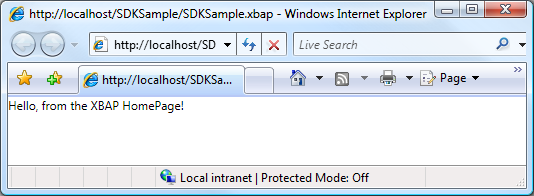  
  
> [!NOTE]
>  Дополнительные сведения о разработке и развертывании XBAP, см. в разделах [Обзор приложений браузера XAML WPF](wpf-xaml-browser-applications-overview.md) и [развертывание приложений WPF](deploying-a-wpf-application-wpf.md).  

   
### Настройка заголовка, ширины и высоты основного окна  
 Одно дело, вы могли заметить в предыдущем примере — что заголовком как браузера, так и панели вкладок является URI для XBAP. Заголовок не только длинный, но также не является ни привлекательным, ни информативным. По этой причине <xref:System.Windows.Controls.Page> предлагает способ для изменения заголовка, задав <xref:System.Windows.Controls.Page.WindowTitle%2A> свойство. Кроме того, можно настроить ширину и высоту окна браузера, задав <xref:System.Windows.Controls.Page.WindowWidth%2A> и <xref:System.Windows.Controls.Page.WindowHeight%2A>, соответственно.  
  
 <xref:System.Windows.Controls.Page.WindowTitle%2A>, <xref:System.Windows.Controls.Page.WindowWidth%2A>, и <xref:System.Windows.Controls.Page.WindowHeight%2A> можно задать декларативно в разметке, как показано в следующем примере.  
  
 [!code-xaml[NavigationOverviewSnippets#HomePageMARKUP](~/samples/snippets/csharp/VS_Snippets_Wpf/NavigationOverviewSnippets/CSharp/HomePage.xaml#homepagemarkup)]  
  
 Результат показан на примере ниже.  
  
   
  
   
### Переход по гиперссылке  
 Типичный XBAP состоит из нескольких страниц. Самый простой способ перехода от одной страницы к другой — для использования <xref:System.Windows.Documents.Hyperlink>. Можно декларативно добавить <xref:System.Windows.Documents.Hyperlink> для <xref:System.Windows.Controls.Page> с помощью `Hyperlink` элемент, который показан в следующем примере разметки.  
  
 [!code-xaml[NavigationOverviewSnippets#HyperlinkXAML1](~/samples/snippets/csharp/VS_Snippets_Wpf/NavigationOverviewSnippets/CSharp/PageWithHyperlink.xaml#hyperlinkxaml1)]  
[!code-xaml[NavigationOverviewSnippets#HyperlinkXAML2](~/samples/snippets/csharp/VS_Snippets_Wpf/NavigationOverviewSnippets/CSharp/PageWithHyperlink.xaml#hyperlinkxaml2)]  
[!code-xaml[NavigationOverviewSnippets#HyperlinkXAML3](~/samples/snippets/csharp/VS_Snippets_Wpf/NavigationOverviewSnippets/CSharp/PageWithHyperlink.xaml#hyperlinkxaml3)]  
  
 Объект `Hyperlink` элемент требует следующего:  
  
-   Пакет URI из <xref:System.Windows.Controls.Page> для перехода, определяемом параметрами `NavigateUri` атрибута.  
  
-   Содержимого, что пользователь может щелкнуть для инициации перехода, например текст и изображения (для содержимого, `Hyperlink` элемент может содержать, см. в разделе <xref:System.Windows.Documents.Hyperlink>).  
  
 На следующем рисунке показан XBAP с <xref:System.Windows.Controls.Page> с <xref:System.Windows.Documents.Hyperlink>.  
  
 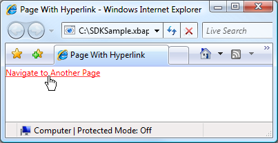  
  
 Как и следовало ожидать, щелкнув <xref:System.Windows.Documents.Hyperlink> вызывает XBAP для перехода к <xref:System.Windows.Controls.Page> , определяемому `NavigateUri` атрибута. Кроме того XBAP добавляет запись для предыдущего <xref:System.Windows.Controls.Page> в список последних страниц в Internet Explorer. Это показано на следующем рисунке.  
  
   
  
 Помимо поддержки перехода от одного <xref:System.Windows.Controls.Page> в другую, <xref:System.Windows.Documents.Hyperlink> также поддерживает переход к фрагменту.  
  
   
### Переход к фрагменту  
 *Переход к фрагменту* — это переход к фрагменту содержимого в любом текущего <xref:System.Windows.Controls.Page> или другой <xref:System.Windows.Controls.Page>. В WPF, фрагмент содержимого представляет собой данные, содержащиеся в именованном элементе. Именованный элемент — элемент, имеющий его `Name` набором атрибутов. В следующей разметке показан именованный `TextBlock` элемент, содержащий фрагмент содержимого.  
  
 [!code-xaml[NavigationOverviewSnippets#PageWithContentFragmentsMARKUP1](~/samples/snippets/csharp/VS_Snippets_Wpf/NavigationOverviewSnippets/CSharp/PageWithFragments.xaml#pagewithcontentfragmentsmarkup1)]  
[!code-xaml[NavigationOverviewSnippets#PageWithContentFragmentsMARKUP2](~/samples/snippets/csharp/VS_Snippets_Wpf/NavigationOverviewSnippets/CSharp/PageWithFragments.xaml#pagewithcontentfragmentsmarkup2)]  
[!code-xaml[NavigationOverviewSnippets#PageWithContentFragmentsMARKUP3](~/samples/snippets/csharp/VS_Snippets_Wpf/NavigationOverviewSnippets/CSharp/PageWithFragments.xaml#pagewithcontentfragmentsmarkup3)]  
  
 Для <xref:System.Windows.Documents.Hyperlink> для перехода к фрагменту содержимого `NavigateUri` атрибут должен содержать следующее:  
  
-   URI Из <xref:System.Windows.Controls.Page> с для перехода к фрагменту содержимого.  
  
-   Символ "#".  
  
-   Имя элемента на <xref:System.Windows.Controls.Page> , включающего фрагмент содержимого.  
  
 Фрагмент URI имеет следующий формат.  
  
 *URI_страницы* `#` *имя_элемента*.  
  
 Ниже приведен пример `Hyperlink` , настроенной на переход к фрагменту содержимого.  
  
 [!code-xaml[NavigationOverviewSnippets#PageThatNavigatesXAML1](~/samples/snippets/csharp/VS_Snippets_Wpf/NavigationOverviewSnippets/CSharp/PageThatNavigatesToFragment.xaml#pagethatnavigatesxaml1)]  
[!code-xaml[NavigationOverviewSnippets#PageThatNavigatesXAML2](~/samples/snippets/csharp/VS_Snippets_Wpf/NavigationOverviewSnippets/CSharp/PageThatNavigatesToFragment.xaml#pagethatnavigatesxaml2)]  
[!code-xaml[NavigationOverviewSnippets#PageThatNavigatesXAML3](~/samples/snippets/csharp/VS_Snippets_Wpf/NavigationOverviewSnippets/CSharp/PageThatNavigatesToFragment.xaml#pagethatnavigatesxaml3)]  
  
> [!NOTE]
>  В этом разделе описывается реализация переходов фрагмента по умолчанию в WPF. WPF Кроме того, позволяет реализовать собственную схему переходов фрагмента, которая отчасти требует обработки <xref:System.Windows.Navigation.NavigationService.FragmentNavigation?displayProperty=nameWithType> событий.  
  
> [!IMPORTANT]
>  Вы можете перейти к фрагментам на свободных XAML страниц (только для разметки XAML файлы с `Page` как корневой элемент) только в том случае, если страницы можно просмотреть с помощью [!INCLUDE[TLA2#tla_http](../../../../includes/tla2sharptla-http-md.md)].  
>   
>  Тем не менее свободный XAML страницу можно перейти к своим собственным фрагментам.  
  
   
### Служба переходов  
 Хотя <xref:System.Windows.Documents.Hyperlink> позволяет пользователю инициировать переход к конкретному <xref:System.Windows.Controls.Page>, работа по поиску и загрузке страницы выполняется с <xref:System.Windows.Navigation.NavigationService> класса. По сути <xref:System.Windows.Navigation.NavigationService> предоставляет возможность обработки запроса перехода со стороны клиентского кода, такие как <xref:System.Windows.Documents.Hyperlink>. Кроме того <xref:System.Windows.Navigation.NavigationService> реализует поддержку более высокого уровня для отслеживания и влияние на запроса перехода.  
  
 Когда <xref:System.Windows.Documents.Hyperlink> нажатии WPF вызовы <xref:System.Windows.Navigation.NavigationService.Navigate%2A?displayProperty=nameWithType> для обнаружения и загрузки <xref:System.Windows.Controls.Page> в указанный пакет URI. Скачанный <xref:System.Windows.Controls.Page> преобразуется в дерево объектов, корневой объект которого является экземпляром Скачанный <xref:System.Windows.Controls.Page>. Ссылка на корневой <xref:System.Windows.Controls.Page> объект хранится в <xref:System.Windows.Navigation.NavigationService.Content%2A?displayProperty=nameWithType> свойство. Пакет URI для содержимого, к которому был осуществлен переход, сохраняется в <xref:System.Windows.Navigation.NavigationService.Source%2A?displayProperty=nameWithType> свойство, хотя <xref:System.Windows.Navigation.NavigationService.CurrentSource%2A?displayProperty=nameWithType> сохраняет пакет URI для последней страницы, к которому был осуществлен переход.  
  
> [!NOTE]
>  Существует возможность WPF приложению требуется более одного активного <xref:System.Windows.Navigation.NavigationService>. Дополнительные сведения см. в разделе [узлы переходов](#Navigation_Hosts) далее в этом разделе.  
  
   
### Программный переход с помощью службы переходов  
 Не нужно знать о <xref:System.Windows.Navigation.NavigationService> Если переход реализован декларативно в разметке с помощью <xref:System.Windows.Documents.Hyperlink>, так как <xref:System.Windows.Documents.Hyperlink> использует <xref:System.Windows.Navigation.NavigationService> от вашего имени. Это означает, что пока прямой или непрямой родитель объекта <xref:System.Windows.Documents.Hyperlink> является узлом перехода (см. в разделе [узлы переходов](#Navigation_Hosts)), <xref:System.Windows.Documents.Hyperlink> будут иметь возможность находить и использовать службу переходов этого узла для обработки запрос навигации.  
  
 Тем не менее, существуют ситуации, когда необходимо использовать <xref:System.Windows.Navigation.NavigationService> напрямую, включая следующие:  
  
-   Если вам нужно создать экземпляр <xref:System.Windows.Controls.Page> с помощью конструктора не по умолчанию.  
  
-   Если вам нужно задать свойства <xref:System.Windows.Controls.Page> перед переходом к нему.  
  
-   Когда <xref:System.Windows.Controls.Page> что необходимо осуществлять переходы можно определить только во время выполнения.  
  
 В этих случаях необходимо написать код для программной инициации перехода посредством вызова <xref:System.Windows.Navigation.NavigationService.Navigate%2A> метод <xref:System.Windows.Navigation.NavigationService> объекта. Для этого требуется получить ссылку на <xref:System.Windows.Navigation.NavigationService>.  
  
#### Получение ссылки на службу переходов  
 По причинам, охваченных [узлы переходов](#Navigation_Hosts) разделе WPF приложение может иметь более одного <xref:System.Windows.Navigation.NavigationService>. Это означает, что в коде необходимо предусмотреть способ поиска <xref:System.Windows.Navigation.NavigationService>, который обычно является <xref:System.Windows.Navigation.NavigationService> , приводящую к текущему <xref:System.Windows.Controls.Page>. Можно получить ссылку на <xref:System.Windows.Navigation.NavigationService> путем вызова `static`<xref:System.Windows.Navigation.NavigationService.GetNavigationService%2A?displayProperty=nameWithType> метод. Чтобы получить <xref:System.Windows.Navigation.NavigationService> , переход к конкретному <xref:System.Windows.Controls.Page>, передать ссылку на <xref:System.Windows.Controls.Page> в качестве аргумента <xref:System.Windows.Navigation.NavigationService.GetNavigationService%2A> метод. Следующий код показывает способ получения <xref:System.Windows.Navigation.NavigationService> для текущего <xref:System.Windows.Controls.Page>.  
  
 [!code-csharp[NavigationOverviewSnippets#GetNSCODEBEHIND1](~/samples/snippets/csharp/VS_Snippets_Wpf/NavigationOverviewSnippets/CSharp/GetNSPage.xaml.cs#getnscodebehind1)]  
[!code-csharp[NavigationOverviewSnippets#GetNSCODEBEHIND2](~/samples/snippets/csharp/VS_Snippets_Wpf/NavigationOverviewSnippets/CSharp/GetNSPage.xaml.cs#getnscodebehind2)]
  
  
 Как быстро найти <xref:System.Windows.Navigation.NavigationService> для <xref:System.Windows.Controls.Page>, <xref:System.Windows.Controls.Page> реализует <xref:System.Windows.Controls.Page.NavigationService%2A> свойство. Эти действия показаны в следующем примере.  
  
 [!code-csharp[NavigationOverviewSnippets#GetNSShortcutCODEBEHIND1](~/samples/snippets/csharp/VS_Snippets_Wpf/NavigationOverviewSnippets/CSharp/GetNSPageShortCut.xaml.cs#getnsshortcutcodebehind1)]  
[!code-csharp[NavigationOverviewSnippets#GetNSShortcutCODEBEHIND2](~/samples/snippets/csharp/VS_Snippets_Wpf/NavigationOverviewSnippets/CSharp/GetNSPageShortCut.xaml.cs#getnsshortcutcodebehind2)]
  
  
> [!NOTE]
>  Объект <xref:System.Windows.Controls.Page> может получить только ссылку на его <xref:System.Windows.Navigation.NavigationService> при <xref:System.Windows.Controls.Page> вызывает <xref:System.Windows.FrameworkElement.Loaded> событий.  
  
#### Программный переход к объекту страницы  
 В следующем примере показано, как использовать <xref:System.Windows.Navigation.NavigationService> осуществить программный переход к <xref:System.Windows.Controls.Page>. Программный переход является обязательным, поскольку <xref:System.Windows.Controls.Page> то есть, куда выполняется переход могут быть созданы только с помощью конструктора, единый, не по умолчанию. <xref:System.Windows.Controls.Page> С нестандартным конструктором показан в следующей разметке и коде.  
  
 [!code-xaml[NavigationOverviewSnippets#PageWithNonDefaultConstructorXAML](~/samples/snippets/csharp/VS_Snippets_Wpf/NavigationOverviewSnippets/CSharp/PageWithNonDefaultConstructor.xaml#pagewithnondefaultconstructorxaml)]  
  
 [!code-csharp[NavigationOverviewSnippets#PageWithNonDefaultConstructorCODEBEHIND](~/samples/snippets/csharp/VS_Snippets_Wpf/NavigationOverviewSnippets/CSharp/PageWithNonDefaultConstructor.xaml.cs#pagewithnondefaultconstructorcodebehind)]
   
  
 <xref:System.Windows.Controls.Page> , Осуществляющий переход к <xref:System.Windows.Controls.Page> с нестандартным конструктором показан в следующей разметке и коде.  
  
 [!code-xaml[NavigationOverviewSnippets#NSNavigationPageXAML](~/samples/snippets/csharp/VS_Snippets_Wpf/NavigationOverviewSnippets/CSharp/NSNavigationPage.xaml#nsnavigationpagexaml)]  
  
 [!code-csharp[NavigationOverviewSnippets#NSNavigationPageCODEBEHIND](~/samples/snippets/csharp/VS_Snippets_Wpf/NavigationOverviewSnippets/CSharp/NSNavigationPage.xaml.cs#nsnavigationpagecodebehind)]
   
  
 При <xref:System.Windows.Documents.Hyperlink> об этом <xref:System.Windows.Controls.Page> является щелчке, запускается переход путем создания экземпляра <xref:System.Windows.Controls.Page> перейдите к с помощью конструктора не по умолчанию и вызвав <xref:System.Windows.Navigation.NavigationService.Navigate%2A?displayProperty=nameWithType> метод. <xref:System.Windows.Navigation.NavigationService.Navigate%2A> принимает ссылку на объект, <xref:System.Windows.Navigation.NavigationService> производится переход, типа pack URI.  
  
#### Программный переход с URI типа pack  
 Если вам необходимо создать в пакете URI программным образом (если только определения пакета URI во время выполнения, например), можно использовать <xref:System.Windows.Navigation.NavigationService.Navigate%2A?displayProperty=nameWithType> метод. Эти действия показаны в следующем примере.  
  
 [!code-xaml[NavigationOverviewSnippets#NSUriNavigationPageXAML](~/samples/snippets/csharp/VS_Snippets_Wpf/NavigationOverviewSnippets/CSharp/NSUriNavigationPage.xaml#nsurinavigationpagexaml)]  
  
 [!code-csharp[NavigationOverviewSnippets#NSUriNavigationPageCODEBEHIND](~/samples/snippets/csharp/VS_Snippets_Wpf/NavigationOverviewSnippets/CSharp/NSUriNavigationPage.xaml.cs#nsurinavigationpagecodebehind)]
   
  
#### Обновление текущей страницы  
 Объект <xref:System.Windows.Controls.Page> не загружается, если он имеет тот же пакет URI пакета URI , хранящееся в <xref:System.Windows.Navigation.NavigationService.Source%2A?displayProperty=nameWithType> свойство. Чтобы принудительно WPF попытку загрузить текущую страницу, можно последовательно вызвать методы <xref:System.Windows.Navigation.NavigationService.Refresh%2A?displayProperty=nameWithType> метод, как показано в следующем примере.  
  
 [!code-xaml[NavigationOverviewSnippets#NSRefreshNavigationPageXAML1](~/samples/snippets/csharp/VS_Snippets_Wpf/NavigationOverviewSnippets/CSharp/NSRefreshNavigationPage.xaml#nsrefreshnavigationpagexaml1)]  
  
 [!code-csharp[NavigationOverviewSnippets#NSRefreshNavigationPageCODEBEHIND1](~/samples/snippets/csharp/VS_Snippets_Wpf/NavigationOverviewSnippets/CSharp/NSRefreshNavigationPage.xaml.cs#nsrefreshnavigationpagecodebehind1)]
   
[!code-csharp[NavigationOverviewSnippets#NSRefreshNavigationPageCODEBEHIND2](~/samples/snippets/csharp/VS_Snippets_Wpf/NavigationOverviewSnippets/CSharp/NSRefreshNavigationPage.xaml.cs#nsrefreshnavigationpagecodebehind2)]
  
  
   
### Время существования перехода  
 Как вы уже видели, существует множество способов инициации перехода. Когда переход инициирован и навигации во время выполнения, можно отслеживать и повлиять на него с помощью следующих событий, которые реализуются <xref:System.Windows.Navigation.NavigationService>:  
  
-   <xref:System.Windows.Navigation.NavigationService.Navigating>. Появляется, когда запрошен новый переход. Можно использовать для отмены перехода.  
  
-   <xref:System.Windows.Navigation.NavigationService.NavigationProgress>. Происходит периодически во время загрузки, тем самым предоставляя информацию о ходе процесса навигации.  
  
-   <xref:System.Windows.Navigation.NavigationService.Navigated>. Появляется, когда страница найдена и загружена.  
  
-   <xref:System.Windows.Navigation.NavigationService.NavigationStopped>. Происходит, когда переход остановлен (путем вызова <xref:System.Windows.Navigation.NavigationService.StopLoading%2A>), или при запросе нового перехода во время выполнения текущего перехода.  
  
-   <xref:System.Windows.Navigation.NavigationService.NavigationFailed>. Появляется при возникновении ошибки во время перехода к запрошенному содержимому.  
  
-   <xref:System.Windows.Navigation.NavigationService.LoadCompleted>. Появляется, когда содержимое, к которому был осуществлен переход, загружено и проанализировано и начинается его отрисовка.  
  
-   <xref:System.Windows.Navigation.NavigationService.FragmentNavigation>. Появляется в начале перехода к фрагменту содержимого, который происходит:  
  
    -   немедленно, если нужный фрагмент находится в текущем содержимом;  
  
    -   после загрузки исходного содержимого, если нужный фрагмент находится в другом содержимом.  
  
 События перехода вызываются в порядке, который показан на следующем рисунке.  
  
 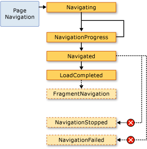  
  
 В общем случае <xref:System.Windows.Controls.Page> не связан с этими событиями. Более вероятно, что приложение связано с ними, и по этой причине эти события также вызываются с помощью <xref:System.Windows.Application> класса:  
  
-   <xref:System.Windows.Application.Navigating?displayProperty=nameWithType>  
  
-   <xref:System.Windows.Application.NavigationProgress?displayProperty=nameWithType>  
  
-   <xref:System.Windows.Application.Navigated?displayProperty=nameWithType>  
  
-   <xref:System.Windows.Application.NavigationFailed?displayProperty=nameWithType>  
  
-   <xref:System.Windows.Application.NavigationStopped?displayProperty=nameWithType>  
  
-   <xref:System.Windows.Application.LoadCompleted?displayProperty=nameWithType>  
  
-   <xref:System.Windows.Application.FragmentNavigation?displayProperty=nameWithType>  
  
 Каждый раз <xref:System.Windows.Navigation.NavigationService> возникает событие <xref:System.Windows.Application> класс вызывает соответствующее событие. <xref:System.Windows.Controls.Frame> и <xref:System.Windows.Navigation.NavigationWindow> обеспечивают те же события, для обнаружения переходов в соответствующих областях.  
  
 В некоторых случаях <xref:System.Windows.Controls.Page> могут заинтересовать эти события. Например <xref:System.Windows.Controls.Page> может обрабатывать <xref:System.Windows.Navigation.NavigationService.Navigating?displayProperty=nameWithType> событие, чтобы определить необходимость отмены перехода. Эти действия показаны в следующем примере.  
  
 [!code-xaml[NavigationOverviewSnippets#CancelNavigationPageXAML](~/samples/snippets/csharp/VS_Snippets_Wpf/NavigationOverviewSnippets/CSharp/CancelNavigationPage.xaml#cancelnavigationpagexaml)]  
  
 [!code-csharp[NavigationOverviewSnippets#CancelNavigationPageCODEBEHIND](~/samples/snippets/csharp/VS_Snippets_Wpf/NavigationOverviewSnippets/CSharp/CancelNavigationPage.xaml.cs#cancelnavigationpagecodebehind)]
   
  
 Если регистрируется обработчик с событием перехода из <xref:System.Windows.Controls.Page>, как предыдущий пример, необходимо также отменить регистрацию обработчика событий. Если этого не сделать, могут возникнуть побочные эффекты, как WPF запоминает переходы <xref:System.Windows.Controls.Page> с помощью журнала.  
  
   
### Запоминание перехода в журнале  
 WPF использует два стека для запоминания страниц, на которые был осуществлен переход: стек переходов назад и вперед. При переходе из текущего <xref:System.Windows.Controls.Page> в новый <xref:System.Windows.Controls.Page> или вперед к существующему <xref:System.Windows.Controls.Page>, текущий <xref:System.Windows.Controls.Page> добавляется *стек переходов назад*. При переходе из текущего <xref:System.Windows.Controls.Page> вернитесь к предыдущему <xref:System.Windows.Controls.Page>, текущий <xref:System.Windows.Controls.Page> добавляется *вперед*. Стек "Назад", стек "Вперед" и функциональные возможности для управления ими в совокупности называются журналом. Каждый элемент в стеке переходов назад и вперед — это экземпляр <xref:System.Windows.Navigation.JournalEntry> класса и называется *записи журнала*.  
  
#### Перемещение по журналу в браузере Internet Explorer  
 По существу, журнала работает так же, как **обратно** и **вперед** кнопки в Internet Explorer сделать. Это показано на следующем рисунке.  
  
   
  
 Для XBAP , размещаемых в Internet Explorer, WPF осуществляет интеграцию журнала в области навигации UI из Internet Explorer. Это позволяет пользователям перемещаться по страницам в XBAP с помощью **обратно**, **вперед**, и **последние страницы** кнопки в Internet Explorer. Журнал не интегрирован в [!INCLUDE[TLA2#tla_ie6](../../../../includes/tla2sharptla-ie6-md.md)] таким же образом, что и для [!INCLUDE[TLA2#tla_ie7](../../../../includes/tla2sharptla-ie7-md.md)] или Internet Explorer 8. Вместо этого WPF отображает навигации замените UI.  
  
> [!IMPORTANT]
>  В Internet Explorer, при переходе со страницы и обратно XBAP, в журнале сохраняются только записи журнала для страниц, которые не поддерживались в активном состоянии. Обсуждение поддержки страниц в активном состоянии, см. в разделе [время существования страницы и журнал](#PageLifetime) далее в этом разделе.  
  
 По умолчанию текст для каждого <xref:System.Windows.Controls.Page> , отображаемый в **последние страницы** список Internet Explorer — URI для <xref:System.Windows.Controls.Page>. В большинстве случаев это не особенно важно для пользователя. К счастью можно изменить текст, используя следующие параметры.  
  
1. Вложенный `JournalEntry.Name` значение атрибута.  
  
2. `Page.Title` Значение атрибута.  
  
3. `Page.WindowTitle` Значение атрибута и URI для текущего <xref:System.Windows.Controls.Page>.  
  
4. Интерфейс URI для текущего объекта <xref:System.Windows.Controls.Page>. (Значение по умолчанию)  
  
 Порядок, в котором перечислены параметры, совпадает с порядком приоритета для поиска текста. Например если `JournalEntry.Name` не установлен, другие значения игнорируются.  
  
 В следующем примере используется `Page.Title` атрибут, чтобы изменить текст, отображаемый в записи журнала.  
  
 [!code-xaml[NavigationOverviewSnippets#PageTitleMARKUP1](~/samples/snippets/csharp/VS_Snippets_Wpf/NavigationOverviewSnippets/CSharp/PageWithTitle.xaml#pagetitlemarkup1)]  
[!code-xaml[NavigationOverviewSnippets#PageTitleMARKUP2](~/samples/snippets/csharp/VS_Snippets_Wpf/NavigationOverviewSnippets/CSharp/PageWithTitle.xaml#pagetitlemarkup2)]  
  
 [!code-csharp[NavigationOverviewSnippets#PageTitleCODEBEHIND1](~/samples/snippets/csharp/VS_Snippets_Wpf/NavigationOverviewSnippets/CSharp/PageWithTitle.xaml.cs#pagetitlecodebehind1)]
   
[!code-csharp[NavigationOverviewSnippets#PageTitleCODEBEHIND2](~/samples/snippets/csharp/VS_Snippets_Wpf/NavigationOverviewSnippets/CSharp/PageWithTitle.xaml.cs#pagetitlecodebehind2)]
  
  
#### Перемещение по журналу с помощью WPF  
 Несмотря на то, что пользователь может перемещаться по журналу с помощью **обратно**, **вперед**, и **последние страницы** в Internet Explorer, можно также перейти по журналу с помощью обоих декларативные и программные механизмы, предоставляемые WPF. Одна из причин для этого — предоставление пользовательских переходов [!INCLUDE[TLA2#tla_ui#plural](../../../../includes/tla2sharptla-uisharpplural-md.md)] на страницах.  
  
 Можно декларативно добавить поддержку журнального перехода с помощью команд перехода, предоставляемых <xref:System.Windows.Input.NavigationCommands>. Следующий пример демонстрирует, как использовать `BrowseBack` команды перехода.  
  
 [!code-xaml[NavigationOverviewSnippets#NavigationCommandsPageXAML1](~/samples/snippets/csharp/VS_Snippets_Wpf/NavigationOverviewSnippets/CSharp/NavigationCommandsPage.xaml#navigationcommandspagexaml1)]  
[!code-xaml[NavigationOverviewSnippets#NavigationCommandsPageXAML2](~/samples/snippets/csharp/VS_Snippets_Wpf/NavigationOverviewSnippets/CSharp/NavigationCommandsPage.xaml#navigationcommandspagexaml2)]  
[!code-xaml[NavigationOverviewSnippets#NavigationCommandsPageXAML3](~/samples/snippets/csharp/VS_Snippets_Wpf/NavigationOverviewSnippets/CSharp/NavigationCommandsPage.xaml#navigationcommandspagexaml3)]  
[!code-xaml[NavigationOverviewSnippets#NavigationCommandsPageXAML4](~/samples/snippets/csharp/VS_Snippets_Wpf/NavigationOverviewSnippets/CSharp/NavigationCommandsPage.xaml#navigationcommandspagexaml4)]  
  
 Можно программно перемещаться по журналу с помощью одного из следующих членов <xref:System.Windows.Navigation.NavigationService> класса:  
  
-   <xref:System.Windows.Navigation.NavigationService.GoBack%2A>  
  
-   <xref:System.Windows.Navigation.NavigationService.GoForward%2A>  
  
-   <xref:System.Windows.Navigation.NavigationService.CanGoBack%2A>  
  
-   <xref:System.Windows.Navigation.NavigationService.CanGoForward%2A>  
  
 Журнал можно также управлять программным образом, как описано в [сохранение состояния содержимого с помощью журнала переходов](#RetainingContentStateWithNavigationHistory) далее в этом разделе.  
  
   
### Время существования страницы и журнал  
 Рассмотрите возможность XBAP с несколькими страницами, которые содержат форматированное содержимое, включая графики, анимации и мультимедиа. Объем памяти для подобных страниц может быть довольно большим, особенно если используются видеоматериалы и звуковые файлы. Учитывая, что в журнале «запоминаются», которые были посещенные страницы XBAP может быстро расходовать значительный объем памяти.  
  
 По этой причине, по умолчанию журнала выполняется для хранения <xref:System.Windows.Controls.Page> метаданные в каждой записи журнала, а не ссылку на <xref:System.Windows.Controls.Page> объекта. При переходе к записи журнала его <xref:System.Windows.Controls.Page> метаданные используются для создания нового экземпляра указанного <xref:System.Windows.Controls.Page>. Как следствие каждый <xref:System.Windows.Controls.Page> , к которому осуществляется переход имеет время существования, который показан на следующем рисунке.  
  
 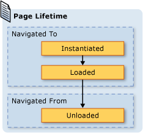  
  
 Хотя при использовании поведения журнала по умолчанию можно сэкономить потребление памяти, производительность отрисовки каждой страницы может уменьшиться; повторное создание экземпляров <xref:System.Windows.Controls.Page> может быть много времени, особенно в том случае, если он имеет много содержимого. Если необходимо сохранить <xref:System.Windows.Controls.Page> экземпляра в журнале, можно рисовать на два способа это сделать. Во-первых, можно осуществить программный переход к <xref:System.Windows.Controls.Page> путем вызова метода <xref:System.Windows.Navigation.NavigationService.Navigate%2A?displayProperty=nameWithType> метод.  
  
 Во-вторых, можно указать, что WPF сохранял экземпляр <xref:System.Windows.Controls.Page> в журнале, задав <xref:System.Windows.Controls.Page.KeepAlive%2A> свойства `true` (по умолчанию используется `false`). Как показано в следующем примере, можно задать <xref:System.Windows.Controls.Page.KeepAlive%2A> декларативно в разметке.  
  
 [!code-xaml[NavigationOverviewSnippets#KeepAlivePageXAML](~/samples/snippets/csharp/VS_Snippets_Wpf/NavigationOverviewSnippets/CSharp/KeepAlivePage.xaml#keepalivepagexaml)]  
  
 Время существования <xref:System.Windows.Controls.Page> это поддерживается в активном состоянии, немного отличается от другой — нет. В первый раз <xref:System.Windows.Controls.Page> , остается активным осуществляется переход, так же, как создается экземпляр <xref:System.Windows.Controls.Page> , не сохраняется. Тем не менее так как экземпляр <xref:System.Windows.Controls.Page> сохраняется в журнале, он никогда не инициализируется повторно для до тех пор, пока он остается в журнале. Следовательно Если <xref:System.Windows.Controls.Page> имеет логику инициализации, который должен вызываться каждый раз <xref:System.Windows.Controls.Page> к которому осуществляется переход, следует переместить ее из конструктора в обработчик для <xref:System.Windows.FrameworkElement.Loaded> событий. Как показано на следующем рисунке, <xref:System.Windows.FrameworkElement.Loaded> и <xref:System.Windows.FrameworkElement.Unloaded> события по-прежнему вызываются каждый раз <xref:System.Windows.Controls.Page> осуществляется переход и обратно, соответственно.  
  
 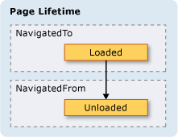  
  
 Когда <xref:System.Windows.Controls.Page> — не поддерживается в активном состоянии, можно выполнять одно из следующих:  
  
-   Сохранять ссылку или любую его часть.  
  
-   Регистрировать обработчики событий с событиями, которые не реализованы в объекте.  
  
 Выполнения любой из этих действий будут созданы ссылки, которые вынудят <xref:System.Windows.Controls.Page> должно храниться в памяти, даже в том случае, если он был удален из журнала.  
  
 В общем случае следует отдавать предпочтение по умолчанию <xref:System.Windows.Controls.Page> поведение не <xref:System.Windows.Controls.Page> проверки активности. Однако при этом существуют реализации состояния, которые описаны в следующем разделе.  
  
   
### Сохранение состояния содержимого с помощью журнала переходов  
 Если <xref:System.Windows.Controls.Page> не поддерживаться в рабочем состоянии, но имеет элементы управления, которые собирают данные от пользователя, что происходит с данными, если пользователь переходит с и обратно <xref:System.Windows.Controls.Page>? С точки зрения пользователя следует ожидать появления ранее введенных данных. К сожалению так как новый экземпляр класса <xref:System.Windows.Controls.Page> создается при каждом переходе, элементы управления, что собранные данные, инициализируются заново и данные будут потеряны.  
  
 К счастью, журнал обеспечивает запоминание данных через <xref:System.Windows.Controls.Page> при переходах, включая данные элементов управления. В частности, записи журнала для каждого <xref:System.Windows.Controls.Page> действует как временный контейнер для связанного <xref:System.Windows.Controls.Page> состояния. Ниже показано, как используется эта поддержка при <xref:System.Windows.Controls.Page> перехода из:  
  
1. Запись для текущего <xref:System.Windows.Controls.Page> добавляется в журнал.  
  
2. Состояние <xref:System.Windows.Controls.Page> хранится в записи журнала для этой страницы, которая добавляется в стек переходов назад.  
  
3. Новый <xref:System.Windows.Controls.Page> , к которому осуществляется переход.  
  
 Если страницы <xref:System.Windows.Controls.Page> будет осуществлен переход обратно, с помощью журнала, выполняются следующие действия:  
  
1. <xref:System.Windows.Controls.Page> Создается (самая верхняя запись журнала в стеке переходов назад).  
  
2. <xref:System.Windows.Controls.Page> Обновляется с состоянием, которое было сохранено в записи журнала для <xref:System.Windows.Controls.Page>.  
  
3. <xref:System.Windows.Controls.Page> Выполняется переход к.  
  
 WPF автоматически использует эту поддержку, при использовании следующих элементов управления на <xref:System.Windows.Controls.Page>:  
  
-   <xref:System.Windows.Controls.CheckBox>  
  
-   <xref:System.Windows.Controls.ComboBox>  
  
-   <xref:System.Windows.Controls.Expander>  
  
-   <xref:System.Windows.Controls.Frame>  
  
-   <xref:System.Windows.Controls.ListBox>  
  
-   <xref:System.Windows.Controls.ListBoxItem>  
  
-   <xref:System.Windows.Controls.MenuItem>  
  
-   <xref:System.Windows.Controls.ProgressBar>  
  
-   <xref:System.Windows.Controls.RadioButton>  
  
-   <xref:System.Windows.Controls.Slider>  
  
-   <xref:System.Windows.Controls.TabControl>  
  
-   <xref:System.Windows.Controls.TabItem>  
  
-   <xref:System.Windows.Controls.TextBox>  
  
 Если <xref:System.Windows.Controls.Page> использует эти элементы управления, содержащиеся в них данные запоминаются при <xref:System.Windows.Controls.Page> при переходах, как показано **любимого цвета** <xref:System.Windows.Controls.ListBox> на следующем рисунке.  
  
 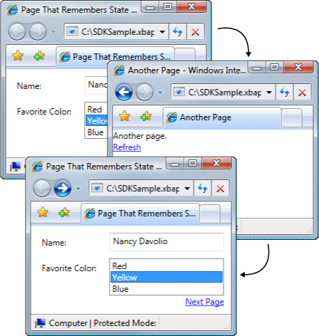  
  
 Когда <xref:System.Windows.Controls.Page> имеет элементы управления, не упомянутые в предыдущем списке, или когда состояние сохраняется в пользовательских объектах, необходимо написать код для сохранения в журнале состояния <xref:System.Windows.Controls.Page> переходов.  
  
 Если необходимо запомнить небольшие части состояния <xref:System.Windows.Controls.Page> при переходах, можно использовать свойства зависимостей (см. в разделе <xref:System.Windows.DependencyProperty>), настроенные с помощью <xref:System.Windows.FrameworkPropertyMetadata.Journal%2A?displayProperty=nameWithType> флаг метаданных.  
  
 Если состояние, ваш <xref:System.Windows.Controls.Page> необходимо запомнить при переходах состоит из нескольких фрагментов данных, может оказаться меньше кода с большим объемом инкапсуляцию состояния в одном классе и реализовать <xref:System.Windows.Navigation.IProvideCustomContentState> интерфейс.  
  
 Если вам необходимо перейти по различным состояниям одного <xref:System.Windows.Controls.Page>, не переходя с <xref:System.Windows.Controls.Page> , можно использовать <xref:System.Windows.Navigation.IProvideCustomContentState> и <xref:System.Windows.Navigation.NavigationService.AddBackEntry%2A?displayProperty=nameWithType>.  
  
   
### Файлы cookie  
 Другим образом, как WPF приложения могут хранить данные с помощью файлов cookie, которые создаются, обновляются и удалить с помощью <xref:System.Windows.Application.SetCookie%2A> и <xref:System.Windows.Application.GetCookie%2A> методы. Файлы cookie, можно создать в WPF будут использовать другие виды веб-приложений это те же cookie; файлы cookie представляют собой произвольные фрагменты данных, которые хранятся в приложении на клиентском компьютере во время или между сеансами приложения. Данные файлов cookie обычно представлены в форме пары "имя — значение" в следующем формате.  
  
 *имя* `=` *значение*  
  
 При передаче данных <xref:System.Windows.Application.SetCookie%2A>, вместе с <xref:System.Uri> расположения, для которого задается файл cookie, файл cookie создается в памяти, и он доступен только в течение текущего сеанса приложения. Этот тип файла cookie называется *файл cookie сеанса*.  
  
 Чтобы сохранить файл cookie на протяжении нескольких сеансов приложения, необходимо добавить в файл cookie дату окончания срока действия, используя следующий формат.  
  
 *ИМЯ* `=` *ЗНАЧЕНИЕ* `; expires=DAY, DD-MMM-YYYY HH:MM:SS GMT`  
  
 Файл cookie с датой окончания срока действия хранится в текущем Windows папке временных файлов Интернета для установки до истечения срока действия файла cookie. Такой файл cookie называется *постоянный файл cookie* так, как он сохраняется между сеансами приложения.  
  
 Получить сеанс и постоянные файлы cookie, вызвав <xref:System.Windows.Application.GetCookie%2A> , передавая <xref:System.Uri> расположения, где был задан файл cookie с <xref:System.Windows.Application.SetCookie%2A> метод.  
  
 Ниже приведены некоторые способы поддержки файлов cookie в WPF:  
  
-   WPF Автономные приложения и XBAP можно создать и управлении файлами cookie.  
  
-   Файлы cookie, создаваемых с XBAP можно получить из браузера.  
  
-   XBAP на том же домене можно создавать и совместно использовать файлы cookie.  
  
-   XBAP и HTML страниц из одного домена можно создавать и совместно использовать файлы cookie.  
  
-   Файлы cookie отправляются при XBAP и свободные XAML страниц создания веб-запросов.  
  
-   Оба верхнего уровня XBAP и XBAP размещенные в IFRAMES доступны файлы cookie.  
  
-   Поддержка файлов cookie в WPF одинаков для всех поддерживаемых браузерах.  
  
-   В Internet Explorer, политика P3P, которая относится к файлам cookie, соблюдается системой WPF, особенно в отношении Майкрософт и сторонних XBAP.  
  
   
### Структурная навигация  
 Если вам нужно передать данные из одного <xref:System.Windows.Controls.Page> в другую, можно передать данные как аргументы конструктора не по умолчанию <xref:System.Windows.Controls.Page>. Обратите внимание, что если вы используете этот способ, то необходимо поддерживать <xref:System.Windows.Controls.Page> активном состоянии; Если нет, в следующий раз, перейдите к <xref:System.Windows.Controls.Page>, WPF заново создается <xref:System.Windows.Controls.Page> с помощью конструктора по умолчанию.  
  
 Кроме того ваши <xref:System.Windows.Controls.Page> можно реализовать свойства, заданные с данными, которые необходимо передать. Все усложняется тем не менее, если <xref:System.Windows.Controls.Page> требуется для передачи данных обратно в <xref:System.Windows.Controls.Page> , приводящую к нему. Проблема в том, что изначально переходы не поддерживают механизмы, гарантирующие, что <xref:System.Windows.Controls.Page> возвращается после перехода из него. По существу переходы не поддерживают семантику вызова/возврата. Чтобы решить эту проблему, WPF предоставляет <xref:System.Windows.Navigation.PageFunction%601> класс, который можно использовать, чтобы убедиться, что <xref:System.Windows.Controls.Page> возвращается в прогнозируемом и структурированном виде. Дополнительные сведения см. в разделе [Общие сведения о структурной навигации](structured-navigation-overview.md).  
  
   
## Класс NavigationWindow  
 К этому моменту мы рассмотрели целый ряд служб переходов, которые с наибольшей вероятностью будут использоваться для построения приложений с содержимым, допускающим переходы. Эти службы обсуждались в контексте XBAP, несмотря на то, что они не ограничиваются XBAP. Воспользуйтесь преимуществами опыт работы современных пользователей для включения навигации в стиле браузера в автономные приложения, современные операционные системы и приложений Windows. Вот наиболее распространенные примеры.  
  
-   **Word тезауруса**: Переход по вариантам слов.  
  
-   **Обозреватель файлов**: Просмотр файлов и папок.  
  
-   **Мастеры**: Разбиение сложной задачи на несколько страниц, которые можно перемещаться. Например, мастер компонентов Windows, который обрабатывает добавление и удаление компонентов Windows.  
  
 Включение навигации в стиле браузера в автономных приложениях, можно использовать <xref:System.Windows.Navigation.NavigationWindow> класса. <xref:System.Windows.Navigation.NavigationWindow> является производным от <xref:System.Windows.Window> и расширяет его такой же поддержкой навигации, XBAP предоставить. Можно использовать <xref:System.Windows.Navigation.NavigationWindow> как главное окно автономного приложения или как дополнительное окно, например диалоговое окно.  
  
 Для реализации <xref:System.Windows.Navigation.NavigationWindow>, как и в случае с классами самого верхнего уровня в WPF (<xref:System.Windows.Window>, <xref:System.Windows.Controls.Page>, и так далее), используйте комбинацию разметки и кода. Эти действия показаны в следующем примере.  
  
 [!code-xaml[IntroToNavNavigationWindowSnippets#NavigationWindowMARKUP](~/samples/snippets/csharp/VS_Snippets_Wpf/IntroToNavNavigationWindowSnippets/CSharp/MainWindow.xaml#navigationwindowmarkup)]  
  
 [!code-csharp[IntroToNavNavigationWindowSnippets#NavigationWindowCODEBEHIND](~/samples/snippets/csharp/VS_Snippets_Wpf/IntroToNavNavigationWindowSnippets/CSharp/MainWindow.xaml.cs#navigationwindowcodebehind)]
   
  
 Этот код создает <xref:System.Windows.Navigation.NavigationWindow> , автоматически переходит к <xref:System.Windows.Controls.Page> (HomePage.xaml) при <xref:System.Windows.Navigation.NavigationWindow> открыт. Если <xref:System.Windows.Navigation.NavigationWindow> является главное окно приложения, можно использовать `StartupUri` атрибут, чтобы запустить его. Это показано в следующем примере разметки.  
  
 [!code-xaml[IntroToNavNavigationWindowSnippets#AppLaunchNavWindow](~/samples/snippets/csharp/VS_Snippets_Wpf/IntroToNavNavigationWindowSnippets/CSharp/App.xaml#applaunchnavwindow)]  
  
 На следующем рисунке показан <xref:System.Windows.Navigation.NavigationWindow> как главное окно автономного приложения.  
  
 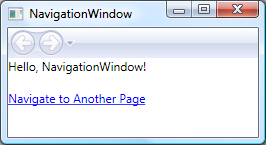  
  
 Из рисунка, можно увидеть, что <xref:System.Windows.Navigation.NavigationWindow> имеет заголовок, несмотря на то, что он не задан <xref:System.Windows.Navigation.NavigationWindow> реализации кода из предыдущего примера. Вместо этого заголовок задается с помощью <xref:System.Windows.Controls.Page.WindowTitle%2A> свойство, которое показано в следующем коде.  
  
 [!code-xaml[IntroToNavNavigationWindowSnippets#HomePageMARKUP1](~/samples/snippets/csharp/VS_Snippets_Wpf/IntroToNavNavigationWindowSnippets/CSharp/HomePage.xaml#homepagemarkup1)]  
[!code-xaml[IntroToNavNavigationWindowSnippets#HomePageMARKUP2](~/samples/snippets/csharp/VS_Snippets_Wpf/IntroToNavNavigationWindowSnippets/CSharp/HomePage.xaml#homepagemarkup2)]  
  
 Установка <xref:System.Windows.Controls.Page.WindowWidth%2A> и <xref:System.Windows.Controls.Page.WindowHeight%2A> свойства также влияет на <xref:System.Windows.Navigation.NavigationWindow>.  
  
 Обычно вы реализуете собственный <xref:System.Windows.Navigation.NavigationWindow> при необходимости настроить его поведение или внешний вид. Если вы этого не сделали, можно использовать команду быстрого вызова. Если указать пакет URI из <xref:System.Windows.Controls.Page> как <xref:System.Windows.Application.StartupUri%2A> в автономном приложении, <xref:System.Windows.Application> автоматически создает <xref:System.Windows.Navigation.NavigationWindow> узел <xref:System.Windows.Controls.Page>. В следующем примере разметки показано, как это сделать.  
  
 [!code-xaml[IntroToNavNavigationWindowSnippets#AppLaunchPage](~/samples/snippets/csharp/VS_Snippets_Wpf/IntroToNavNavigationWindowSnippets/CSharp/AnotherApp.xaml#applaunchpage)]  
  
 Если необходимо, чтобы дополнительное окно приложения например диалоговое окно, чтобы быть <xref:System.Windows.Navigation.NavigationWindow>, чтобы открыть его, можно использовать код в следующем примере.  
  
 [!code-csharp[IntroToNavNavigationWindowSnippets#CreateNWDialogBox](~/samples/snippets/csharp/VS_Snippets_Wpf/IntroToNavNavigationWindowSnippets/CSharp/DialogOwnerWindow.xaml.cs#createnwdialogbox)]
   
  
 На рисунке ниже показан результат.  
  
 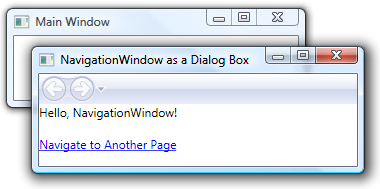  
  
 Как вы видите, <xref:System.Windows.Navigation.NavigationWindow> отображает Internet Explorer-стиль **обратно** и **вперед** кнопки, которые позволяют пользователям перемещаться по журналу. Эти кнопки предоставляют пользователям те же возможности, что показаны на следующем рисунке.  
  
   
  
 Если страницы предоставляют свои собственные поддержку перемещения по журналу и пользовательский Интерфейс, можно скрыть **обратно** и **вперед** кнопок, отображаемых по <xref:System.Windows.Navigation.NavigationWindow> , задав значение <xref:System.Windows.Navigation.NavigationWindow.ShowsNavigationUI%2A> свойства `false`.  
  
 Кроме того, можно использовать поддержку настройки в WPF для замены UI из <xref:System.Windows.Navigation.NavigationWindow> сам.  
  
   
## Класс Frame  
 Как обозреватель так и <xref:System.Windows.Navigation.NavigationWindow> представляют собой окна, предоставляющие содержимое. В некоторых случаях приложения имеют содержимое, которое не обязательно должно размещаться в целом окне. Такое содержимое помещается внутрь другого содержимого. Можно вставить содержимое с возможностью переходов в другое содержимое с помощью <xref:System.Windows.Controls.Frame> класса. <xref:System.Windows.Controls.Frame> предоставляет такую же поддержку как <xref:System.Windows.Navigation.NavigationWindow> и XBAP.  
  
 В следующем примере показано, как добавить <xref:System.Windows.Controls.Frame> для <xref:System.Windows.Controls.Page> декларативно с помощью `Frame` элемент.  
  
 [!code-xaml[NavigationOverviewSnippets#FrameHostPageXAML1](~/samples/snippets/csharp/VS_Snippets_Wpf/NavigationOverviewSnippets/CSharp/FrameHostPage.xaml#framehostpagexaml1)]  
[!code-xaml[NavigationOverviewSnippets#FrameHostPageXAML2](~/samples/snippets/csharp/VS_Snippets_Wpf/NavigationOverviewSnippets/CSharp/FrameHostPage.xaml#framehostpagexaml2)]  
[!code-xaml[NavigationOverviewSnippets#FrameHostPageXAML3](~/samples/snippets/csharp/VS_Snippets_Wpf/NavigationOverviewSnippets/CSharp/FrameHostPage.xaml#framehostpagexaml3)]  
  
 Эта разметка задает `Source` атрибут `Frame` элемент в пакет URI для <xref:System.Windows.Controls.Page> , <xref:System.Windows.Controls.Frame> должен перейти сначала. На следующем рисунке показан XBAP с <xref:System.Windows.Controls.Page> с <xref:System.Windows.Controls.Frame> , осуществляющий переходы между несколькими страницами.  
  
 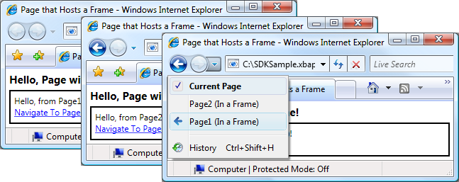  
  
 Вы не обязательно использовать только <xref:System.Windows.Controls.Frame> внутри содержимого <xref:System.Windows.Controls.Page>. Обычно для размещения <xref:System.Windows.Controls.Frame> внутри содержимого <xref:System.Windows.Window>.  
  
 По умолчанию <xref:System.Windows.Controls.Frame> использует собственный журнал только при отсутствии другого журнала. Если <xref:System.Windows.Controls.Frame> является частью содержимого, которое размещено внутри <xref:System.Windows.Navigation.NavigationWindow> или XBAP, <xref:System.Windows.Controls.Frame> использует журнал, который принадлежит <xref:System.Windows.Navigation.NavigationWindow> или XBAP. Иногда Однако <xref:System.Windows.Controls.Frame> может потребоваться отвечать за собственный журнал. Одна из причин для этого является необходимость разрешения переходов в журнале в этих страницах, расположенных на серверах <xref:System.Windows.Controls.Frame>. Это показано на следующем рисунке.  
  
   
  
 В этом случае можно настроить <xref:System.Windows.Controls.Frame> с помощью параметра собственный журнал <xref:System.Windows.Controls.Frame.JournalOwnership%2A> свойство <xref:System.Windows.Controls.Frame> для <xref:System.Windows.Navigation.JournalOwnership.OwnsJournal>. Это показано в следующем примере разметки.  
  
 [!code-xaml[NavigationOverviewSnippets#FrameHostPageOwnJournalXAML1](~/samples/snippets/csharp/VS_Snippets_Wpf/NavigationOverviewSnippets/CSharp/FrameHostPageOwnJournal.xaml#framehostpageownjournalxaml1)]  
[!code-xaml[NavigationOverviewSnippets#FrameHostPageOwnJournalXAML2](~/samples/snippets/csharp/VS_Snippets_Wpf/NavigationOverviewSnippets/CSharp/FrameHostPageOwnJournal.xaml#framehostpageownjournalxaml2)]  
[!code-xaml[NavigationOverviewSnippets#FrameHostPageOwnJournalXAML3](~/samples/snippets/csharp/VS_Snippets_Wpf/NavigationOverviewSnippets/CSharp/FrameHostPageOwnJournal.xaml#framehostpageownjournalxaml3)]  
  
 На следующем рисунке показано влияние перехода <xref:System.Windows.Controls.Frame> , использует собственный журнал.  
  
 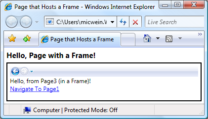  
  
 Обратите внимание, что записи журнала отображаются в области навигации UI в <xref:System.Windows.Controls.Frame>, а не с помощью Internet Explorer.  
  
> [!NOTE]
>  Если <xref:System.Windows.Controls.Frame> является частью содержимого, размещенного в <xref:System.Windows.Window>, <xref:System.Windows.Controls.Frame> использует собственный журнал и, следовательно, отображает собственный навигации UI.  
  
 Если вам требуется <xref:System.Windows.Controls.Frame> для предоставления собственный журнал без отображения панели навигации UI, можно скрыть навигации UI , задав <xref:System.Windows.Controls.Frame.NavigationUIVisibility%2A> для <xref:System.Windows.Visibility.Hidden>. Это показано в следующем примере разметки.  
  
 [!code-xaml[NavigationOverviewSnippets#FrameHostPageHidesUIXAML1](~/samples/snippets/csharp/VS_Snippets_Wpf/NavigationOverviewSnippets/CSharp/FrameHostPageOwnHiddenJournal.xaml#framehostpagehidesuixaml1)]  
[!code-xaml[NavigationOverviewSnippets#FrameHostPageHidesUIXAML2](~/samples/snippets/csharp/VS_Snippets_Wpf/NavigationOverviewSnippets/CSharp/FrameHostPageOwnHiddenJournal.xaml#framehostpagehidesuixaml2)]  
[!code-xaml[NavigationOverviewSnippets#FrameHostPageHidesUIXAML3](~/samples/snippets/csharp/VS_Snippets_Wpf/NavigationOverviewSnippets/CSharp/FrameHostPageOwnHiddenJournal.xaml#framehostpagehidesuixaml3)]  
  
   
## Узлы переходов  
 <xref:System.Windows.Controls.Frame> и <xref:System.Windows.Navigation.NavigationWindow> являются классами, которые известны как узлы переходов. Объект *узла навигации* является классом, который может перейти к содержимому и отобразить. В этой ситуации каждом узле переходов используются собственная <xref:System.Windows.Navigation.NavigationService> и журнала. На следующем рисунке показана основная структура узла переходов.  
  
   
  
 По сути, это позволяет <xref:System.Windows.Navigation.NavigationWindow> и <xref:System.Windows.Controls.Frame> обеспечить такую же поддержку переходов, XBAP предоставляет при размещении в браузере.  
  
 Помимо использования <xref:System.Windows.Navigation.NavigationService> и журнала, узлы переходов реализуют те же члены, <xref:System.Windows.Navigation.NavigationService> реализует. Это показано на следующем рисунке.  
  
   
  
 Это позволяет программировать поддержку переходов непосредственно с ними. Это можно использовать, если необходимо предоставить навигации UI для <xref:System.Windows.Controls.Frame> , размещенного в <xref:System.Windows.Window>. Кроме того, оба типа реализуют дополнительные, связанных с навигацией члены, включая `BackStack` (<xref:System.Windows.Navigation.NavigationWindow.BackStack%2A?displayProperty=nameWithType>, <xref:System.Windows.Controls.Frame.BackStack%2A?displayProperty=nameWithType>) и `ForwardStack` (<xref:System.Windows.Navigation.NavigationWindow.ForwardStack%2A?displayProperty=nameWithType>, <xref:System.Windows.Controls.Frame.ForwardStack%2A?displayProperty=nameWithType>), которые позволяют перебирать записи журнала в серверной части стек и переслать стека, соответственно.  
  
 Как упоминалось ранее, в приложении может существовать несколько журналов. На следующем рисунке показано пример, когда это возможно.  
  
   
  
   
## Переход к содержимому, отличному от страниц XAML  
 В этом разделе <xref:System.Windows.Controls.Page> и пакет XBAP использовался для демонстрируют различные возможности переходов WPF. Тем не менее <xref:System.Windows.Controls.Page> то есть скомпилированный в приложение не является единственным типом содержимого, к которому можно осуществить переход и пакет XBAP — не единственный способ определения содержимого.  
  
 Как показано в этом разделе, можно также осуществлять переходы к свободным XAML файлы, HTML файлы и объекты.  
  
   
### Переход к свободным файлам XAML  
 Свободный XAML файл является файлом со следующими характеристиками:  
  
-   Содержит только XAML (то есть без кода).  
  
-   имеет объявление соответствующего пространства имен;  
  
-   имя файла имеет расширение XAML.  
  
 Например, рассмотрим следующее содержимое, сохраненное как свободный XAML файле Person.xaml.  
  
 [!code-xaml[NavigationOverviewSnippets#LooseXAML](~/samples/snippets/csharp/VS_Snippets_Wpf/NavigationOverviewSnippets/CSharp/Person.xaml#loosexaml)]  
  
 Если дважды щелкнуть файл, браузер откроется, выполнит переход к содержимому и отобразит его. Это показано на следующем рисунке.  
  
 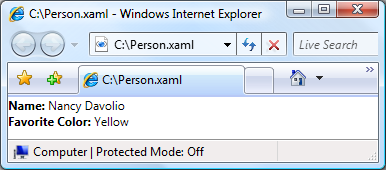  
  
 Можно отобразить свободный XAML файл из следующего:  
  
-   веб-узел на локальном компьютере, в интрасети или Интернете;  
  
-   Объект [!INCLUDE[TLA#tla_unc](../../../../includes/tlasharptla-unc-md.md)] общую папку.  
  
-   локальный диск.  
  
 Свободный XAML файл можно добавить в Избранное браузера или сделать домашней страницей браузера.  
  
> [!NOTE]
>  Дополнительные сведения о публикации и запуске свободных XAML страниц, см. в разделе [развертывание приложений WPF](deploying-a-wpf-application-wpf.md).  
  
 Единственным ограничением в отношении свободных XAML является возможность размещения только содержимое, которое безопасно для запуска в режиме частичного доверия. Например `Window` не может быть корневым элементом свободного XAML файл. Дополнительные сведения см. в разделе [Безопасность частичного доверия в WPF](../wpf-partial-trust-security.md).  
  
   
### Переход к файлам HTML элемента управления Frame  
 Как можно догадаться, можно также перейти к HTML. Необходимо просто предоставить URI , используется схема http. Например, следующая XAML показывает <xref:System.Windows.Controls.Frame> , осуществляющий переход к HTML страницы.  
  
 [!code-xaml[NavigationOverviewSnippets#FrameHtmlNavMARKUP](~/samples/snippets/csharp/VS_Snippets_Wpf/NavigationOverviewSnippets/CSharp/FrameHTMLNavPage.xaml#framehtmlnavmarkup)]  
  
 Переход к HTML требуются специальные разрешения. Например, нельзя перейти из XBAP , запущенного в песочнице безопасности частичного доверия для зоны Интернета. Дополнительные сведения см. в разделе [Безопасность частичного доверия в WPF](../wpf-partial-trust-security.md).  
  
   
### Переход к файлам HTML с помощью элемента управления WebBrowser  
 <xref:System.Windows.Controls.WebBrowser> Управления поддерживает HTML размещение документов, навигации и скриптов и управляемого кода взаимодействия. Подробные сведения о <xref:System.Windows.Controls.WebBrowser> управления, см. в разделе <xref:System.Windows.Controls.WebBrowser>.  
  
 Как и <xref:System.Windows.Controls.Frame>, переходе по адресу HTML с помощью <xref:System.Windows.Controls.WebBrowser> требуются специальные разрешения. Например, из приложений с частичным доверием можно перейти только к HTML расположенный на исходном узле. Дополнительные сведения см. в разделе [Безопасность частичного доверия в WPF](../wpf-partial-trust-security.md).  
  
   
### Переход к пользовательским объектам  
 Если у вас есть данные, которые хранятся в виде пользовательских объектов, один из способов отображения этих данных является создание <xref:System.Windows.Controls.Page> с содержимым, привязанным к таким объектам (см. в разделе [Общие сведения о привязке данных](../data/data-binding-overview.md)). Если не требуется создание всей страницы только для отображения объектов, то можно перейти непосредственно к ним.  
  
 Рассмотрите возможность `Person` класс, который реализуется в следующем коде.  
  
 [!code-csharp[NavigateToObjectSnippets#PersonClassCODE](~/samples/snippets/csharp/VS_Snippets_Wpf/NavigateToObjectSnippets/CSharp/Person.cs#personclasscode)]
   
  
 Для перехода к нему вызовите <xref:System.Windows.Navigation.NavigationWindow.Navigate%2A?displayProperty=nameWithType> метод, как показано в следующем примере кода.  
  
 [!code-xaml[NavigateToObjectSnippets#PageThatNavsToObject1](~/samples/snippets/csharp/VS_Snippets_Wpf/NavigateToObjectSnippets/CSharp/HomePage.xaml#pagethatnavstoobject1)]  
[!code-xaml[NavigateToObjectSnippets#PageThatNavsToObject2](~/samples/snippets/csharp/VS_Snippets_Wpf/NavigateToObjectSnippets/CSharp/HomePage.xaml#pagethatnavstoobject2)]  
[!code-xaml[NavigateToObjectSnippets#PageThatNavsToObject3](~/samples/snippets/csharp/VS_Snippets_Wpf/NavigateToObjectSnippets/CSharp/HomePage.xaml#pagethatnavstoobject3)]  
  
 [!code-csharp[NavigateToObjectSnippets#PageThatNavsToObjectCODEBEHIND](~/samples/snippets/csharp/VS_Snippets_Wpf/NavigateToObjectSnippets/CSharp/HomePage.xaml.cs#pagethatnavstoobjectcodebehind)]
   
  
 На рисунке ниже показан результат.  
  
 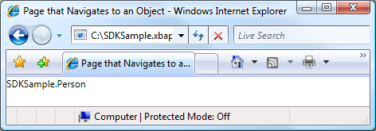  
  
 Из этого рисунка можно видеть, что ничего полезного не отобразилось. На самом деле, возвращаемое значение — это значение, которое отображается `ToString` метод **Person** объекта; по умолчанию это единственное значение, которое WPF можно использовать для представления объекта. Можно переопределить `ToString` метод для возврата более значимой информации, несмотря на то, что он будет по-прежнему быть только строковым значением. Один из методов, воспользуйтесь преимуществами возможностей представления WPF является использование шаблона данных. Можно реализовать шаблон данных, WPF можно связать с объектом определенного типа. В следующем коде показано шаблон данных для `Person` объекта.  
  
 [!code-xaml[NavigateToObjectSnippets#DataTemplateMARKUP](~/samples/snippets/csharp/VS_Snippets_Wpf/NavigateToObjectSnippets/CSharp/App.xaml#datatemplatemarkup)]  
  
 Здесь шаблон данных связан с `Person` типа с помощью `x:Type` расширение разметки в `DataType` атрибута. Затем шаблон данных привязывает `TextBlock` элементов (см. в разделе <xref:System.Windows.Controls.TextBlock>) к свойствам `Person` класса. На следующем рисунке показан обновленный внешний вид `Person` объекта.  
  
   
  
 Преимуществом этого способа является связность, которая обеспечивается возможностью повторного использования шаблона данных для согласованного отображения объектов в любом месте приложения.  
  
 Дополнительные сведения о шаблонах данных см. в разделе [Общие сведения о шаблонах данных](../data/data-templating-overview.md).  
  
   
## Безопасность  
 WPF Поддержка навигации позволяет XBAP осуществлять переходы через Интернет, а также позволяет приложениям сторонних размещения содержимого. Для защиты приложений и пользователей от опасных WPF предоставляет широкий набор функций безопасности, которые рассматриваются в [безопасности](../security-wpf.md) и [Безопасность частичного доверия WPF](../wpf-partial-trust-security.md).  
  
## См. также

- <xref:System.Windows.Application.SetCookie%2A>
- <xref:System.Windows.Application.GetCookie%2A>
- [Общие сведения об управлении приложением](application-management-overview.md)
- [URI типа "pack" в WPF](pack-uris-in-wpf.md)
- [Общие сведения о структурной навигации](structured-navigation-overview.md)
- [Общие сведения о топологии переходов](navigation-topologies-overview.md)
- [Практические руководства](navigation-how-to-topics.md)
- [Развертывание приложения WPF](deploying-a-wpf-application-wpf.md)
