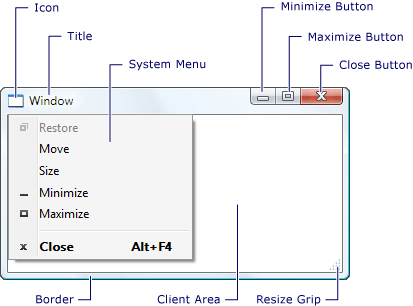
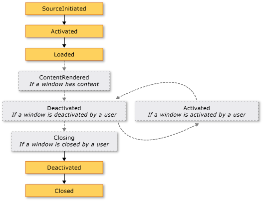
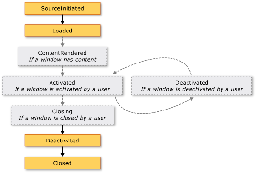
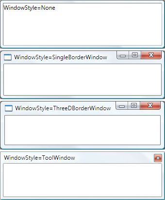

# <a name="wpf-windows-overview"></a>Общие сведения об окнах WPF
Пользователи взаимодействуют с Windows Presentation Foundation (WPF) автономных приложений с помощью windows. Основная цель окна — разместить содержимое, которое визуализирует данные и позволяет пользователям взаимодействовать с ними. Автономный WPF приложения предоставляют собственные окна с помощью <xref:System.Windows.Window> класса. В данном разделе представлены <xref:System.Windows.Window> затем освещаются основы создания и управления окнами в автономных приложениях.  
  
> [!NOTE]
>  Браузерные WPF приложений, включая XAML-приложения браузера (XBAP) и свободные [!INCLUDE[TLA#tla_xaml](../../../../includes/tlasharptla-xaml-md.md)] страниц, не предоставляют собственных окон. Вместо этого они размещаются в окнах, предоставляемых [!INCLUDE[TLA#tla_iegeneric](../../../../includes/tlasharptla-iegeneric-md.md)]. См. в разделе [Общие сведения о приложениях браузера WPF XAML](wpf-xaml-browser-applications-overview.md).  

<a name="TheWindowClass"></a>   
## <a name="the-window-class"></a>Класс окна  
 На следующем рисунке показана составляющие части окна:  
  
   
  
 Окно разделено на две области: неклиентскую и клиентскую.  
  
 *Неклиентской области* окна реализуется WPF и включает части окна, которые являются общими для большинства окон, включая следующие:  
  
-   Граница.  
  
-   Заголовок окна.  
  
-   Значок.  
  
-   Кнопки "Свернуть", "Развернуть" и "Восстановить".  
  
-   Кнопка "Закрыть".  
  
-   Системное меню с элементами, которые позволяют пользователям свернуть, развернуть, восстановить, перемещать, изменять размеры и закрыть окно.  
  
 *Клиентской области* окна находится внутри неклиентской области окна и используется разработчиками для добавления содержимого конкретного приложения, такие как строки меню, панелей инструментов и элементов управления.  
  
 В WPF, окно инкапсулируется <xref:System.Windows.Window> класс, который используется для следующих целей:  
  
-   Отобразить окно.  
  
-   Настроить размер, положение и внешний вид окна.  
  
-   Разместить содержимое конкретного приложения.  
  
-   Управлять временем существования окна.  
  
<a name="DefiningAWindow"></a>   
## <a name="implementing-a-window"></a>Реализация окна  
 Реализация типичного окна включает внешний вид и поведение, где *внешний вид* определяет, как окно отображается для пользователей и *поведение* определяет функционирование окна при взаимодействии пользователей с ним. В WPF, вы можете реализовать внешний вид и поведение окна с помощью кода, либо или [!INCLUDE[TLA2#tla_xaml](../../../../includes/tla2sharptla-xaml-md.md)] разметки.  
  
 Как правило, тем не менее, внешний вид окна реализуется с помощью [!INCLUDE[TLA2#tla_xaml](../../../../includes/tla2sharptla-xaml-md.md)] разметки, а его поведение реализуется с помощью кода программной части, как показано в следующем примере.  
  
 [!code-xaml[WindowsOverviewSnippets#MarkupAndCodeBehindWindowMARKUP](~/samples/snippets/csharp/VS_Snippets_Wpf/WindowsOverviewSnippets/CSharp/MarkupAndCodeBehindWindow.xaml#markupandcodebehindwindowmarkup)]  
  
 [!code-csharp[WindowsOverviewSnippets#MarkupAndCodeBehindWindowCODEBEHIND](~/samples/snippets/csharp/VS_Snippets_Wpf/WindowsOverviewSnippets/CSharp/MarkupAndCodeBehindWindow.xaml.cs#markupandcodebehindwindowcodebehind)]
   
  
 Чтобы включить [!INCLUDE[TLA2#tla_xaml](../../../../includes/tla2sharptla-xaml-md.md)] файла разметки и файл с выделенным кодом для совместной работы, необходимо выполнение следующих условий:  
  
-   В разметке `Window` элемент должен включать `x:Class` атрибута. При построении приложения существование `x:Class` в разметке вызывает файл [!INCLUDE[TLA#tla_msbuild](../../../../includes/tlasharptla-msbuild-md.md)] для создания `partial` класс, производный от <xref:System.Windows.Window> и имеет имя, которое задается параметром `x:Class` атрибута. Это требует добавления параметра [!INCLUDE[TLA2#tla_xml](../../../../includes/tla2sharptla-xml-md.md)] объявление пространства имен для [!INCLUDE[TLA2#tla_xaml](../../../../includes/tla2sharptla-xaml-md.md)] схемы ( `xmlns:x="http://schemas.microsoft.com/winfx/2006/xaml"` ). Созданный `partial` класс реализует `InitializeComponent` метод, который вызывается для регистрации событий и задания свойств, реализованных в разметке.  
  
-   В коде программной части класс должен быть `partial` класс с тем же именем, который задается параметром `x:Class` атрибут в разметке и он должен быть производным от <xref:System.Windows.Window>. Это позволяет файл кода должно быть связано с `partial` класса, созданного для файла разметки при построении приложения (см. в разделе [построение приложения WPF](building-a-wpf-application-wpf.md)).  
  
-   В коде программной части <xref:System.Windows.Window> класс должен реализовывать конструктор, который вызывает `InitializeComponent` метод. `InitializeComponent` реализуется разметки созданным файлом `partial` класс для регистрации событий и задания свойств, которые определены в разметке.  
  
> [!NOTE]
>  При добавлении нового <xref:System.Windows.Window> в проект с помощью [!INCLUDE[TLA#tla_visualstu](../../../../includes/tlasharptla-visualstu-md.md)], <xref:System.Windows.Window> реализуется с помощью разметки и кода и включает необходимую конфигурацию для создания связи между файлами разметки и кода как описанные здесь.  
  
 При такой конфигурации можно сосредоточиться на определении внешнего вида окна в [!INCLUDE[TLA2#tla_xaml](../../../../includes/tla2sharptla-xaml-md.md)] разметки и реализации его поведения в коде. В следующем примере показано окно с кнопкой, реализованной в [!INCLUDE[TLA2#tla_xaml](../../../../includes/tla2sharptla-xaml-md.md)] разметки и обработчик событий для кнопки <xref:System.Windows.Controls.Primitives.ButtonBase.Click> событий, реализован в коде.  
  
 [!code-xaml[WindowsOverviewWindowWithButtonSnippets#MarkupAndCodeBehindWindowMARKUP](~/samples/snippets/csharp/VS_Snippets_Wpf/WindowsOverviewWindowWithButtonSnippets/CSharp/MarkupAndCodeBehindWindow.xaml#markupandcodebehindwindowmarkup)]  
  
 [!code-csharp[WindowsOverviewWindowWithButtonSnippets#MarkupAndCodeBehindWindowCODEBEHIND](~/samples/snippets/csharp/VS_Snippets_Wpf/WindowsOverviewWindowWithButtonSnippets/CSharp/MarkupAndCodeBehindWindow.xaml.cs#markupandcodebehindwindowcodebehind)]
   
  
<a name="ConfiguringWindowForMSBuild"></a>   
## <a name="configuring-a-window-definition-for-msbuild"></a>Настройка определения окна для MSBuild  
 Реализация окна определяет его конфигурацию для [!INCLUDE[TLA2#tla_msbuild](../../../../includes/tla2sharptla-msbuild-md.md)]. Для окна, которое определяется с помощью [!INCLUDE[TLA2#tla_xaml](../../../../includes/tla2sharptla-xaml-md.md)] разметки и кода:  
  
-   [!INCLUDE[TLA2#tla_xaml](../../../../includes/tla2sharptla-xaml-md.md)] файлы разметки настраиваются как [!INCLUDE[TLA2#tla_msbuild](../../../../includes/tla2sharptla-msbuild-md.md)]`Page` элементов.  
  
-   Файлы кода программной части настраиваются как [!INCLUDE[TLA2#tla_msbuild](../../../../includes/tla2sharptla-msbuild-md.md)]`Compile` элементов.  
  
 Это показано в следующем [!INCLUDE[TLA2#tla_msbuild](../../../../includes/tla2sharptla-msbuild-md.md)] файл проекта.  
  
```xml  
<Project ...  
                xmlns="http://schemas.microsoft.com/developer/msbuild/2003">  
    ...  
    <Page Include="MarkupAndCodeBehindWindow.xaml" />  
    <Compile Include=" MarkupAndCodeBehindWindow.xaml.cs" />  
    ...  
</Project>  
```  
  
 Сведения о построении WPF приложений, см. в разделе [построение приложения WPF](building-a-wpf-application-wpf.md).  
  
<a name="WindowLifetime"></a>   
## <a name="window-lifetime"></a>Время существования окна  
 Как и любой класс, окно имеет время существования, которое начинается с момента создания его экземпляра, после чего оно открывается, активируется, деактивируется и, в конечном счете, закрывается.  

<a name="Opening_a_Window"></a>   
### <a name="opening-a-window"></a>Открытие окна  
 Чтобы открыть окно, сначала создайте его экземпляр, как показано в следующем примере.  
  
 [!code-xaml[WindowsOverviewStartupEventSnippets#AppMARKUP](~/samples/snippets/csharp/VS_Snippets_Wpf/WindowsOverviewStartupEventSnippets/CSharp/App.xaml#appmarkup)]  
  
 [!code-csharp[WindowsOverviewStartupEventSnippets#AppCODEBEHIND](~/samples/snippets/csharp/VS_Snippets_Wpf/WindowsOverviewStartupEventSnippets/CSharp/App.xaml.cs#appcodebehind)]  
  
 В этом примере `MarkupAndCodeBehindWindow` создается при запуске приложения, который происходит при <xref:System.Windows.Application.Startup> события.  
  
 При создании экземпляра окна, ссылку на него автоматически добавляется в список windows под управлением <xref:System.Windows.Application> объекта (см. в разделе <xref:System.Windows.Application.Windows%2A?displayProperty=nameWithType>). Кроме того, первое окно для создания экземпляра по умолчанию задается <xref:System.Windows.Application> как главное окно приложения (см. в разделе <xref:System.Windows.Application.MainWindow%2A?displayProperty=nameWithType>).  
  
 Наконец, открывается окно путем вызова <xref:System.Windows.Window.Show%2A> метода; результат показан на рисунке ниже.  
  
   
  
 Окно, которое открывается путем вызова <xref:System.Windows.Window.Show%2A> безрежимным окном, это означает, что приложение работает в режиме, который позволяет пользователям активировать и другие окна в одном приложении.  
  
> [!NOTE]
>  <xref:System.Windows.Window.ShowDialog%2A> вызывается для открытия окна, такие как диалоговые окна в модальном режиме. См. в разделе [Общие сведения о полях диалогового окна](dialog-boxes-overview.md) Дополнительные сведения.  
  
 Когда <xref:System.Windows.Window.Show%2A> является именем, окно выполняет работу по инициализации, перед его отображением Чтобы установить инфраструктуру, которая позволяет принимать ввод данных пользователем. При инициализации окна <xref:System.Windows.Window.SourceInitialized> события и отображения окна.  
  
 Для быстрого вызова <xref:System.Windows.Application.StartupUri%2A> можно задать, чтобы указать первое окно, которое открывается автоматически при запуске приложения.  
  
 [!code-xaml[WindowsOverviewSnippets#ApplicationStartupUriMARKUP](~/samples/snippets/csharp/VS_Snippets_Wpf/WindowsOverviewSnippets/CSharp/App.xaml#applicationstartupurimarkup)]  
  
 При запуске приложения окном, заданным параметром значение <xref:System.Windows.Application.StartupUri%2A> открывается немодальном режиме; внутри окно открывается путем вызова его <xref:System.Windows.Window.Show%2A> метод.  
  
<a name="Ownership"></a>   
#### <a name="window-ownership"></a>Владение окном  
 Окно, которое открывается с помощью <xref:System.Windows.Window.Show%2A> метод не имеет неявной связи с окном, которое он создан; пользователи могут взаимодействовать с любым из окон независимо от другого, это означает, что любое окно может выполнять следующее:  
  
-   Перекрывать другое (если только одно из окон не имеет его <xref:System.Windows.Window.Topmost%2A> свойство значение `true`).  
  
-   Сворачиваться, разворачиваться и восстанавливаться без влияния на другое окно.  
  
 Для некоторых окон требуется связь с окном, которое их открывает. Например [!INCLUDE[TLA#tla_ide](../../../../includes/tlasharptla-ide-md.md)] приложение может открывать окна свойств и окна инструментов, типичное поведение которых перекрыть окно, которое их создает. Кроме того, такие окна должны всегда закрываться, сворачиваться, разворачиваться и восстанавливаться вместе с окном, которое их создало. Такую связь можно установить, сделав одно окно *собственные* другой и можно сделать путем установки <xref:System.Windows.Window.Owner%2A> свойство *собственного окна* со ссылкой на *владельца окно*. Эти действия показаны в следующем примере.  
  
 [!code-csharp[WindowOwnerOwnedWindowsSnippets#SetWindowOwnerCODE](~/samples/snippets/csharp/VS_Snippets_Wpf/WindowOwnerOwnedWindowsSnippets/CSharp/MainWindow.xaml.cs#setwindowownercode)]
   
  
 После установки владения:  
  
-   Окно во владении может ссылаться на окно-владелец, проверяя значение его <xref:System.Windows.Window.Owner%2A> свойство.  
  
-   Окно-владелец может обнаруживать все окна, окна, проверив значение его <xref:System.Windows.Window.OwnedWindows%2A> свойство.  
  
<a name="Preventing"></a>   
#### <a name="preventing-window-activation"></a>Предотвращение активации окна  
 Существуют сценарии, где windows не должны активироваться при отображении, например диалог windows messenger стиле интернет-приложения или окна уведомлений приложения электронной почты.  
  
 Если приложение содержит окно, которое не должно активироваться при отображении, можно задать его <xref:System.Windows.Window.ShowActivated%2A> свойства `false` перед вызовом <xref:System.Windows.Window.Show%2A> метода в первый раз. Результат:  
  
-   Окно не активируется.  
  
-   Окна <xref:System.Windows.Window.Activated> событие не происходит.  
  
-   Текущее активированное окно останется активным.  
  
 Однако окно активируется, если пользователь щелкнет его неклиентскую или клиентскую область. В этом случае:  
  
-   Окно активируется.  
  
-   Окна <xref:System.Windows.Window.Activated> события.  
  
-   Ранее активированное окно деактивируется.  
  
-   Окна <xref:System.Windows.Window.Deactivated> и <xref:System.Windows.Window.Activated> вызываются события в ответ на действия пользователя.  
  
<a name="Window_Activation"></a>   
### <a name="window-activation"></a>Активация окна  
 При первом открытии окна оно становится активным (если он отображается с <xref:System.Windows.Window.ShowActivated%2A> присвоено `false`). *Активного окна* — это окно, в настоящий момент захватывает входные данные пользователя, например нажатий клавиш и щелчки мышью. Когда окно становится активным, он выдает <xref:System.Windows.Window.Activated> событий.  
  
> [!NOTE]
>  При первом открытии окна <xref:System.Windows.FrameworkElement.Loaded> и <xref:System.Windows.Window.ContentRendered> события вызываются после <xref:System.Windows.Window.Activated> события. С учетом этого окно может считаться открытым при <xref:System.Windows.Window.ContentRendered> возникает.  
  
 После активизации окна пользователь может активировать другое окно в том же приложении или активировать другое приложение. В этом случае текущее активное окно становится неактивным и вызывает <xref:System.Windows.Window.Deactivated> событий. Аналогично, когда пользователь выбирает неактивное окно, окно снова становится активным и <xref:System.Windows.Window.Activated> возникает.  
  
 Одна из основных причин для обработки <xref:System.Windows.Window.Activated> и <xref:System.Windows.Window.Deactivated> — для включения и отключения функций, которые могут выполняться только при активном окне. Например, некоторые окна отображают интерактивное содержимое, которое требует постоянного ввода данных или внимания пользователя, включая игры и видеопроигрыватели. Ниже приведен упрощенный видеопроигрыватель, демонстрирующий способ обработки <xref:System.Windows.Window.Activated> и <xref:System.Windows.Window.Deactivated> для реализации такого поведения.  
  
 [!code-xaml[WindowsOverviewSnippets#ActivationDeactivationMARKUP](~/samples/snippets/csharp/VS_Snippets_Wpf/WindowsOverviewSnippets/CSharp/CustomMediaPlayerWindow.xaml#activationdeactivationmarkup)]  
  
 [!code-csharp[WindowsOverviewSnippets#ActivationDeactivationCODEBEHIND](~/samples/snippets/csharp/VS_Snippets_Wpf/WindowsOverviewSnippets/CSharp/CustomMediaPlayerWindow.xaml.cs#activationdeactivationcodebehind)]
   
  
 Другие типы приложений могут выполнять код в фоновом режиме, когда окно деактивировано. Например, почтовый клиент может продолжать опрашивать почтовый сервер, пока пользователь работает с другими приложениями. Такие приложения часто обеспечивают другое или дополнительное поведение, когда главное окно не активно. В случае почтовой программы это может означать как добавление нового почтового элемента в папку "Входящие", так и добавление значка уведомления на панель задач. Значок уведомления требуется отображать, только если почтовое окно неактивно, что можно определить, проверив <xref:System.Windows.Window.IsActive%2A> свойство.  
  
 Если фоновая задача завершается, окно может потребоваться более срочном уведомлять пользователя, вызвав <xref:System.Windows.Window.Activate%2A> метод. Если пользователь взаимодействует с другое приложение активируется, когда <xref:System.Windows.Window.Activate%2A> вызове кнопке панели задач окна мигает. Если пользователь взаимодействует с текущим приложением, вызов метода <xref:System.Windows.Window.Activate%2A> перенесет окно на передний план.  
  
> [!NOTE]
>  Можно обрабатывать активацию области приложения с помощью <xref:System.Windows.Application.Activated?displayProperty=nameWithType> и <xref:System.Windows.Application.Deactivated?displayProperty=nameWithType> события.  
  
<a name="Closing_a_Window"></a>   
### <a name="closing-a-window"></a>Закрытие окна  
 Время существования окна заканчивается, когда пользователь его закрывает. Окно может быть закрыто с помощью элементов в неклиентской области, включая следующие:  
  
-   **Закрыть** элемент **системы** меню.  
  
-   Нажатие клавиш ALT+F4.  
  
-   Нажав клавишу **закрыть** кнопки.  
  
 Можно указать дополнительные способы закрытия окна для клиентской области, к наиболее типичным из которых относятся следующие:  
  
-   **Выхода** элемент **файл** меню, обычно для главных окон приложений.  
  
-   Объект **закрыть** элемент **файл** меню, обычно для вторичных окон приложений.  
  
-   Объект **отменить** кнопка, обычно для модального диалогового окна.  
  
-   Объект **закрыть** кнопка, обычно для немодального диалогового окна.  
  
 Чтобы закрыть окно в ответ на один из этих пользовательских механизмов, необходимо вызвать <xref:System.Windows.Window.Close%2A> метод. В следующем примере реализуется возможность закрытия окна, выбрав **выхода** на **файл** меню.  
  
 [!code-xaml[WindowsOverviewSnippets#WindowWithFileExitMARKUP](~/samples/snippets/csharp/VS_Snippets_Wpf/WindowsOverviewSnippets/CSharp/WindowWithFileExit.xaml#windowwithfileexitmarkup)]  
  
 [!code-csharp[WindowsOverviewSnippets#WindowWithFileExitCODEBEHIND](~/samples/snippets/csharp/VS_Snippets_Wpf/WindowsOverviewSnippets/CSharp/WindowWithFileExit.xaml.cs#windowwithfileexitcodebehind)]
   
  
 При закрытии окно вызывает два события: <xref:System.Windows.Window.Closing> и <xref:System.Windows.Window.Closed>.  
  
 <xref:System.Windows.Window.Closing> Возникает перед закрытием окна и предоставляет механизм, с помощью окно, которое может быть прервано замыкания. Одна из распространенных причин, препятствующих закрытию окна, заключается в том, что содержимое окна содержит измененные данные. В этом случае <xref:System.Windows.Window.Closing> событие можно обработать для определения данных является "грязным" и, таким образом, чтобы запрашивать у пользователя, следует ли закрыть окно без сохранения данных или отменить закрытие окна. В следующем примере показано ключевые аспекты обработки <xref:System.Windows.Window.Closing>.  
  
 [!code-csharp[WindowClosingSnippets](~/samples/snippets/csharp/VS_Snippets_Wpf/WindowClosingSnippets/CSharp/DataWindow.xaml.cs)]
   

 <xref:System.Windows.Window.Closing> Обработчику события передаются <xref:System.ComponentModel.CancelEventArgs>, который реализует `Boolean`<xref:System.ComponentModel.CancelEventArgs.Cancel%2A> задание для свойства `true` для предотвращения закрытия окна.  
  
 Если <xref:System.Windows.Window.Closing> не обрабатывается или обрабатывается, но не отменено, оно будет закрыто. Непосредственно перед фактическим закрытием окна <xref:System.Windows.Window.Closed> возникает. На этом этапе невозможно предотвратить закрытие окна.  
  
> [!NOTE]
>  Приложение можно настроить таким образом, чтобы завершить работу автоматически при любом закрытии главного окна приложения (см. в разделе <xref:System.Windows.Application.MainWindow%2A>) или закрытии последнего окна. Дополнительные сведения см. в разделе <xref:System.Windows.Application.ShutdownMode%2A>.  
  
 Хотя окно может быть явно закрыто с помощью механизмов, предоставляемых в неклиентской и клиентской областях, окно может быть неявно Закрыто в результате поведения в других частях приложения или Windows, включая следующие:  
  
-   Пользователь выходит из системы или завершает работу Windows.  
  
-   Закрывается владелец окна (см. в разделе <xref:System.Windows.Window.Owner%2A>).  
  
-   Закрывается главное окно приложения и <xref:System.Windows.Application.ShutdownMode%2A> является <xref:System.Windows.ShutdownMode.OnMainWindowClose>.  
  
-   <xref:System.Windows.Application.Shutdown%2A> вызывается.  
  
> [!NOTE]
>  После закрытия окно нельзя открыть повторно.  
  
<a name="Window_Lifetime_Events"></a>   
### <a name="window-lifetime-events"></a>События времени существования окна  
 Ниже показана последовательность основных событий во время существования окна:  
  
   
  
 Ниже показана последовательность основных событий во время существования окна, которое отображается без активации (<xref:System.Windows.Window.ShowActivated%2A> присваивается `false` перед отображением окна):  
  
   
  
<a name="WindowLocation"></a>   
## <a name="window-location"></a>Расположение окна  
 Когда окно открыто, оно располагается в координатах x и y относительно рабочего стола. Это расположение можно определить, проверив <xref:System.Windows.Window.Left%2A> и <xref:System.Windows.Window.Top%2A> свойства, соответственно. Можно задать эти свойства, чтобы изменить расположение окна.  
  
 Можно также указать начальное расположение <xref:System.Windows.Window> при его первом отображении, установив <xref:System.Windows.Window.WindowStartupLocation%2A> свойство с одним из следующих <xref:System.Windows.WindowStartupLocation> значений перечисления:  
  
-   <xref:System.Windows.WindowStartupLocation.CenterOwner> (по умолчанию)  
  
-   <xref:System.Windows.WindowStartupLocation.CenterScreen>  
  
-   <xref:System.Windows.WindowStartupLocation.Manual>  
  
 Если начальное расположение указано как <xref:System.Windows.WindowStartupLocation.Manual>и <xref:System.Windows.Window.Left%2A> и <xref:System.Windows.Window.Top%2A> свойства не задано, <xref:System.Windows.Window> появится запрос Windows расположения в.  
  
<a name="Topmost_Windows_and_Z_Order"></a>   
### <a name="topmost-windows-and-z-order"></a>Окна верхнего уровня и Z-порядок  
 Помимо расположения в координатах x и y, окно имеет координату по оси z, которая определяет его вертикальную позицию относительно других окон. Это называется z-порядком окна. Существует два типа: обычный z-порядок и верхний z-порядок. Расположение окна в *обычном z порядке* определяется, является ли активной или нет. По умолчанию окно находится в обычном z-порядке. Расположение окна в *верхнем z порядке* также определяется, является ли активной или нет. Кроме того, окна в самом верхнем z-порядке всегда расположены над окнами в обычном z-порядке. Окно располагается в верхнем z порядке, задав его <xref:System.Windows.Window.Topmost%2A> свойства `true`.  
  
 [!code-xaml[WindowsOverviewSnippets#TopmostWindowMARKUP1](~/samples/snippets/csharp/VS_Snippets_Wpf/WindowsOverviewSnippets/CSharp/TopmostWindow.xaml#topmostwindowmarkup1)]  
  
 В каждом z-порядке активное в данный момент окно появляется поверх всех других окон в том же z-порядке.  
  
<a name="WindowSize"></a>   
## <a name="window-size"></a>Размер окна  
 Помимо расположения на рабочем столе, окно имеет размер, определяемый несколькими свойствами, включая различные свойства ширины и высоты и <xref:System.Windows.Window.SizeToContent%2A>.  
  
 <xref:System.Windows.FrameworkElement.MinWidth%2A>, <xref:System.Windows.FrameworkElement.Width%2A>, и <xref:System.Windows.FrameworkElement.MaxWidth%2A> используются для управления диапазоном ширины окна во время существования, которые настраиваются, как показано в следующем примере.  
  
 [!code-xaml[WindowsOverviewSnippets#WidthWindowMARKUP1](~/samples/snippets/csharp/VS_Snippets_Wpf/WindowsOverviewSnippets/CSharp/WidthWindow.xaml#widthwindowmarkup1)]  
  
 Высота окна управляется <xref:System.Windows.FrameworkElement.MinHeight%2A>, <xref:System.Windows.FrameworkElement.Height%2A>, и <xref:System.Windows.FrameworkElement.MaxHeight%2A>и настроены, как показано в следующем примере.  
  
 [!code-xaml[WindowsOverviewSnippets#HeightWindowMARKUP1](~/samples/snippets/csharp/VS_Snippets_Wpf/WindowsOverviewSnippets/CSharp/HeightWindow.xaml#heightwindowmarkup1)]  
  
 Так как различные значения ширины и высоты определяют диапазон, то что ширина и высота изменяемого окна могут находиться в любом месте указанного диапазона для соответствующего измерения. Чтобы определить текущую ширину и высоту, проверьте <xref:System.Windows.FrameworkElement.ActualWidth%2A> и <xref:System.Windows.FrameworkElement.ActualHeight%2A>, соответственно.  
  
 Если вы хотите, ширину и высоту окна будет иметь размер, соответствующий размер окна содержимого, можно использовать <xref:System.Windows.Window.SizeToContent%2A> свойство, которое имеет следующие значения:  
  
-   <xref:System.Windows.SizeToContent.Manual>. Нет эффекта (по умолчанию).  
  
-   <xref:System.Windows.SizeToContent.Width>. Ширине содержимого, который имеет тот же эффект, что и установка <xref:System.Windows.FrameworkElement.MinWidth%2A> и <xref:System.Windows.FrameworkElement.MaxWidth%2A> по ширине содержимого.  
  
-   <xref:System.Windows.SizeToContent.Height>. Высоте содержимого, который имеет тот же эффект, что и установка <xref:System.Windows.FrameworkElement.MinHeight%2A> и <xref:System.Windows.FrameworkElement.MaxHeight%2A> по высоте содержимого.  
  
-   <xref:System.Windows.SizeToContent.WidthAndHeight>. По размеру содержимого ширину и высоту, которая имеет тот же эффект, что и установка <xref:System.Windows.FrameworkElement.MinHeight%2A> и <xref:System.Windows.FrameworkElement.MaxHeight%2A> равными высоте содержимого, а оба <xref:System.Windows.FrameworkElement.MinWidth%2A> и <xref:System.Windows.FrameworkElement.MaxWidth%2A> по ширине содержимого.  
  
 В следующем примере показано окно, размеры которого автоматически устанавливаются равными его содержимому по вертикали и по горизонтали при первом отображении.  
  
 [!code-xaml[WindowsOverviewSnippets#SizeToContentWindowMARKUP1](~/samples/snippets/csharp/VS_Snippets_Wpf/WindowsOverviewSnippets/CSharp/SizeToContentWindow.xaml#sizetocontentwindowmarkup1)]  
  
 В следующем примере показано, как задать <xref:System.Windows.Window.SizeToContent%2A> свойства в коде, чтобы указать, как размер окна изменяется в соответствии с содержимым.
  
 [!code-csharp[HOWTOWindowManagementSnippets#SetWindowSizeToContentPropertyCODE](~/samples/snippets/csharp/VS_Snippets_Wpf/HOWTOWindowManagementSnippets/CSharp/MainWindow.xaml.cs#setwindowsizetocontentpropertycode)]
   
  
<a name="OrderOfPrecedence"></a>   
## <a name="order-of-precedence-for-sizing-properties"></a>Порядок приоритета для свойств размера  
 Различные свойства размеров окна объединяются для определения диапазона ширины и высоты окна изменяемого размера. Чтобы обеспечить сохранение допустимого диапазона, <xref:System.Windows.Window> вычисляет значения свойств размера, с использованием следующего порядка приоритета.  
  
 **Для свойств высоты:**  
  
1. <xref:System.Windows.FrameworkElement.MinHeight%2A?displayProperty=nameWithType>
  
2. <xref:System.Windows.FrameworkElement.MaxHeight%2A?displayProperty=nameWithType>
  
3. <xref:System.Windows.SizeToContent.Height?displayProperty=nameWithType>/<xref:System.Windows.SizeToContent.WidthAndHeight?displayProperty=nameWithType>
  
4. <xref:System.Windows.FrameworkElement.Height%2A?displayProperty=nameWithType>  
  
 **Для свойств ширины:**  
  
1. <xref:System.Windows.FrameworkElement.MinWidth%2A?displayProperty=nameWithType>
  
2. <xref:System.Windows.FrameworkElement.MaxWidth%2A?displayProperty=nameWithType>
  
3. <xref:System.Windows.SizeToContent.Width?displayProperty=nameWithType>/<xref:System.Windows.SizeToContent.WidthAndHeight?displayProperty=nameWithType>
  
4. <xref:System.Windows.FrameworkElement.Width%2A?displayProperty=nameWithType>  
  
 Очередность выполнения также можно определить размер окна, когда она развернута, который управляется с помощью <xref:System.Windows.Window.WindowState%2A> свойство.  
  
<a name="WindowState"></a>   
## <a name="window-state"></a>Состояние окна  
 В течение времени существования окна изменяемого размера оно может иметь три состояния: обычное, свернутое и развернутое. Окно с *обычный* состояние является состоянием окна по умолчанию. Окно с этим состоянием позволяет пользователю перемещать его и изменять размер, используя захват для изменения размера или границу.  
  
 Окно с *сведены к минимуму* состоянием сворачивается в кнопке панели задач, если <xref:System.Windows.Window.ShowInTaskbar%2A> присваивается `true`; в противном случае оно сворачивается до наименьшего возможного размера оно может быть и размещается в левом нижнем углу рабочего стола. Ни один из типов свернутого окна не может быть изменен с помощью границы или захвата для изменения размера, хотя свернутое окно, которое не отображается на панели задач, можно перетаскивать на рабочем столе.  
  
 Окно с *в развернутом состоянии* состоянием расширяется до максимального размера, который определяется размером до его <xref:System.Windows.FrameworkElement.MaxWidth%2A>, <xref:System.Windows.FrameworkElement.MaxHeight%2A>, и <xref:System.Windows.Window.SizeToContent%2A> свойствами. Как и для свернутого окна, размер развернутого окна нельзя изменить с помощью захвата для изменения размера или перетаскивания границы.  
  
> [!NOTE]
>  Значения <xref:System.Windows.Window.Top%2A>, <xref:System.Windows.Window.Left%2A>, <xref:System.Windows.FrameworkElement.Width%2A>, и <xref:System.Windows.FrameworkElement.Height%2A> свойства окна всегда представляют значения для обычного состояния, даже в том случае, если окно свернуто или развернуто в настоящее время.  
  
 Состояние окна можно настроить, задав его <xref:System.Windows.Window.WindowState%2A> свойство, которое может иметь одно из следующих <xref:System.Windows.WindowState> значений перечисления:  
  
-   <xref:System.Windows.WindowState.Normal> (по умолчанию)  
  
-   <xref:System.Windows.WindowState.Maximized>  
  
-   <xref:System.Windows.WindowState.Minimized>  
  
 В следующем примере показано создание окна, которое отображается развернутым при его открытии.  
  
 [!code-xaml[WindowsOverviewSnippets#WindowStateWindowMARKUP1](~/samples/snippets/csharp/VS_Snippets_Wpf/WindowsOverviewSnippets/CSharp/WindowStateWindow.xaml#windowstatewindowmarkup1)]  
  
 Как правило, следует задать <xref:System.Windows.Window.WindowState%2A> для настройки начального состояния окна. После отображения окна изменяемого размера пользователи могут нажимать кнопки свертывания, развертывания и восстановления на панели заголовка окна, чтобы изменить состояние окна.  
  
<a name="WindowAppearance"></a>   
## <a name="window-appearance"></a>Внешний вид окна  
 Можно изменить внешний вид клиентской области окна, добавляя в нее определенное содержимое, такое как кнопки, метки и текстовые поля. Для настройки неклиентской области, <xref:System.Windows.Window> предоставляет несколько свойств, которые включают <xref:System.Windows.Window.Icon%2A> для установки значка окна и <xref:System.Windows.Window.Title%2A> для установки заголовка.  
  
 Можно также изменить внешний вид и поведение границы неклиентской области, настраивая режим изменения размера окна, стиль окна и отображение в виде кнопки на панели задач рабочего стола.  

<a name="Resize_Mode"></a>   
### <a name="resize-mode"></a>Режим изменения размера  
 В зависимости от <xref:System.Windows.Window.WindowStyle%2A> свойство, можно управлять как (и нужно ли) пользователь может изменять размер окна. Выбор стиля окна влияет ли пользователь изменять размер окна, перетаскивая его границу мышью, является ли **свернуть**, **развернуть**, и **изменение размера** кнопки отображаются в неклиентской области, и, если они отображаются, включены ли они.  
  
 Можно настроить изменение размера окна, задав его <xref:System.Windows.Window.ResizeMode%2A> свойство, которое может принимать одно из следующих <xref:System.Windows.ResizeMode> значений перечисления:  
  
-   <xref:System.Windows.ResizeMode.NoResize>  
  
-   <xref:System.Windows.ResizeMode.CanMinimize>  
  
-   <xref:System.Windows.ResizeMode.CanResize> (по умолчанию)  
  
-   <xref:System.Windows.ResizeMode.CanResizeWithGrip>  
  
 Как и в <xref:System.Windows.Window.WindowStyle%2A>, режим изменения размера окна редко изменяется во время существования, это означает, что вы скорее установим его из [!INCLUDE[TLA2#tla_xaml](../../../../includes/tla2sharptla-xaml-md.md)] разметки.  
  
 [!code-xaml[WindowsOverviewSnippets#ResizeModeWindowMARKUP1](~/samples/snippets/csharp/VS_Snippets_Wpf/WindowsOverviewSnippets/CSharp/ResizeModeWindow.xaml#resizemodewindowmarkup1)]  
  
 Обратите внимание, что можно определить, является ли окно развернуто, свернуто или восстановлено, проверяя <xref:System.Windows.Window.WindowState%2A> свойство.  
  
<a name="Window_Style"></a>   
### <a name="window-style"></a>Стиль окна  
 Граница, предоставляемая из неклиентской области окна, подходит для большинства приложений. Однако существуют ситуации, когда требуются различные типы границ либо границы вовсе не требуются, в зависимости от типа окна.  
  
 Для управления типом границы окна, установите его <xref:System.Windows.Window.WindowStyle%2A> свойство с одним из следующих значений <xref:System.Windows.WindowStyle> перечисления:  
  
-   <xref:System.Windows.WindowStyle.None>  
  
-   <xref:System.Windows.WindowStyle.SingleBorderWindow> (по умолчанию)  
  
-   <xref:System.Windows.WindowStyle.ThreeDBorderWindow>  
  
-   <xref:System.Windows.WindowStyle.ToolWindow>  
  
 На следующем рисунке показаны последствия этих стилей окон:  
  
   
  
 Можно задать <xref:System.Windows.Window.WindowStyle%2A> одним [!INCLUDE[TLA2#tla_xaml](../../../../includes/tla2sharptla-xaml-md.md)] разметки или кода; так как это редко изменяется во время существования окна, то скорее задать его с помощью [!INCLUDE[TLA2#tla_xaml](../../../../includes/tla2sharptla-xaml-md.md)] разметки.  
  
 [!code-xaml[WindowsOverviewSnippets#WindowStyleWindowMARKUP1](~/samples/snippets/csharp/VS_Snippets_Wpf/WindowsOverviewSnippets/CSharp/WindowStyleWindow.xaml#windowstylewindowmarkup1)]  
  
#### <a name="non-rectangular-window-style"></a>Непрямоугольный стиль окна  
 Существуют также ситуации, где стилей границ, предоставляемых <xref:System.Windows.Window.WindowStyle%2A> позволяет вам потребуется недостаточно. Например, вы можете создать приложение с непрямоугольной границей, таких как [!INCLUDE[TLA#tla_wmp](../../../../includes/tlasharptla-wmp-md.md)] использует.  
  
 Например рассмотрим речи пузырьковой окно, показанное на следующем рисунке:  
  
   
  
 Этот тип окна можно создать, задав <xref:System.Windows.Window.WindowStyle%2A> свойства <xref:System.Windows.WindowStyle.None>и с помощью специальной поддержки, <xref:System.Windows.Window> прозрачности.  
  
 [!code-xaml[WindowsOverviewSnippets#TransparentWindowMARKUP1](~/samples/snippets/csharp/VS_Snippets_Wpf/WindowsOverviewSnippets/CSharp/TransparentWindow.xaml#transparentwindowmarkup1)]  
  
 Это сочетание значений указывает, что окно отрисовывается полностью прозрачным. В этом состоянии нельзя использовать элементы оформления неклиентской области окна (кнопки "Закрыть", "Минимизировать", "Развернуть" и "Восстановить" и т. д.). Следовательно, необходимо предоставить свои собственные элементы.  
  
<a name="Task_Bar_Presence"></a>   
### <a name="task-bar-presence"></a>Наличие панели задач  

По умолчанию внешний вид окна включает кнопку панели задач, как показано на следующем рисунке:

   
  
 Некоторые типы окон не имеют кнопки панели задач, таких как окна сообщений и диалоговые окна (см. в разделе [Общие сведения о полях диалогового окна](dialog-boxes-overview.md)). Вы можете управлять, отображаются ли кнопки панели задач для окна, задав <xref:System.Windows.Window.ShowInTaskbar%2A> свойство (`true` по умолчанию).  
  
 [!code-xaml[WindowsOverviewSnippets#ShowInTaskbarWindowMARKUP1](~/samples/snippets/csharp/VS_Snippets_Wpf/WindowsOverviewSnippets/CSharp/ShowInTaskbarWindow.xaml#showintaskbarwindowmarkup1)]  
  
<a name="SecurityConsiderations"></a>   
## <a name="security-considerations"></a>Вопросы безопасности  
 <xref:System.Windows.Window> требуется `UnmanagedCode` создания разрешения безопасности. Для приложений, установленных и запускаемых с локального компьютера, это включено в набор разрешений, предоставленных приложению.  
  
 Однако это выходит за рамки набора разрешений для приложений, запущенных из Интернета или локальной интрасети с помощью [!INCLUDE[TLA#tla_clickonce](../../../../includes/tlasharptla-clickonce-md.md)]. Следовательно, пользователи будут получать [!INCLUDE[TLA2#tla_clickonce](../../../../includes/tla2sharptla-clickonce-md.md)] предупреждение системы безопасности и должны будут повысить набор разрешений для приложения до полного доверия.  
  
 Кроме того [!INCLUDE[TLA2#tla_xbap#plural](../../../../includes/tla2sharptla-xbapsharpplural-md.md)] не может отображать окна или диалоговые окна по умолчанию. Обсуждение безопасности автономных приложений, см. в разделе [стратегия безопасности WPF — безопасность платформы](../wpf-security-strategy-platform-security.md).  
  
<a name="Other_Types_of_Windows"></a>   
## <a name="other-types-of-windows"></a>Другие типы окон  
 <xref:System.Windows.Navigation.NavigationWindow> — Это окно, предназначенное для предоставления навигации по содержимому. Дополнительные сведения см. в разделе [Общие сведения о переходах](navigation-overview.md)).  
  
 Диалоговые окна — это окна, которые часто используются для сбора информации от пользователя для выполнения функции. Например, когда пользователь хочет открыть файл, **открыть файл** диалоговое окно обычно отображается в приложении, чтобы получить имя файла от пользователя. Дополнительные сведения см. в разделе [Общие сведения о диалоговых окнах](dialog-boxes-overview.md).  
  
## <a name="see-also"></a>См. также

- <xref:System.Windows.Window>
- <xref:System.Windows.MessageBox>
- <xref:System.Windows.Navigation.NavigationWindow>
- <xref:System.Windows.Application>
- [Общие сведения о диалоговых окнах](dialog-boxes-overview.md)
- [Построение приложения WPF](building-a-wpf-application-wpf.md)
