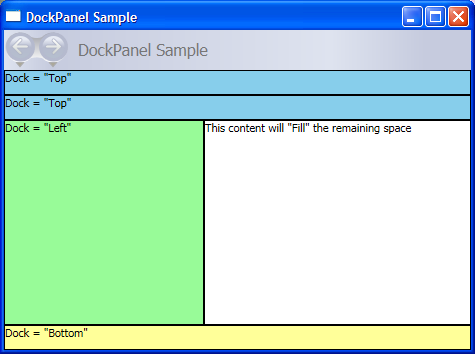

# Практическое руководство. Разделение пространства с помощью элемента DockPanel
В следующем примере создается простой UI  framework с помощью <xref:System.Windows.Controls.DockPanel> элемент. <xref:System.Windows.Controls.DockPanel> Разделяет доступное пространство между его дочерних элементов.  
  
## Пример  
 В этом примере используется <xref:System.Windows.Controls.DockPanel.Dock%2A> свойство, которое является присоединенным свойством, чтобы прикрепить два идентичных <xref:System.Windows.Controls.Border> элементы <xref:System.Windows.Controls.Dock.Top> разделенного пространства. Третий <xref:System.Windows.Controls.Border> прикреплен данный элемент <xref:System.Windows.Controls.Dock.Left>, шириной 200 пикселей. Четвертый <xref:System.Windows.Controls.Border> закреплены <xref:System.Windows.Controls.Dock.Bottom> экрана. Последний <xref:System.Windows.Controls.Border> элемент автоматически заполняет оставшееся пространство.  
  
 
 [!code-csharp[DockPanelOvwSample#1](~/samples/snippets/csharp/VS_Snippets_Wpf/DockPanelOvwSample/CSharp/DockPanel_Ovw_Sample.cs#1)]
 
 [!code-xaml[DockPanelOvwSample#1](~/samples/snippets/xaml/VS_Snippets_Wpf/DockPanelOvwSample/XAML/default.xaml#1)]  
  
> [!NOTE]
>  По умолчанию последний дочерний узел данного <xref:System.Windows.Controls.DockPanel> элемент заполняет оставшееся незанятое пространство. Если в этом нет необходимости, следует задать `LastChildFill="False"`.  
  
 Скомпилированное приложение возвращает новый пользовательский интерфейс, выглядящий следующим образом.  
  
   
  
## См. также

- <xref:System.Windows.Controls.DockPanel>
- [Общие сведения о панелях](panels-overview.md)
