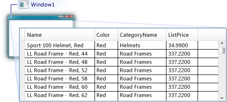

# Пошаговое руководство. Отображение данных из базы данных SQL Server в элементе управления DataGrid

В этом пошаговом руководстве, получения данных из базы данных SQL Server и отображение их в <xref:System.Windows.Controls.DataGrid> элемента управления. Использовать ADO.NET Entity Framework для создания классов сущностей, которые представляют данные и использовать LINQ для записи запроса, который получает указанные данные из класса сущностей.

## Предварительные требования

Ниже приведены компоненты, необходимые для выполнения данного пошагового руководства.

-   Visual Studio.

-   Доступ к запущенному экземпляру SQL Server или SQL Server Express с образца базы данных AdventureWorks, подключенные к ней. Можно загрузить из базы данных AdventureWorks [GitHub](https://github.com/Microsoft/sql-server-samples/releases).

## Создайте классы сущностей

1. Создайте новый проект приложения WPF в Visual Basic или C# и назовите его `DataGridSQLExample`.

2. В обозревателе решений щелкните правой кнопкой мыши проект, выберите пункт **добавить**, а затем выберите **новый элемент**.

     Будет открыто диалоговое окно Добавление нового элемента.

3. На панели "Установленные шаблоны", выберите **данных** и в списке шаблонов выберите **ADO.NET Entity Data Model**.

     

4. Назовите файл `AdventureWorksModel.edmx` и нажмите кнопку **добавить**.

     Появится мастер модели EDM.

5. На экране «Выбор содержимого модели» выберите **конструктор EF из базы данных** и нажмите кнопку **Далее**.

6. На экране «Выбор подключения к данным» обеспечивают подключение к базе данных AdventureWorksLT2008. Дополнительные сведения см. в разделе [выберите Your данных диалогового окна соединения](https://go.microsoft.com/fwlink/?LinkId=160190).

    Убедитесь, что имя указано `AdventureWorksLT2008Entities` и что **сохранить настройки подключения сущности в App.Config как** флажок выбран и нажмите кнопку **Далее**.

7. На экране «Выбор объектов базы данных» разверните узел таблицы и выберите **продукта** и **ProductCategory** таблиц.

     Можно создавать классы сущностей для всех таблиц; Тем не менее в этом примере извлекаются данные только из этих двух таблиц.

     

8. Нажмите кнопку **Готово**.

     Сущности Product и ProductCategory, отображаются в конструкторе сущностей.

     

## Извлечение и представление данных

1. Откройте файл MainWindow.xaml.

2. Задайте <xref:System.Windows.FrameworkElement.Width%2A> свойство <xref:System.Windows.Window> для 450.

3. В редакторе XAML добавьте следующий <xref:System.Windows.Controls.DataGrid> тег между `<Grid>` и `</Grid>` теги для добавления <xref:System.Windows.Controls.DataGrid> с именем `dataGrid1`.

     [!code-xaml[DataGrid_SQL_EF_Walkthrough#3](~/samples/snippets/csharp/VS_Snippets_Wpf/DataGrid_SQL_EF_Walkthrough/CS/MainWindow.xaml#3)]

     

4. Выберите <xref:System.Windows.Window>.

5. С помощью окна свойств или редактор XAML, создайте обработчик событий для <xref:System.Windows.Window> с именем `Window_Loaded` для <xref:System.Windows.FrameworkElement.Loaded> событий. Дополнительные сведения см. в разделе [Как Создание простого обработчика событий](https://docs.microsoft.com/previous-versions/visualstudio/visual-studio-2010/bb675300(v=vs.100)).

     Ниже показан XAML для MainWindow.xaml.

    > [!NOTE]
    > Если вы используете Visual Basic, в первой строке файла MainWindow.XAML, замените `x:Class="DataGridSQLExample.MainWindow"` с `x:Class="MainWindow"`.

     [!code-xaml[DataGrid_SQL_EF_Walkthrough#1](~/samples/snippets/csharp/VS_Snippets_Wpf/DataGrid_SQL_EF_Walkthrough/CS/MainWindow.xaml#1)]

6. Откройте файл с выделенным кодом (MainWindow.xaml.vb или MainWindow.xaml.cs) для <xref:System.Windows.Window>.

7. Добавьте следующий код, чтобы получить только определенные значения из соединяемых таблиц и задать <xref:System.Windows.Controls.ItemsControl.ItemsSource%2A> свойство <xref:System.Windows.Controls.DataGrid> к результатам запроса.

     [!code-csharp[DataGrid_SQL_EF_Walkthrough#2](~/samples/snippets/csharp/VS_Snippets_Wpf/DataGrid_SQL_EF_Walkthrough/CS/MainWindow.xaml.cs#2)]
     

8. Запустите пример.

     Вы должны увидеть <xref:System.Windows.Controls.DataGrid> , отображающий данные.

     

## См. также

- <xref:System.Windows.Controls.DataGrid>
- [Инструкции: Начало работы с Entity Framework в приложениях WPF?](https://go.microsoft.com/fwlink/?LinkId=159868)