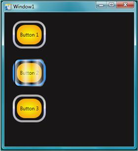

# Пошаговые руководства: Создание пользовательской анимированной кнопки
Как предполагает имя, очень удобно для получения насыщенных презентаций опыта создания для клиентов Windows Presentation Foundation (WPF). В этих пошаговых руководствах показано, как настроить внешний вид и поведение кнопки (включая анимацию). Эта настройка выполняется с помощью стиля и шаблона, так что можно применить эта пользовательская кнопка легко к любой кнопке в приложении. На следующем рисунке настраиваемая кнопка вы создадите.  
  
   
  
 Векторная графика, составляющих внешний вид кнопки создаются с помощью XAML. XAML — похож на HTML, но является более эффективные и расширяемые. XAML можно вводить вручную с помощью Microsoft Visual Studio или Блокнот, или можно использовать это средство визуального проектирования, таких как Microsoft Expression Blend. Expression Blend работает путем создания основного XAML кода, поэтому оба метода создают одинаковую графику.  
  
## В этом разделе  
 [Создание кнопки с помощью Microsoft Expression Blend](walkthrough-create-a-button-by-using-microsoft-expression-blend.md)  
 В этой статье демонстрируется создание кнопки с помощью пользовательского поведения с помощью средства конструктора Expression Blend.  
  
 [Создание кнопки с помощью XAML](walkthrough-create-a-button-by-using-xaml.md)  
 Демонстрирует создание кнопки с помощью пользовательского поведения с помощью XAML и Visual Studio.  
  
## Связанные разделы  
 [Стилизация и использование шаблонов](styling-and-templating.md)  
 Описывает, как стили и шаблоны могут использоваться для определения внешнего вида и поведения элементов управления.  
  
 [Общие сведения об эффектах анимации](../graphics-multimedia/animation-overview.md)  
 Описывает, как объекты могут быть анимированы с помощью WPF анимации и системы.  
  
 [Общие сведения о закраске сплошным цветом и градиентом](../graphics-multimedia/painting-with-solid-colors-and-gradients-overview.md)  
 В этой статье описывается использование объектов кисть для закрашивания сплошным цветом, линейным градиентом и радиальным градиентом.  
  
 [Общие сведения об эффектах для точечных рисунков](../graphics-multimedia/bitmap-effects-overview.md)  
 Описывает эффекты точечного рисунка, поддерживаемые WPF и способы их применения.
