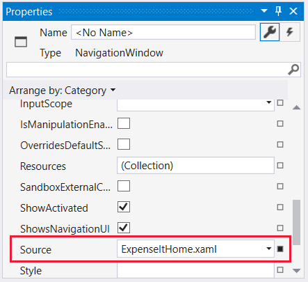
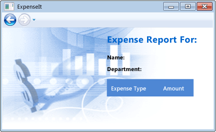

# <a name="walkthrough-my-first-wpf-desktop-application"></a>Пошаговое руководство. Создание классического приложения WPF

В этой статье показано, как разработать простое приложение Windows Presentation Foundation (WPF), которое включает общие для большинства приложений WPF элементы: расширяемый язык разметки приложений (XAML), код, определение приложения, элементы управления, макет интерфейса, привязки данных и стили.

Это пошаговое руководство включает следующие шаги:

- Использование XAML для разработки пользовательского интерфейса (UI) приложения.

- Написание кода, определяющего поведение приложения.

- Создание определения приложения для управления приложением.

- Добавление элементов управления и создание макета для пользовательского интерфейса приложения.

- Создания таблиц стилей для согласованного отображения пользовательского интерфейса в приложении.

- Использование привязки к данным для заполнения пользовательского интерфейса на основе данных.

В конце пошагового руководства будет создано автономное приложение Windows, которое позволяет пользователям просматривать отчеты о расходах для выбранных пользователей. Приложение состоит из нескольких страниц WPF, размещаемых в окне обозревателя.

> [!TIP]
> Пример кода, который используется в этом пошаговом руководстве, доступен для Visual Basic и C# в [Общие сведения о сборке приложений WPF](https://go.microsoft.com/fwlink/?LinkID=160008).

## <a name="prerequisites"></a>Предварительные требования

Visual Studio 2017 или более поздней версии.

Дополнительные сведения об установке последней версии Visual Studio, см. в разделе [установка Visual Studio](https://docs.microsoft.com/ru-ru/visualstudio/install/install-visual-studio).

## <a name="create-the-application-project"></a>Создание проекта приложения

Первым шагом является создание инфраструктуры приложения, которая включает в себя определение приложения, две страницы и изображение.

1. Создайте новый проект приложения WPF в Visual Basic или Visual C# с именем **`ExpenseIt`**:

   1. Откройте Visual Studio и выберите **Файл** > **Создать** > **Проект**.

      Откроется диалоговое окно **Новый проект**.

   2. В разделе **Установленные**, разверните **Visual C#**  или **Visual Basic**, а затем выберите **Windows Desktop**.

   3. Выберите шаблон **Приложение WPF (.NET Framework)**. Введите имя **`ExpenseIt`** , а затем нажмите **ОК**.

      

      Visual Studio создаст проект и откроет конструктор для окна приложения по умолчанию с именем **MainWindow.xaml**.

   > [!NOTE]
   > В этом пошаговом руководстве используется элемент управления <xref:System.Windows.Controls.DataGrid>, доступный в .NET Framework 4 и более поздних версиях. Дополнительные сведения о выборе целевой версии .NET см. в статье [Visual Studio: Общие сведения о настройке целевой платформы](https://docs.microsoft.com/ru-ru/visualstudio/ide/visual-studio-multi-targeting-overview).

2. Откройте *Application.xaml* (Visual Basic) или *App.xaml* (C#).

    Этот файл XAML определяет WPF-приложение и все его ресурсы. Этот файл также используется для указания объекта пользовательского интерфейса, автоматически отображаемого при запуске приложения; в данном случае это *MainWindow.xaml*.

    В C# он должен выглядеть следующим образом.

    [!code-xaml[ExpenseIt#1](~/samples/snippets/csharp/VS_Snippets_Wpf/ExpenseIt/CSharp/ExpenseIt/App.xaml#1)]

3. Откройте *MainWindow.xaml*.

    Этот файл XAML представляет главное окно приложения и отображает созданное содержимое страниц. Класс <xref:System.Windows.Window> определяет свойства окна, такие как заголовок, размер и значок, и обрабатывает события (например, открытие и закрытие окна).

4. Замените <xref:System.Windows.Window> на элемент <xref:System.Windows.Navigation.NavigationWindow>, как показано в следующем XAML:

   ```xaml
   <NavigationWindow x:Class="ExpenseIt.MainWindow"
        xmlns="http://schemas.microsoft.com/winfx/2006/xaml/presentation"
        xmlns:x="http://schemas.microsoft.com/winfx/2006/xaml"
        ...
   </NavigationWindow>
   ```

   Это приложение осуществляет переход к различному содержимому вводимых пользователем данных. Вот почему основное <xref:System.Windows.Window> должно быть заменено на  <xref:System.Windows.Navigation.NavigationWindow>. <xref:System.Windows.Navigation.NavigationWindow> наследует все свойства <xref:System.Windows.Window>. Дополнительные сведения см. в разделе [Общие сведения о переходах](../app-development/navigation-overview.md).

5. Измените следующие свойства <xref:System.Windows.Navigation.NavigationWindow>:

    - Задайте для свойства <xref:System.Windows.Window.Title%2A> значение `ExpenseIt`.

    - Задайте для свойства <xref:System.Windows.FrameworkElement.Width%2A> значение 500 пикселей.

    - Задайте для свойства <xref:System.Windows.FrameworkElement.Height%2A> значение 350 пикселей.

    - Удалите <xref:System.Windows.Controls.Grid> между тегами <xref:System.Windows.Navigation.NavigationWindow>.   

    В C# XAML должен выглядеть следующим образом.

    [!code-xaml[ExpenseIt#2](~/samples/snippets/csharp/VS_Snippets_Wpf/ExpenseIt/CSharp/ExpenseIt/MainWindow.xaml#2)]

6. Откройте *MainWindow.xaml.vb* или *MainWindow.xaml.cs*.

    Этот файл является файлом кода, который содержит код для обработки событий, объявленных в *MainWindow.xaml*. Этот файл содержит разделяемый класс для окна, определенного в XAML-коде.

7. Если вы используете C#, измените класс `MainWindow`, чтобы он наследовал от <xref:System.Windows.Navigation.NavigationWindow>. (В Visual Basic это происходит автоматически при изменении окна в XAML.)

   Код должен выглядеть следующим образом:

   [!code-csharp[ExpenseIt#3](~/samples/snippets/csharp/VS_Snippets_Wpf/ExpenseIt/CSharp/ExpenseIt/MainWindow.xaml.cs#3)]

## <a name="add-files-to-the-application"></a>Добавление файлов в приложение

В этом разделе вы добавите в приложение две страницы и изображение.

1. Добавьте новую страницу WPF в проект и назовите её `ExpenseItHome.xaml`:

   1. В **обозревателе решений**, щелкните правой кнопкой мыши **`ExpenseIt`** и выберите **Добавить** > **Страница**.

   1. В окне **Добавление нового элемента**, уже выбран шаблон **Страница (WPF)**. Введите имя **`ExpenseItHome`**, а затем нажмите **Добавить**.

    Эта страница является первой страницей, которая отображается при запуске приложения. На ней отображается список пользователей для выбора пользователя, по которому необходимо сформировать отчет о расходах.

2. Откройте *`ExpenseItHome.xaml`*.

3. Задайте для <xref:System.Windows.Controls.Page.Title%2A> значение `ExpenseIt - Home`.

    В C# XAML должен выглядеть следующим образом.

    [!code-xaml[ExpenseIt#6](~/samples/snippets/csharp/VS_Snippets_Wpf/ExpenseIt/CSharp/ExpenseIt2/ExpenseItHome.xaml#6)]

4. Откройте *MainWindow.xaml*.

5. Задайте для <xref:System.Windows.Navigation.NavigationWindow.Source%2A> у <xref:System.Windows.Navigation.NavigationWindow> значение `ExpenseItHome.xaml`.

    Этот параметр задает `ExpenseItHome.xaml` в качестве первой страницы, открываемой при запуске приложения. 

    В C# XAML должен выглядеть следующим образом.

    [!code-xaml[ExpenseIt#7](~/samples/snippets/csharp/VS_Snippets_Wpf/ExpenseIt/CSharp/ExpenseIt2/MainWindow.xaml#7)]

   > [!TIP]
   > Можно также задать свойство **Источник** в категории свойств окна **Разное**.
   >
   > 

6. Добавьте другую страницу WPF в проект и назовите её *ExpenseReportPage.xaml*:

   1. В **обозревателе решений**, щелкните правой кнопкой мыши **`ExpenseIt`** и выберите **Добавить** > **Страница**.

   1. В окне **Добавление нового элемента**, уже выбран шаблон **Страница (WPF)**. Введите имя **ExpenseReportPage**, а затем нажмите **Добавить**.

    Эта страница будет отображать отчет по расходам для человека, выбранного на странице **`ExpenseItHome`**.

7. Откройте файл *ExpenseReportPage.xaml*.

8. Задайте для <xref:System.Windows.Controls.Page.Title%2A> значение `ExpenseIt - View Expense`.

    В C# XAML должен выглядеть следующим образом.

    [!code-xaml[ExpenseIt#4](~/samples/snippets/csharp/VS_Snippets_Wpf/ExpenseIt/CSharp/ExpenseIt/ExpenseReportPage.xaml#4)]

9. Откройте *ExpenseItHome.xaml.vb* и *ExpenseReportPage.xaml.vb*, или *ExpenseItHome.xaml.cs* и *ExpenseReportPage.xaml.cs*.

    При создании нового файла страницы Visual Studio автоматически создает файл кода. Эти файлы обрабатывают логику, реагирующую на действия пользователя.

    Код должен выглядеть следующим образом для **`ExpenseItHome`**:

    [!code-csharp[ExpenseIt#2_5](~/samples/snippets/csharp/VS_Snippets_Wpf/ExpenseIt/CSharp/ExpenseIt2/ExpenseItHome.xaml.cs#2_5)]

    И следующим образом для **ExpenseReportPage**:

    [!code-csharp[ExpenseIt#5](~/samples/snippets/csharp/VS_Snippets_Wpf/ExpenseIt/CSharp/ExpenseIt/ExpenseReportPage.xaml.cs#5)]

10. Добавьте изображение с именем *watermark.png* в проект. Можно создать собственное изображение, скопировать файл из примера кода или загрузить его [здесь](./media/watermark.png).

    1. Щелкните правой кнопкой мыши узел проекта и выберите **добавить** > **существующий элемент**.

    2. В окне **Добавить существующий элемент** перейдите к файлу изображения, который вы хотите использовать, а затем выберите **добавить**.

## <a name="build-and-run-the-application"></a>Построение и запуск приложения

1. Чтобы построить и запустить приложение, нажмите клавишу **F5** или выберите **начать отладку** из меню **Отладка**.

2. Закройте приложение, чтобы вернуться в Visual Studio.

## <a name="create-the-layout"></a>Создание макета

Макет позволяет упорядочивать размещение элементов пользовательского интерфейса и также управлять их размером и положением при изменении размера пользовательского интерфейса. Обычно макет создается с одним из следующих элементов управления макетом.

- <xref:System.Windows.Controls.Canvas>
- <xref:System.Windows.Controls.DockPanel>
- <xref:System.Windows.Controls.Grid>
- <xref:System.Windows.Controls.StackPanel>
- <xref:System.Windows.Controls.VirtualizingStackPanel>
- <xref:System.Windows.Controls.WrapPanel>

Каждый из этих элементов управления макетом поддерживает специальный тип макета дочерних элементов. Размер страницы `ExpenseIt` может быть изменен, и каждая страница имеет элементы, которые упорядочены по горизонтали и вертикали рядом с другими элементами. Следовательно, <xref:System.Windows.Controls.Grid> является идеальным элементом макета для приложения.

> [!TIP]
> Дополнительные сведения о элементе <xref:System.Windows.Controls.Panel> см. в разделе [Общие сведения о панелях](../controls/panels-overview.md). Дополнительные сведения о макете см. в разделе [Макет](../advanced/layout.md).

В разделе создается таблица с одним столбцом и тремя строками, с полями шириной 10 пикселей, путем добавления определений столбцов и строк для <xref:System.Windows.Controls.Grid> в *`ExpenseItHome.xaml`*.

1. Откройте *`ExpenseItHome.xaml`*.

2. Задайте для <xref:System.Windows.FrameworkElement.Margin%2A> у <xref:System.Windows.Controls.Grid> значение «10,0,10,10», которое соответствует величине полей слева, сверху, справа и снизу:

   ```xaml
   <Grid Margin="10,0,10,10">
   ```

   > [!TIP]
   > Можно также задать **Margin** в категории **макет** свойств элемента:
   >
   > 

3. Добавьте следующий XAML между тегов <xref:System.Windows.Controls.Grid>, чтобы создать определения строк и столбцов:

    [!code-xaml[ExpenseIt#8](~/samples/snippets/csharp/VS_Snippets_Wpf/ExpenseIt/CSharp/ExpenseIt3/ExpenseItHome.xaml#8)]

    Свойство <xref:System.Windows.Controls.RowDefinition.Height%2A> двух строк имеет значение <xref:System.Windows.GridLength.Auto%2A>, означающее, что размер строки определяется её содержимым. Значение по умолчанию для <xref:System.Windows.Controls.RowDefinition.Height%2A> равно <xref:System.Windows.GridUnitType.Star>; это означает, что высота строки — это взвешенная пропорция доступного пространства. Например, если две строки имеют <xref:System.Windows.Controls.RowDefinition.Height%2A> равную «*», каждый из них имеет высоту в размере половины доступного пространства.

    Ваш <xref:System.Windows.Controls.Grid> теперь должен иметь следующий XAML:

    [!code-xaml[ExpenseIt#9](~/samples/snippets/csharp/VS_Snippets_Wpf/ExpenseIt/CSharp/ExpenseIt3/ExpenseItHome.xaml#9)]

## <a name="add-controls"></a>Добавление элементов управления

В этом разделе вы обновите пользовательский интерфейс для отображения списка пользователей, для которых может выводиться отчет по расходам. Элементы управления — это объекты пользовательского интерфейса, позволяющие пользователям взаимодействовать с приложением. Более подробную информацию см. в разделе [Элементы управления](../controls/index.md).

Чтобы создать этот пользовательский интерфейс, нужно добавить следующие элементы для *`ExpenseItHome.xaml`*:

- <xref:System.Windows.Controls.ListBox> (для получения списка пользователей).
- <xref:System.Windows.Controls.Label> (для заголовков списка).
- <xref:System.Windows.Controls.Button> (чтобы при её нажатии вывести отчет по расходам для человека, выбранного в списке).

Каждый элемент управления помещается в строке <xref:System.Windows.Controls.Grid>, в соответствии с заданным значением вложенного свойства зависимостей <xref:System.Windows.Controls.Grid.Row%2A?displayProperty=nameWithType>. Дополнительные сведения о вложенных свойствах см. в разделе [Свойства зависимостей](../advanced/attached-properties-overview.md).

1. Откройте *`ExpenseItHome.xaml`*.

2. Добавьте следующий XAML где-то между тегов <xref:System.Windows.Controls.Grid>:

   [!code-xaml[ExpenseIt#10](~/samples/snippets/csharp/VS_Snippets_Wpf/ExpenseIt/CSharp/ExpenseIt4/ExpenseItHome.xaml#10)]

   > [!TIP]
   > Также можно создать элементы управления, перетащив их из **панели элементов** в окне конструктора, а затем задав их свойства в окне **Свойства**.

3. Выполните сборку и запуск приложения.

## <a name="add-an-image-and-a-title"></a>Добавить изображение и заголовок

В этом разделе вы обновите интерфейс пользователя домашней страницы, добавив изображение и заголовок страницы.

1. Откройте *`ExpenseItHome.xaml`*.

2. Добавьте еще один столбец в <xref:System.Windows.Controls.Grid.ColumnDefinitions%2A> с фиксированным значением <xref:System.Windows.Controls.ColumnDefinition.Width%2A>, равным 230 пикселей:

    [!code-xaml[ExpenseIt#11](~/samples/snippets/csharp/VS_Snippets_Wpf/ExpenseIt/CSharp/ExpenseIt5/ExpenseItHome.xaml#11)]

3. Добавьте другую строку в <xref:System.Windows.Controls.Grid.RowDefinitions%2A>:

    [!code-xaml[ExpenseIt#11b](~/samples/snippets/csharp/VS_Snippets_Wpf/ExpenseIt/CSharp/ExpenseIt5/ExpenseItHome.xaml#11b)]

4. Переместите элементы управления во второй столбец, задав свойству <xref:System.Windows.Controls.Grid.Column%2A?displayProperty=nameWithType> значение 1, в каждом из трех элементов управления (Border, ListBox и Button).

5. Переместите каждый элемент управления вниз на одну строку, увеличивая на 1 значение его свойства <xref:System.Windows.Controls.Grid.Row%2A?displayProperty=nameWithType>.

   XAML для трех элементов управления теперь выглядит следующим образом:

    [!code-xaml[ExpenseIt#12](~/samples/snippets/csharp/VS_Snippets_Wpf/ExpenseIt/CSharp/ExpenseIt5/ExpenseItHome.xaml#12)]

6. Присвойте свойству <xref:System.Windows.Controls.Panel.Background%2A> у <xref:System.Windows.Controls.Grid> в качестве значения файл изображения *watermark.png*, добавив следующий XAML где-то между `<Grid>` и `</Grid>`:

    [!code-xaml[ExpenseIt#14](~/samples/snippets/csharp/VS_Snippets_Wpf/ExpenseIt/CSharp/ExpenseIt5/ExpenseItHome.xaml#14)]

7. Перед элементом <xref:System.Windows.Controls.Border> добавьте <xref:System.Windows.Controls.Label> с содержимым «View Expense Report». Это заголовок страницы.

    [!code-xaml[ExpenseIt#13](~/samples/snippets/csharp/VS_Snippets_Wpf/ExpenseIt/CSharp/ExpenseIt5/ExpenseItHome.xaml#13)]

8. Выполните сборку и запуск приложения.

На следующем рисунке показан полученный результат:


## <a name="add-code-to-handle-events"></a>Добавьте код для обработки событий

1. Откройте *`ExpenseItHome.xaml`*.

2. Добавьте обработчик события <xref:System.Windows.Controls.Primitives.ButtonBase.Click> у <xref:System.Windows.Controls.Button>. Дополнительные сведения см. в разделе [Создание простого обработчика событий](https://docs.microsoft.com/previous-versions/visualstudio/visual-studio-2010/bb675300(v=vs.100)).

    [!code-xaml[ExpenseIt#15](~/samples/snippets/csharp/VS_Snippets_Wpf/ExpenseIt/CSharp/ExpenseIt6/ExpenseItHome.xaml#15)]

3. Откройте *`ExpenseItHome.xaml.vb`* или *`ExpenseItHome.xaml.cs`*.

4. Добавьте следующий код, в класс `ExpenseItHome`, чтобы добавить обработчик события щелчка кнопки. Обработчик событий открывает страницу **ExpenseReportPage**.

    [!code-csharp[ExpenseIt#16](~/samples/snippets/csharp/VS_Snippets_Wpf/ExpenseIt/CSharp/ExpenseIt6/ExpenseItHome.xaml.cs#16)]

## <a name="create-the-ui-for-expensereportpage"></a>Создание пользовательского интерфейса для страницы ExpenseReportPage

*ExpenseReportPage.xaml* отображает отчет по расходам для человека, выбранного на странице **`ExpenseItHome`**. В этом разделе вы создадите пользовательский интерфейс для **ExpenseReportPage**. Вы также добавите фон и цвет заливки для различных элементов пользовательского интерфейса.

1. Откройте файл *ExpenseReportPage.xaml*.

2. Добавьте следующий XAML между тегами <xref:System.Windows.Controls.Grid>:

    [!code-xaml[ExpenseIt#17](~/samples/snippets/csharp/VS_Snippets_Wpf/ExpenseIt/CSharp/ExpenseIt6/ExpenseReportPage.xaml#17)]

    Этот пользовательский интерфейс аналогичен *`ExpenseItHome.xaml`*, за исключением того, что данные отчета отображаются в <xref:System.Windows.Controls.DataGrid>.

3. Выполните сборку и запуск приложения.

    > [!NOTE]
    > Если отобразится сообщение об ошибке, <xref:System.Windows.Controls.DataGrid> не найден или не существует, убедитесь, что ваш проект использует .NET Framework 4 или более поздней версии. Дополнительные сведения о выборе целевой версии .NET см. в статье [Visual Studio: Общие сведения о настройке целевой платформы](https://docs.microsoft.com/ru-ru/visualstudio/ide/visual-studio-multi-targeting-overview).

4. Нажмите кнопку **View**.

    Появится страница отчета по расходам. Также обратите внимание на то, что кнопка возврата активна.

На следующем рисунке показаны элементы пользовательского интерфейса, добавленные в *ExpenseReportPage.xaml*.



## <a name="style-controls"></a>Определение стиля элементов управления

Внешний вид различных элементов часто является одинаковым для всех элементов одного типа в пользовательском интерфейсе. Пользовательский интерфейс использует [стили](../controls/styling-and-templating.md) для многократного использования паарметров внешнего вида у нескольких элементов. Повторное использование стилей помогает упростить создание XAML и управление им. В этом разделе атрибуты, установленные ранее для каждого элемента, заменяются стилями.

1. Откройте *Application.xaml* или *App.xaml*.

2. Добавьте следующий XAML между тагами <xref:System.Windows.Application.Resources%2A?displayProperty=nameWithType>:

    [!code-xaml[ExpenseIt#18](~/samples/snippets/csharp/VS_Snippets_Wpf/ExpenseIt/CSharp/ExpenseIt7/App.xaml#18)]

    Этот код XAML добавляет следующие стили:

    - `headerTextStyle`: Для форматирования заголовка страницы <xref:System.Windows.Controls.Label>.

    - `labelStyle`: Для форматирования <xref:System.Windows.Controls.Label>.

    - `columnHeaderStyle`: Для форматирования <xref:System.Windows.Controls.Primitives.DataGridColumnHeader>.

    - `listHeaderStyle`: Для форматирования <xref:System.Windows.Controls.Border> заголовка списка.

    - `listHeaderTextStyle`: Для форматирования <xref:System.Windows.Controls.Label> в заголовке списка.

    - `buttonStyle`: Для форматирования <xref:System.Windows.Controls.Button> на `ExpenseItHome.xaml`.

    Обратите внимание на то, что стили представляют собой ресурсы и являются дочерними для свойства <xref:System.Windows.Application.Resources%2A?displayProperty=nameWithType>. Здесь стили применяются ко всем элементам в приложении. Пример использования ресурсов в приложении .NET Framework см. в разделе [использование ресурсов приложения](../advanced/how-to-use-application-resources.md).

3. Откройте *`ExpenseItHome.xaml`*.

4. Замените весь код в <xref:System.Windows.Controls.Grid> на следующий XAML:

    [!code-xaml[ExpenseIt#19](~/samples/snippets/csharp/VS_Snippets_Wpf/ExpenseIt/CSharp/ExpenseIt7/ExpenseItHome.xaml#19)]

    Свойства, определяющие внешний вид элементов управления, такие как <xref:System.Windows.VerticalAlignment> и <xref:System.Windows.Media.FontFamily>, при применении стилей удаляются и заменяются. Например `headerTextStyle` применяется к <xref:System.Windows.Controls.Label> «View Expense Report».

5. Откройте файл *ExpenseReportPage.xaml*.

6. Замените весь код в <xref:System.Windows.Controls.Grid> на следующий XAML:

    [!code-xaml[ExpenseIt#20](~/samples/snippets/csharp/VS_Snippets_Wpf/ExpenseIt/CSharp/ExpenseIt7/ExpenseReportPage.xaml#20)]

    В элементы <xref:System.Windows.Controls.Label> и <xref:System.Windows.Controls.Border> будут добавлены стили.

## <a name="bind-data-to-a-control"></a>Привязка данных к элементу управления

В этом разделе вы создадите XML-данные, привязанные к различным элементам управления.

1. Откройте *`ExpenseItHome.xaml`*.

2. После открывающего элемента <xref:System.Windows.Controls.Grid>, добавьте следующий XAML для создания <xref:System.Windows.Data.XmlDataProvider>, содержащий данные для каждого пользователя:

    [!code-xaml[ExpenseIt#21](~/samples/snippets/csharp/VS_Snippets_Wpf/ExpenseIt/CSharp/ExpenseIt8/ExpenseItHome.xaml#21)]
    [!code-xaml[ExpenseIt#23](~/samples/snippets/csharp/VS_Snippets_Wpf/ExpenseIt/CSharp/ExpenseIt8/ExpenseItHome.xaml#23)]
    [!code-xaml[ExpenseIt#22](~/samples/snippets/csharp/VS_Snippets_Wpf/ExpenseIt/CSharp/ExpenseIt8/ExpenseItHome.xaml#22)]

    Данные создаются как ресурсы <xref:System.Windows.Controls.Grid>. Обычно такие данные загружаются в виде файла, но для простоты в этом примере они добавляются в коде.

3. В элемент `<Grid.Resources>` добавьте следующий <xref:System.Windows.DataTemplate>, который определяет способ отображения данных в <xref:System.Windows.Controls.ListBox>:

    [!code-xaml[ExpenseIt#21](~/samples/snippets/csharp/VS_Snippets_Wpf/ExpenseIt/CSharp/ExpenseIt8/ExpenseItHome.xaml#21)]
    [!code-xaml[ExpenseIt#24](~/samples/snippets/csharp/VS_Snippets_Wpf/ExpenseIt/CSharp/ExpenseIt8/ExpenseItHome.xaml#24)]
    [!code-xaml[ExpenseIt#22](~/samples/snippets/csharp/VS_Snippets_Wpf/ExpenseIt/CSharp/ExpenseIt8/ExpenseItHome.xaml#22)]

    Дополнительные сведения о шаблонах данных см. в разделе [Общие сведения о шаблонах данных](../data/data-templating-overview.md).

4. Замените существующий <xref:System.Windows.Controls.ListBox> следующим XAML:

    [!code-xaml[ExpenseIt#25](~/samples/snippets/csharp/VS_Snippets_Wpf/ExpenseIt/CSharp/ExpenseIt8/ExpenseItHome.xaml#25)]

    Этот XAML привязывает свойство <xref:System.Windows.Controls.ItemsControl.ItemsSource%2A> элемента <xref:System.Windows.Controls.ListBox> к источнику данных и применяет шаблон данных  <xref:System.Windows.Controls.ItemsControl.ItemTemplate%2A>.

## <a name="connect-data-to-controls"></a>Подключение данных к элементам управления

Далее добавим код для извлечения имени, выбранного на странице **`ExpenseItHome`** и передачи его конструктору **ExpenseReportPage**. **ExpenseReportPage** задает контекст данных для переданного элемента к которому привязываются элементы управления, определенные в *ExpenseReportPage.xaml*.

1. Откройте файл *ExpenseReportPage.xaml.vb* или *ExpenseReportPage.xaml.cs*.

2. Добавьте конструктор, принимающий объект, чтобы можно было передавать данные отчета о затратах выбранного человека.

    [!code-csharp[ExpenseIt#26](~/samples/snippets/csharp/VS_Snippets_Wpf/ExpenseIt/CSharp/ExpenseIt8/ExpenseReportPage.xaml.cs#26)]

3. Откройте *`ExpenseItHome.xaml.vb`* или *`ExpenseItHome.xaml.cs`*.

4. Измените обработчик <xref:System.Windows.Controls.Primitives.ButtonBase.Click>, добавив вызов конструктора, передавая отчет о затратах выбранного человека.

    [!code-csharp[ExpenseIt#27](~/samples/snippets/csharp/VS_Snippets_Wpf/ExpenseIt/CSharp/ExpenseIt8/ExpenseItHome.xaml.cs#27)]

## <a name="style-data-with-data-templates"></a>Стиль с использованием шаблонов данных

В этом разделе вы обновите пользовательский Интерфейс для каждого элемента в списках с привязкой к данным с помощью шаблонов данных.

1. Откройте файл *ExpenseReportPage.xaml*.

2. Привяжите содержимое <xref:System.Windows.Controls.Label> «Name» и «Department» к свойствам. Дополнительные сведения о привязке данных см. в разделе [Общие сведения о привязке данных](../data/data-binding-overview.md).

    [!code-xaml[ExpenseIt#31](~/samples/snippets/csharp/VS_Snippets_Wpf/ExpenseIt/CSharp/ExpenseIt9/ExpenseReportPage.xaml#31)]

3. После открывающего элемента <xref:System.Windows.Controls.Grid> добавьте следующие шаблоны данных, которые определяют способ отображения данных отчета о расходах:

    [!code-xaml[ExpenseIt#30](~/samples/snippets/csharp/VS_Snippets_Wpf/ExpenseIt/CSharp/ExpenseIt9/ExpenseReportPage.xaml#30)]

4. Замените <xref:System.Windows.Controls.DataGridTextColumn> на <xref:System.Windows.Controls.DataGridTemplateColumn> у элемента <xref:System.Windows.Controls.DataGrid> и примените шаблоны к ним.

    [!code-xaml[ExpenseIt#32](~/samples/snippets/csharp/VS_Snippets_Wpf/ExpenseIt/CSharp/ExpenseIt9/ExpenseReportPage.xaml#32)]

5. Выполните сборку и запуск приложения.

6. Выберите "person", а затем нажмите **View**.

На следующем рисунке показаны обе страницы приложения `ExpenseIt` с элементами управления, макетом, стилями, привязками данных и примененными шаблонами данных:


> [!NOTE]
> В этом примере демонстрируется конкретная функциональная возможность WPF и не cj,k.lf.ncz все рекомендации по безопасности, локализации и специальным возможностям. Исчерпывающая информация о WPF и рекомендации по разработке приложений .NET Framework см. в следующих разделах:
>
> - [Специальные возможности](https://docs.microsoft.com/dotnet/framework/ui-automation/accessibility-best-practices)
>
> - [Безопасность](../security-wpf.md)
>
> - [Глобализация и локализация WPF](../advanced/wpf-globalization-and-localization-overview.md)
>
> - [Производительность WPF](../advanced/optimizing-wpf-application-performance.md)

## <a name="next-steps"></a>Следующие шаги

В этом пошаговом руководстве вы узнали ряд методов для создания пользовательского интерфейса с помощью Windows Presentation Foundation (WPF). Теперь вы должны знать основные стандартные блоки приложения .NET Framework для работы с данными. Более подробную информацию об архитектуре и моделях программирования WPF см. в следующих разделах:

- [Архитектура WPF](../advanced/wpf-architecture.md)
- [Обзор XAML (WPF)](../advanced/xaml-overview-wpf.md)
- [Общие сведения о свойствах зависимостей](../advanced/dependency-properties-overview.md)
- [Макет](../advanced/layout.md)

Более подробную информацию о создании приложений см. в следующих разделах:

- [Разработка приложений](../app-development/index.md)
- [Элементы управления](../controls/index.md)
- [Общие сведения о привязке данных](../data/data-binding-overview.md)
- [Графика и мультимедиа](../graphics-multimedia/index.md)
- [Документы в WPF](../advanced/documents-in-wpf.md)

## <a name="see-also"></a>См. также

- [Общие сведения о панелях](../controls/panels-overview.md)
- [Общие сведения о шаблонах данных](../data/data-templating-overview.md)
- [Построение приложения WPF](../app-development/building-a-wpf-application-wpf.md)
- [Стили и шаблоны](../controls/styles-and-templates.md)
