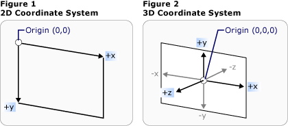

# Обзор трехмерной графики
 Функциональные возможности трехмерной (3D) графики в [!INCLUDE[TLA#tla_winclient](../../../../includes/tlasharptla-winclient-md.md)] позволяют разработчикам рисовать, преобразовывать и анимировать трехмерную графику как в разметке, так и в процедурном коде. Разработчики могут сочетать двухмерную графику с трехмерной для создания многофункциональных элементов управления, предоставления сложных визуальных представлений данных или повышения удобства работы с интерфейсом приложения. Поддержка трехмерной графики в [!INCLUDE[TLA2#tla_winclient](../../../../includes/tla2sharptla-winclient-md.md)] не предполагает предоставления полнофункциональной платформы для разработки игр. В этом разделе содержатся общие сведения о функциональных возможностях трехмерной графики в графической системе [!INCLUDE[TLA2#tla_winclient](../../../../includes/tla2sharptla-winclient-md.md)].  

   
## Трехмерное содержимое в двумерном контейнере  
 Графическое 3D-содержимое в [!INCLUDE[TLA2#tla_winclient](../../../../includes/tla2sharptla-winclient-md.md)] инкапсулировано в элементе <xref:System.Windows.Controls.Viewport3D>, который может входить в структуру двумерного элемента. Графическая система рассматривает <xref:System.Windows.Controls.Viewport3D> как двумерный визуальный элемент, подобный многим другим в [!INCLUDE[TLA2#tla_winclient](../../../../includes/tla2sharptla-winclient-md.md)]. <xref:System.Windows.Controls.Viewport3D> функционирует как окно — окно просмотра трехмерной сцены. Говоря точнее, это поверхность, на которую проецируется 3D-сцена.  
  
 В традиционном 2D-приложении <xref:System.Windows.Controls.Viewport3D> можно использовать так же, как и любой другой контейнерный элемент, например Grid или Canvas. Несмотря на то, что можно использовать <xref:System.Windows.Controls.Viewport3D> с другими графическими 2D-объектами в том же графе сцены, нельзя сочетать 2D и 3D объекты в рамках <xref:System.Windows.Controls.Viewport3D>. В этом разделе основное внимание уделяется отрисовке 3D-графики внутри <xref:System.Windows.Controls.Viewport3D>.  
  
   
## Координаты трехмерного пространства  
 Система координат [!INCLUDE[TLA2#tla_winclient](../../../../includes/tla2sharptla-winclient-md.md)] для 2D-графики начинается в левом верхнем углу области отрисовки (обычно областью отрисовки является экран). В 2D-системе положительные значения оси X откладываются слева направо, а оси Y — сверху вниз.  Однако, в системе 3D-координат начало располагается в центре отрисовываемой области, положительные значения оси X откладываются слева направо, оси Y — снизу вверх, а оси Z — из центра к наблюдателю.  
  
   
Представления традиционных двумерных и трехмерных систем координат  
  
 Пространство, определяемое этими осями, является стационарной системой отсчета координат для 3D-объектов в [!INCLUDE[TLA2#tla_winclient](../../../../includes/tla2sharptla-winclient-md.md)]. При построении моделей в этом пространстве и создании источников света и камер для их отображения необходимо отличать стационарную систему отсчета координат ("мировую систему координат") от локальной системы отсчета, которая создается для каждой модели при применении к ней преобразований. Помните, что в зависимости от освещения и настроек камеры объекты в мировой системе координат могут выглядеть различным образом или быть полностью невидимыми. При этом положение камеры не изменяет расположения объектов в мировой системе координат.  
  
   
## Камеры и проекции  
 Разработчики, работающие с двумерной графикой, привыкли к размещению графических примитивов на двумерном экране. При создании 3D-сцены важно помнить, что фактически создается 2D-представление 3D-объектов. Поскольку 3D-сцена выглядит по-разному в зависимости от точки наблюдения, необходимо указать эту точку наблюдения. Это позволяет сделать класс <xref:System.Windows.Media.Media3D.Camera>.  
  
 Другой способ понимания того, как представляется 3D-сцена на 2D-поверхности — это описание сцены как проекции на поверхность просмотра. <xref:System.Windows.Media.Media3D.ProjectionCamera> позволяет указать различные проекции и их свойства для изменения того, как наблюдатель видит 3D-модели. Объект <xref:System.Windows.Media.Media3D.PerspectiveCamera> указывает проекцию сцены в перспективе.  Другими словами, <xref:System.Windows.Media.Media3D.PerspectiveCamera> предоставляет точку схождения перспективы. Можно указать положение камеры в пространстве координат сцены, направление, поле зрения камеры и вектор, определяющий направление "вверх" в сцене. На следующей схеме показана <xref:System.Windows.Media.Media3D.PerspectiveCamera> в проекции.
  
 Свойства <xref:System.Windows.Media.Media3D.ProjectionCamera.NearPlaneDistance%2A> и <xref:System.Windows.Media.Media3D.ProjectionCamera.FarPlaneDistance%2A> объекта  <xref:System.Windows.Media.Media3D.ProjectionCamera> ограничивают диапазон проекции камеры. Поскольку камеры могут быть расположены в любом месте сцены, фактически можно расположить камеру внутри модели или очень близко от нее, затрудняя её обзор. <xref:System.Windows.Media.Media3D.ProjectionCamera.NearPlaneDistance%2A> позволяет указать минимальное расстояние от камеры, объекты ближе которого не будут нарисованы. И наоборот, <xref:System.Windows.Media.Media3D.ProjectionCamera.FarPlaneDistance%2A> позволяет задать расстояние от камеры, за которым объекты не будут нарисованы, что гарантирует, что объекты, расположенные слишком далеко, чтобы их можно было раглядеть, не будут включены в сцену.  
  
   
Позиция камеры  
  
 <xref:System.Windows.Media.Media3D.OrthographicCamera> указывает ортогональную проекцию 3D-модели на двумерную визуальную поверхность. Подобно другим камерам, она указывает позицию, направление просмотра и направление "вверх". В отличие от <xref:System.Windows.Media.Media3D.PerspectiveCamera>, при этом <xref:System.Windows.Media.Media3D.OrthographicCamera> описывает проекцию, которая не включает ракурс перспективы. Другими словами, <xref:System.Windows.Media.Media3D.OrthographicCamera> описывает призму, стороны которой параллельны, а не сходятся в точке камеры. На следующем рисунке показана одна и та же модель, отображенная с использованием <xref:System.Windows.Media.Media3D.PerspectiveCamera> и <xref:System.Windows.Media.Media3D.OrthographicCamera>.  
  
   
Перспективная и ортогональная проекции  
  
 В следующем коде показано несколько обычных параметров камеры.  
  
 [!code-csharp[3dgallery_procedural_snip#Basic3DShapeCodeExampleInline1](~/samples/snippets/csharp/VS_Snippets_Wpf/3DGallery_procedural_snip/CSharp/Basic3DShapeExample.cs#basic3dshapecodeexampleinline1)]
   
  
   
## Примитивы модели и сетки  
  
 <xref:System.Windows.Media.Media3D.Model3D> — абстрактный базовый класс, представляющий универсальный 3D-объект. Для создания 3D-сцены необходимо несколько объектов, составляющих граф сцены и являющихся производными от <xref:System.Windows.Media.Media3D.Model3D>. В настоящее время [!INCLUDE[TLA2#tla_winclient](../../../../includes/tla2sharptla-winclient-md.md)] поддерживает моделирование геометрических объектов с помощью <xref:System.Windows.Media.Media3D.GeometryModel3D>. Свойство <xref:System.Windows.Media.Media3D.GeometryModel3D.Geometry%2A> этой модели принимает примитив сетки.
  
 Начните построение модели с создания примитива или сетки. 3D-примитив представляет собой набор вершин, образующих одну 3D-сущность. Большинство 3D-систем предоставляют примитивы, смоделированные на основе простейшей замкнутой фигуры: треугольника, определенного тремя вершинами. Поскольку три точки треугольника лежат в одной плоскости, можно добавлять треугольники для моделирования более сложных фигур, называемых сетками.  
  
 3D-система [!INCLUDE[TLA2#tla_winclient](../../../../includes/tla2sharptla-winclient-md.md)] предоставляет класс <xref:System.Windows.Media.Media3D.MeshGeometry3D>, позволяющий определить любую геометрическую форму; предопределенные 3D-примитивы, такие как сферы или кубические формы, на текущий момент не поддерживаются. Начните создание  <xref:System.Windows.Media.Media3D.MeshGeometry3D> путем определения списка вершин треугольников в качестве его свойства <xref:System.Windows.Media.Media3D.MeshGeometry3D.Positions%2A>. Каждая вершина задается как <xref:System.Windows.Media.Media3D.Point3D>.  (В [!INCLUDE[TLA#tla_xaml](../../../../includes/tlasharptla-xaml-md.md)] это свойство указывается в виде списка чисел, сгруппированных тройками и представляющих координаты каждой вершины.) В зависимости от геометрического объекта сетка может состоять из множества треугольников, некоторые из которых совместно используют общие углы (вершины). Чтобы нарисовать сетку правильно, приложению [!INCLUDE[TLA2#tla_winclient](../../../../includes/tla2sharptla-winclient-md.md)] необходимы сведения о том, какие вершины треугольников являются общими. Эта информация, указывается как список индексов треугольников в свойстве <xref:System.Windows.Media.Media3D.MeshGeometry3D.TriangleIndices%2A>. Этот список определяет порядок, в котором точки, указанные в <xref:System.Windows.Media.Media3D.MeshGeometry3D.Positions%2A>, будут определять треугольник.  
  
 [!code-xaml[basic3d#Basic3DXAML3DN3](~/samples/snippets/xaml/VS_Snippets_Wpf/Basic3D/XAML/Window1.xaml#basic3dxaml3dn3)]  
  
 В приведенном выше примере список <xref:System.Windows.Media.Media3D.MeshGeometry3D.Positions%2A> задает восемь вершин для определения сетки кубической формы. Свойство  <xref:System.Windows.Media.Media3D.MeshGeometry3D.TriangleIndices%2A> указывает список двенадцати групп по три индекса. Каждое число в списке определяет смещение в списке <xref:System.Windows.Media.Media3D.MeshGeometry3D.Positions%2A>. Например, первыми тремя вершинами в <xref:System.Windows.Media.Media3D.MeshGeometry3D.Positions%2A> являются (1,1,0), (0,1,0) и (0,0,0). Первые три индекса, определяемые <xref:System.Windows.Media.Media3D.MeshGeometry3D.TriangleIndices%2A>: 0, 2 и 1, которые соответствует первому, третьему и второму пунктам в <xref:System.Windows.Media.Media3D.MeshGeometry3D.Positions%2A>. В результате первый треугольник, формирующий модель куба, будет составлен из вершин (1, 1, 0), (0, 1, 0) и (0, 0, 0), а оставшиеся одиннадцать треугольников будут определяться аналогичным образом.  
  
 Можно продолжить определение модели путем указания значений для свойств <xref:System.Windows.Media.Media3D.MeshGeometry3D.Normals%2A> и <xref:System.Windows.Media.Media3D.MeshGeometry3D.TextureCoordinates%2A>. Для отображения поверхности модели графической системе требуются данные о том, какое направление поверхности является лицевым для любого данного треугольника. Система использует эти сведения для вычислений освещения модели: поверхности, обращенные к источнику освещения, отображаются ярче, чем поверхности, расположенные под углом к освещению. Хотя приложение [!INCLUDE[TLA2#tla_winclient](../../../../includes/tla2sharptla-winclient-md.md)] может определить векторы нормали по умолчанию, используя координаты позиции, можно также задавать различные векторы нормали для аппроксимации вида кривых поверхностей.
  
 Свойство <xref:System.Windows.Media.Media3D.MeshGeometry3D.TextureCoordinates%2A> указывает коллекцию <xref:System.Windows.Point>, сообщающую графической системе, как сопоставить координаты текстуры вершинам сетки. <xref:System.Windows.Media.Media3D.MeshGeometry3D.TextureCoordinates%2A> указываются как значение от 0 до 1 включительно.  Как и в свойстве  <xref:System.Windows.Media.Media3D.MeshGeometry3D.Normals%2A>, графическая система может вычислить координаты текстуры по умолчанию, но вы можете установить различные координаты текстуры для управления отображением текстуры, например, содержащей часть повторяющегося узора. Дополнительные сведения о координатах текстуры можно найти в последующих разделах или в пакете Managed Direct3D SDK.

 В следующем примере показано создание одной грани модели куба в процедурном коде. Обратите внимание, что можно нарисовать весь куб как один объект GeometryModel3D; в этом примере грань куба отображается как отдельная модель для того, чтобы далее применить отдельные текстуры для каждой грани.  
  
 [!code-csharp[3doverview#3DOverview3DN6](~/samples/snippets/csharp/VS_Snippets_Wpf/3DOverview/CSharp/Window1.xaml.cs#3doverview3dn6)]
   
  
 [!code-csharp[3doverview#3DOverview3DN7](~/samples/snippets/csharp/VS_Snippets_Wpf/3DOverview/CSharp/Window1.xaml.cs#3doverview3dn7)]
   
  
   
## Применение материалов к модели  

 Чтобы сетка выглядела как объект в трехмерном пространстве, к ней необходимо применить текстуру, которая покрывает поверхность, определенную ее вершинами и треугольниками. В этом случае можно осветить эту поверхность и создать ее проекцию с помощью камеры. В двумерной графике для применения цветов, шаблонов, градиентов или другого визуального содержимого к участкам экрана используется класс <xref:System.Windows.Media.Brush>. Однако, внешний вид 3D-объектов является функцией модели освещения, а не только примененного к ним цвета или узора. Реальные объекты отражают свет неодинаково, в зависимости от качества поверхностей: гладкие и глянцевые поверхности выглядят иначе, чем неровные и матовые, также одни объекты поглощают свет, в то время как другие — отражают. К 3D-объектам можно применить те же кисти, что и к 2D-объектам, но применить их напрямую невозможно.

 Для определения характеристик поверхности модели [!INCLUDE[TLA2#tla_winclient](../../../../includes/tla2sharptla-winclient-md.md)] использует абстрактный класс <xref:System.Windows.Media.Media3D.Material>. Конкретные подклассы класса `Material` определяют некоторые характеристики внешнего вида поверхности модели, и каждый из них предоставляет свойство Brush, которому можно присвоить значение SolidColorBrush, TileBrush или VisualBrush.
  
-   <xref:System.Windows.Media.Media3D.DiffuseMaterial> указывает, что кисть будет применена к модели, так, будто она была освещена рассеянным светом. Использование класса DiffuseMaterial больше всего напоминает применение кистей непосредственно в 2D-моделях; поверхности модели не отражают свет, как блестящие поверхности.  
  
-   <xref:System.Windows.Media.Media3D.SpecularMaterial> указывает, что кисть будет применена к модели, как если бы поверхность модели была твердой или блестящей, способной отражать блики. Можно задать степень гладкости или «глянца» текстуры, указав значение для свойства <xref:System.Windows.Media.Media3D.SpecularMaterial.SpecularPower%2A>.  
  
-   <xref:System.Windows.Media.Media3D.EmissiveMaterial> позволяет указать, что текстура будет применяться, как если бы модель излучала свет, соответствующий цвету кисти. Это не делает модель светящейся; однако это иначе влияет на затенение, чем если бы текстура была создана с помощью класса DiffuseMaterial или SpecularMaterial.
  
 Для повышения производительности противоположные поверхности объекта <xref:System.Windows.Media.Media3D.GeometryModel3D> (грани, которые невидимы, поскольку они находятся на противоположной стороне модели относительно камеры) удаляются из сцены.  Чтобы указать <xref:System.Windows.Media.Media3D.Material> для применения к противоположной поверхности модели, установите свойство <xref:System.Windows.Media.Media3D.GeometryModel3D.BackMaterial%2A>.

 Для достижения некоторых свойств поверхности, таких как свечение или эффект отражения, можно последовательно применить к модели несколько различных кистей. Можно применять и повторно использовать несколько материалов с помощью класса <xref:System.Windows.Media.Media3D.MaterialGroup>. Дочерние элементы класса MaterialGroup применяются от первого к последнему в нескольких проходах отрисовки.
  
 В следующих примерах кода показано применение сплошного цвета и рисования с помощью кистей к 3D-модели.  

 [!code-xaml[basic3d#Basic3DXAML3DN5](~/samples/snippets/xaml/VS_Snippets_Wpf/Basic3D/XAML/Window1.xaml#basic3dxaml3dn5)]  

 [!code-xaml[3doverview#3DOverview3DN9](~/samples/snippets/csharp/VS_Snippets_Wpf/3DOverview/CSharp/app.xaml#3doverview3dn9)]  

 [!code-csharp[3doverview#3DOverview3DN8](~/samples/snippets/csharp/VS_Snippets_Wpf/3DOverview/CSharp/Window1.xaml.cs#3doverview3dn8)]
  
   

## Освещение сцены

 Источники света в 3D-графике выполняют ту же роль, что и реальные источники света: они делают поверхности видимыми. Более того, источники света определяют, какая часть сцены будет включена в проекцию. Объекты источников света в приложении [!INCLUDE[TLA2#tla_winclient](../../../../includes/tla2sharptla-winclient-md.md)] создают различные эффекты света и тени. Они смоделированы на основе поведения различных реальных источников света. Сцена должна включать как минимум один источник света, иначе модели будут невидимыми.  
  
 Указанные ниже источники света являются производными от базового класса <xref:System.Windows.Media.Media3D.Light>:  
  
-   <xref:System.Windows.Media.Media3D.AmbientLight>: Предоставляет рассеянное освещение, при котором все объекты освещаются одинаково, независимо от их расположения или ориентации.  
  
-   <xref:System.Windows.Media.Media3D.DirectionalLight>: Создает освещение, аналогичное удаленному источнику света. Направленные источники света имеют свойство  <xref:System.Windows.Media.Media3D.DirectionalLight.Direction%2A>, указанное как объект Vector3D, но без заданного местоположения.

-   <xref:System.Windows.Media.Media3D.PointLight>: Создает освещение, аналогичное точечному источнику света. Источники света PointLights занимают определенное положение и испускают свет из этого положения. Объекты на сцене освещаются в зависимости от их положения и расстояния относительно источника света. <xref:System.Windows.Media.Media3D.PointLightBase> предоставляет свойство <xref:System.Windows.Media.Media3D.PointLightBase.Range%2A>, которое определяет расстояние, далее которого модели не будут освещены светом. Класс PointLight также предоставляет свойства затухания, определяющие интенсивность ослабления источника света в зависимости от расстояния. Можно указать константу, линейную или квадратичную интерполяцию затухания источника света.

-   <xref:System.Windows.Media.Media3D.SpotLight>: Наследует от <xref:System.Windows.Media.Media3D.PointLight>. Источники света Spotlight освещают сцену подобно точечным источникам света и также имеют расположение и направление. Они проецируют свет в конусообразную область, заданную свойствами <xref:System.Windows.Media.Media3D.SpotLight.InnerConeAngle%2A> и <xref:System.Windows.Media.Media3D.SpotLight.OuterConeAngle%2A> (в градусах).  

 За освещение отвечают объекты <xref:System.Windows.Media.Media3D.Model3D>, поэтому можно преобразовывать и анимировать свойства источников света, включая положение, цвет, направление и диапазон.  

 [!code-xaml[hittest3d#HitTest3D3DN6](~/samples/snippets/csharp/VS_Snippets_Wpf/HitTest3D/CSharp/Window1.xaml#hittest3d3dn6)]  

 [!code-csharp[basic3d#Basic3D3DN11](~/samples/snippets/csharp/VS_Snippets_Wpf/Basic3D/CSharp/Window1.xaml.cs#basic3d3dn11)]

 [!code-csharp[basic3d#Basic3D3DN12](~/samples/snippets/csharp/VS_Snippets_Wpf/Basic3D/CSharp/Window1.xaml.cs#basic3d3dn12)]

 [!code-csharp[basic3d#Basic3D3DN13](~/samples/snippets/csharp/VS_Snippets_Wpf/Basic3D/CSharp/Window1.xaml.cs#basic3d3dn13)]

## Преобразование моделей

 При создании моделей в сцене им задается определенное местоположение. Для поворота моделей, изменения их размера или перемещения внутри сцены не следует изменять вершины, определяющие сами модели. Вместо этого, как и в 2D-моделировании, следует применять к моделям преобразования.  
  
 Каждый объект модели имеет свойство <xref:System.Windows.Media.Media3D.Model3D.Transform%2A>, с помощью которого можно перемещать модель или изменять ее размер. При применении преобразования все точки модели фактически смещаются с помощью определенного вектора или значения, заданного преобразованием. Другими словами, выполняется преобразование координатного пространства, в котором определена модель ("пространство модели"), при этом значения, составляющие геометрию модели в системе координат всей сцены ("мировое пространство"), не изменяются.  

 Дополнительные сведения о преобразовании моделей см. в разделе [Общие сведения о трехмерных преобразованиях](3-d-transformations-overview.md).  

   
## Анимация моделей  
 Реализация 3D-модели [!INCLUDE[TLA2#tla_winclient](../../../../includes/tla2sharptla-winclient-md.md)] в приложении участвует в той же системе анимации и времени, что и 2D-графика. Другими словами, для анимации трехмерной сцены необходимо анимировать свойства ее моделей. Можно непосредственно анимировать свойства примитивов, но обычно проще анимировать преобразования, изменяющие позицию или внешний вид моделей. Поскольку преобразования можно применить и к <xref:System.Windows.Media.Media3D.Model3DGroup>, а также отдельным моделям, возможно применение одного набора анимаций к дочернему элементу Model3DGroup, а другого набора — к группе дочерних объектов. Также можно добиться разнообразных визуальных эффектов, анимируя свойства элементов освещения сцены. Наконец, можно анимировать саму проекцию, изменяя положение камеры или поле зрения. Дополнительные сведения о системе времени и анимации в приложении [!INCLUDE[TLA2#tla_winclient](../../../../includes/tla2sharptla-winclient-md.md)] см. в разделах [Общие сведения об эффектах анимации](animation-overview.md), [Общие сведения о Storyboard](storyboards-overview.md) и [Общие сведения об объектах класса Freezable](../advanced/freezable-objects-overview.md).
  
 Для анимации объекта в приложении [!INCLUDE[TLA2#tla_winclient](../../../../includes/tla2sharptla-winclient-md.md)] создайте временную шкалу, определите анимацию (которая изменяет значение некоторого свойства во времени) и укажите свойство, к которому применяется анимация. Так как все объекты в 3D-сцене являются дочерними элементами <xref:System.Windows.Controls.Viewport3D>, необходимо применить анимацию к свойствам Viewport3D.

 Предположим, требуется создать качающуюся на месте модель. Вы можете применить <xref:System.Windows.Media.Media3D.RotateTransform3D> к модели и анимировать ее ось вращения от одного вектора к другому. В следующем примере кода демонстрируется применение Vector3DAnimation к свойству Axis преобразования элемента Rotation3D, при условии что RotateTransform3D будет одним из нескольких преобразований, применяемых к модели с TransformGroup.  
  
 [!code-csharp[3doverview#3DOverview3DN1](~/samples/snippets/csharp/VS_Snippets_Wpf/3DOverview/CSharp/Window1.xaml.cs#3doverview3dn1)]
   
  
 [!code-csharp[3doverview#3DOverview3DN3](~/samples/snippets/csharp/VS_Snippets_Wpf/3DOverview/CSharp/Window1.xaml.cs#3doverview3dn3)]
   
  
 [!code-csharp[3doverview#3DOverview3DN4](~/samples/snippets/csharp/VS_Snippets_Wpf/3DOverview/CSharp/Window1.xaml.cs#3doverview3dn4)]
   
  
 [!code-csharp[3doverview#3DOverview3DN5](~/samples/snippets/csharp/VS_Snippets_Wpf/3DOverview/CSharp/Window1.xaml.cs#3doverview3dn5)]
   
  
   
## Добавление трехмерного содержимого в окно  
 Для отображения сцены добавьте модели и источники света в <xref:System.Windows.Media.Media3D.Model3DGroup>, затем установите <xref:System.Windows.Media.Media3D.Model3DGroup> как <xref:System.Windows.Media.Media3D.ModelVisual3D.Content%2A> у <xref:System.Windows.Media.Media3D.ModelVisual3D>. Добавьте <xref:System.Windows.Media.Media3D.ModelVisual3D> в коллекцию  <xref:System.Windows.Controls.Viewport3D.Children%2A> элемента <xref:System.Windows.Controls.Viewport3D>. Добавьте камеру во <xref:System.Windows.Controls.Viewport3D>, задав его свойство <xref:System.Windows.Controls.Viewport3D.Camera%2A>.  
  
 Наконец, добавьте <xref:System.Windows.Controls.Viewport3D> в окно. Когда <xref:System.Windows.Controls.Viewport3D> включен в содержимое элемента макета, такого как Canvas, укажите размер объекта Viewport3D, задав его свойства <xref:System.Windows.FrameworkElement.Height%2A> и <xref:System.Windows.FrameworkElement.Width%2A> (наследуется от <xref:System.Windows.FrameworkElement>).
  
 [!code-xaml[hostingwpfusercontrolinwf#1](~/samples/snippets/csharp/VS_Snippets_Wpf/HostingWpfUserControlInWf/CSharp/HostingWpfUserControlInWf/ConeControl.xaml#1)]  
  
## См. также

- <xref:System.Windows.Controls.Viewport3D>
- <xref:System.Windows.Media.Media3D.PerspectiveCamera>
- <xref:System.Windows.Media.Media3D.DirectionalLight>
- <xref:System.Windows.Media.Media3D.Material>
- [Общие сведения о трехмерных преобразованиях](3-d-transformations-overview.md)
- [Достижение максимальной производительности 3D в WPF](maximize-wpf-3d-performance.md)
- [Практические руководства](3-d-graphics-how-to-topics.md)
- [Обзор фигур и базовых средств рисования в приложении WPF](shapes-and-basic-drawing-in-wpf-overview.md)
- [Рисование с помощью объектов Image, Drawing и Visual](painting-with-images-drawings-and-visuals.md)
