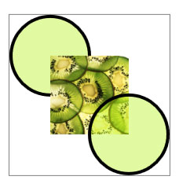
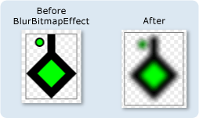
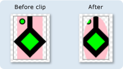

# Обзор объектов Drawing
В данном разделе представлены <xref:System.Windows.Media.Drawing> объектов и описывает их использование для эффективного рисования фигур, точечных рисунков, текста и мультимедиа. Используйте <xref:System.Windows.Media.Drawing> объектов при создании коллекции картинок, рисовании с помощью <xref:System.Windows.Media.DrawingBrush>, или использовать <xref:System.Windows.Media.Visual> объектов.  

   
## Что такое объект-рисунок?  
 Объект <xref:System.Windows.Media.Drawing> объект описывает отображаемое содержимое, например фигуру, растровое изображение, видео или строку текста. Различные типы рисунков описывают различные типы содержимого. Ниже приведен список различных типов объектов-рисунков.  
  
-   <xref:System.Windows.Media.GeometryDrawing> — Выводит фигуру.  
  
-   <xref:System.Windows.Media.ImageDrawing> — Выводит изображение.  
  
-   <xref:System.Windows.Media.GlyphRunDrawing> — Выводит текст.  
  
-   <xref:System.Windows.Media.VideoDrawing> — Воспроизводит аудио-или видео.  
  
-   <xref:System.Windows.Media.DrawingGroup> — Выводит другие рисунки. Для объединения рисунков в один составной используйте группирование рисунков.  
  
 <xref:System.Windows.Media.Drawing> объекты являются универсальными. Существует много способов, которые можно использовать <xref:System.Windows.Media.Drawing> объекта.  
  
-   Можно отобразить его как изображение с помощью <xref:System.Windows.Media.DrawingImage> и <xref:System.Windows.Controls.Image> элемента управления.  
  
-   Вы можете использовать его с <xref:System.Windows.Media.DrawingBrush> для рисования объекта, такие как <xref:System.Windows.Controls.Page.Background%2A> из <xref:System.Windows.Controls.Page>.  
  
-   Его можно использовать для описания внешнего вида <xref:System.Windows.Media.DrawingVisual>.  
  
-   Его можно использовать для перечисления содержимого <xref:System.Windows.Media.Visual>.  
  
 WPF предоставляет другие типы объектов, которые поддерживают рисование фигур, растровых изображений, текста и мультимедиа. Например, можно также использовать <xref:System.Windows.Shapes.Shape> объектов для рисования фигур и <xref:System.Windows.Controls.MediaElement> управления предоставляют еще один способ добавить видео в приложение. Поэтому когда следует использовать <xref:System.Windows.Media.Drawing> объектов? Когда можно пожертвовать возможностями уровня среды ради улучшения производительности или при необходимости <xref:System.Windows.Freezable> функции. Так как <xref:System.Windows.Media.Drawing> объектов не поддерживают [макета](../advanced/layout.md), ввод и режим фокусировки, они обеспечивают выигрыш в производительности, делает их идеальными для описания фона, коллекций картинок и низкоуровневых рисунков с <xref:System.Windows.Media.Visual> объектов.  
  
 Так как они представляют собой тип <xref:System.Windows.Freezable> объекта, <xref:System.Windows.Media.Drawing> объекты получают некоторые специальные особенности, которые включают следующие: они могут объявляться как [ресурсы](../advanced/xaml-resources.md), общие для нескольких объектов, делать доступными только для чтения с целью повышения производительности, клонировать и делать потокобезопасными. Дополнительные сведения о различных возможностях, предоставляемых <xref:System.Windows.Freezable> объектов, см. в разделе [Freezable Общие сведения об объектах](../advanced/freezable-objects-overview.md).  
  
   
## Рисование фигуры  
 Чтобы нарисовать фигуру, используйте <xref:System.Windows.Media.GeometryDrawing>. Прорисовки <xref:System.Windows.Media.GeometryDrawing.Geometry%2A> свойство описывает форму, его <xref:System.Windows.Media.GeometryDrawing.Brush%2A> свойство описывает закрашивание внутренней части фигуры и его <xref:System.Windows.Media.GeometryDrawing.Pen%2A> свойство описывает, как должно отображаться его контура.  
  
 В следующем примере используется <xref:System.Windows.Media.GeometryDrawing> для рисования фигуры. Фигура описывается <xref:System.Windows.Media.GeometryGroup> и два <xref:System.Windows.Media.EllipseGeometry> объектов. Фигуры закрашивается кистью <xref:System.Windows.Media.LinearGradientBrush> и ее контур рисуется пером <xref:System.Windows.Media.Brushes.Black%2A> <xref:System.Windows.Media.Pen>.  
  
 В этом примере создаются следующие <xref:System.Windows.Media.GeometryDrawing>.  
  
   
Объект GeometryDrawing  
  
 [!code-csharp[DrawingMiscSnippets_snip#GeometryDrawingExampleInline](~/samples/snippets/csharp/VS_Snippets_Wpf/DrawingMiscSnippets_snip/CSharp/GeometryDrawingExample.cs#geometrydrawingexampleinline)]
 [!code-xaml[DrawingMiscSnippets_snip#GeometryDrawingExampleInline](~/samples/snippets/xaml/VS_Snippets_Wpf/DrawingMiscSnippets_snip/XAML/GeometryDrawingExample.xaml#geometrydrawingexampleinline)]  
  
 Полный пример см. в разделе [Создание GeometryDrawing](how-to-create-a-geometrydrawing.md).  
  
 Другие <xref:System.Windows.Media.Geometry> классов, таких как <xref:System.Windows.Media.PathGeometry> позволяют создавать более сложные фигуры, кривых и дуг. Дополнительные сведения о <xref:System.Windows.Media.Geometry> объектов, см. в разделе [Общие сведения о геометрии](geometry-overview.md).  
  
 Дополнительные сведения о других способах рисования фигур, которые не используют <xref:System.Windows.Media.Drawing> объектов, см. в разделе [фигур и базовых средств рисования в WPF Обзор](shapes-and-basic-drawing-in-wpf-overview.md).  
  
   
## Рисование изображения  
 Для рисования изображения, следует использовать <xref:System.Windows.Media.ImageDrawing>. <xref:System.Windows.Media.ImageDrawing> Объекта <xref:System.Windows.Media.ImageDrawing.ImageSource%2A> свойство описывает изображения для рисования и его <xref:System.Windows.Media.ImageDrawing.Rect%2A> свойство определяет область, где рисуется изображение.  
  
 В следующем примере изображение рисуется в прямоугольнике, расположенном в точке (75,75) и имеющем размер 100 на 100 пикселей. На следующем рисунке показано <xref:System.Windows.Media.ImageDrawing> созданный в примере. Серая рамка был добавлен, чтобы показать границы <xref:System.Windows.Media.ImageDrawing>.  
  
   
ImageDrawing размером 100 на 100  
  
 [!code-csharp[DrawingMiscSnippets_snip#ImageDrawing100by100Inline](~/samples/snippets/csharp/VS_Snippets_Wpf/DrawingMiscSnippets_snip/CSharp/ImageDrawingExample.cs#imagedrawing100by100inline)]
 [!code-xaml[DrawingMiscSnippets_snip#ImageDrawing100by100Inline](~/samples/snippets/xaml/VS_Snippets_Wpf/DrawingMiscSnippets_snip/XAML/ImageDrawingExample.xaml#imagedrawing100by100inline)]  
  
 Дополнительную информацию об изображениях см. в разделе [Общие сведения об изображениях](imaging-overview.md).  
  
   
## Воспроизведение мультимедиа (только код)  
  
> [!NOTE]
>  Несмотря на то, что можно объявить <xref:System.Windows.Media.VideoDrawing> в [!INCLUDE[TLA#tla_xaml](../../../../includes/tlasharptla-xaml-md.md)], вы можете только загружать и воспроизводить соответствующие мультимедиа с помощью кода. Чтобы воспроизвести видео в [!INCLUDE[TLA#tla_xaml](../../../../includes/tlasharptla-xaml-md.md)], используйте <xref:System.Windows.Controls.MediaElement> вместо этого.  
  
 Для воспроизведения аудио-или видео, используйте <xref:System.Windows.Media.VideoDrawing> и <xref:System.Windows.Media.MediaPlayer>. Есть два способа загрузки и воспроизведения мультимедиа. Первый заключается в использовании <xref:System.Windows.Media.MediaPlayer> и <xref:System.Windows.Media.VideoDrawing> , а второй способ состоит в создании собственных <xref:System.Windows.Media.MediaTimeline> для использования с <xref:System.Windows.Media.MediaPlayer> и <xref:System.Windows.Media.VideoDrawing>.  
  
> [!NOTE]
>  При распространении мультимедиа с приложением, в отличие от изображений, файл мультимедиа нельзя использовать как ресурс проекта. Вместо этого в файле проекта необходимо выбрать тип мультимедиа `Content` и задать для `CopyToOutputDirectory` значение `PreserveNewest` или `Always`.  
  
 Для воспроизведения файлов мультимедиа без создания собственной <xref:System.Windows.Media.MediaTimeline>, выполните следующие действия.  
  
1. Создание объекта <xref:System.Windows.Media.MediaPlayer>.  
  
     [!code-csharp[DrawingMiscSnippets_snip#VideoDrawingExampleInline1](~/samples/snippets/csharp/VS_Snippets_Wpf/DrawingMiscSnippets_snip/CSharp/VideoDrawingExample.cs#videodrawingexampleinline1)]  
  
2. Используйте <xref:System.Windows.Media.MediaPlayer.Open%2A> метод для загрузки файла мультимедиа.  
  
     [!code-csharp[DrawingMiscSnippets_snip#VideoDrawingExampleInline2](~/samples/snippets/csharp/VS_Snippets_Wpf/DrawingMiscSnippets_snip/CSharp/VideoDrawingExample.cs#videodrawingexampleinline2)]  
  
3. Создайте таблицу <xref:System.Windows.Media.VideoDrawing>.  
  
     [!code-csharp[DrawingMiscSnippets_snip#VideoDrawingExampleInline3](~/samples/snippets/csharp/VS_Snippets_Wpf/DrawingMiscSnippets_snip/CSharp/VideoDrawingExample.cs#videodrawingexampleinline3)]  
  
4. Укажите размер и расположение для отображения мультимедиа, задав <xref:System.Windows.Media.VideoDrawing.Rect%2A> свойство <xref:System.Windows.Media.VideoDrawing>.  
  
     [!code-csharp[DrawingMiscSnippets_snip#VideoDrawingExampleInline4](~/samples/snippets/csharp/VS_Snippets_Wpf/DrawingMiscSnippets_snip/CSharp/VideoDrawingExample.cs#videodrawingexampleinline4)]  
  
5. Задайте <xref:System.Windows.Media.VideoDrawing.Player%2A> свойство <xref:System.Windows.Media.VideoDrawing> с <xref:System.Windows.Media.MediaPlayer> был создан.  
  
     [!code-csharp[DrawingMiscSnippets_snip#VideoDrawingExampleInline5](~/samples/snippets/csharp/VS_Snippets_Wpf/DrawingMiscSnippets_snip/CSharp/VideoDrawingExample.cs#videodrawingexampleinline5)]  
  
6. Используйте <xref:System.Windows.Media.MediaPlayer.Play%2A> метод <xref:System.Windows.Media.MediaPlayer> для начала воспроизведения мультимедиа.  
  
     [!code-csharp[DrawingMiscSnippets_snip#VideoDrawingExampleInline6](~/samples/snippets/csharp/VS_Snippets_Wpf/DrawingMiscSnippets_snip/CSharp/VideoDrawingExample.cs#videodrawingexampleinline6)]  
  
 В следующем примере используется <xref:System.Windows.Media.VideoDrawing> и <xref:System.Windows.Media.MediaPlayer> для однократного воспроизведения видеофайла.  
  
 [!code-csharp[DrawingMiscSnippets_snip#VideoDrawingExampleInline](~/samples/snippets/csharp/VS_Snippets_Wpf/DrawingMiscSnippets_snip/CSharp/VideoDrawingExample.cs#videodrawingexampleinline)]  
  
 Чтобы получить дополнительное управление временем для мультимедиа, используйте <xref:System.Windows.Media.MediaTimeline> с <xref:System.Windows.Media.MediaPlayer> и <xref:System.Windows.Media.VideoDrawing> объектов. <xref:System.Windows.Media.MediaTimeline> Позволяет указать, следует ли повторять видео. Чтобы использовать <xref:System.Windows.Media.MediaTimeline> с <xref:System.Windows.Media.VideoDrawing>, выполните следующие действия:  
  
1. Объявите <xref:System.Windows.Media.MediaTimeline> и задайте ее временные характеристики.  
  
     [!code-csharp[DrawingMiscSnippets_snip#RepeatingVideoDrawingExampleInline1](~/samples/snippets/csharp/VS_Snippets_Wpf/DrawingMiscSnippets_snip/CSharp/VideoDrawingExample.cs#repeatingvideodrawingexampleinline1)]  
  
2. Создание <xref:System.Windows.Media.MediaClock> из <xref:System.Windows.Media.MediaTimeline>.  
  
     [!code-csharp[DrawingMiscSnippets_snip#RepeatingVideoDrawingExampleInline2](~/samples/snippets/csharp/VS_Snippets_Wpf/DrawingMiscSnippets_snip/CSharp/VideoDrawingExample.cs#repeatingvideodrawingexampleinline2)]  
  
3. Создание <xref:System.Windows.Media.MediaPlayer> и использовать <xref:System.Windows.Media.MediaClock> присвоить его <xref:System.Windows.Media.MediaPlayer.Clock%2A> свойство.  
  
     [!code-csharp[DrawingMiscSnippets_snip#RepeatingVideoDrawingExampleInline3](~/samples/snippets/csharp/VS_Snippets_Wpf/DrawingMiscSnippets_snip/CSharp/VideoDrawingExample.cs#repeatingvideodrawingexampleinline3)]  
  
4. Создание <xref:System.Windows.Media.VideoDrawing> и назначить <xref:System.Windows.Media.MediaPlayer> для <xref:System.Windows.Media.VideoDrawing.Player%2A> свойство <xref:System.Windows.Media.VideoDrawing>.  
  
     [!code-csharp[DrawingMiscSnippets_snip#RepeatingVideoDrawingExampleInline4](~/samples/snippets/csharp/VS_Snippets_Wpf/DrawingMiscSnippets_snip/CSharp/VideoDrawingExample.cs#repeatingvideodrawingexampleinline4)]  
  
 В следующем примере используется <xref:System.Windows.Media.MediaTimeline> с <xref:System.Windows.Media.MediaPlayer> и <xref:System.Windows.Media.VideoDrawing> для воспроизведения видео.  
  
 [!code-csharp[DrawingMiscSnippets_snip#RepeatingVideoDrawingExampleInline](~/samples/snippets/csharp/VS_Snippets_Wpf/DrawingMiscSnippets_snip/CSharp/VideoDrawingExample.cs#repeatingvideodrawingexampleinline)]  
  
 Обратите внимание, что при использовании <xref:System.Windows.Media.MediaTimeline>, интерактивный <xref:System.Windows.Media.Animation.ClockController> возвращаемые <xref:System.Windows.Media.Animation.Clock.Controller%2A> свойство <xref:System.Windows.Media.MediaClock> для управления воспроизведением мультимедиа, а не интерактивные методы <xref:System.Windows.Media.MediaPlayer>.  
  
   
## Рисование текста  
 Для рисования текста, следует использовать <xref:System.Windows.Media.GlyphRunDrawing> и <xref:System.Windows.Media.GlyphRun>. В следующем примере используется <xref:System.Windows.Media.GlyphRunDrawing> для рисования текста «Hello, World!».  
  
 [!code-csharp[DrawingMiscSnippets_snip#GlyphRunDrawingExampleInline](~/samples/snippets/csharp/VS_Snippets_Wpf/DrawingMiscSnippets_snip/CSharp/GlyphRunDrawingExample.cs#glyphrundrawingexampleinline)]
 [!code-xaml[DrawingMiscSnippets_snip#GlyphRunDrawingExampleInline](~/samples/snippets/xaml/VS_Snippets_Wpf/DrawingMiscSnippets_snip/XAML/GlyphRunExample.xaml#glyphrundrawingexampleinline)]  
  
 Объект <xref:System.Windows.Media.GlyphRun> — это низкоуровневый объект, предназначенный для использования с представления документов фиксированного формата и сценариев печати. Рисование текста на экран является простым способом является использование <xref:System.Windows.Controls.Label> или <xref:System.Windows.Controls.TextBlock>. Дополнительные сведения о <xref:System.Windows.Media.GlyphRun>, см. в разделе [Знакомство с объектом GlyphRun и элементом Glyphs](../advanced/introduction-to-the-glyphrun-object-and-glyphs-element.md) Обзор.  
  
   
## Составные рисунки  
 Объект <xref:System.Windows.Media.DrawingGroup> позволяет объединить несколько рисунков в один составной рисунок. С помощью <xref:System.Windows.Media.DrawingGroup>, фигуры, изображения и текст можно объединить в единую <xref:System.Windows.Media.Drawing> объекта.  
  
 В следующем примере используется <xref:System.Windows.Media.DrawingGroup> сочетание двух <xref:System.Windows.Media.GeometryDrawing> объектов и <xref:System.Windows.Media.ImageDrawing> объекта. В этом примере формируются следующие данные:  
  
   
Составной рисунок  
  
 [!code-csharp[DrawingMiscSnippets_snip#GraphicsMMSimpleDrawingGroupExample](~/samples/snippets/csharp/VS_Snippets_Wpf/DrawingMiscSnippets_snip/CSharp/DrawingGroupExample.cs#graphicsmmsimpledrawinggroupexample)]
 [!code-xaml[DrawingMiscSnippets_snip#GraphicsMMSimpleDrawingGroupExample](~/samples/snippets/xaml/VS_Snippets_Wpf/DrawingMiscSnippets_snip/XAML/DrawingGroupExample.xaml#graphicsmmsimpledrawinggroupexample)]  
  
 Объект <xref:System.Windows.Media.DrawingGroup> также позволяет применить к его содержимому маски непрозрачности, преобразования, эффекты для точечных рисунков и другие операции. <xref:System.Windows.Media.DrawingGroup> операции применяются в следующем порядке: <xref:System.Windows.Media.DrawingGroup.OpacityMask%2A>, <xref:System.Windows.Media.DrawingGroup.Opacity%2A>, <xref:System.Windows.Media.DrawingGroup.BitmapEffect%2A>, <xref:System.Windows.Media.DrawingGroup.ClipGeometry%2A>, <xref:System.Windows.Media.DrawingGroup.GuidelineSet%2A>, а затем <xref:System.Windows.Media.DrawingGroup.Transform%2A>.  
  
 Ниже показан порядок, в котором <xref:System.Windows.Media.DrawingGroup> применяются операции.  
  
   
Порядок операций для DrawingGroup  
  
 В следующей таблице описаны свойства, можно использовать для управления <xref:System.Windows.Media.DrawingGroup> содержимое объекта.  
  
|Свойство|Описание|Рисунки|  
|--------------|-----------------|------------------|  
|<xref:System.Windows.Media.DrawingGroup.OpacityMask%2A>|Изменяет прозрачность выбранных частей <xref:System.Windows.Media.DrawingGroup> содержимое. Пример см. в статье [Практическое руководство. Управление прозрачностью рисунка](https://docs.microsoft.com/previous-versions/dotnet/netframework-3.5/ms748242(v=vs.90)).||  
|<xref:System.Windows.Media.DrawingGroup.Opacity%2A>|Однородно изменяет прозрачность <xref:System.Windows.Media.DrawingGroup> содержимое. Это свойство используется, чтобы сделать <xref:System.Windows.Media.Drawing> прозрачным или полупрозрачным. Пример см. в статье [Практическое руководство. Применение маски непрозрачности к рисунку](https://docs.microsoft.com/previous-versions/dotnet/netframework-3.5/ms753195(v=vs.90)).||  
|<xref:System.Windows.Media.DrawingGroup.BitmapEffect%2A>|Применяет <xref:System.Windows.Media.Effects.BitmapEffect> для <xref:System.Windows.Media.DrawingGroup> содержимое. Пример см. в статье [Практическое руководство. Применение BitmapEffect к рисунку](https://docs.microsoft.com/previous-versions/dotnet/netframework-3.5/ms752341(v=vs.90)).||  
|<xref:System.Windows.Media.DrawingGroup.ClipGeometry%2A>|Клипов <xref:System.Windows.Media.DrawingGroup> содержимое области, заданной с помощью <xref:System.Windows.Media.Geometry>. Пример см. в статье [Практическое руководство. Обрезка рисунка](https://docs.microsoft.com/previous-versions/dotnet/netframework-3.5/ms743068(v=vs.90)) .||  
|<xref:System.Windows.Media.DrawingGroup.GuidelineSet%2A>|Привязывает аппаратно-независимые пиксели к пикселям устройства, следуя указанным правилам. Это свойство полезно для обеспечения резкой отрисовки высокодетализированной графики на дисплеях с низким разрешением. Пример см. в разделе [Применение GuidelineSet к рисунку](how-to-apply-a-guidelineset-to-a-drawing.md).||  
|<xref:System.Windows.Media.DrawingGroup.Transform%2A>|Преобразует <xref:System.Windows.Media.DrawingGroup> содержимое. Пример см. в статье [Практическое руководство. Применение преобразования к рисунку](https://docs.microsoft.com/previous-versions/dotnet/netframework-3.5/ms742304(v=vs.90)).||  
  
   
## Отображение рисунка в виде изображения  
 Для отображения <xref:System.Windows.Media.Drawing> с <xref:System.Windows.Controls.Image> управления, используйте <xref:System.Windows.Media.DrawingImage> как <xref:System.Windows.Controls.Image> элемента управления <xref:System.Windows.Controls.Image.Source%2A> и задайте <xref:System.Windows.Media.DrawingImage> объекта <xref:System.Windows.Media.DrawingImage.Drawing%2A?displayProperty=nameWithType> свойства в документе, вы хотите отобразить.  
  
 В следующем примере используется <xref:System.Windows.Media.DrawingImage> и <xref:System.Windows.Controls.Image> управления для отображения <xref:System.Windows.Media.GeometryDrawing>. В этом примере формируются следующие данные:  
  
   
Объект DrawingImage  
  
 [!code-csharp[DrawingMiscSnippets_snip#DrawingImageExampleWholePage](~/samples/snippets/csharp/VS_Snippets_Wpf/DrawingMiscSnippets_snip/CSharp/DrawingImageExample.cs#drawingimageexamplewholepage)]
 [!code-xaml[DrawingMiscSnippets_snip#DrawingImageExampleWholePage](~/samples/snippets/xaml/VS_Snippets_Wpf/DrawingMiscSnippets_snip/XAML/DrawingImageExample.xaml#drawingimageexamplewholepage)]  
  
   
## Заполнение объекта с помощью рисунка  
 Объект <xref:System.Windows.Media.DrawingBrush> — это тип кисти, которая закрашивает область объектом-рисунком. Этот объект можно использовать для закраски практически любого графического объекта с помощью рисунка. <xref:System.Windows.Media.Drawing> Свойство <xref:System.Windows.Media.DrawingBrush> описывает его <xref:System.Windows.Media.DrawingBrush.Drawing%2A>. Для подготовки к просмотру <xref:System.Windows.Media.Drawing> с <xref:System.Windows.Media.DrawingBrush>, добавьте его к кисти с использованием кисти <xref:System.Windows.Media.Drawing> свойства и используйте кисть для закраски графического объекта, такого как элемент управления или панели.  
  
 В следующих примерах используется <xref:System.Windows.Media.DrawingBrush> для закрашивания <xref:System.Windows.Shapes.Shape.Fill%2A> из <xref:System.Windows.Shapes.Rectangle> шаблоном, созданным из <xref:System.Windows.Media.GeometryDrawing>. В этом примере формируются следующие данные:  
  
   
GeometryDrawing с DrawingBrush  
  
 [!code-csharp[DrawingMiscSnippets_snip#DrawingBrushExampleWholePage](~/samples/snippets/csharp/VS_Snippets_Wpf/DrawingMiscSnippets_snip/CSharp/DrawingBrushExample.cs#drawingbrushexamplewholepage)]
 [!code-xaml[DrawingMiscSnippets_snip#DrawingBrushExampleWholePage](~/samples/snippets/xaml/VS_Snippets_Wpf/DrawingMiscSnippets_snip/XAML/DrawingBrushExample.xaml#drawingbrushexamplewholepage)]  
  
 <xref:System.Windows.Media.DrawingBrush> Класс предоставляет разнообразные варианты растягивания и мозаичного заполнения своего содержимого. Дополнительные сведения о <xref:System.Windows.Media.DrawingBrush>, см. в разделе [Рисование с помощью изображений, рисунков и визуальных элементов](painting-with-images-drawings-and-visuals.md) Обзор.  
  
   
## Рисование с помощью объектов Visual  
 Объект <xref:System.Windows.Media.DrawingVisual> — это тип визуального объекта, предназначенного для отрисовки рисунка. Работа непосредственно на визуальном уровне является инструментом для разработчиков, которым требуется построить настраиваемую графическую среду, и не описывается в этом обзоре. Дополнительные сведения см. в разделе [Использование объектов DrawingVisual](using-drawingvisual-objects.md).  
  
   
## Объекты DrawingContext  
 <xref:System.Windows.Media.DrawingContext> Позволяет заполнить <xref:System.Windows.Media.Visual> или <xref:System.Windows.Media.Drawing> визуальным содержимым. Многие такие низкоуровневые графические объекты используют <xref:System.Windows.Media.DrawingContext> так, как он описывает графическое содержимое очень эффективно.  
  
 Несмотря на то что <xref:System.Windows.Media.DrawingContext> методы рисования выглядеть методы рисования <xref:System.Drawing.Graphics?displayProperty=nameWithType> типа, они фактически сильно отличаются. <xref:System.Windows.Media.DrawingContext> — используется с графической системой сохраненного режима, а <xref:System.Drawing.Graphics?displayProperty=nameWithType> тип используется с графической системой непосредственного режима. При использовании <xref:System.Windows.Media.DrawingContext> команд рисования объекта, фактически сохраняется набор инструкций отрисовки (хотя фактический механизм сохранения зависит от типа объекта, предоставляющего <xref:System.Windows.Media.DrawingContext>), будет использоваться позже по графику системы; не выполняется рисование на экране в режиме реального времени. Дополнительные сведения о том, как работает графическая система Windows Presentation Foundation (WPF), см. в разделе [Обзор отрисовки графики WPF](wpf-graphics-rendering-overview.md).  
  
 Вы никогда непосредственно не создаете экземпляр <xref:System.Windows.Media.DrawingContext>, однако можете получить контекст рисования с помощью определенных методов, например <xref:System.Windows.Media.DrawingGroup.Open%2A?displayProperty=nameWithType> и <xref:System.Windows.Media.DrawingVisual.RenderOpen%2A?displayProperty=nameWithType>.  
  
   
## Перечисление содержимого визуального элемента  
 Наряду с другими своими возможностями, объекты <xref:System.Windows.Media.Drawing> также предоставляют объектную модель для перечисления содержимого <xref:System.Windows.Media.Visual>.  
  
 В следующем примере метод <xref:System.Windows.Media.VisualTreeHelper.GetDrawing%2A> используется для извлечения значения <xref:System.Windows.Media.DrawingGroup> из <xref:System.Windows.Media.Visual> и перечисления содержимого группы.  
  
 [!code-csharp[DrawingMiscSnippets_snip#GraphicsMMRetrieveDrawings](~/samples/snippets/csharp/VS_Snippets_Wpf/DrawingMiscSnippets_snip/CSharp/EnumerateDrawingsExample.xaml.cs#graphicsmmretrievedrawings)]  
  
## См. также

- <xref:System.Windows.Media.Drawing>
- <xref:System.Windows.Media.DrawingGroup>
- [Двумерная графика и изображения](../advanced/optimizing-performance-2d-graphics-and-imaging.md)
- [Рисование с помощью объектов Image, Drawing и Visual](painting-with-images-drawings-and-visuals.md)
- [Общие сведения о классе Geometry](geometry-overview.md)
- [Обзор фигур и базовых средств рисования в приложении WPF](shapes-and-basic-drawing-in-wpf-overview.md)
- [Общие сведения об отрисовке графики в WPF](wpf-graphics-rendering-overview.md)
- [Общие сведения об объектах класса Freezable](../advanced/freezable-objects-overview.md)
- [Практические руководства](drawings-how-to-topics.md)
