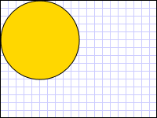
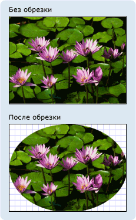
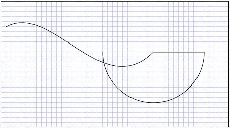
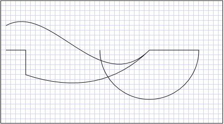
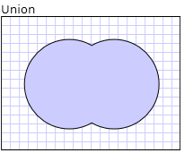
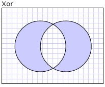

# Общие сведения о классе Geometry
В этом обзоре описывается использование Windows Presentation Foundation (WPF) <xref:System.Windows.Media.Geometry> классов для описания фигур. В этом разделе также приведены различия между <xref:System.Windows.Media.Geometry> объектов и <xref:System.Windows.Shapes.Shape> элементов.  

   
## Что такое класс Geometry?  
 <xref:System.Windows.Media.Geometry> Класс и классы, производные от него, такие как <xref:System.Windows.Media.EllipseGeometry>, <xref:System.Windows.Media.PathGeometry>, и <xref:System.Windows.Media.CombinedGeometry>, позволяют описывать геометрию двумерной фигуры. Данные геометрические описания имеют множество применений, например определение фигуры для рисования на экране или определение областей проверки нажатия и областей обрезки. Геометрию можно даже использовать для определения пути анимации.  
  
 <xref:System.Windows.Media.Geometry> объекты могут быть простыми, такими как прямоугольники и круги или сложными, созданными из двух или более геометрических объектов.  Более сложные геометрические объекты могут быть созданы с помощью <xref:System.Windows.Media.PathGeometry> и <xref:System.Windows.Media.StreamGeometry> классы, которые позволяют описывать дуги и кривые.  
  
 Так как <xref:System.Windows.Media.Geometry> — это разновидность <xref:System.Windows.Freezable>, <xref:System.Windows.Media.Geometry> объекты предоставляют ряд специальных возможностей: их можно объявлять как [ресурсы](../advanced/xaml-resources.md), общие для нескольких объектов, делать доступными только для чтения с целью повышения производительности, клонировать, и делать потокобезопасными. Дополнительные сведения о различных возможностях, предоставляемых <xref:System.Windows.Freezable> объектов, см. в разделе [Freezable Общие сведения об объектах](../advanced/freezable-objects-overview.md).  
  
   
## Геометрические объекты и Фигур  
 <xref:System.Windows.Media.Geometry> И <xref:System.Windows.Shapes.Shape> классы похожи тем, что они описывают двумерные фигуры (сравнить <xref:System.Windows.Media.EllipseGeometry> и <xref:System.Windows.Shapes.Ellipse> например), однако существуют важные различия.  
  
 Например <xref:System.Windows.Media.Geometry> класс наследует от <xref:System.Windows.Freezable> класс при <xref:System.Windows.Shapes.Shape> класс наследует от <xref:System.Windows.FrameworkElement>. Так как они являются элементами, <xref:System.Windows.Shapes.Shape> объекты могут отображаться сами и участвовать в системе макета, хотя <xref:System.Windows.Media.Geometry> объектов невозможно.  
  
 Несмотря на то что <xref:System.Windows.Shapes.Shape> объекты являются легче работать, чем <xref:System.Windows.Media.Geometry> объектов, <xref:System.Windows.Media.Geometry> объекты являются более гибкими. Хотя <xref:System.Windows.Shapes.Shape> объект используется для отрисовки двумерной графики, <xref:System.Windows.Media.Geometry> объект можно использовать для определения геометрической области для двумерной графики, определения области обрезки или определить область для проверки нажатия, например.  
  
### Форма контура  
 Один <xref:System.Windows.Shapes.Shape>, <xref:System.Windows.Shapes.Path> классом, фактически <xref:System.Windows.Media.Geometry> для описания своего содержимого. Установив <xref:System.Windows.Shapes.Path.Data%2A> свойство <xref:System.Windows.Shapes.Path> с <xref:System.Windows.Media.Geometry> и задав его <xref:System.Windows.Shapes.Shape.Fill%2A> и <xref:System.Windows.Shapes.Shape.Stroke%2A> свойства, можно отображать <xref:System.Windows.Media.Geometry>.  
  
   
## Общие свойства, принимающие объект класса Geometry  
 В предыдущих разделах упоминалось, что объекты класса Geometry могут использоваться с другими объектами для различных целей, например для рисования фигур, анимации и обрезки. В следующей таблице перечислены несколько классов, имеющих свойства, принимающие <xref:System.Windows.Media.Geometry> объекта.  
  
|Тип|Свойство|  
|----------|--------------|  
|<xref:System.Windows.Media.Animation.DoubleAnimationUsingPath>|<xref:System.Windows.Media.Animation.DoubleAnimationUsingPath.PathGeometry%2A>|  
|<xref:System.Windows.Media.DrawingGroup>|<xref:System.Windows.Media.DrawingGroup.ClipGeometry%2A>|  
|<xref:System.Windows.Media.GeometryDrawing>|<xref:System.Windows.Media.GeometryDrawing.Geometry%2A>|  
|<xref:System.Windows.Shapes.Path>|<xref:System.Windows.Shapes.Path.Data%2A>|  
|<xref:System.Windows.UIElement>|<xref:System.Windows.UIElement.Clip%2A>|  
  
   
## Простые геометрические типы  
 Базовый класс для всех геометрических объектов является абстрактным классом <xref:System.Windows.Media.Geometry>.  Классы, которые являются производными от <xref:System.Windows.Media.Geometry> класса можно условно разделить на три категории: простые геометрические объекты, геометрические объекты пути и составные геометрические объекты.  
  
 Простые геометрические классы включают <xref:System.Windows.Media.LineGeometry>, <xref:System.Windows.Media.RectangleGeometry>, и <xref:System.Windows.Media.EllipseGeometry> и используются для создания простых геометрических фигур, таких как линии, прямоугольники и круги.  
  
-   Объект <xref:System.Windows.Media.LineGeometry> определяется путем указания начальной точки строки, а также конечную точку.  
  
-   Объект <xref:System.Windows.Media.RectangleGeometry> определяется с помощью <xref:System.Windows.Rect> структуры, указывающий его относительное положение, высоту и ширину. Можно создать прямоугольник с закругленными углами, установив <xref:System.Windows.Media.RectangleGeometry.RadiusX%2A> и <xref:System.Windows.Media.RectangleGeometry.RadiusY%2A> свойства.  
  
-   <xref:System.Windows.Media.EllipseGeometry> Определяется центральной точки, радиус по оси x и y радиус.  Следующие примеры показывают, как создать простые геометрические объекты для отображения и для обрезки.  
  
 Эти же фигуры, а также более сложные фигуры, могут создаваться с использованием <xref:System.Windows.Media.PathGeometry> или путем объединения геометрических объектов, но эти классы предоставляют более простые средства для создания таких простых геометрических фигур.  
  
 В следующем примере показано, как создать и отобразить <xref:System.Windows.Media.LineGeometry>.  Как отмечалось ранее, <xref:System.Windows.Media.Geometry> объекта не может нарисовать сам себя, поэтому в примере используется <xref:System.Windows.Shapes.Path> фигуру для отображения линии.  Поскольку линия не имеет площади, задание <xref:System.Windows.Shapes.Shape.Fill%2A> свойство <xref:System.Windows.Shapes.Path> не имеет смысла; вместо этого только <xref:System.Windows.Shapes.Shape.Stroke%2A> и <xref:System.Windows.Shapes.Shape.StrokeThickness%2A> указаны свойства. На следующем рисунке показан результат выполнения этого примера.  
  
   
Объект LineGeometry, соединяющий точки (10,20) и (100,130)  
  
 [!code-xaml[GeometryOverviewSamples_snip#GraphicsMMLineGeometryExample](~/samples/snippets/csharp/VS_Snippets_Wpf/GeometryOverviewSamples_snip/CS/GeometryExamples.xaml#graphicsmmlinegeometryexample)]  
  
 [!code-csharp[GeometryOverviewSamples_procedural_snip#GraphicsMMLineGeometryExample](~/samples/snippets/csharp/VS_Snippets_Wpf/GeometryOverviewSamples_procedural_snip/CSharp/GeometryExamples.cs#graphicsmmlinegeometryexample)]
   
  
 В следующем примере показано, как создать и отобразить <xref:System.Windows.Media.EllipseGeometry>.  Примеры устанавливают <xref:System.Windows.Media.EllipseGeometry.Center%2A> из <xref:System.Windows.Media.EllipseGeometry> укажите точки `50,50` а радиус по оси x и y радиус задаются равными `50`, результате создается круг диаметром 100.  Внутреннюю часть эллипса закрашивается путем присвоения значения для свойства Fill элемента Path, в данном случае <xref:System.Windows.Media.Brushes.Gold%2A>. На следующем рисунке показан результат выполнения этого примера.  
  
   
Объект EllipseGeometry, нарисованный в точке (50,50)  
  
 [!code-xaml[GeometryOverviewSamples_snip#GraphicsMMEllipseGeometryExample](~/samples/snippets/csharp/VS_Snippets_Wpf/GeometryOverviewSamples_snip/CS/GeometryExamples.xaml#graphicsmmellipsegeometryexample)]  
  
 [!code-csharp[GeometryOverviewSamples_procedural_snip#GraphicsMMEllipseGeometryExample](~/samples/snippets/csharp/VS_Snippets_Wpf/GeometryOverviewSamples_procedural_snip/CSharp/GeometryExamples.cs#graphicsmmellipsegeometryexample)]
   
  
 В следующем примере показано, как создать и отобразить <xref:System.Windows.Media.RectangleGeometry>.  Положение и размеры прямоугольника определяются <xref:System.Windows.Rect> структуры. Положение — `50,50`, высота и ширина — `25`. В результате получается квадрат. На следующем рисунке показан результат выполнения этого примера.  
  
   
Объект RectangleGeometry, нарисованный в точке 50,50  
  
 [!code-xaml[GeometryOverviewSamples_snip#GraphicsMMRectangleGeometryExample](~/samples/snippets/csharp/VS_Snippets_Wpf/GeometryOverviewSamples_snip/CS/GeometryExamples.xaml#graphicsmmrectanglegeometryexample)]  
  
 [!code-csharp[GeometryOverviewSamples_procedural_snip#GraphicsMMRectangleGeometryExample](~/samples/snippets/csharp/VS_Snippets_Wpf/GeometryOverviewSamples_procedural_snip/CSharp/GeometryExamples.cs#graphicsmmrectanglegeometryexample)]
   
  
 В следующем примере показано, как использовать <xref:System.Windows.Media.EllipseGeometry> качестве области обрезки для изображения.  <xref:System.Windows.Controls.Image> Объект определяется с помощью <xref:System.Windows.FrameworkElement.Width%2A> 200 и <xref:System.Windows.FrameworkElement.Height%2A> 150.  <xref:System.Windows.Media.EllipseGeometry> С <xref:System.Windows.Media.EllipseGeometry.RadiusX%2A> значение 100, <xref:System.Windows.Media.EllipseGeometry.RadiusY%2A> значение 75 и <xref:System.Windows.Media.EllipseGeometry.Center%2A> присваивается значение 100,75 <xref:System.Windows.UIElement.Clip%2A> свойства изображения.  Будет отображаться только часть изображения, находящаяся внутри эллипса. На следующем рисунке показан результат выполнения этого примера.  
  
   
Использование объекта EllipseGeometry для обрезки элемента управления Image  
  
 [!code-xaml[GeometryOverviewSamples_snip#GraphicsMMImageClipGeometryExample](~/samples/snippets/csharp/VS_Snippets_Wpf/GeometryOverviewSamples_snip/CS/GeometryExamples.xaml#graphicsmmimageclipgeometryexample)]  
  
 [!code-csharp[GeometryOverviewSamples_procedural_snip#GraphicsMMImageClipGeometryExample](~/samples/snippets/csharp/VS_Snippets_Wpf/GeometryOverviewSamples_procedural_snip/CSharp/GeometryExamples.cs#graphicsmmimageclipgeometryexample)]
   
  
   
## Геометрические объекты-контуры  
 <xref:System.Windows.Media.PathGeometry> Класс и его облегченный эквивалент <xref:System.Windows.Media.StreamGeometry> класса, предоставляют средства для описания сложных фигур состоящие из дуг, кривых и линий.  
  
 В сердце <xref:System.Windows.Media.PathGeometry> — это коллекция <xref:System.Windows.Media.PathFigure> объекты названы так, как каждая фигура описывает дискретную форму так, <xref:System.Windows.Media.PathGeometry>. Каждый <xref:System.Windows.Media.PathFigure> состоит из одного или нескольких <xref:System.Windows.Media.PathSegment> объектов, каждый из которых описывает сегмент фигуры.  
  
 Существует несколько типов сегментов.  
  
|Тип сегмента|Описание|Пример|  
|------------------|-----------------|-------------|  
|<xref:System.Windows.Media.ArcSegment>|Создает эллиптическую дугу между двумя точками.|[Создание эллиптической дуги](how-to-create-an-elliptical-arc.md).|  
|<xref:System.Windows.Media.BezierSegment>|Создает кривую Безье третьего порядка между двумя точками.|[Создание кривой Безье третьего порядка](how-to-create-a-cubic-bezier-curve.md).|  
|<xref:System.Windows.Media.LineSegment>|Создает линию между двумя точками.|[Создание LineSegment в PathGeometry](how-to-create-a-linesegment-in-a-pathgeometry.md)|  
|<xref:System.Windows.Media.PolyBezierSegment>|Создает набор кривых Безье третьего порядка.|См. в разделе <xref:System.Windows.Media.PolyBezierSegment> страница "тип".|  
|<xref:System.Windows.Media.PolyLineSegment>|Создает набор линий.|См. в разделе <xref:System.Windows.Media.PolyLineSegment> страница "тип".|  
|<xref:System.Windows.Media.PolyQuadraticBezierSegment>|Создает набор кривых Безье второго порядка.|См. в разделе <xref:System.Windows.Media.PolyQuadraticBezierSegment> страницы.|  
|<xref:System.Windows.Media.QuadraticBezierSegment>|Создает кривую Безье второго порядка.|[Создание кривой Безье второго порядка](how-to-create-a-quadratic-bezier-curve.md).|  
  
 Сегменты <xref:System.Windows.Media.PathFigure> объединяются в одну геометрическую форму конечную точку сегмента как начальную точку следующего сегмента. <xref:System.Windows.Media.PathFigure.StartPoint%2A> Свойство <xref:System.Windows.Media.PathFigure> указывает точку, от которой рисуется первый сегмент. Каждый последующий сегмент начинается в конечной точке предыдущего сегмента. Например, вертикальная линия от `10,50` для `10,150` может быть определена путем задания <xref:System.Windows.Media.PathFigure.StartPoint%2A> свойства `10,50` и создание <xref:System.Windows.Media.LineSegment> с <xref:System.Windows.Media.LineSegment.Point%2A> значение свойства `10,150`.  
  
 В следующем примере создается простой <xref:System.Windows.Media.PathGeometry> из одной <xref:System.Windows.Media.PathFigure> с <xref:System.Windows.Media.LineSegment> и отображается с использованием <xref:System.Windows.Shapes.Path> элемент. <xref:System.Windows.Media.PathFigure> Объекта <xref:System.Windows.Media.PathFigure.StartPoint%2A> присваивается `10,20` и <xref:System.Windows.Media.LineSegment> определен с конечной точкой `100,130`. На следующем рисунке показано <xref:System.Windows.Media.PathGeometry> созданный в этом примере.  
  
   
Контур PathGeometry, содержащий один LineSegment  
  
 [!code-xaml[GeometryOverviewSamples_snip#GraphicsMMPathGeometryLineExample](~/samples/snippets/csharp/VS_Snippets_Wpf/GeometryOverviewSamples_snip/CS/GeometryExamples.xaml#graphicsmmpathgeometrylineexample)]  
  
 [!code-csharp[GeometryOverviewSamples_procedural_snip#GraphicsMMPathGeometryLineExample](~/samples/snippets/csharp/VS_Snippets_Wpf/GeometryOverviewSamples_procedural_snip/CSharp/GeometryExamples.cs#graphicsmmpathgeometrylineexample)]
   
  
 Стоит сравнить этот пример с предыдущим <xref:System.Windows.Media.LineGeometry> пример.  Синтаксис, используемый для <xref:System.Windows.Media.PathGeometry> является гораздо более подробным, отличный от используемого для простого <xref:System.Windows.Media.LineGeometry>, и может быть целесообразнее использовать <xref:System.Windows.Media.LineGeometry> класса таким образом, но подробный синтаксис <xref:System.Windows.Media.PathGeometry> позволяет очень сложными и сложные геометрические области.  
  
 Более сложные геометрические объекты могут быть созданы с помощью сочетания <xref:System.Windows.Media.PathSegment> объектов.  
  
 В следующем примере используется <xref:System.Windows.Media.BezierSegment>, <xref:System.Windows.Media.LineSegment>и <xref:System.Windows.Media.ArcSegment> для создания фигуры. В примере сначала создается кривая Безье третьего порядка путем задания четырех точек: начальной точки, который является конечной точкой предыдущего сегмента, конечной точки (<xref:System.Windows.Media.BezierSegment.Point3%2A>), и двух контрольных точек (<xref:System.Windows.Media.BezierSegment.Point1%2A> и <xref:System.Windows.Media.BezierSegment.Point2%2A>).  Две контрольные точки кривой Безье третьего порядка ведут себя как магниты, притягивая к себе то, что без них было бы прямой линией. В результате получается кривая. Первая контрольная точка, <xref:System.Windows.Media.BezierSegment.Point1%2A>, влияет на начало кривой; вторая контрольная точка, <xref:System.Windows.Media.BezierSegment.Point2%2A>, влияет на конечную часть кривой.  
  
 Затем в примере добавляется <xref:System.Windows.Media.LineSegment>, который отрисовывается конечную точку предыдущего <xref:System.Windows.Media.BezierSegment> ей, предшествующую точку, заданную ее <xref:System.Windows.Media.LineSegment> свойство.  
  
 Затем в примере добавляется <xref:System.Windows.Media.ArcSegment>, который отрисовывается из конечной точки предыдущего <xref:System.Windows.Media.LineSegment> точку, заданную ее <xref:System.Windows.Media.ArcSegment.Point%2A> свойство. В примере также указывается x - и y Радиус дуги (<xref:System.Windows.Media.ArcSegment.Size%2A>), угол поворота (<xref:System.Windows.Media.ArcSegment.RotationAngle%2A>), флаг, указывающий, насколько большим должен быть угол дуги (<xref:System.Windows.Media.ArcSegment.IsLargeArc%2A>) и значение, указывающее направление, в котором рисуется дуга (<xref:System.Windows.Media.ArcSegment.SweepDirection%2A>). На следующей иллюстрации показана фигура, полученная в результате выполнения этого примера.  
  
   
Объект PathGeometry  
  
 [!code-xaml[GeometryOverviewSamples_snip#GraphicsMMPathGeometryComplexExample](~/samples/snippets/csharp/VS_Snippets_Wpf/GeometryOverviewSamples_snip/CS/GeometryExamples.xaml#graphicsmmpathgeometrycomplexexample)]  
  
 [!code-csharp[GeometryOverviewSamples_procedural_snip#GraphicsMMPathGeometryComplexExample](~/samples/snippets/csharp/VS_Snippets_Wpf/GeometryOverviewSamples_procedural_snip/CSharp/GeometryExamples.cs#graphicsmmpathgeometrycomplexexample)]
   
  
 Еще более сложные геометрические объекты могут создаваться с использованием нескольких <xref:System.Windows.Media.PathFigure> объектов в рамках <xref:System.Windows.Media.PathGeometry>.  
  
 В следующем примере создается <xref:System.Windows.Media.PathGeometry> с двумя <xref:System.Windows.Media.PathFigure> объектов, каждый из которых содержит несколько <xref:System.Windows.Media.PathSegment> объектов.  <xref:System.Windows.Media.PathFigure> Из приведенного выше примера и <xref:System.Windows.Media.PathFigure> с <xref:System.Windows.Media.PolyLineSegment> и <xref:System.Windows.Media.QuadraticBezierSegment> используются.  Объект <xref:System.Windows.Media.PolyLineSegment> определяется массивом точек и <xref:System.Windows.Media.QuadraticBezierSegment> определяется с помощью точки управления и конечной точки. На следующей иллюстрации показана фигура, полученная в результате выполнения этого примера.  
  
   
Объект PathGeometry из нескольких фигур  
  
 [!code-xaml[GeometryOverviewSamples_snip#GraphicsMMPathGeometryComplexMultiExample](~/samples/snippets/csharp/VS_Snippets_Wpf/GeometryOverviewSamples_snip/CS/GeometryExamples.xaml#graphicsmmpathgeometrycomplexmultiexample)]  
  
 [!code-csharp[GeometryOverviewSamples_procedural_snip#GraphicsMMPathGeometryComplexMultiExample](~/samples/snippets/csharp/VS_Snippets_Wpf/GeometryOverviewSamples_procedural_snip/CSharp/GeometryExamples.cs#graphicsmmpathgeometrycomplexmultiexample)]
   
  
### StreamGeometry  
 Как и <xref:System.Windows.Media.PathGeometry> класса <xref:System.Windows.Media.StreamGeometry> определяет сложную геометрическую форму, которая может содержать кривые, дуги и линии. В отличие от <xref:System.Windows.Media.PathGeometry>, содержимое <xref:System.Windows.Media.StreamGeometry> не поддерживают привязку данных, анимацию или изменения. Используйте <xref:System.Windows.Media.StreamGeometry> для описания сложной геометрии, но не требуется поддержка привязки данных, анимации или изменения. Из-за своей эффективности <xref:System.Windows.Media.StreamGeometry> класс хорошо подходит для описания графических элементов.  
  
 Пример см. в разделе [Создание фигуры с помощью класса StreamGeometry](how-to-create-a-shape-using-a-streamgeometry.md).  
  
### Синтаксис разметки пути  
 <xref:System.Windows.Media.PathGeometry> И <xref:System.Windows.Media.StreamGeometry> типы поддержки [!INCLUDE[TLA#tla_xaml](../../../../includes/tlasharptla-xaml-md.md)] синтаксис, с помощью специальных последовательностей перемещения атрибута и команд рисования. Дополнительные сведения см. в разделе [Синтаксис разметки пути](path-markup-syntax.md).  
  
   
## Составные геометрические объекты  
 Составные геометрические объекты могут создаваться с использованием <xref:System.Windows.Media.GeometryGroup>, <xref:System.Windows.Media.CombinedGeometry>, или путем вызова статического <xref:System.Windows.Media.Geometry> метод <xref:System.Windows.Media.Geometry.Combine%2A>.  
  
-   <xref:System.Windows.Media.CombinedGeometry> Объекта и <xref:System.Windows.Media.Geometry.Combine%2A> метод выполняет логическую операцию объединения областей, определенных двумя геометрическими. <xref:System.Windows.Media.Geometry> объекты, не имеющие площади, отбрасываются. Только два <xref:System.Windows.Media.Geometry> объекты могут быть объединены (несмотря на то, что эти два геометрических объекта также могут быть составными).  
  
-   <xref:System.Windows.Media.GeometryGroup> Класс создает объединением <xref:System.Windows.Media.Geometry> объектов без объединения их областей. Любое количество <xref:System.Windows.Media.Geometry> объекты могут быть добавлены к <xref:System.Windows.Media.GeometryGroup>. Пример см. в разделе [Создание составной фигуры](how-to-create-a-composite-shape.md).  
  
 Так как они не выполняют операцию объединения, используя <xref:System.Windows.Media.GeometryGroup> объектов дает выигрыш в производительности по сравнению с использованием <xref:System.Windows.Media.CombinedGeometry> объектов или <xref:System.Windows.Media.Geometry.Combine%2A> метод.  
  
   
## Объединенные геометрические объекты  
 В предыдущем подразделе упоминалось <xref:System.Windows.Media.CombinedGeometry> объекта и <xref:System.Windows.Media.Geometry.Combine%2A> метод объединения области, определяемой геометрические объекты, они содержат. <xref:System.Windows.Media.GeometryCombineMode> Перечисление указывает способ комбинирования геометрий. Возможные значения <xref:System.Windows.Media.CombinedGeometry.GeometryCombineMode%2A> свойства: <xref:System.Windows.Media.GeometryCombineMode.Union>, <xref:System.Windows.Media.GeometryCombineMode.Intersect>, <xref:System.Windows.Media.GeometryCombineMode.Exclude>, и <xref:System.Windows.Media.GeometryCombineMode.Xor>.  
  
 В следующем примере <xref:System.Windows.Media.CombinedGeometry> определяется с режимом объединения Union.  Оба <xref:System.Windows.Media.CombinedGeometry.Geometry1%2A> и <xref:System.Windows.Media.CombinedGeometry.Geometry2%2A> определяются как круги одного радиуса, но со смещением центров на 50.  
  
 [!code-xaml[GeometrySample#23](~/samples/snippets/csharp/VS_Snippets_Wpf/GeometrySample/CS/combininggeometriesexample.xaml#23)]  
  
   
  
 В следующем примере <xref:System.Windows.Media.CombinedGeometry> определяется с режимом объединения <xref:System.Windows.Media.GeometryCombineMode.Xor>.  Оба <xref:System.Windows.Media.CombinedGeometry.Geometry1%2A> и <xref:System.Windows.Media.CombinedGeometry.Geometry2%2A> определяются как круги одного радиуса, но со смещением центров на 50.  
  
 [!code-xaml[GeometrySample#24](~/samples/snippets/csharp/VS_Snippets_Wpf/GeometrySample/CS/combininggeometriesexample.xaml#24)]  
  
   
  
 Дополнительные примеры см. в разделах [Создание составной фигуры](how-to-create-a-composite-shape.md) и [Создание сочетаний геометрических объектов](how-to-create-a-combined-geometry.md).  
  
   
## Возможности объектов Freezable  
 Так как он наследует от <xref:System.Windows.Freezable> класс, <xref:System.Windows.Media.Geometry> предоставляет ряд специальных возможностей: <xref:System.Windows.Media.Geometry> объекты могут быть объявлены как [ресурсы XAML](../advanced/xaml-resources.md), общие для нескольких объектов, делать доступными только для чтения с целью повышения производительности, клонировать и делать потокобезопасными. Дополнительные сведения о различных возможностях, предоставляемых <xref:System.Windows.Freezable> объектов, см. в разделе [Freezable Общие сведения об объектах](../advanced/freezable-objects-overview.md).  
  
   
## Другие функции класса Geometry  
 <xref:System.Windows.Media.Geometry> Класс также предоставляет полезные служебные методы, такие как следующие:  
  
-   <xref:System.Windows.Media.Geometry.GetArea%2A> — Возвращает область <xref:System.Windows.Media.Geometry>.  
  
-   <xref:System.Windows.Media.Geometry.FillContains%2A> — Определяет, содержит ли данная геометрия другой <xref:System.Windows.Media.Geometry>.  
  
-   <xref:System.Windows.Media.Geometry.StrokeContains%2A> — Определяет ли Обводка <xref:System.Windows.Media.Geometry> содержащую указанную точку.  
  
 См. в разделе <xref:System.Windows.Media.Geometry> класс полный список методов.  
  
## См. также

- <xref:System.Windows.Media.Geometry>
- <xref:System.Windows.Media.PathGeometry>
- <xref:System.Windows.Shapes.Path>
- <xref:System.Windows.Media.GeometryDrawing>
- [Двумерная графика и изображения](../advanced/optimizing-performance-2d-graphics-and-imaging.md)
- [Синтаксис разметки пути](path-markup-syntax.md)
- [Практические руководства](geometries-how-to-topics.md)
- [Общие сведения об эффектах анимации](animation-overview.md)
- [Обзор фигур и базовых средств рисования в приложении WPF](shapes-and-basic-drawing-in-wpf-overview.md)
- [Обзор объектов Drawing](drawing-objects-overview.md)
