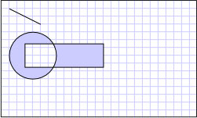

# Практическое руководство. Создание составной фигуры
В этом примере демонстрируется создание составной фигуры, применив <xref:System.Windows.Media.Geometry> объектов и отобразить их с помощью <xref:System.Windows.Shapes.Path> элемент. В следующем примере <xref:System.Windows.Media.LineGeometry>, <xref:System.Windows.Media.EllipseGeometry>и <xref:System.Windows.Media.RectangleGeometry> используются с <xref:System.Windows.Media.GeometryGroup> Создание составной фигуры. Затем рисуются фигуры с помощью <xref:System.Windows.Shapes.Path> элемент.  
  
## Пример  
 [!code-xaml[GeometrySample#19](~/samples/snippets/csharp/VS_Snippets_Wpf/GeometrySample/CS/combininggeometriesexample.xaml#19)]  
  
 [!code-csharp[GeometriesMiscSnippets_procedural_snip#CompositeShapeCodeExampleInline1](~/samples/snippets/csharp/VS_Snippets_Wpf/GeometriesMiscSnippets_procedural_snip/CSharp/CompositeShapeExample.cs#compositeshapecodeexampleinline1)]
   
  
 На следующем рисунке показана фигура, созданная в предыдущем примере.  
  
   
Составные геометрические объекты  
  
 Более сложные фигуры, например, многоугольники и фигур с помощью сегментов кривых могут быть созданы с помощью <xref:System.Windows.Media.PathGeometry>. Пример, демонстрирующий создание фигуры с помощью <xref:System.Windows.Media.PathGeometry>, см. в разделе [Создание фигуры с помощью PathGeometry](how-to-create-a-shape-by-using-a-pathgeometry.md).  Несмотря на то, что в этом примере отображает фигуру на экране при помощи <xref:System.Windows.Shapes.Path> элемент, <xref:System.Windows.Media.Geometry> объектов может также использоваться для описания содержимого <xref:System.Windows.Media.GeometryDrawing> или <xref:System.Windows.Media.DrawingContext>. Они также могут использоваться для обрезки и проверки нажатия.  
  
 Этот пример является частью большего примера; полный пример см. в разделе [Пример геометрических объектов](https://go.microsoft.com/fwlink/?LinkID=159989).
