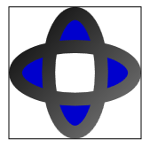
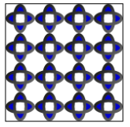

# Практическое руководство. Закрашивание области с помощью Drawing
Этот пример показывает, как можно закрасить область рисунком. Чтобы закрасить область рисунком, используйте <xref:System.Windows.Media.DrawingBrush> и одного или нескольких <xref:System.Windows.Media.Drawing> объектов.   В следующем примере используется <xref:System.Windows.Media.DrawingBrush> для закраски объекта рисунком из двух эллипсов.  
  
## Пример  
 [!code-xaml[drawingbrush_snip#DrawingBrushExampleWholePage](~/samples/snippets/csharp/VS_Snippets_Wpf/drawingbrush_snip/CS/DrawingBrushExample.xaml#drawingbrushexamplewholepage)]  
  
 [!code-csharp[drawingbrush_procedural_snip#DrawingBrushExampleWholePage](~/samples/snippets/csharp/VS_Snippets_Wpf/drawingbrush_procedural_snip/CSharp/DrawingBrushExample.cs#drawingbrushexamplewholepage)]
   
  
 На следующем рисунке показан результат выполнения этого примера.  
  
   
  
 (Центр фигуры белого, по причинам, описанным в [управление заливкой составных фигур](how-to-control-the-fill-of-a-composite-shape.md).)  
  
 Установив <xref:System.Windows.Media.DrawingBrush> объекта <xref:System.Windows.Media.TileBrush.Viewport%2A> и <xref:System.Windows.Media.TileBrush.TileMode%2A> свойства, можно создать повторяющийся шаблон. Следующий пример выполняет заливку объекта шаблоном, созданным рисунком из двух эллипсов.  
  
 [!code-xaml[drawingbrush_snip#TiledDrawingBrushExampleWholePage](~/samples/snippets/csharp/VS_Snippets_Wpf/drawingbrush_snip/CS/TiledDrawingBrushExample.xaml#tileddrawingbrushexamplewholepage)]  
  
 [!code-csharp[drawingbrush_procedural_snip#TiledDrawingBrushExampleWholePage](~/samples/snippets/csharp/VS_Snippets_Wpf/drawingbrush_procedural_snip/CSharp/TiledDrawingBrushExample.cs#tileddrawingbrushexamplewholepage)]
   
  
 На следующем рисунке показан мозаичный <xref:System.Windows.Media.DrawingBrush> выходных данных.  
  
   
  
 Дополнительные сведения о кистях для рисования см. в разделе [Рисование с помощью изображений, рисунков и визуальных элементов](painting-with-images-drawings-and-visuals.md). Дополнительные сведения о <xref:System.Windows.Media.Drawing> объектов, см. в разделе [Обзор объектов Drawing](drawing-objects-overview.md).
