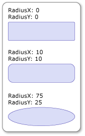

# Практическое руководство. Скругление углов объекта RectangleGeometry
Для скругления углов <xref:System.Windows.Media.RectangleGeometry>, задайте его <xref:System.Windows.Media.RectangleGeometry.RadiusX%2A> и <xref:System.Windows.Media.RectangleGeometry.RadiusY%2A> свойства в значение больше нуля. Чем больше значения, тем больше радиус скругления углов прямоугольника.  
  
## Пример  
 В следующем примере показано несколько <xref:System.Windows.Media.RectangleGeometry> объектов с разными <xref:System.Windows.Media.RectangleGeometry.RadiusX%2A> и <xref:System.Windows.Media.RectangleGeometry.RadiusY%2A> параметры. <xref:System.Windows.Media.RectangleGeometry> Объекты отображаются с помощью <xref:System.Windows.Shapes.Path> элементов.  
  
 [!code-xaml[GeometryOverviewSamples_snip#GraphicsMMRoundedRectangleGeometryExampleWholePage](~/samples/snippets/csharp/VS_Snippets_Wpf/GeometryOverviewSamples_snip/CS/RectangleGeometryRoundedCornerExample.xaml#graphicsmmroundedrectanglegeometryexamplewholepage)]  
  
   
Прямоугольники с закругленными углами  
  
## См. также

- [Общие сведения о классе Geometry](geometry-overview.md)
- [Создание составной фигуры](how-to-create-a-composite-shape.md)
- [Создание фигуры с помощью объекта PathGeometry](how-to-create-a-shape-by-using-a-pathgeometry.md)
