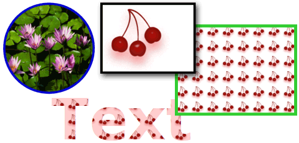
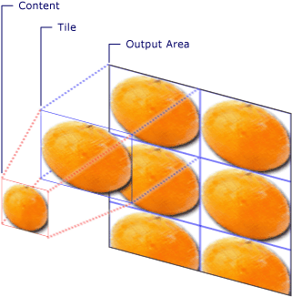

# Рисование с помощью объектов Image, Drawing и Visual
В этом разделе описывается использование <xref:System.Windows.Media.ImageBrush>, <xref:System.Windows.Media.DrawingBrush>, и <xref:System.Windows.Media.VisualBrush> объекты Заливка области с изображением, <xref:System.Windows.Media.Drawing>, или <xref:System.Windows.Media.Visual>.  

   
## Предварительные требования  
 Для понимания этого раздела необходимо ознакомиться с различными типами кистей, имеющихся в Windows Presentation Foundation (WPF), и их основными возможностями. Общие сведения см. в разделе [Общие сведения о кистях WPF](wpf-brushes-overview.md).  
  
   
## Закрашивание области с помощью Image  
 <xref:System.Windows.Media.ImageBrush> Закрашивает область с <xref:System.Windows.Media.ImageSource>. Это наиболее распространенный тип <xref:System.Windows.Media.ImageSource> для использования с <xref:System.Windows.Media.ImageBrush> является <xref:System.Windows.Media.Imaging.BitmapImage>, которая описывает растрового изображения. Можно использовать <xref:System.Windows.Media.DrawingImage> для заполнения с помощью <xref:System.Windows.Media.Drawing> , но проще использовать <xref:System.Windows.Media.DrawingBrush> вместо этого. Дополнительные сведения о <xref:System.Windows.Media.ImageSource> объектов, см. в разделе [Обзор работы с образами](imaging-overview.md).  
  
 Для заполнения с помощью <xref:System.Windows.Media.ImageBrush>, создание <xref:System.Windows.Media.Imaging.BitmapImage> и используйте его для загрузки содержимого точечного рисунка. Затем с помощью <xref:System.Windows.Media.Imaging.BitmapImage> присвоить <xref:System.Windows.Media.ImageBrush.ImageSource%2A> свойство <xref:System.Windows.Media.ImageBrush>. Наконец, примените <xref:System.Windows.Media.ImageBrush> на объект, который нужно нарисовать.  В XAML, можно просто задать <xref:System.Windows.Media.ImageBrush.ImageSource%2A> свойство <xref:System.Windows.Media.ImageBrush> на путь к загружаемому изображению.  
  
 Как и все <xref:System.Windows.Media.Brush> объектов, <xref:System.Windows.Media.ImageBrush> может использоваться для рисования объектов, таких как фигуры, панели, элементы управления и текст. На следующем рисунке показан некоторые эффекты, которые могут быть обеспечены <xref:System.Windows.Media.ImageBrush>.  
  
   
Объекты, заполненные при помощи ImageBrush  
  
 По умолчанию <xref:System.Windows.Media.ImageBrush> растягивает изображения до полного заполнения области закрашиваемой, возможно искажение изображения, если область рисования имеет другие пропорции изображения. Это поведение можно изменить, изменив <xref:System.Windows.Media.TileBrush.Stretch%2A> свойство со значения по умолчанию <xref:System.Windows.Media.Stretch.Fill> для <xref:System.Windows.Media.Stretch.None>, <xref:System.Windows.Media.Stretch.Uniform>, или <xref:System.Windows.Media.Stretch.UniformToFill>. Так как <xref:System.Windows.Media.ImageBrush> — это разновидность <xref:System.Windows.Media.TileBrush>, можно указать точно в том случае, как кисть изображения заполняет область вывода и даже создать шаблоны. Дополнительные сведения о дополнительных <xref:System.Windows.Media.TileBrush> функции, см. в разделе [Общие сведения о TileBrush](tilebrush-overview.md).  
  
   
## Пример Заполнение объекта с растровым изображением  
 В следующем примере используется <xref:System.Windows.Media.ImageBrush> для закрашивания <xref:System.Windows.Controls.Panel.Background%2A> из <xref:System.Windows.Controls.Canvas>.  
  
 [!code-xaml[BrushOverviewExamples_snip#GraphicsMMImageBrushAsCanvasBackgroundExampleWholePage](~/samples/snippets/xaml/VS_Snippets_Wpf/BrushOverviewExamples_snip/XAML/ImageBrushExample.xaml#graphicsmmimagebrushascanvasbackgroundexamplewholepage)]  
  
 [!code-csharp[BrushOverviewExamples_procedural_snip#GraphicsMMImageBrushAsCanvasBackgroundExampleWholePage](~/samples/snippets/csharp/VS_Snippets_Wpf/BrushOverviewExamples_procedural_snip/CSharp/ImageBrushExample.cs#graphicsmmimagebrushascanvasbackgroundexamplewholepage)]
   
  
   
## Закрашивание области с помощью Drawing  
 Объект <xref:System.Windows.Media.DrawingBrush> позволяет закрасить область фигуры, текст, изображения и видео. Фигуры внутри закрашивающей кисти сами могут быть закрашены сплошным цветом, градиент, изображения, или даже другим <xref:System.Windows.Media.DrawingBrush>. На следующем рисунке показано несколько способов использования <xref:System.Windows.Media.DrawingBrush>.  
  
   
Объекты, заполненные при помощи DrawingBrush  
  
 Объект <xref:System.Windows.Media.DrawingBrush> закрашивает область с <xref:System.Windows.Media.Drawing> объекта. Объект <xref:System.Windows.Media.Drawing> объект описывает отображаемое содержимое, например фигуру, растровое изображение, видео или строку текста. Различные типы рисунков описывают различные типы содержимого. Ниже приведен список различных типов объектов-рисунков.  
  
-   <xref:System.Windows.Media.GeometryDrawing> — Выводит фигуру.  
  
-   <xref:System.Windows.Media.ImageDrawing> — Выводит изображение.  
  
-   <xref:System.Windows.Media.GlyphRunDrawing> — Выводит текст.  
  
-   <xref:System.Windows.Media.VideoDrawing> — Воспроизводит аудио-или видео.  
  
-   <xref:System.Windows.Media.DrawingGroup> — Выводит другие рисунки. Для объединения рисунков в один составной используйте группирование рисунков.  
  
 Дополнительные сведения о <xref:System.Windows.Media.Drawing> объектов, см. в разделе [Обзор объектов Drawing](drawing-objects-overview.md).  
  
 Как и <xref:System.Windows.Media.ImageBrush>, <xref:System.Windows.Media.DrawingBrush> растягивает его <xref:System.Windows.Media.DrawingBrush.Drawing%2A> для заполнения области вывода. Это поведение можно переопределить, изменив <xref:System.Windows.Media.TileBrush.Stretch%2A> свойства из значения по умолчанию <xref:System.Windows.Media.Stretch.Fill>. Дополнительные сведения см. в описании свойства <xref:System.Windows.Media.TileBrush.Stretch%2A>.  
  
   
## Пример Заполнение объекта с помощью рисунка  
 В следующем примере показано, как можно заполнить объект с помощью рисунка с изображением трех эллипсов. Объект <xref:System.Windows.Media.GeometryDrawing> используется для описания эллипсов.  
  
 [!code-xaml[BrushOverviewExamples_snip#GraphicsMMDrawingBrushAsButtonBackgroundExample](~/samples/snippets/xaml/VS_Snippets_Wpf/BrushOverviewExamples_snip/XAML/DrawingBrushExample.xaml#graphicsmmdrawingbrushasbuttonbackgroundexample)]  
  
 [!code-csharp[BrushOverviewExamples_procedural_snip#GraphicsMMDrawingBrushAsButtonBackgroundExample1](~/samples/snippets/csharp/VS_Snippets_Wpf/BrushOverviewExamples_procedural_snip/CSharp/DrawingBrushExample.cs#graphicsmmdrawingbrushasbuttonbackgroundexample1)]
   
  
   
## Закрашивание области с помощью Visual  
 Наиболее гибкая и мощная из всех кистей, <xref:System.Windows.Media.VisualBrush> закрашивает область с <xref:System.Windows.Media.Visual>. Объект <xref:System.Windows.Media.Visual> является низкоуровневым графическим типом, который служит в качестве предка для многих полезных графических компонентов. Например <xref:System.Windows.Window>, <xref:System.Windows.FrameworkElement>, и <xref:System.Windows.Controls.Control> классы представляют собой различные типы <xref:System.Windows.Media.Visual> объектов. С помощью <xref:System.Windows.Media.VisualBrush>, им можно рисовать заполнить область практически любым Windows Presentation Foundation (WPF) графического объекта.  
  
> [!NOTE]
>  Несмотря на то что <xref:System.Windows.Media.VisualBrush> — это разновидность <xref:System.Windows.Freezable> объекта, он не может быть заморожен (доступным только для чтения) при его <xref:System.Windows.Media.VisualBrush.Visual%2A> свойству присвоено значение, отличное от `null`.  
  
 Существует два способа задания <xref:System.Windows.Media.VisualBrush.Visual%2A> содержимое <xref:System.Windows.Media.VisualBrush>.  
  
-   Создайте новый <xref:System.Windows.Media.Visual> и использовать его для задания <xref:System.Windows.Media.VisualBrush.Visual%2A> свойство <xref:System.Windows.Media.VisualBrush>. Например, см. в разделе [пример: Заполнение объекта с помощью Visual](#examplevisualbrush1) в следующем разделе.  
  
-   Использовать существующее <xref:System.Windows.Media.Visual>, который создает дубликат изображения целевого объекта <xref:System.Windows.Media.Visual>. Затем можно использовать <xref:System.Windows.Media.VisualBrush> для создания интересных эффектов, например отражения и увеличения. Например, см. в разделе [пример: Создание отражения](#examplevisualbrush2) раздел.  
  
 При определении нового <xref:System.Windows.Media.VisualBrush.Visual%2A> для <xref:System.Windows.Media.VisualBrush> и что <xref:System.Windows.Media.Visual> — <xref:System.Windows.UIElement> (например, панель или элемент управления), система разметки выполняется <xref:System.Windows.UIElement> и его дочерних элементов при <xref:System.Windows.Media.VisualBrush.AutoLayoutContent%2A> свойству `true`. Однако корневой <xref:System.Windows.UIElement> фактически изолирован от остальной части системы: стили и внешний макет не могут перейти эту границу. Таким образом, следует явно указать размер корневого <xref:System.Windows.UIElement>, так как его единственным родительским объектом является <xref:System.Windows.Media.VisualBrush> и таким образом его размер не может автоматически подобран по заполняемой области. Дополнительные сведения о макете в Windows Presentation Foundation (WPF) см. в разделе [Макет](../advanced/layout.md).  
  
 Как и <xref:System.Windows.Media.ImageBrush> и <xref:System.Windows.Media.DrawingBrush>, <xref:System.Windows.Media.VisualBrush> растягивает свое содержимое до заполнения области вывода. Это поведение можно переопределить, изменив <xref:System.Windows.Media.TileBrush.Stretch%2A> свойства из значения по умолчанию <xref:System.Windows.Media.Stretch.Fill>. Дополнительные сведения см. в описании свойства <xref:System.Windows.Media.TileBrush.Stretch%2A>.  
  
   
## Пример Заполнение объекта с помощью Visual  
 В следующем примере несколько элементов управления и панель используются для заполнения прямоугольника.  
  
 [!code-xaml[BrushOverviewExamples_snip#GraphicsMMVisualBrushAsRectangleBackgroundExample](~/samples/snippets/xaml/VS_Snippets_Wpf/BrushOverviewExamples_snip/XAML/VisualBrushExample.xaml#graphicsmmvisualbrushasrectanglebackgroundexample)]  
  
 [!code-csharp[BrushOverviewExamples_procedural_snip#GraphicsMMVisualBrushAsRectangleBackgroundExample1](~/samples/snippets/csharp/VS_Snippets_Wpf/BrushOverviewExamples_procedural_snip/CSharp/VisualBrushExample.cs#graphicsmmvisualbrushasrectanglebackgroundexample1)]
   
  
   
## Пример Создание отражения  
 В предыдущем примере показано, как создать новый <xref:System.Windows.Media.Visual> для использования в качестве фона. Можно также использовать <xref:System.Windows.Media.VisualBrush> для отображения существующего визуального; эта возможность позволяет создавать интересные визуальные эффекты, например отражения и увеличения. В следующем примере используется <xref:System.Windows.Media.VisualBrush> для создания отражения <xref:System.Windows.Controls.Border> , содержащего несколько элементов. На следующей иллюстрации показан результат выполнения этого примера.  
  
   
Отраженный объект Visual  
  
 [!code-csharp[visualbrush_markup_snip#GraphicsMMVisualBrushReflectionExampleWholePage](~/samples/snippets/csharp/VS_Snippets_Wpf/visualbrush_markup_snip/CSharp/ReflectionExample.cs#graphicsmmvisualbrushreflectionexamplewholepage)]
 
 [!code-xaml[visualbrush_markup_snip#GraphicsMMVisualBrushReflectionExampleWholePage](~/samples/snippets/xaml/VS_Snippets_Wpf/visualbrush_markup_snip/XAML/ReflectionExample.xaml#graphicsmmvisualbrushreflectionexamplewholepage)]  
  
 Дополнительные примеры, демонстрирующие увеличение частей экрана и создание отражений, см. в разделе [Пример VisualBrush](https://go.microsoft.com/fwlink/?LinkID=160049).  
  
   
## Функции TileBrush  
 <xref:System.Windows.Media.ImageBrush>, <xref:System.Windows.Media.DrawingBrush>, и <xref:System.Windows.Media.VisualBrush> типов <xref:System.Windows.Media.TileBrush> объектов. <xref:System.Windows.Media.TileBrush> объекты предоставляют высокую степень контроля над закрашивание области с изображения, рисунок или visual. Например, можно заполнить область не одним растянутым изображением, а элементами мозаики, которые образуют узор.  
  
 Объект <xref:System.Windows.Media.TileBrush> имеет три основных компонента: содержимое, плитки и область вывода.  
  
   
Компоненты TileBrush с одним элементом мозаики  
  
   
Компоненты TileBrush с несколькими элементами мозаики  
  
 Дополнительные сведения о функциях мозаики из <xref:System.Windows.Media.TileBrush> объектов, см. в разделе [Общие сведения о TileBrush](tilebrush-overview.md).  
  
## См. также

- <xref:System.Windows.Media.ImageBrush>
- <xref:System.Windows.Media.DrawingBrush>
- <xref:System.Windows.Media.VisualBrush>
- <xref:System.Windows.Media.TileBrush>
- [Общие сведения о TileBrush](tilebrush-overview.md)
- [Общие сведения о кистях WPF](wpf-brushes-overview.md)
- [Общие сведения об обработке изображений](imaging-overview.md)
- [Обзор объектов Drawing](drawing-objects-overview.md)
- [Общие сведения о масках непрозрачности](opacity-masks-overview.md)
- [Общие сведения об отрисовке графики в WPF](wpf-graphics-rendering-overview.md)
- [Пример использования кистей](https://go.microsoft.com/fwlink/?LinkID=160005)
- [Пример использования VisualBrush](https://go.microsoft.com/fwlink/?LinkID=160049)
