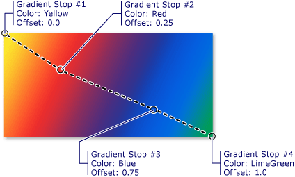
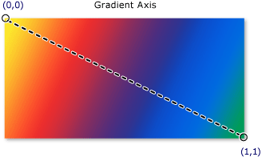
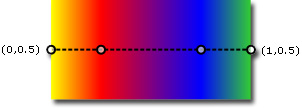
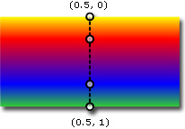
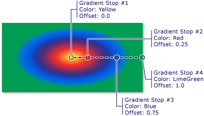
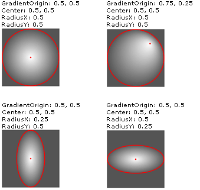

# Общие сведения о закраске сплошным цветом и градиентом
В этом разделе описывается использование <xref:System.Windows.Media.SolidColorBrush>, <xref:System.Windows.Media.LinearGradientBrush>, и <xref:System.Windows.Media.RadialGradientBrush> объекты для закрашивания сплошным цветом, линейным градиентом и радиальным градиентом.  

   
## Закрашивание области сплошным цветом  
 Одна из самых распространенных операций на любой платформе — закрасить область сплошным <xref:System.Windows.Media.Color>. Для выполнения этой задачи Windows Presentation Foundation (WPF) предоставляет <xref:System.Windows.Media.SolidColorBrush> класса. В следующих разделах описаны различные способы закрашивания с <xref:System.Windows.Media.SolidColorBrush>.  
  
   
### Использование SolidColorBrush в XAML  
 Чтобы закрасить область сплошным цветом в XAML, используйте один из следующих вариантов.  
  
-   Выберите стандартную сплошную цветную кисть по имени.  Например, можно задать кнопки <xref:System.Windows.Controls.Control.Background%2A> «Red» или «MediumBlue».  Список других стандартных кистей сплошного цвета, см. в разделе статические свойства класса <xref:System.Windows.Media.Brushes> класса. Пример.  
  
     [!code-xaml[BrushOverviewExamples_snip#SolidColorBrushNamedColor1XAML](~/samples/snippets/xaml/VS_Snippets_Wpf/BrushOverviewExamples_snip/XAML/SolidColorBrushExample.xaml#solidcolorbrushnamedcolor1xaml)]  
  
-   Выберите цвет из 32-разрядной цветовой палитры, указав насыщенность красной, зеленой и синей составляющих для смешения в сплошной цвет.  Формат для указания цвета из 32-разрядной палитры — *#rrggbb*, где *rr* — шестнадцатеричное число из двух цифр, представляющее относительное количество красного цвета, *gg* — зеленого, *bb* — синего.  Кроме того, цвет можно указать в формате #*aarrggbb*, где *aa* представляет *альфа-канал*, или прозрачность, цвета. Этот подход позволяет создавать частично прозрачные цвета.  В следующем примере <xref:System.Windows.Controls.Control.Background%2A> из <xref:System.Windows.Controls.Button> присваивается полностью непрозрачному красному, с помощью шестнадцатеричного формата.  
  
     [!code-xaml[BrushOverviewExamples_snip#SolidColorBrushHex1XAML](~/samples/snippets/xaml/VS_Snippets_Wpf/BrushOverviewExamples_snip/XAML/SolidColorBrushExample.xaml#solidcolorbrushhex1xaml)]  
  
-   Используйте синтаксис тега свойства для описания <xref:System.Windows.Media.SolidColorBrush>. Этот синтаксис требует более подробного описания, но позволяет указать дополнительные параметры, например непрозрачность кисти. В следующем примере <xref:System.Windows.Controls.Control.Background%2A> свойства двух <xref:System.Windows.Controls.Button> элементы задаются равными полностью непрозрачному красному. Цвет первой кисти описан с использованием имени стандартного цвета. Цвет второй кисти описан с помощью шестнадцатеричного формата.  
  
     [!code-xaml[BrushOverviewExamples_snip#SolidColorBrushPropertyTag1XAML](~/samples/snippets/xaml/VS_Snippets_Wpf/BrushOverviewExamples_snip/XAML/SolidColorBrushExample.xaml#solidcolorbrushpropertytag1xaml)]  
  
   
### Закрашивание с использованием SolidColorBrush в коде  
 Чтобы закрасить область сплошным цветом в коде, используйте один из следующих вариантов.  
  
-   Используйте одну из стандартных кистей, предоставляемых <xref:System.Windows.Media.Brushes> класса. В следующем примере <xref:System.Windows.Controls.Control.Background%2A> из <xref:System.Windows.Controls.Button> присваивается <xref:System.Windows.Media.Brushes.Red%2A>.  
  
     [!code-csharp[BrushOverviewExamples_snip#SolidColorBrushPredefinedBrush1CSharp](~/samples/snippets/csharp/VS_Snippets_Wpf/BrushOverviewExamples_snip/CSharp/SolidColorBrushExample.cs#solidcolorbrushpredefinedbrush1csharp)]  
  
-   Создание <xref:System.Windows.Media.SolidColorBrush> и задайте его <xref:System.Windows.Media.SolidColorBrush.Color%2A> свойства с помощью <xref:System.Windows.Media.Color> структуры. Можно использовать стандартный цвет в <xref:System.Windows.Media.Colors> класса или создать <xref:System.Windows.Media.Color> с помощью статического <xref:System.Windows.Media.Color.FromArgb%2A> метод.  
  
     В следующем примере показано, как задать <xref:System.Windows.Media.SolidColorBrush.Color%2A> свойство <xref:System.Windows.Media.SolidColorBrush> с помощью предопределенного цвета.  
  
     [!code-csharp[BrushOverviewExamples_snip#SolidColorBrushPredefinedColor1CSharp](~/samples/snippets/csharp/VS_Snippets_Wpf/BrushOverviewExamples_snip/CSharp/SolidColorBrushExample.cs#solidcolorbrushpredefinedcolor1csharp)]  
  
 Статический <xref:System.Windows.Media.Color.FromArgb%2A> используется для задания значения альфа, красного, зеленого и синего цвета. Обычный диапазон для этих значений — от 0 до 255. Значение 0 указывает, что цвет полностью прозрачен, а значение 255 — что он полностью непрозрачен. Аналогично значение 0 для красного цвета указывает, что цвет не имеет красной составляющей, а значение 255 означает, что цвет имеет максимальную насыщенность красной составляющей.  В следующем примере цвет кисти описан путем указания значения альфа и значений красного, зеленого и синего цветов.  
  
 [!code-csharp[BrushOverviewExamples_snip#SolidColorBrushfromArgbExample1CSharp](~/samples/snippets/csharp/VS_Snippets_Wpf/BrushOverviewExamples_snip/CSharp/SolidColorBrushExample.cs#solidcolorbrushfromargbexample1csharp)]  
  
 Другие способы задания цвета см. в разделе <xref:System.Windows.Media.Color> справочника.  
  
   
## Закрашивание области с помощью градиента  
 Градиентные кисти закрашивают область разными цветами, которые переходят из одного в другой по некоторой оси. Их можно использовать для создания картины света и теней, которая придает элементам управления трехмерный вид. Их также можно использовать для имитации стекла, хрома, воды и других гладких поверхностей.  WPF предоставляет два типа градиентных кистей: <xref:System.Windows.Media.LinearGradientBrush> и <xref:System.Windows.Media.RadialGradientBrush>.  
  
   
## Линейные градиенты  
 Объект <xref:System.Windows.Media.LinearGradientBrush> закрашивает область градиентом, определенным вдоль линии, *ось градиента*.  Укажите цвета градиента и их расположение вдоль оси градиента с помощью <xref:System.Windows.Media.GradientStop> объектов.  Ось градиента можно изменить, чтобы создать горизонтальный или вертикальный градиент, или обратить направление градиента. Ось градиента описана в следующем разделе. По умолчанию создается диагональный градиент.  
  
 В следующем примере показан код, создающий линейный градиент с четырьмя цветами.  
  
 [!code-xaml[GradientBrushExamples_snip#DiagonalGradient1XAML](~/samples/snippets/xaml/VS_Snippets_Wpf/GradientBrushExamples_snip/XAML/LinearGradientBrushExample.xaml#diagonalgradient1xaml)]  
  
 [!code-csharp[GradientBrushExamples_snip#DiagonalGradient1CSharp](~/samples/snippets/csharp/VS_Snippets_Wpf/GradientBrushExamples_snip/CSharp/LinearGradientBrushExample.cs#diagonalgradient1csharp)]  
  
 Этот код создает следующий градиент.  
  
   
  
 **Примечание.** Примерах с градиентом в этом разделе используется система координат по умолчанию для определения начальной и конечной точек. Система координат по умолчанию определяется относительно ограничивающего прямоугольника: 0 указывает, что 0 процентов ограничивающего прямоугольника, а 1 указывает 100 процентов ограничивающего прямоугольника. Эту систему координат можно изменить, задав <xref:System.Windows.Media.GradientBrush.MappingMode%2A> в соответствии с значением <xref:System.Windows.Media.BrushMappingMode.Absolute>. Абсолютная система координат не привязана к ограничивающему прямоугольнику. Значения интерпретируются непосредственно в локальной области.  
  
 <xref:System.Windows.Media.GradientStop> Основной строительный блок градиентной кисти.  Ограничение градиента задает <xref:System.Windows.Media.GradientStop.Color%2A> в <xref:System.Windows.Media.GradientStop.Offset%2A> вдоль оси градиента.  
  
-   Ступень градиента <xref:System.Windows.Media.GradientStop.Color%2A> свойство задает цвет градиента. Можно установить цвет с помощью стандартного цвета (предоставляемые <xref:System.Windows.Media.Colors> класс) или путем указания значений ScRGB или ARGB. В XAML для описания цвета можно также использовать шестнадцатеричный формат. Дополнительные сведения см. в разделе <xref:System.Windows.Media.Color> структуры.  
  
-   Ступень градиента <xref:System.Windows.Media.GradientStop.Offset%2A> свойство определяет положение цвета ограничения градиента на оси градиента. Значением offset является <xref:System.Double> , в диапазоне от 0 до 1. Чем ближе значение смещения ограничения градиента к 0, тем ближе цвет находится к началу градиента. Чем ближе значение смещения градиента к 1, тем ближе цвет находится к окончанию градиента.  
  
 Цвет каждой точки между ограничениями градиента подчиняется закону линейной интерполяции как сочетание цветов, заданных двумя ограничивающими положениями градиента. На следующем рисунке показаны ограничения градиента, используемые в предыдущем примере. Кружками отмечены положения ограничений градиента, а пунктирной линией обозначена ось градиента.  
  
   
  
 Первое ограничение градиента задает желтый цвет в точке со смещением `0.0`.  Второе ограничение градиента задает красный цвет в точке со смещением `0.25`.  Цвета между этими двумя ограничениями постепенно меняются от желтого к красному при движении слева направо вдоль оси градиента.  Третье ограничение градиента задает синий цвет в точке со смещением `0.75`.  Цвета между вторым и третьим ограничениями градиента постепенно меняются от красного к синему. Четвертое ограничение градиента задает зеленый цвет в точке со смещением `1.0`. Цвета между третьим и четвертым ограничениями градиента постепенно меняются от синего к зеленому.  
  
   
### Ось градиента  
 Как было сказано ранее, ограничения градиента кисти линейного градиента располагаются вдоль линии, называемой осью градиента. Можно изменить ориентацию и размер строки, с помощью кисти <xref:System.Windows.Media.LinearGradientBrush.StartPoint%2A> и <xref:System.Windows.Media.LinearGradientBrush.EndPoint%2A> свойства. Управляя кисти <xref:System.Windows.Media.LinearGradientBrush.StartPoint%2A> и <xref:System.Windows.Media.LinearGradientBrush.EndPoint%2A>, можно создавать горизонтальные и вертикальные градиенты, обращать направление градиента, уменьшать распространение градиента и многое другое.  
  
 По умолчанию кисти линейного градиента в <xref:System.Windows.Media.LinearGradientBrush.StartPoint%2A> и <xref:System.Windows.Media.LinearGradientBrush.EndPoint%2A> задаются относительно закрашиваемой области. Точка (0, 0) представляет верхний левый угол закрашиваемой области, а точка (1, 1) — правый нижний угол. Значение по умолчанию <xref:System.Windows.Media.LinearGradientBrush.StartPoint%2A> из <xref:System.Windows.Media.LinearGradientBrush> — (0,0) и значение по умолчанию <xref:System.Windows.Media.LinearGradientBrush.EndPoint%2A> — (1,1), при котором создается Диагональный градиент, начиная с верхнего левого угла и заканчивающийся в правом нижнем углу закрашиваемой области. На следующем рисунке показана ось градиента линейной градиентной кисти имеет значения по умолчанию <xref:System.Windows.Media.LinearGradientBrush.StartPoint%2A> и <xref:System.Windows.Media.LinearGradientBrush.EndPoint%2A>.  
  
   
  
 Приведенный ниже показано, как создать горизонтальный градиент, указав кисти <xref:System.Windows.Media.LinearGradientBrush.StartPoint%2A> и <xref:System.Windows.Media.LinearGradientBrush.EndPoint%2A>. Обратите внимание на то, что градиента здесь такие же, как показано в предыдущих примерах; При простом изменении <xref:System.Windows.Media.LinearGradientBrush.StartPoint%2A> и <xref:System.Windows.Media.LinearGradientBrush.EndPoint%2A>, градиент был изменен с диагонального на горизонтальную.  
  
 [!code-xaml[GradientBrushExamples_snip#HorizontalGradient1XAML](~/samples/snippets/xaml/VS_Snippets_Wpf/GradientBrushExamples_snip/XAML/LinearGradientBrushExample.xaml#horizontalgradient1xaml)]  
  
 [!code-csharp[GradientBrushExamples_snip#HorizontalGradient1CSharp](~/samples/snippets/csharp/VS_Snippets_Wpf/GradientBrushExamples_snip/CSharp/LinearGradientBrushExample.cs#horizontalgradient1csharp)]  
  
 На приведенном ниже рисунке показан созданный градиент. Ось градиента отмечена пунктирной линией, а ограничения градиента отмечены кружками.  
  
   
  
 В следующем примере показано, как создать вертикальный градиент.  
  
 [!code-xaml[GradientBrushExamples_snip#VerticalGradient1XAML](~/samples/snippets/xaml/VS_Snippets_Wpf/GradientBrushExamples_snip/XAML/LinearGradientBrushExample.xaml#verticalgradient1xaml)]  
  
 [!code-csharp[GradientBrushExamples_snip#VerticalGradient1CSharp](~/samples/snippets/csharp/VS_Snippets_Wpf/GradientBrushExamples_snip/CSharp/LinearGradientBrushExample.cs#verticalgradient1csharp)]  
  
 На приведенном ниже рисунке показан созданный градиент. Ось градиента отмечена пунктирной линией, а ограничения градиента отмечены кружками.  
  
   
  
   
## Радиальные градиенты  
 Как и <xref:System.Windows.Media.LinearGradientBrush>, <xref:System.Windows.Media.RadialGradientBrush> закрашивает область цветами, которые вместе вдоль оси. В предыдущих примерах показано, что ось кисти линейного градиента является прямой линией. Ось кисти радиального градиента определяется кругом. Цвета меняются в разные стороны от точки начала.  
  
 В следующем примере кисть радиального градиента используется для закрашивания внутренней части прямоугольника.  
  
 [!code-xaml[GradientBrushExamples_snip#RadialGradient1XAML](~/samples/snippets/xaml/VS_Snippets_Wpf/GradientBrushExamples_snip/XAML/RadialGradientBrushExample.xaml#radialgradient1xaml)]  
  
 [!code-csharp[GradientBrushExamples_snip#RadialGradient1CSharp](~/samples/snippets/csharp/VS_Snippets_Wpf/GradientBrushExamples_snip/CSharp/RadialGradientBrushExample.cs#radialgradient1csharp)]  
  
 На следующем рисунке показан градиент, созданный в предыдущем примере. Ограничения градиента кисти выделены. Обратите внимание, что, хотя результаты различаются, ограничения градиента в этом примере совпадают с ограничениями градиента в предыдущих примерах использования кисти линейного градиента.  
  
   
  
 <xref:System.Windows.Media.RadialGradientBrush.GradientOrigin%2A> Указывает начальную точку оси градиента кисти радиального градиента. Ось градиента располагается от начала градиента к его окружности. Окружность градиента кисти определяется ее <xref:System.Windows.Media.RadialGradientBrush.Center%2A>, <xref:System.Windows.Media.RadialGradientBrush.RadiusX%2A>, и <xref:System.Windows.Media.RadialGradientBrush.RadiusY%2A> свойства.  
  
 На следующем рисунке показано несколько радиальных градиентов с разными <xref:System.Windows.Media.RadialGradientBrush.GradientOrigin%2A>, <xref:System.Windows.Media.RadialGradientBrush.Center%2A>, <xref:System.Windows.Media.RadialGradientBrush.RadiusX%2A>, и <xref:System.Windows.Media.RadialGradientBrush.RadiusY%2A> параметры.  
  
   
Кисти RadialGradientBrush с различными значениями параметров GradientOrigin, Center, RadiusX и RadiusY.  
  
   
## Задание прозрачных и частично прозрачных ограничений градиента  
 Поскольку градиента не предусмотрено свойство непрозрачности, необходимо указать альфа-канал цветов с помощью [!INCLUDE[TLA#tla_argb](../../../../includes/tlasharptla-argb-md.md)] шестнадцатеричного формата в разметке или использовать <xref:System.Windows.Media.Color.FromScRgb%2A?displayProperty=nameWithType> метод для создания градиента, которые являются прозрачным или полупрозрачным. Ниже описаны процедуры по созданию частично прозрачных ограничений градиента в XAML и код.  
  
   
### Задание непрозрачности цвета в XAML  
 В XAML можно использовать шестнадцатеричный формат [!INCLUDE[TLA2#tla_argb](../../../../includes/tla2sharptla-argb-md.md)] для указания непрозрачности отдельных цветов. [!INCLUDE[TLA2#tla_argb](../../../../includes/tla2sharptla-argb-md.md)] шестнадцатеричное представление использует следующий синтаксис:  
  
 `#` **AA** *вида rrggbb*  
  
 Здесь *aa* — двузначное шестнадцатеричное значение, используемое для указания непрозрачности цвета. *rr*, *gg* и *bb* — двузначные шестнадцатеричные значения, используемые для указания насыщенности красного, зеленого и синего цветов. Шестнадцатеричная цифра может принимать значения от 0 до F (сначала цифры от 0 до 9, затем буквы от A до F). Наименьшее значение — 0, наибольшее — F. Альфа-значение 00 задает полностью прозрачный цвет, а альфа-значение FF — полностью непрозрачный цвет.  В следующем примере используется шестнадцатеричный формат [!INCLUDE[TLA2#tla_argb](../../../../includes/tla2sharptla-argb-md.md)] для задания двух цветов. Первый — частично прозрачный (он имеет альфа-значение x20). Второй — полностью непрозрачный.  
  
 [!code-xaml[GradientBrushExamples_snip#TransparentGradientStopExample1XAML](~/samples/snippets/xaml/VS_Snippets_Wpf/GradientBrushExamples_snip/XAML/GradientStopsExample.xaml#transparentgradientstopexample1xaml)]  
  
   
### Задание непрозрачности цвета в коде  
 При использовании кода, статический <xref:System.Windows.Media.Color.FromArgb%2A> метод позволяет указать альфа-значение, при создании цвета. Этот метод принимает четыре параметра типа <xref:System.Byte>. Первый параметр задает альфа-канал цвета. Другие три параметра определяют значения красного, зеленого и синего цветов. Все значения должны быть в диапазоне от 0 до 255 включительно. Значение альфа, равное 0, указывает, что цвет полностью прозрачен, а значение 255 — что он полностью непрозрачен. В следующем примере <xref:System.Windows.Media.Color.FromArgb%2A> метод используется для создания двух цветов. Первый цвет — частично прозрачный (он имеет альфа-значение x32). Второй — полностью непрозрачный.  
  
 [!code-csharp[GradientBrushExamples_snip#TransparentGradientStopExample1CSharp](~/samples/snippets/csharp/VS_Snippets_Wpf/GradientBrushExamples_snip/CSharp/GradientStopsExample.cs#transparentgradientstopexample1csharp)]  
  
 Кроме того, можно использовать <xref:System.Windows.Media.Color.FromScRgb%2A> метод, который можно использовать для создания цвета значения ScRGB.  
  
   
## Закрашивание с помощью объектов Image, Drawing, Visual и Pattern  
 <xref:System.Windows.Media.ImageBrush>, <xref:System.Windows.Media.DrawingBrush>, и <xref:System.Windows.Media.VisualBrush> классы позволяют Закраска области с помощью изображений, рисунков и визуальных элементов. Сведения о закрашивании с использованием изображений, рисунков и шаблонов см. в разделе [Рисование с помощью объектов Image, Drawing и Visual](painting-with-images-drawings-and-visuals.md).  
  
## См. также

- <xref:System.Windows.Media.Brush>
- <xref:System.Windows.Media.SolidColorBrush>
- <xref:System.Windows.Media.LinearGradientBrush>
- <xref:System.Windows.Media.RadialGradientBrush>
- [Рисование с помощью объектов Image, Drawing и Visual](painting-with-images-drawings-and-visuals.md)
- [Общие сведения о преобразованиях объекта Brush](brush-transformation-overview.md)
- [Уровни графической отрисовки](../advanced/graphics-rendering-tiers.md)
