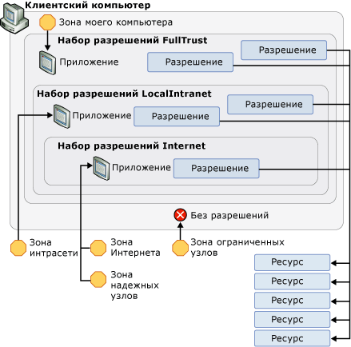

# Стратегия безопасности WPF — безопасность платформы
Хотя Windows Presentation Foundation (WPF) предоставляет широкий набор служб безопасности, предусмотрена также возможность средства безопасности базовой платформы, включая операционную систему, CLR, и Internet Explorer. Эти уровни объединяются для обеспечения в WPF надежной модели безопасности с глубокой защитой, которая пытается исключить любые точки сбоя, как показано на следующем рисунке.  
  
   
  
 В остальной части этого раздела рассматриваются компоненты на каждом из этих уровней, относящихся к WPF.  

   
## Безопасность операционной системы  
 Минимальный уровень операционной системы, требуемой для WPF — [!INCLUDE[TLA2#tla_winxpsp2](../../../includes/tla2sharptla-winxpsp2-md.md)]. Ядро [!INCLUDE[TLA2#tla_winxpsp2](../../../includes/tla2sharptla-winxpsp2-md.md)] предоставляет несколько функций безопасности, которые формируют основу безопасности для всех приложений Windows, включая созданные с помощью WPF. [!INCLUDE[TLA#tla_longhorn](../../../includes/tlasharptla-longhorn-md.md)] включает в себя функции безопасности WPF и расширяет их возможности. В этом разделе рассматривается широкий спектр этих функций безопасности, которые важны для WPF, а также интеграция WPF с ними для обеспечения дальнейшей глубокой защиты.  
  
   
### Microsoft Windows XP с пакетом обновления 2 (SP2)  
 В дополнение к общему обзору и усилению Windows, существуют три ключевых компонента из [!INCLUDE[TLA2#tla_winxpsp2](../../../includes/tla2sharptla-winxpsp2-md.md)] , которые будут рассмотрены в этом разделе:  
  
-   Компиляция /GS  
  
-   [!INCLUDE[TLA#tla_win_update](../../../includes/tlasharptla-win-update-md.md)].  
  
#### Компиляция /GS  
 [!INCLUDE[TLA2#tla_winxpsp2](../../../includes/tla2sharptla-winxpsp2-md.md)] обеспечивает защиту путем перекомпиляции многих системных библиотек ядра, включая все WPF зависимости, такие как CLR, чтобы снизить вероятность переполнения буфера. Это достигается путем использования параметра /GS с компилятором командной строки C/C++. Несмотря на то, что следует явно избегать переполнения буфера, компиляция /GS представляет пример глубокой защиты против потенциальных угроз, созданных случайно или злонамеренно.  
  
 Ранее переполнения буфера были причиной многих эксплойтов безопасности с высокой степенью воздействия. Переполнение буфера возникает, когда злоумышленник использует уязвимость кода, которая позволяет внедрить вредоносный код, выполняющий записи за границами буфера. Затем это позволяет злоумышленнику перехватить процесс, в котором выполняется код, путем перезаписи адреса возврата функции, чтобы вызвать выполнение кода злоумышленника. Результатом является вредоносный код, выполняющий произвольный код с привилегиями перехваченного процесса.  
  
 На высоком уровне флаг компилятора /GS защищает от некоторых потенциальных переполнений буфера путем добавления специального cookie безопасности для защиты адреса возврата функции, которая содержит буферы локальных строк. После возврата функции cookie безопасности сравнивается со своим предыдущим значением. Если значение изменилось, то возможно, произошло переполнение буфера, и процесс будет остановлен с состоянием ошибки. Остановка процесса предотвращает выполнение потенциально вредоносного кода. См. в разделе [/GS (проверка безопасности буфера)](/cpp/build/reference/gs-buffer-security-check) для получения дополнительных сведений.  
  
 WPF компилируется с флагом/GS, чтобы добавить еще один уровень защиты для WPF приложений.  
  
#### Усовершенствования Microsoft Windows Update  
 [!INCLUDE[TLA#tla_win_update](../../../includes/tlasharptla-win-update-md.md)] также были внесены усовершенствования в [!INCLUDE[TLA2#tla_winxpsp2](../../../includes/tla2sharptla-winxpsp2-md.md)] для упрощения процесса загрузки и установки обновлений. Эти изменения значительно улучшили безопасность для клиентов WPF, помогая обеспечить актуальность версий их систем, особенно в отношении обновлений для системы безопасности.  
  
   
### Windows Vista  
 WPF Пользователи [!INCLUDE[TLA#tla_longhorn](../../../includes/tlasharptla-longhorn-md.md)] получают преимущества операционной системы дополнительных улучшений безопасности, включая «Минимальных привилегий доступа пользователей», проверки целостности кода и привилегий.  
  
#### Контроль учетных записей (UAC)  
 В настоящее время пользователи Windows предпочитают работать с правами администратора, поскольку многие приложения требуют их для установки или выполнения или оба. Одним из примеров является возможность записи в реестр параметров приложения по умолчанию.  
  
 Работа с правами администратора в действительности означает, что приложения выполняются из процессов, которым предоставлены права администратора. Влияние этого на безопасность заключается в том, что любой вредоносный код, перехвативший процесс с правами администратора, автоматически наследует эти права, включая доступ к критически важным системным ресурсам.  
  
 Один из способов защиты от этой угрозы безопасности состоит в запуске приложений с наименьшим количеством требуемых им привилегий. Этот способ называется принципом наименьших привилегий и является базовой функцией операционной системы [!INCLUDE[TLA#tla_longhorn](../../../includes/tlasharptla-longhorn-md.md)]. Эта функция вызывается контролем учетных записей (UAC) и используется [!INCLUDE[TLA#tla_longhorn](../../../includes/tlasharptla-longhorn-md.md)] UAC в двух основных случаях.  
  
-   Для запуска большинства приложений с правами UAC по умолчанию, даже если пользователь является администратором; только приложения, требующие привилегий администратора, будут выполняться с привилегиями администратора. Для запуска с привилегиями администратора приложения должны быть явно отмечены либо в своем манифесте приложения, либо как запись в политике безопасности.  
  
-   Для обеспечения решений совместимости, таких как виртуализация. Например, многие приложения пытаются выполнять запись в места с ограниченным доступом, такие как C:\Program Files. Для приложений, выполняющихся в рамках UAC, существует альтернативное расположение, для записи в которое не требуются права администратора. Для приложений, работающих в рамках UAC, UAC виртуализирует расположение C:\Program Files, и таким образом приложения считают, что выполняют запись в это расположение, но на самом деле запись выполняется в другое, пользовательское расположение. Такой вид работы совместимости позволяет операционной системе запускать многие приложения, которые ранее не могли работать в UAC.  
  
#### Проверки целостности кода  
 [!INCLUDE[TLA#tla_longhorn](../../../includes/tlasharptla-longhorn-md.md)] включает более глубокие проверки целостности кода, чтобы помочь предотвратить, введенного в системные файлы или в ядро во время загрузки или выполнения вредоносного кода. Это выходит за рамки защиты системных файлов.  
  
   
### Процесс с ограниченными правами для браузерных приложений  
 Браузерные приложения WPF выполняются в песочнице зоны Интернета. WPF Интеграция с Microsoft Internet Explorer расширяет эту защиту, добавляя дополнительную поддержку.  
  
#### Internet Explorer 6 с пакетом обновления 2 и Internet Explorer 7 для XP  
 WPF усиливает безопасность операционной системы, ограничивая привилегии процесса для XAML-приложения браузера (XBAP) обеспечить дополнительную защиту. Перед запуском браузерного приложения WPF операционная система создает хост-процесс, который удаляет ненужные привилегии из токена процесса. В качестве примеров удаляемых привилегий можно назвать возможность завершения работы компьютера пользователя, загрузки драйверов и доступа на чтение ко всем файлам на компьютере.  
  
#### Internet Explorer 7 для Vista  
 В [!INCLUDE[TLA#tla_ie7](../../../includes/tlasharptla-ie7-md.md)], WPF приложения выполняются в защищенном режиме. В частности, XAML-приложения браузера (XBAP) выполняются с целостностью среднего уровня.  
  
#### Уровень глубокой защиты  
 Поскольку XAML-приложения браузера (XBAP) обычно изолируются набором разрешений зоны Интернета, удаление этих привилегий не повреждает XAML-приложения браузера (XBAP) с точки зрения совместимости. Вместо этого создается дополнительный уровень глубокой защиты; если изолированное приложение сможет использовать другие уровни и перехватить процесс, этот процесс будет иметь только ограниченные привилегии.  
  
 См. в разделе [под учетной записью пользователя с минимальными правами](https://docs.microsoft.com/previous-versions/tn-archive/cc700846%28v=technet.10%29).  
  
   
## Безопасность среды CLR  
 CLR предлагает ряд ключевых преимуществ безопасности, включающих проверку, верификацию, CAS (Code Access Security — безопасность доступа кода) и методологию, критическую с точки зрения безопасности.  
  
   
### Проверка и верификация  
 Для обеспечения изоляции и целостности сборки CLR использует процесс проверки. CLR Проверка гарантирует, что сборки изолируются путем проверки их формата файла переносимых исполняемых (PE) для адресов, которые указывают за пределы данной сборки. CLR Проверка также проверяет целостность метаданных, встроенных в сборку.  
  
 Чтобы обеспечить безопасность типов, помочь предотвратить общие проблемы безопасности (например, переполнение буфера) и включите "песочницы" путем изоляции подпроцесса, CLR безопасности использует концепцию верификации.  
  
 Управляемые приложения компилируются в язык MSIL. Когда методы в управляемом приложении выполняются, его MSIL-файлы компилируются в машинный код с помощью JIT-компиляции. JIT-компиляция включает процесс верификации, который применяет много правил безопасности и надежности, обеспечивающих, что код:  
  
-   не нарушает контракты типов;  
  
-   не вызывает переполнение буфера;  
  
-   не имеет бесконтрольный доступ к памяти.  
  
 Выполнение управляемого кода, который не соответствует правилам верификации, не разрешается, пока он не будет считаться надежным кодом.  
  
 Преимущества верифицируемого кода являются главной причиной, почему WPF основан на .NET Framework. При условии, что используется верифицируемый код, вероятность использования возможных уязвимостей значительно ниже.  
  
   
### Управление доступом для кода  
 Клиентский компьютер предоставляет широкий спектр ресурсов, к которым может получить доступ управляемое приложение, включая файловую систему, реестр, службы печати, пользовательский интерфейс, отражение и переменные среды. Прежде чем управляемое приложение может получить доступ к любому из ресурсов на клиентском компьютере, она должна иметь разрешение .NET Framework для этого. Разрешение в CAS является подклассом <xref:System.Security.CodeAccessPermission>; CAS реализует по одному подклассу для каждого ресурса, к которому управляемые приложения могут получать доступ.  
  
 Ряд разрешений, которые предоставляются CAS управляемому приложению при запуске его выполнения, называется набором разрешений и определяется свидетельством, предоставляемым приложением. Для приложений WPF предоставляемое свидетельство — это расположение или зона, откуда запускаются приложения. CAS определяет следующие зоны:  
  
-   **Мой компьютер**. Приложения запускаются с клиентского компьютера (полное доверие).  
  
-   **Локальная интрасеть**. Приложения запускаются из интрасети (частичное доверие).  
  
-   **Интернет**. Приложения запускаются из Интернета (минимальное доверие).  
  
-   **Доверенные веб-сайты**. Приложения, идентифицированные пользователем как доверенные (минимальное доверие).  
  
-   **Веб-сайты без доверия**. Приложения, идентифицированные пользователем как ненадежные (без доверия).  
  
 Для каждой из этих зон CAS предоставляет предопределенный набор разрешений, содержащий разрешения, которые соответствует уровню доверия, связанному с каждой зоной. Сюда входит следующее.  
  
-   **FullTrust**. Для приложений, запускаемых из **Мой компьютер** зоны. Предоставляются все возможные разрешения.  
  
-   **LocalIntranet**. Для приложений, запускаемых из **Местная интрасеть** зоны. Подмножество разрешений предоставляется для обеспечения среднего уровня доступа к ресурсам на клиентском компьютере, включая изолированное хранилище, неограниченный доступ к пользовательскому интерфейсу, неограниченный доступ к диалогам для работы с файлами, ограниченное отражение, ограниченный доступ к переменным среды. Разрешения для критически важных ресурсов, таких как реестр, не предоставляются.  
  
-   **Интернет**. Для приложений, запускаемых из **Internet** или **Надежные узлы** зоны. Подмножество разрешений предоставляется для обеспечения ограниченного доступа к ресурсам на клиентском компьютере, включая изолированное хранилище, только открытие файлов и ограниченный пользовательский интерфейс. В сущности, эти наборы разрешений изолируют приложения от клиентского компьютера.  
  
 Приложения, которые идентифицированы как происходящие из **ненадежных узлов** зоны не предоставляется разрешений с CAS вообще. Следовательно, для них не существует предопределенный набор разрешений.  
  
 На следующем рисунке показано отношение между зонами, наборами разрешений, разрешениями и ресурсами.  
  
   
  
 Ограничения песочницы безопасности зоны Интернета в равной степени применяются к любому коду, который [!INCLUDE[TLA2#tla_winfxwebapp](../../../includes/tla2sharptla-winfxwebapp-md.md)] импортирует из системной библиотеки, включая WPF. Это гарантирует, что каждый бит кода блокируется, даже WPF. К сожалению, чтобы иметь возможность выполнения, [!INCLUDE[TLA2#tla_winfxwebapp](../../../includes/tla2sharptla-winfxwebapp-md.md)] необходимо выполнять функции, которым требуется больше разрешений, чем те, которые включены в песочнице безопасности зоны Интернета.  
  
 Рассмотрим приложение [!INCLUDE[TLA2#tla_winfxwebapp](../../../includes/tla2sharptla-winfxwebapp-md.md)], в котором имеется следующая страница:  
  
 [!code-csharp[WPFPlatformSecuritySnippets#Permission](~/samples/snippets/csharp/VS_Snippets_Wpf/WPFPlatformSecuritySnippets/CSharp/Page1.xaml.cs#permission)]
   
  
 Для выполнения этого [!INCLUDE[TLA2#tla_winfxwebapp](../../../includes/tla2sharptla-winfxwebapp-md.md)] базовый код WPF должен выполнить больше функций, чем доступно вызываемому [!INCLUDE[TLA2#tla_winfxwebapp](../../../includes/tla2sharptla-winfxwebapp-md.md)], в том числе:  
  
-   создание дескриптора окна (hWnd) для отрисовки;  
  
-   диспетчеризацию сообщений;  
  
-   загрузку шрифт Tahoma.  
  
 С точки зрения безопасности предоставление прямого доступа к любой из этих операций из изолированного приложения будет иметь катастрофические последствия.  
  
 К счастью, WPF разрешает данную ситуацию, позволяя этим операциям выполняться с повышенными привилегиями от имени изолированного приложения. Хотя все операции WPF проверяются на соответствие ограниченным разрешениям безопасности зоны Интернета домена приложения [!INCLUDE[TLA2#tla_winfxwebapp](../../../includes/tla2sharptla-winfxwebapp-md.md)], WPF (как и другим системным библиотекам) предоставляется набор разрешений, который включает все возможные разрешения.  
  
 Для этого необходимо, чтобы WPF предоставлялись повышенные привилегии с одновременным запретом набору разрешений зоны Интернета несущего домена приложения распоряжаться этими привилегиями.  
  
 WPF выполняет это с помощью **Assert** метод разрешения. В следующем примере кода показано, как это происходит.  
  
 [!code-csharp[WPFPlatformSecuritySnippets#Permission](~/samples/snippets/csharp/VS_Snippets_Wpf/WPFPlatformSecuritySnippets/CSharp/Page1.xaml.cs#permission)]
   
  
 **Assert** сущности, предотвращает ограничение неограниченных разрешений, необходимых WPF Интернет не будучи ограниченными разрешениями зоны [!INCLUDE[TLA2#tla_winfxwebapp](../../../includes/tla2sharptla-winfxwebapp-md.md)].  
  
 С точки зрения платформы WPF несет ответственность за использование **Assert** правильно; неправильное использование **Assert** может позволить вредоносный код может повышать уровень привилегий. Следовательно, важно только вызвать **Assert** при необходимости, и чтобы убедиться, что "песочницы" ограничения остаются без изменений. Например, изолированному коду не разрешается открывать случайные файлы, но разрешается использовать шрифты. WPF позволяет изолированным приложениям использовать функциональность шрифтов путем вызова **Assert**, а также для WPF для чтения файлов, которые заведомо содержат эти шрифты, от имени изолированного приложения.  
  
   
### развертывание ClickOnce  
 ClickOnce — это комплексная технология развертывания входит в состав .NET Framework, который интегрируется с Microsoft Visual Studio (см. в разделе [ClickOnce развертывание и безопасность](/visualstudio/deployment/clickonce-security-and-deployment) подробные сведения). Автономные приложения WPF могут развертываться с помощью ClickOnce, тогда как браузерные приложения необходимо развертывать с помощью ClickOnce.  
  
 Приложения, развернутые с помощью ClickOnce, приобретают дополнительный уровень безопасности посредством CAS (Code Access Security — безопасность доступа кода); в сущности, приложения, развернутые с помощью ClickOnce, запрашивают разрешения, которые им необходимы. Им предоставляются только разрешения, не расширяющие набор разрешений для зоны, в которой развертывается приложения. За счет ограничения набора разрешений только теми, которые необходимы, даже если они меньше, чем разрешения, предоставляемые набором разрешений зоны запуска, можно до минимума сократить количество ресурсов, к которым приложение имеет доступ. Таким образом, уменьшается вероятность повреждений на клиентском компьютере в случае перехвата приложения.  
  
   
### Методология, критическая с точки зрения безопасности  
 В отношении кода WPF, который использует разрешения для включения песочницы зоны Интернета для приложений [!INCLUDE[TLA2#tla_winfxwebapp](../../../includes/tla2sharptla-winfxwebapp-md.md)], должна поддерживаться наивысшая возможная степень аудита и контроля безопасности. Для облегчения этого требования, .NET Framework обеспечивает новую поддержку для управляемого кода, который повышает привилегии. В частности CLR позволяет определить код, который повышает привилегии и пометьте его атрибутом <xref:System.Security.SecurityCriticalAttribute>; любой код, который не помечен атрибутом <xref:System.Security.SecurityCriticalAttribute> становится *прозрачного* использовании этой методологии. В свою очередь, управляемому коду, который не помечен атрибутом <xref:System.Security.SecurityCriticalAttribute>, запрещено повышать привилегии.  
  
 С точки зрения безопасности методологии, позволяет организацию WPF кода, который повышает привилегии в *с точки зрения безопасности ядра*, а остальное остается прозрачным. Изоляция кода, с точки зрения безопасности позволяет WPF командой инженеров сосредоточиться дополнительный анализ и источника контроль безопасности с точки зрения безопасности ядре, критическом стандартных методов безопасности (см. в разделе [стратегия безопасности WPF — Проектирование безопасности](wpf-security-strategy-security-engineering.md)).  
  
 Обратите внимание на то, что платформа .NET Framework позволяет доверенному коду расширять [!INCLUDE[TLA2#tla_winfxwebapp](../../../includes/tla2sharptla-winfxwebapp-md.md)] песочнице зоны Интернета, позволяя разработчикам создавать управляемые сборки, которые помечены атрибутом <xref:System.Security.AllowPartiallyTrustedCallersAttribute> (APTCA) и развертываются для пользователя глобального кэша СБОРОК. Пометка сборки атрибутом APTCA является исключительно важной операцией безопасности, так как позволяет вызывать эту сборку любому коду, включая вредоносный код из Интернета. При этом необходимо использовать особую осторожность и рекомендации, и пользователи должны указывать, что доверяют этому программному обеспечению, чтобы установить его.  
  
   
## Безопасность Microsoft Internet Explorer  
 Помимо сокращения проблем безопасности и упрощения настройки безопасности, [!INCLUDE[TLA#tla_ie6sp2](../../../includes/tlasharptla-ie6sp2-md.md)] содержит несколько функций усовершенствования безопасности, которые повышают безопасность для пользователей XAML-приложения браузера (XBAP). Эти функции пытаются разрешить пользователям большую степень контроля над их работой в Интернете.  
  
 До [!INCLUDE[TLA2#tla_ie6sp2](../../../includes/tla2sharptla-ie6sp2-md.md)] пользователи могли сталкиваться со следующими проблемами:  
  
-   произвольно всплывающими окнами;  
  
-   запутывающим перенаправлением скриптов;  
  
-   многочисленными диалоговыми окнами безопасности на некоторых веб-сайтах.  
  
 В некоторых случаях ненадежные веб-сайты пытаются обмануть пользователей путем имитации установки UI  или многократного отображения диалогового окна установки [!INCLUDE[TLA#tla_actx](../../../includes/tlasharptla-actx-md.md)], даже если пользователь отменяет его. Возможно, что с помощью этих методов значительное число пользователей обманным путем заставили принять неверные решения, что привело к установке шпионских программ.  
  
 [!INCLUDE[TLA2#tla_ie6sp2](../../../includes/tla2sharptla-ie6sp2-md.md)] включает несколько возможностей для устранения таких проблем, которые связаны с концепцией пользовательской инициации. [!INCLUDE[TLA2#tla_ie6sp2](../../../includes/tla2sharptla-ie6sp2-md.md)] Определяет, когда пользователь нажал на ссылку или элемент страницы перед действием, которое называется *инициации пользователем*и обрабатывает его иначе, чем когда аналогичное действие запускается с помощью скрипта на странице. Например [!INCLUDE[TLA2#tla_ie6sp2](../../../includes/tla2sharptla-ie6sp2-md.md)] включает **блокирование всплывающих окон** , обнаруживает, когда пользователь щелкает кнопку, до того как страница создаст всплывающее окно. Это позволяет [!INCLUDE[TLA2#tla_ie6sp2](../../../includes/tla2sharptla-ie6sp2-md.md)] разрешать наиболее безвредные всплывающие окна и запрещать всплывающие окна, которые пользователи не запрашивают и не хотят. Заблокированные всплывающие окна перехватываются новой **информационной панели**, который позволяет пользователю вручную переопределять блокирование и просматривать всплывающие окна.  
  
 Же логика пользовательской инициации применяется к **откройте**/**Сохранить** запросов безопасности. [!INCLUDE[TLA2#tla_actx](../../../includes/tla2sharptla-actx-md.md)] диалоговые окна установки всегда перехватываются на информационной панели, если они представляют собой обновление установленного ранее элемента управления. Эти меры комбинируются для предоставления пользователям более безопасного и более управляемого взаимодействия, поскольку они защищаются от веб-сайтов, которые беспокоят их установкой нежелательного либо вредоносного программного обеспечения.  
  
 Эти возможности также защищают клиентов, использующих [!INCLUDE[TLA2#tla_ie6sp2](../../../includes/tla2sharptla-ie6sp2-md.md)] для просмотра веб-сайтов, которые позволяют им загружать и устанавливать приложения WPF. В частности, поэтому [!INCLUDE[TLA2#tla_ie6sp2](../../../includes/tla2sharptla-ie6sp2-md.md)] предлагает улучшенное пользовательское взаимодействие, которое уменьшают вероятность установки пользователями вредоносных или нелегальных приложений независимо от того, какая технология была использована для их построения, включая WPF. WPF дополняет эти средства защиты с помощью ClickOnce для упрощения загрузки своих приложений через Интернет. Поскольку XAML-приложения браузера (XBAP) выполняются в песочнице безопасности зоны Интернета, их можно легко запускать. С другой стороны, для выполнения автономных приложений WPF требуется полное доверие. Для этих приложений ClickOnce будет отображать диалоговое окно безопасности во время процесса запуска, чтобы уведомить об использовании дополнительных требований к безопасности приложения. Тем не менее это должно быть инициировано пользователем, также будет управляться логикой, инициированной пользователем, и может быть отменено.  
  
 [!INCLUDE[TLA2#tla_ie7](../../../includes/tla2sharptla-ie7-md.md)] объединяет и расширяет возможности безопасности [!INCLUDE[TLA2#tla_ie6sp2](../../../includes/tla2sharptla-ie6sp2-md.md)] как часть обязательства безопасности.  
  
## См. также

- [Общие сведения о безопасности в Microsoft Internet Explorer 6 в Windows XP SP2](https://www.microsoft.com/downloads/details.aspx?FamilyId=E550F940-37A0-4541-B5E2-704AB386C3ED&displaylang=en)
- [Управление доступом для кода](../misc/code-access-security.md)
- [Безопасность](security-wpf.md)
- [Безопасность частичного доверия в WPF](wpf-partial-trust-security.md)
- [Стратегия безопасности WPF — проектирование безопасности](wpf-security-strategy-security-engineering.md)
